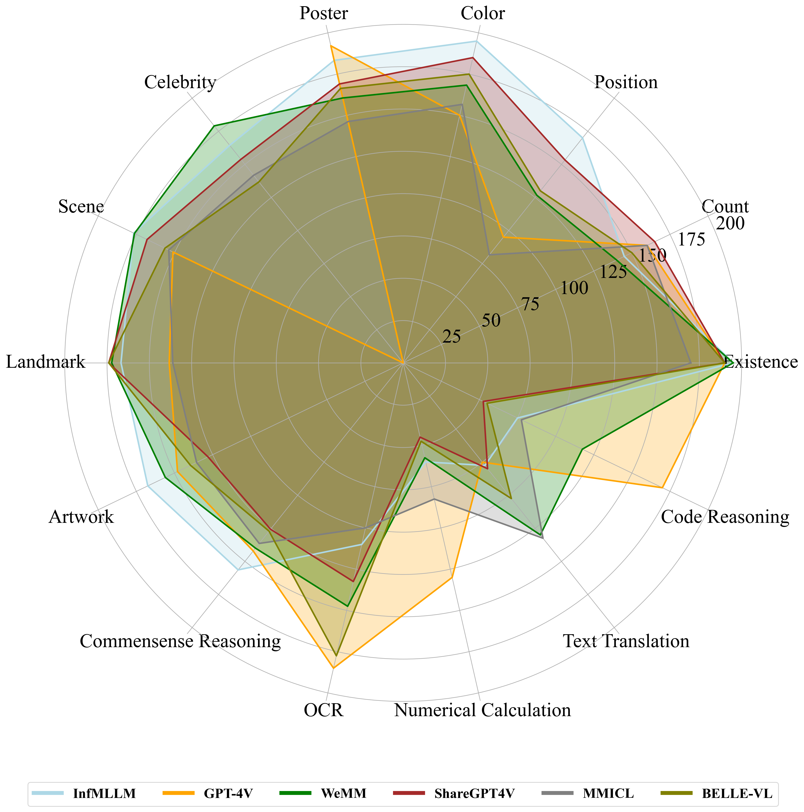

# MME: A Comprehensive Evaluation Benchmark for Multimodal Large Language Models


> Multimodal Large Language Model (MLLM) relies on the powerful LLM to perform multimodal tasks, showing amazing emergent abilities in recent studies, such as writing poems based on an image. However, it is difficult for these case studies to fully reflect the performance of MLLM, lacking a comprehensive evaluation. In this paper, we fill in this blank, presenting the first MLLM Evaluation benchmark MME. It measures both perception and cognition abilities on a total of 14 subtasks. In order to avoid data leakage that may arise from direct use of public datasets for evaluation, the annotations of instruction-answer pairs are all manually designed. The concise instruction design allows us to fairly compare MLLMs, instead of struggling in prompt engineering. Besides, with such an instruction, we can also easily carry out quantitative statistics. A total of 37 advanced MLLMs are comprehensively evaluated on our MME, which not only suggests that existing MLLMs still have a large room for improvement, but also reveals the potential directions for the subsequent model optimization.


## Our MLLM works

🔥🔥🔥 **A Survey on Multimodal Large Language Models**  
**[Project Page](https://github.com/BradyFU/Awesome-Multimodal-Large-Language-Models)** | **[Paper](https://arxiv.org/pdf/2306.13549.pdf)**

A curated list of Multimodal Large Language Models (MLLMs), including multimodal instruction tuning, multimodal in-context learning, multimodal chain-of-thought, llm-aided visual reasoning, foundation models, datasets, and others. This list will be updated in real time. :sparkles:

Welcome to add WeChat ID (wmd_ustc) to join our MLLM communication group! :star2:

---

🔥🔥🔥 **MME: A Comprehensive Evaluation Benchmark for Multimodal Large Language Models**  
**[Project Page [This Page]](https://github.com/BradyFU/Awesome-Multimodal-Large-Language-Models/tree/Evaluation)** | **[Paper](https://arxiv.org/pdf/2306.13394.pdf)**

Leaderboards of **37** advanced MLLMs, including [**BLIP-2**](https://arxiv.org/pdf/2301.12597.pdf), [**InstructBLIP**](https://arxiv.org/pdf/2305.06500.pdf), [**LLaVA**](https://arxiv.org/pdf/2304.08485.pdf), [**MiniGPT-4**](https://arxiv.org/pdf/2304.10592.pdf), [**mPLUG-Owl**](https://arxiv.org/pdf/2304.14178.pdf), [**LLaMA-Adapter V2**](https://arxiv.org/pdf/2304.15010.pdf), [**ImageBind_LLM**](https://github.com/OpenGVLab/LLaMA-Adapter/tree/main), [**Otter**](https://arxiv.org/pdf/2305.03726.pdf), [**VisualGLM-6B**](https://github.com/THUDM/VisualGLM-6B), [**Multimodal-GPT**](https://arxiv.org/pdf/2305.04790.pdf), [**PandaGPT**](https://arxiv.org/pdf/2305.16355.pdf), [**VPGTrans**](https://arxiv.org/pdf/2305.01278.pdf), [**LaVIN**](https://arxiv.org/pdf/2305.15023.pdf), [**Lynx**](https://arxiv.org/pdf/2307.02469.pdf), [**Octopus**](https://github.com/gray311/UnifiedMultimodalInstructionTuning), [**LRV-Instruction**](https://arxiv.org/pdf/2306.14565.pdf), [**Cheetor**](https://arxiv.org/pdf/2308.04152.pdf), [**MMICL**](https://github.com/HaozheZhao/MIC), [**GIT2**](https://arxiv.org/pdf/2205.14100.pdf), [**BLIVA**](https://arxiv.org/pdf/2308.09936.pdf), [**Skywork-MM**](https://github.com/will-singularity/Skywork-MM/tree/main), [**Qwen-VL-Chat**](https://arxiv.org/pdf/2308.12966.pdf), [**InternLM-XComposer-VL**](https://arxiv.org/pdf/2309.15112.pdf), [**Lion**](https://github.com/mynameischaos/Lion), [**Muffin**](https://github.com/thunlp/Muffin), [**WeMM**](https://github.com/scenarios/WeMM), [**SPHINX**](https://github.com/Alpha-VLLM/LLaMA2-Accessory/tree/main/SPHINX), [**InfMLLM**](https://github.com/mightyzau/InfMLLM), [**mPLUG-Owl2**](https://github.com/X-PLUG/mPLUG-Owl/tree/main/mPLUG-Owl2), [**GPT-4V**](https://cdn.openai.com/papers/GPTV_System_Card.pdf), [**CVLM**](https://github.com/buptlihang/CVLM), [**LVIS-INSTRUCT4V**](https://arxiv.org/pdf/2311.07574.pdf), [**Kanva**](https://github.com/llp1992/Kanva), [**DataOptim**](https://github.com/BAAI-DCAI/DataOptim), [**ShareGPT4V**](https://github.com/InternLM/InternLM-XComposer/tree/main/projects/ShareGPT4V), [**BELLE-VL**](https://huggingface.co/BELLE-2/BELLE-VL), and [**TransCore-M**](https://github.com/PCIResearch/TransCore-M).

If you want to add your model in our leaderboards, please feel free to email bradyfu24@gmail.com. We will update the leaderboards in time. :sparkles:

<details><summary>Download MME :star2::star2: </summary>

The benchmark dataset is collected by Xiamen University for academic research only. You can email guilinli@stu.xmu.edu.cn to obtain the dataset, according to the following requirement. 

**Requirement**: A real-name system is encouraged for better academic communication. Your email suffix needs to match your affiliation, such as xx@stu.xmu.edu.cn and Xiamen University. Otherwise, you need to explain why. Please include the information bellow when sending your application email.

```
Name: (tell us who you are.)
Affiliation: (the name/url of your university or company)
Job Title: (e.g., professor, PhD, and researcher)
Email: (your email address)
How to use: (only for non-commercial use)
```

</details>

---

🔥🔥🔥 **Woodpecker: Hallucination Correction for Multimodal Large Language Models** 

<p align="center">
    
</p>

**[Paper](https://arxiv.org/pdf/2310.16045.pdf)** | **[Online Demo](https://f252626b321420bfb1.gradio.live/)** | **[Source Code](https://github.com/BradyFU/Woodpecker)**

This is the first work to correct hallucinations in MLLMs.

---

<br> **📑 If you find our projects helpful to your research, please consider citing:** <br>

```
@article{yin2023survey,
  title={A Survey on Multimodal Large Language Models},
  author={Yin, Shukang and Fu, Chaoyou and Zhao, Sirui and Li, Ke and Sun, Xing and Xu, Tong and Chen, Enhong},
  journal={arXiv preprint arXiv:2306.13549},
  year={2023}
}

@article{fu2023mme,
  title={MME: A Comprehensive Evaluation Benchmark for Multimodal Large Language Models},
  author={Fu, Chaoyou and Chen, Peixian and Shen, Yunhang and Qin, Yulei and Zhang, Mengdan and Lin, Xu and Qiu, Zhenyu and Lin, Wei and Yang, Jinrui and Zheng, Xiawu and Li, Ke and Sun, Xing and Ji, Rongrong},
  journal={arXiv preprint arXiv:2306.13394},
  year={2023}
}

@article{yin2023woodpecker,
  title={Woodpecker: Hallucination Correction for Multimodal Large Language Models},
  author={Yin, Shukang and Fu, Chaoyou and Zhao, Sirui and Xu, Tong and Wang, Hao and Sui, Dianbo and Shen, Yunhang and Li, Ke and Sun, Xing and Chen, Enhong},
  journal={arXiv preprint arXiv:2310.16045},
  year={2023}
}
```

---

# News 🚀
**[2023-12]** 

1. [12-01] Thanks to [**Cheng Wen**](https://scholar.google.com/citations?user=9MLB3s8AAAAJ&hl=zh-CN), [**BELLE-VL**](https://huggingface.co/BELLE-2/BELLE-VL) is added to our leaderboards. 🔥🔥
2. [12-01] Thanks to [**PCI Research**](https://www.pcitech.com/), [**TransCore-M**](https://github.com/PCIResearch/TransCore-M) joins MME. 🔥🔥


**[2023-11]** 

1. [11-24] Thanks to [**Xiaoyi Dong**](https://scholar.google.com/citations?user=FscToE0AAAAJ&hl=en), we add [**ShareGPT4V**](https://github.com/InternLM/InternLM-XComposer/tree/main/projects/ShareGPT4V) to our leaderboards. 🔥🔥
2. [11-24] Thanks to [**Muyang He**](https://scholar.google.com/citations?hl=en&user=Q0Xn7i4AAAAJ), [**DataOptim**](https://github.com/BAAI-DCAI/DataOptim) joins MME. 🔥🔥
3. [11-24] Thanks to [**Zifei Shan**](https://scholar.google.com/citations?user=DGIdpTwAAAAJ&hl=en&oi=ao), [**Kanva**](https://github.com/llp1992/Kanva) is added. 🔥🔥
4. [11-21] Thanks to [**Junke Wang**](https://scholar.google.com.hk/citations?user=qQuxuo0AAAAJ&hl=zh-CN&oi=ao), [**LVIS-INSTRUCT4V**](https://arxiv.org/pdf/2311.07574.pdf) is added to our MME. 🔥🔥
5. [11-18] Thanks to [**Zhenbo Luo**](https://dblp.org/pid/152/8206.html), our leaderboards welcome a new member [**CVLM**](https://github.com/buptlihang/CVLM). 🔥🔥
6. [11-10] Thanks to [**Qinghao Ye**](https://scholar.google.com.hk/citations?user=ZYOhaGwAAAAJ&hl=zh-CN&oi=ao), we get a new model [**mPLUG-Owl2**](https://github.com/X-PLUG/mPLUG-Owl/tree/main/mPLUG-Owl2) in our leaderboards. 🔥🔥
7. [11-10] Thanks to [**Zhibin Wang**](https://scholar.google.com/citations?hl=zh-CN&user=YHzKee8AAAAJ), [**InfMLLM**](https://github.com/mightyzau/InfMLLM) joins our leaderboards. 🔥🔥

**[2023-10]** 

1. [10-29] Thanks to [**Jiaming Han**](https://scholar.google.com/citations?hl=en&user=vgcxKEcAAAAJ&view_op=list_works), [**SPHINX**](https://github.com/Alpha-VLLM/LLaMA2-Accessory/tree/main/SPHINX) is added to our leaderboards. 
2. [10-23] Thanks to [**Zihan Wang**](https://github.com/hanhanHANS), he manually evaluate the performance of [**GPT-4V**](https://cdn.openai.com/papers/GPTV_System_Card.pdf) on our benchmark. Note that GPT-4V refuses to answer questions that involve individuals, resulting in a zero score in the Celebrity subtask. 
3. [10-13] Thanks to [**Yizhou Zhou**](https://scholar.google.com/citations?user=dHBNmSkAAAAJ&hl=en&oi=sra), [**WeMM**](https://github.com/scenarios/WeMM) joins our leaderboards (The results are renewed on 2023-11-10 by updating the model). 
4. [10-13] Thanks to [**Cui Junbo**](https://github.com/thunlp/Muffin), we add [**Muffin**](https://github.com/thunlp/Muffin) to our leaderboards. 
5. [10-13] Thanks to [**Jiaming Han**](https://scholar.google.com/citations?hl=en&user=vgcxKEcAAAAJ&view_op=list_works), the results of [**LLaMA-Adapter V2**](https://github.com/OpenGVLab/LLaMA-Adapter) have been updated. 
6. [10-04] Thanks to [**Haotian Liu**](https://hliu.cc/), the results of [**LLaVA**](https://github.com/haotian-liu/LLaVA) have been updated. 

**[2023-09]** 

1. [09-28] Thanks to [**Huasong Zhong**](https://github.com/mynameischaos), [**Lion**](https://github.com/mynameischaos/Lion) is added.
2. [09-27] Thanks to [**Xiaoyi Dong**](https://scholar.google.com/citations?user=FscToE0AAAAJ&hl=en), [**InternLM-XComposer-VL**](https://github.com/InternLM/InternLM-XComposer) joins our leaderboards.
3. [09-05] Thanks to [**Jinze Bai**](https://github.com/jinze1994), our leaderboards usher in [**Qwen-VL-Chat**](https://github.com/QwenLM/Qwen-VL).
4. [09-01] Thanks to [**Skywork Multi-Modal Group**](https://github.com/will-singularity), [**Skywork-MM**](https://github.com/will-singularity/Skywork-MM/tree/main) takes part in our leaderboards.

**[2023-08]** 

1. [08-28] Thanks to [**UCSD MLPC**](https://github.com/mlpc-ucsd), we welcome [**BLIVA**](https://github.com/mlpc-ucsd/BLIVA) to join our leaderboards. 
2. [08-28] Thanks to [**Jianfeng Wang**](https://scholar.google.com.hk/citations?user=vJWEw_8AAAAJ&hl=zh-CN&oi=sra), [**GIT2**](https://github.com/microsoft/GenerativeImage2Text) is added to our leaderboards. 
3. [08-28] Thanks to [**Yike Yuan**](https://github.com/yyk-wew) and [**Songyang Zhang**](https://github.com/tonysy), the results of [**MiniGPT4**](https://arxiv.org/pdf/2304.10592.pdf) have been revised. 
4. [08-21] Thanks to [**Haozhe Zhao**](https://github.com/HaozheZhao), [**MMICL**](https://github.com/HaozheZhao/MIC) joins our leaderboards (The results are renewed on 2023-09-17 by upgrading the checkpoint.). 
5. [08-13] Thanks to [**Zhejiang University DCD Lab**](https://github.com/DCDmllm), our leaderboards incorporate a new member [**Cheetor**](https://github.com/DCDmllm/Cheetah). 
6. [08-08] Thanks to [**Fuxiao Liu**](https://github.com/FuxiaoLiu), we add [**LRV-Instruction**](https://github.com/FuxiaoLiu/LRV-Instruction) to our leaderboards. 

**[2023-07]** 

1. [07-28] Thanks to [**Yingzi Ma**](https://gray311.github.io/), his work [**Octopus**](https://github.com/gray311/UnifiedMultimodalInstructionTuning) has been updated to our leaderboards.
2. [07-15] Thanks to [**Jiani Zheng**](https://github.com/Garlicisnotmyfavor), our leaderboards welcome a new member [**Lynx**](https://github.com/bytedance/lynx-llm).
3. [07-12] Thanks to [**Ao Zhang**](https://github.com/waxnkw), his work [**VPGTrans**](https://github.com/VPGTrans/VPGTrans) has been added in our leaderboards.
4. [07-09] Thanks to [**Bo Li**](https://github.com/Luodian), we have updated the evaluation of his work [**Otter**](https://github.com/Luodian/Otter). It uses the latest model [**OTTER-Image-MPT7B**](https://huggingface.co/luodian/OTTER-Image-MPT7B) that incoporates OpenFlamingv2 and enhances instruction following ability.

**[2023-06]** 

1. [06-30] Thanks to [**Renrui Zhang**](https://github.com/ZrrSkywalker), we have updated the evaluation of his two works, i.e., [**LLaMA-Adapter V2**](https://github.com/OpenGVLab/LLaMA-Adapter) and [**ImageBind_LLM**](https://github.com/OpenGVLab/LLaMA-Adapter/tree/main/imagebind_LLM). The former is re-evaluated after changing the model [**weights**](https://github.com/OpenGVLab/LLaMA-Adapter/releases/download/v.2.0.0/7fa55208379faf2dd862565284101b0e4a2a72114d6490a95e432cf9d9b6c813_BIAS-7B.pth), and the latter is a newly added MLLM.
2. [06-30] Thanks to [**Gen Luo**](https://github.com/luogen1996), we have added the evaluation of his work [**LaVIN**](https://github.com/luogen1996/LaVIN).
3. [06-30] The results of other models have also been updated, retrieving the answer from the beginning of the generated responses instead of the whole responses. [**An automated evaluation script**](https://github.com/BradyFU/Awesome-Multimodal-Large-Language-Models/blob/Evaluation/tools/eval_tool.zip) for the calculation of scores has been released!

---

# Evaluation Results of Published Models [[Private Version](https://github.com/BradyFU/Awesome-Multimodal-Large-Language-Models/tree/Evaluation-PrivateModel)]

The top 5 on the perception and cognition leaderboards:



Published and private models are separated. GPT-4V is included in both as an intermediate comparison.

# Evaluation Leaderboards [[Private Version](https://github.com/BradyFU/Awesome-Multimodal-Large-Language-Models/tree/Evaluation-PrivateModel)]


---

<font size=5><center><b> Leaderboards of Published Models </b> </center></font>

- [Perception](#perception)
  - [Existence](#existence) | [Count](#count) | [Position](#position) | [Color](#color) | [Poster](#poster) | [Celebrity](#celebrity) | [Scene](#scene) | [Landmark](#landmark) | [Artwork](#artwork) | [OCR](#ocr)
  
- [Cognition](#cognition)
  - [Commonsense Reasoning](#commonsense-reasoning) | [Numerical Calculation](#numerical-calculation) | [Text Translation](#text-translation) | [Code Reasoning](#code-reasoning)


---

## Perception

Sum of the scores of all perception subtasks, including existence, count, position, color, poster, celebrity, scene, landmark, artwork, and OCR. The full score of each subtask is 200, and that of all perception is 2000.

| Rank |                            Model                             |                           Version                            |    Score    |
| :--: | :----------------------------------------------------------: | :----------------------------------------------------------: | :---------: |
|  🏅️   |     **[InfMLLM](https://github.com/infly-ai/INF-MLLM)**      |    **[Vicuna-13B](https://github.com/infly-ai/INF-MLLM)**    | **1673.75** |
|  🥈   |        **[WeMM](https://github.com/scenarios/WeMM)**         |     **[InternLM-7B](https://github.com/scenarios/WeMM)**     | **1621.66** |
|  🥉   |    **[ShareGPT4V](https://arxiv.org/pdf/2311.12793.pdf)**    | **[Vicuna-13B](https://github.com/InternLM/InternLM-XComposer/tree/main/projects/ShareGPT4V)** | **1618.70** |
|  4   |     [BELLE-VL](https://huggingface.co/BELLE-2/BELLE-VL)      |     [Qwen-14B](https://huggingface.co/BELLE-2/BELLE-VL)      |   1595.34   |
|  5   |  [TransCore-M](https://github.com/PCIResearch/TransCore-M)   | [PCITransGPT-13B](https://github.com/PCIResearch/TransCore-M) |   1588.16   |
|  6   |   [LVIS-INSTRUCT4V](https://arxiv.org/pdf/2311.07574.pdf)    |    [Vicuna-13B](https://github.com/X2FD/LVIS-INSTRUCT4V)     |   1574.89   |
|  7   |  [DataOptim-LLaVA](https://github.com/BAAI-DCAI/DataOptim)   |     [Vicuna-13B](https://github.com/BAAI-DCAI/DataOptim)     |   1563.56   |
|  8   | [SPHINX](https://github.com/Alpha-VLLM/LLaMA2-Accessory/tree/main/SPHINX) | [LLaMA2-13B](https://github.com/Alpha-VLLM/LLaMA2-Accessory/tree/main/SPHINX) |   1560.15   |
|  9   |        [LLaVA](https://arxiv.org/pdf/2304.08485.pdf)         |      [Vicuna-13B](https://github.com/haotian-liu/LLaVA)      |   1531.31   |
|  10  | [InternLM-XComposer-VL](https://github.com/InternLM/InternLM-XComposer) | [InternLM-7B](https://github.com/InternLM/InternLM-XComposer) |   1528.45   |
|  11  |     [Monkey-Chat](https://arxiv.org/pdf/2311.06607.pdf)      |       [Qwen-7B](https://github.com/Yuliang-Liu/Monkey)       |   1522.39   |
|  12  |      [Qwen-VL-Chat](https://github.com/QwenLM/Qwen-VL/)      |         [Qwen-7B](https://github.com/QwenLM/Qwen-VL)         |   1487.58   |
|  13  |      [mPLUG-Owl2](https://arxiv.org/pdf/2311.04257.pdf)      | [LLaMA2-7B](https://github.com/X-PLUG/mPLUG-Owl/tree/main/mPLUG-Owl2) |   1450.20   |
|  14  | [GPT-4V](https://cdn.openai.com/papers/GPTV_System_Card.pdf) |   [-](https://cdn.openai.com/papers/GPTV_System_Card.pdf)    |   1409.43   |
|  15  |        [MMICL](https://arxiv.org/pdf/2309.07915.pdf)         |        [FlanT5xxl](https://github.com/HaozheZhao/MIC)        |   1381.73   |
|  16  |         [Lynx](https://arxiv.org/pdf/2307.02469.pdf)         |      [Vicuna-7B](https://github.com/bytedance/lynx-llm)      |   1373.24   |
|  17  |        [BLIVA](https://arxiv.org/pdf/2308.09936.pdf)         |       [FlanT5xxl](https://github.com/mlpc-ucsd/BLIVA)        |   1337.73   |
|  18  |         [GIT2](https://arxiv.org/pdf/2205.14100.pdf)         | [VQAv2-finetuned](https://github.com/microsoft/GenerativeImage2Text) |   1332.05   |
|  19  |   [LLaMA-Adapter V2](https://arxiv.org/pdf/2304.15010.pdf)   | [LLaMA-Adapter-v2.1-7B](https://github.com/OpenGVLab/LLaMA-Adapter/tree/main/llama_adapter_v2_multimodal7b) |   1328.39   |
|  20  |       [Cheetor](https://arxiv.org/pdf/2308.04152.pdf)        |       [Vicuna-7B](https://github.com/DCDmllm/Cheetah)        |   1299.97   |
|  21  |   [LRV-Instruction](https://arxiv.org/pdf/2306.14565.pdf)    |    [LRV-7B](https://github.com/FuxiaoLiu/LRV-Instruction)    |   1299.79   |
|  22  |        [BLIP-2](https://arxiv.org/pdf/2301.12597.pdf)        | [Flant5xxl](https://github.com/salesforce/LAVIS/tree/main/projects/blip2) |   1293.84   |
|  23  |        [Otter](https://arxiv.org/pdf/2305.03726.pdf)         |    [OTTER-Image-MPT7B](https://github.com/Luodian/Otter)     |   1292.26   |
|  24  |          [Muffin](https://github.com/thunlp/Muffin)          |        [Vicuna-13B](https://github.com/thunlp/Muffin)        |   1281.02   |
|  25  |     [InstructBLIP](https://arxiv.org/pdf/2305.06500.pdf)     | [FlanT5xxl](https://github.com/salesforce/LAVIS/tree/main/projects/instructblip) |   1212.82   |
|  26  |      [mPLUG-Owl](https://arxiv.org/pdf/2304.14178.pdf)       | [LLaMA-7B](https://huggingface.co/MAGAer13/mplug-owl-llama-7b) |   967.34    |
|  27  |        [LaVIN](https://arxiv.org/pdf/2305.15023.pdf)         |       [LAVIN-13B](https://github.com/luogen1996/LaVIN)       |   963.60    |
|  28  |       [VPGTrans](https://arxiv.org/pdf/2305.01278.pdf)       |      [Vicuna-7B](https://github.com/VPGTrans/VPGTrans)       |   790.45    |
|  29  | [ImageBind_LLM](https://github.com/OpenGVLab/LLaMA-Adapter/tree/main) | [LLaMA-7B](https://github.com/OpenGVLab/LLaMA-Adapter/tree/main/imagebind_LLM) |   775.77    |
|  30  |    [VisualGLM-6B](https://github.com/THUDM/VisualGLM-6B)     |    [VisualGLM-6B](https://github.com/THUDM/VisualGLM-6B)     |   705.31    |
|  31  |    [Multimodal-GPT](https://arxiv.org/pdf/2305.04790.pdf)    | [Multimodal-GPT-9B](https://github.com/open-mmlab/Multimodal-GPT) |   654.72    |
|  32  |       [PandaGPT](https://arxiv.org/pdf/2305.16355.pdf)       |       [Vicuna-7B](https://github.com/yxuansu/PandaGPT)       |   642.59    |
|  33  |      [MiniGPT-4](https://arxiv.org/pdf/2304.10592.pdf)       |    [Vicuna-13B](https://github.com/Vision-CAIR/MiniGPT-4)    |   581.66    |

### Existence

| Rank |                            Model                             |                           Version                            |   Score    |
| :--: | :----------------------------------------------------------: | :----------------------------------------------------------: | :--------: |
|  🏅️   |      **[Otter](https://arxiv.org/pdf/2305.03726.pdf)**       |  **[OTTER-Image-MPT7B](https://github.com/Luodian/Otter)**   | **195.00** |
|  🏅️   |       **[Lynx](https://arxiv.org/pdf/2307.02469.pdf)**       |    **[Vicuna-7B](https://github.com/bytedance/lynx-llm)**    | **195.00** |
|  🏅️   |        **[WeMM](https://github.com/scenarios/WeMM)**         |     **[InternLM-7B](https://github.com/scenarios/WeMM)**     | **195.00** |
|  🏅️   |        **[Muffin](https://github.com/thunlp/Muffin)**        |      **[Vicuna-13B](https://github.com/thunlp/Muffin)**      | **195.00** |
|  🏅️   | **[SPHINX](https://github.com/Alpha-VLLM/LLaMA2-Accessory/tree/main/SPHINX)** | **[LLaMA2-13B](https://github.com/Alpha-VLLM/LLaMA2-Accessory/tree/main/SPHINX)** | **195.00** |
|  🏅️   |     **[InfMLLM](https://github.com/infly-ai/INF-MLLM)**      |    **[Vicuna-13B](https://github.com/infly-ai/INF-MLLM)**    | **195.00** |
|  🏅️   | **[LVIS-INSTRUCT4V](https://arxiv.org/pdf/2311.07574.pdf)**  |  **[Vicuna-13B](https://github.com/X2FD/LVIS-INSTRUCT4V)**   | **195.00** |
|  🥈   |       **[GIT2](https://arxiv.org/pdf/2205.14100.pdf)**       | **[VQAv2-finetuned](https://github.com/microsoft/GenerativeImage2Text)** | **190.00** |
|  🥈   | **[InternLM-XComposer-VL](https://github.com/InternLM/InternLM-XComposer)** | **[InternLM-7B](https://github.com/InternLM/InternLM-XComposer)** | **190.00** |
|  🥈   | **[GPT-4V](https://cdn.openai.com/papers/GPTV_System_Card.pdf)** | **[-](https://cdn.openai.com/papers/GPTV_System_Card.pdf)**  | **190.00** |
|  🥈   |    **[ShareGPT4V](https://arxiv.org/pdf/2311.12793.pdf)**    | **[Vicuna-13B](https://github.com/InternLM/InternLM-XComposer/tree/main/projects/ShareGPT4V)** | **190.00** |
|  🥈   | **[DataOptim-LLaVA](https://github.com/BAAI-DCAI/DataOptim)** |   **[Vicuna-13B](https://github.com/BAAI-DCAI/DataOptim)**   | **190.00** |
|  🥈   |   **[BELLE-VL](https://huggingface.co/BELLE-2/BELLE-VL)**    |   **[Qwen-14B](https://huggingface.co/BELLE-2/BELLE-VL)**    | **190.00** |
|  🥈   | **[TransCore-M](https://github.com/PCIResearch/TransCore-M)** | **[PCITransGPT-13B](https://github.com/PCIResearch/TransCore-M)** | **190.00** |
|  🥉   | **[LLaMA-Adapter V2](https://arxiv.org/pdf/2304.15010.pdf)** | **[LLaMA-Adapter-v2.1-7B](https://github.com/OpenGVLab/LLaMA-Adapter/tree/main/llama_adapter_v2_multimodal7b)** | **185.00** |
|  🥉   |   **[InstructBLIP](https://arxiv.org/pdf/2305.06500.pdf)**   | **[FlanT5xxl](https://github.com/salesforce/LAVIS/tree/main/projects/instructblip)** | **185.00** |
|  🥉   |      **[LLaVA](https://arxiv.org/pdf/2304.08485.pdf)**       |    **[Vicuna-13B](https://github.com/haotian-liu/LLaVA)**    | **185.00** |
|  🥉   |      **[LaVIN](https://arxiv.org/pdf/2305.15023.pdf)**       |     **[LAVIN-13B](https://github.com/luogen1996/LaVIN)**     | **185.00** |
|  🥉   |    **[mPLUG-Owl2](https://arxiv.org/pdf/2311.04257.pdf)**    | **[LLaMA2-7B](https://github.com/X-PLUG/mPLUG-Owl/tree/main/mPLUG-Owl2)** | **185.00** |
|  🥉   |   **[Monkey-Chat](https://arxiv.org/pdf/2311.06607.pdf)**    |     **[Qwen-7B](https://github.com/Yuliang-Liu/Monkey)**     | **185.00** |
|  4   |       [Cheetor](https://arxiv.org/pdf/2308.04152.pdf)        |       [Vicuna-7B](https://github.com/DCDmllm/Cheetah)        |   180.00   |
|  4   |        [BLIVA](https://arxiv.org/pdf/2308.09936.pdf)         |       [FlanT5xxl](https://github.com/mlpc-ucsd/BLIVA)        |   180.00   |
|  5   |        [MMICL](https://arxiv.org/pdf/2309.07915.pdf)         |        [FlanT5xxl](https://github.com/HaozheZhao/MIC)        |   170.00   |
|  6   |   [LRV-Instruction](https://arxiv.org/pdf/2306.14565.pdf)    |    [LRV-7B](https://github.com/FuxiaoLiu/LRV-Instruction)    |   165.00   |
|  7   |        [BLIP-2](https://arxiv.org/pdf/2301.12597.pdf)        | [Flant5xxl](https://github.com/salesforce/LAVIS/tree/main/projects/blip2) |   160.00   |
|  8   |      [Qwen-VL-Chat](https://github.com/QwenLM/Qwen-VL/)      |         [Qwen-7B](https://github.com/QwenLM/Qwen-VL)         |   158.33   |
|  9   | [ImageBind_LLM](https://github.com/OpenGVLab/LLaMA-Adapter/tree/main) | [LLaMA-7B](https://github.com/OpenGVLab/LLaMA-Adapter/tree/main/imagebind_LLM) |   128.33   |
|  10  |      [mPLUG-Owl](https://arxiv.org/pdf/2304.14178.pdf)       | [LLaMA-7B](https://huggingface.co/MAGAer13/mplug-owl-llama-7b) |   120.00   |
|  11  |    [VisualGLM-6B](https://github.com/THUDM/VisualGLM-6B)     |    [VisualGLM-6B](https://github.com/THUDM/VisualGLM-6B)     |   85.00    |
|  12  |       [PandaGPT](https://arxiv.org/pdf/2305.16355.pdf)       |       [Vicuna-7B](https://github.com/yxuansu/PandaGPT)       |   70.00    |
|  12  |       [VPGTrans](https://arxiv.org/pdf/2305.01278.pdf)       |      [Vicuna-7B](https://github.com/VPGTrans/VPGTrans)       |   70.00    |
|  13  |      [MiniGPT-4](https://arxiv.org/pdf/2304.10592.pdf)       |    [Vicuna-13B](https://github.com/Vision-CAIR/MiniGPT-4)    |   68.33    |
|  14  |    [Multimodal-GPT](https://arxiv.org/pdf/2305.04790.pdf)    | [Multimodal-GPT-9B](https://github.com/open-mmlab/Multimodal-GPT) |   61.67    |

### Count

| Rank |                            Model                             |                           Version                            |   Score    |
| :--: | :----------------------------------------------------------: | :----------------------------------------------------------: | :--------: |
|  🏅️   |    **[ShareGPT4V](https://arxiv.org/pdf/2311.12793.pdf)**    | **[Vicuna-13B](https://github.com/InternLM/InternLM-XComposer/tree/main/projects/ShareGPT4V)** | **165.00** |
|  🏅️   | **[DataOptim-LLaVA](https://github.com/BAAI-DCAI/DataOptim)** |   **[Vicuna-13B](https://github.com/BAAI-DCAI/DataOptim)**   | **165.00** |
|  🏅️   | **[TransCore-M](https://github.com/PCIResearch/TransCore-M)** | **[PCITransGPT-13B](https://github.com/PCIResearch/TransCore-M)** | **165.00** |
|  🥈   |        **[Muffin](https://github.com/thunlp/Muffin)**        |      **[Vicuna-13B](https://github.com/thunlp/Muffin)**      | **163.33** |
|  🥉   |      **[MMICL](https://arxiv.org/pdf/2309.07915.pdf)**       |      **[FlanT5xxl](https://github.com/HaozheZhao/MIC)**      | **160.00** |
|  🥉   | **[GPT-4V](https://cdn.openai.com/papers/GPTV_System_Card.pdf)** | **[-](https://cdn.openai.com/papers/GPTV_System_Card.pdf)**  | **160.00** |
|  🥉   | **[SPHINX](https://github.com/Alpha-VLLM/LLaMA2-Accessory/tree/main/SPHINX)** | **[LLaMA2-13B](https://github.com/Alpha-VLLM/LLaMA2-Accessory/tree/main/SPHINX)** | **160.00** |
|  🥉   | **[LVIS-INSTRUCT4V](https://arxiv.org/pdf/2311.07574.pdf)**  |  **[Vicuna-13B](https://github.com/X2FD/LVIS-INSTRUCT4V)**   | **160.00** |
|  4   | [InternLM-XComposer-VL](https://github.com/InternLM/InternLM-XComposer) | [InternLM-7B](https://github.com/InternLM/InternLM-XComposer) |   158.33   |
|  5   |        [LLaVA](https://arxiv.org/pdf/2304.08485.pdf)         |      [Vicuna-13B](https://github.com/haotian-liu/LLaVA)      |   155.00   |
|  5   |      [mPLUG-Owl2](https://arxiv.org/pdf/2311.04257.pdf)      | [LLaMA2-7B](https://github.com/X-PLUG/mPLUG-Owl/tree/main/mPLUG-Owl2) |   155.00   |
|  6   |         [Lynx](https://arxiv.org/pdf/2307.02469.pdf)         |      [Vicuna-7B](https://github.com/bytedance/lynx-llm)      |   151.67   |
|  7   |      [Qwen-VL-Chat](https://github.com/QwenLM/Qwen-VL/)      |         [Qwen-7B](https://github.com/QwenLM/Qwen-VL)         |   150.00   |
|  7   |     [BELLE-VL](https://huggingface.co/BELLE-2/BELLE-VL)      |     [Qwen-14B](https://huggingface.co/BELLE-2/BELLE-VL)      |   150.00   |
|  7   |     [Monkey-Chat](https://arxiv.org/pdf/2311.06607.pdf)      |       [Qwen-7B](https://github.com/Yuliang-Liu/Monkey)       |   150.00   |
|  8   |       [InfMLLM](https://github.com/infly-ai/INF-MLLM)        |      [Vicuna-13B](https://github.com/infly-ai/INF-MLLM)      |   145.00   |
|  9   |     [InstructBLIP](https://arxiv.org/pdf/2305.06500.pdf)     | [FlanT5xxl](https://github.com/salesforce/LAVIS/tree/main/projects/instructblip) |   143.33   |
|  10  |          [WeMM](https://github.com/scenarios/WeMM)           |       [InternLM-7B](https://github.com/scenarios/WeMM)       |   140.00   |
|  11  |        [BLIVA](https://arxiv.org/pdf/2308.09936.pdf)         |       [FlanT5xxl](https://github.com/mlpc-ucsd/BLIVA)        |   138.33   |
|  12  |        [BLIP-2](https://arxiv.org/pdf/2301.12597.pdf)        | [Flant5xxl](https://github.com/salesforce/LAVIS/tree/main/projects/blip2) |   135.00   |
|  13  |   [LLaMA-Adapter V2](https://arxiv.org/pdf/2304.15010.pdf)   | [LLaMA-Adapter-v2.1-7B](https://github.com/OpenGVLab/LLaMA-Adapter/tree/main/llama_adapter_v2_multimodal7b) |   133.33   |
|  14  |         [GIT2](https://arxiv.org/pdf/2205.14100.pdf)         | [VQAv2-finetuned](https://github.com/microsoft/GenerativeImage2Text) |   118.33   |
|  15  |   [LRV-Instruction](https://arxiv.org/pdf/2306.14565.pdf)    |    [LRV-7B](https://github.com/FuxiaoLiu/LRV-Instruction)    |   111.67   |
|  16  |       [Cheetor](https://arxiv.org/pdf/2308.04152.pdf)        |       [Vicuna-7B](https://github.com/DCDmllm/Cheetah)        |   96.67    |
|  17  |        [Otter](https://arxiv.org/pdf/2305.03726.pdf)         |    [OTTER-Image-MPT7B](https://github.com/Luodian/Otter)     |   88.33    |
|  17  |        [LaVIN](https://arxiv.org/pdf/2305.15023.pdf)         |       [LAVIN-13B](https://github.com/luogen1996/LaVIN)       |   88.33    |
|  18  |       [VPGTrans](https://arxiv.org/pdf/2305.01278.pdf)       |      [Vicuna-7B](https://github.com/VPGTrans/VPGTrans)       |   85.00    |
|  19  | [ImageBind_LLM](https://github.com/OpenGVLab/LLaMA-Adapter/tree/main) | [LLaMA-7B](https://github.com/OpenGVLab/LLaMA-Adapter/tree/main/imagebind_LLM) |   60.00    |
|  20  |      [MiniGPT-4](https://arxiv.org/pdf/2304.10592.pdf)       |    [Vicuna-13B](https://github.com/Vision-CAIR/MiniGPT-4)    |   55.00    |
|  20  |    [Multimodal-GPT](https://arxiv.org/pdf/2305.04790.pdf)    | [Multimodal-GPT-9B](https://github.com/open-mmlab/Multimodal-GPT) |   55.00    |
|  21  |      [mPLUG-Owl](https://arxiv.org/pdf/2304.14178.pdf)       | [LLaMA-7B](https://huggingface.co/MAGAer13/mplug-owl-llama-7b) |   50.00    |
|  21  |    [VisualGLM-6B](https://github.com/THUDM/VisualGLM-6B)     |    [VisualGLM-6B](https://github.com/THUDM/VisualGLM-6B)     |   50.00    |
|  21  |       [PandaGPT](https://arxiv.org/pdf/2305.16355.pdf)       |       [Vicuna-7B](https://github.com/yxuansu/PandaGPT)       |   50.00    |

### Position

| Rank |                            Model                             |                           Version                            |   Score    |
| :--: | :----------------------------------------------------------: | :----------------------------------------------------------: | :--------: |
|  🏅️   |     **[InfMLLM](https://github.com/infly-ai/INF-MLLM)**      |    **[Vicuna-13B](https://github.com/infly-ai/INF-MLLM)**    | **170.00** |
|  🥈   |    **[ShareGPT4V](https://arxiv.org/pdf/2311.12793.pdf)**    | **[Vicuna-13B](https://github.com/InternLM/InternLM-XComposer/tree/main/projects/ShareGPT4V)** | **153.33** |
|  🥈   | **[SPHINX](https://github.com/Alpha-VLLM/LLaMA2-Accessory/tree/main/SPHINX)** | **[LLaMA2-13B](https://github.com/Alpha-VLLM/LLaMA2-Accessory/tree/main/SPHINX)** | **153.33** |
|  🥉   | **[TransCore-M](https://github.com/PCIResearch/TransCore-M)** | **[PCITransGPT-13B](https://github.com/PCIResearch/TransCore-M)** | **136.67** |
|  4   |        [LLaVA](https://arxiv.org/pdf/2304.08485.pdf)         |      [Vicuna-13B](https://github.com/haotian-liu/LLaVA)      |   133.33   |
|  5   |     [BELLE-VL](https://huggingface.co/BELLE-2/BELLE-VL)      |     [Qwen-14B](https://huggingface.co/BELLE-2/BELLE-VL)      |   130.00   |
|  6   |   [LVIS-INSTRUCT4V](https://arxiv.org/pdf/2311.07574.pdf)    |    [Vicuna-13B](https://github.com/X2FD/LVIS-INSTRUCT4V)     |   128.33   |
|  6   |      [Qwen-VL-Chat](https://github.com/QwenLM/Qwen-VL/)      |         [Qwen-7B](https://github.com/QwenLM/Qwen-VL)         |   128.33   |
|  7   | [InternLM-XComposer-VL](https://github.com/InternLM/InternLM-XComposer) | [InternLM-7B](https://github.com/InternLM/InternLM-XComposer) |   126.67   |
|  7   |          [WeMM](https://github.com/scenarios/WeMM)           |       [InternLM-7B](https://github.com/scenarios/WeMM)       |   126.67   |
|  8   |  [DataOptim-LLaVA](https://github.com/BAAI-DCAI/DataOptim)   |     [Vicuna-13B](https://github.com/BAAI-DCAI/DataOptim)     |   121.67   |
|  9   |     [Monkey-Chat](https://arxiv.org/pdf/2311.06607.pdf)      |       [Qwen-7B](https://github.com/Yuliang-Liu/Monkey)       |   118.33   |
|  10  |         [GIT2](https://arxiv.org/pdf/2205.14100.pdf)         | [VQAv2-finetuned](https://github.com/microsoft/GenerativeImage2Text) |   96.67    |
|  11  | [GPT-4V](https://cdn.openai.com/papers/GPTV_System_Card.pdf) |   [-](https://cdn.openai.com/papers/GPTV_System_Card.pdf)    |   95.00    |
|  12  |         [Lynx](https://arxiv.org/pdf/2307.02469.pdf)         |      [Vicuna-7B](https://github.com/bytedance/lynx-llm)      |   90.00    |
|  13  |      [mPLUG-Owl2](https://arxiv.org/pdf/2311.04257.pdf)      | [LLaMA2-7B](https://github.com/X-PLUG/mPLUG-Owl/tree/main/mPLUG-Owl2) |   88.33    |
|  14  |        [Otter](https://arxiv.org/pdf/2305.03726.pdf)         |    [OTTER-Image-MPT7B](https://github.com/Luodian/Otter)     |   86.67    |
|  14  |   [LRV-Instruction](https://arxiv.org/pdf/2306.14565.pdf)    |    [LRV-7B](https://github.com/FuxiaoLiu/LRV-Instruction)    |   86.67    |
|  15  |        [MMICL](https://arxiv.org/pdf/2309.07915.pdf)         |        [FlanT5xxl](https://github.com/HaozheZhao/MIC)        |   81.67    |
|  15  |        [BLIVA](https://arxiv.org/pdf/2308.09936.pdf)         |       [FlanT5xxl](https://github.com/mlpc-ucsd/BLIVA)        |   81.67    |
|  16  |       [Cheetor](https://arxiv.org/pdf/2308.04152.pdf)        |       [Vicuna-7B](https://github.com/DCDmllm/Cheetah)        |   80.00    |
|  17  |        [BLIP-2](https://arxiv.org/pdf/2301.12597.pdf)        | [Flant5xxl](https://github.com/salesforce/LAVIS/tree/main/projects/blip2) |   73.33    |
|  18  |     [InstructBLIP](https://arxiv.org/pdf/2305.06500.pdf)     | [FlanT5xxl](https://github.com/salesforce/LAVIS/tree/main/projects/instructblip) |   66.67    |
|  19  |          [Muffin](https://github.com/thunlp/Muffin)          |        [Vicuna-13B](https://github.com/thunlp/Muffin)        |   66.67    |
|  20  |        [LaVIN](https://arxiv.org/pdf/2305.15023.pdf)         |       [LAVIN-13B](https://github.com/luogen1996/LaVIN)       |   63.33    |
|  20  |       [VPGTrans](https://arxiv.org/pdf/2305.01278.pdf)       |      [Vicuna-7B](https://github.com/VPGTrans/VPGTrans)       |   63.33    |
|  21  |    [Multimodal-GPT](https://arxiv.org/pdf/2305.04790.pdf)    | [Multimodal-GPT-9B](https://github.com/open-mmlab/Multimodal-GPT) |   58.33    |
|  22  |   [LLaMA-Adapter V2](https://arxiv.org/pdf/2304.15010.pdf)   | [LLaMA-Adapter-v2.1-7B](https://github.com/OpenGVLab/LLaMA-Adapter/tree/main/llama_adapter_v2_multimodal7b) |   56.67    |
|  23  |      [mPLUG-Owl](https://arxiv.org/pdf/2304.14178.pdf)       | [LLaMA-7B](https://huggingface.co/MAGAer13/mplug-owl-llama-7b) |   50.00    |
|  23  |       [PandaGPT](https://arxiv.org/pdf/2305.16355.pdf)       |       [Vicuna-7B](https://github.com/yxuansu/PandaGPT)       |   50.00    |
|  24  |    [VisualGLM-6B](https://github.com/THUDM/VisualGLM-6B)     |    [VisualGLM-6B](https://github.com/THUDM/VisualGLM-6B)     |   48.33    |
|  25  | [ImageBind_LLM](https://github.com/OpenGVLab/LLaMA-Adapter/tree/main) | [LLaMA-7B](https://github.com/OpenGVLab/LLaMA-Adapter/tree/main/imagebind_LLM) |   46.67    |
|  26  |      [MiniGPT-4](https://arxiv.org/pdf/2304.10592.pdf)       |    [Vicuna-13B](https://github.com/Vision-CAIR/MiniGPT-4)    |   43.33    |

### Color

| Rank |                            Model                             |                           Version                            |   Score    |
| :--: | :----------------------------------------------------------: | :----------------------------------------------------------: | :--------: |
|  🏅️   |     **[InfMLLM](https://github.com/infly-ai/INF-MLLM)**      |    **[Vicuna-13B](https://github.com/infly-ai/INF-MLLM)**    | **195.00** |
|  🥈   |    **[ShareGPT4V](https://arxiv.org/pdf/2311.12793.pdf)**    | **[Vicuna-13B](https://github.com/InternLM/InternLM-XComposer/tree/main/projects/ShareGPT4V)** | **185.00** |
|  🥈   | **[TransCore-M](https://github.com/PCIResearch/TransCore-M)** | **[PCITransGPT-13B](https://github.com/PCIResearch/TransCore-M)** | **185.00** |
|  🥈   |   **[Monkey-Chat](https://arxiv.org/pdf/2311.06607.pdf)**    |     **[Qwen-7B](https://github.com/Yuliang-Liu/Monkey)**     | **185.00** |
|  🥉   |      **[BLIVA](https://arxiv.org/pdf/2308.09936.pdf)**       |     **[FlanT5xxl](https://github.com/mlpc-ucsd/BLIVA)**      | **180.00** |
|  🥉   | **[LVIS-INSTRUCT4V](https://arxiv.org/pdf/2311.07574.pdf)**  |  **[Vicuna-13B](https://github.com/X2FD/LVIS-INSTRUCT4V)**   | **180.00** |
|  4   |     [BELLE-VL](https://huggingface.co/BELLE-2/BELLE-VL)      |     [Qwen-14B](https://huggingface.co/BELLE-2/BELLE-VL)      |   175.00   |
|  5   |        [LLaVA](https://arxiv.org/pdf/2304.08485.pdf)         |      [Vicuna-13B](https://github.com/haotian-liu/LLaVA)      |   170.00   |
|  5   |         [Lynx](https://arxiv.org/pdf/2307.02469.pdf)         |      [Vicuna-7B](https://github.com/bytedance/lynx-llm)      |   170.00   |
|  5   |      [Qwen-VL-Chat](https://github.com/QwenLM/Qwen-VL/)      |         [Qwen-7B](https://github.com/QwenLM/Qwen-VL)         |   170.00   |
|  6   |          [WeMM](https://github.com/scenarios/WeMM)           |       [InternLM-7B](https://github.com/scenarios/WeMM)       |   168.33   |
|  7   |   [LRV-Instruction](https://arxiv.org/pdf/2306.14565.pdf)    |    [LRV-7B](https://github.com/FuxiaoLiu/LRV-Instruction)    |   165.00   |
|  7   | [InternLM-XComposer-VL](https://github.com/InternLM/InternLM-XComposer) | [InternLM-7B](https://github.com/InternLM/InternLM-XComposer) |   165.00   |
|  7   |          [Muffin](https://github.com/thunlp/Muffin)          |        [Vicuna-13B](https://github.com/thunlp/Muffin)        |   165.00   |
|  8   | [SPHINX](https://github.com/Alpha-VLLM/LLaMA2-Accessory/tree/main/SPHINX) | [LLaMA2-13B](https://github.com/Alpha-VLLM/LLaMA2-Accessory/tree/main/SPHINX) |   160.00   |
|  9   |         [GIT2](https://arxiv.org/pdf/2205.14100.pdf)         | [VQAv2-finetuned](https://github.com/microsoft/GenerativeImage2Text) |   158.33   |
|  10  |        [MMICL](https://arxiv.org/pdf/2309.07915.pdf)         |        [FlanT5xxl](https://github.com/HaozheZhao/MIC)        |   156.67   |
|  11  |  [DataOptim-LLaVA](https://github.com/BAAI-DCAI/DataOptim)   |     [Vicuna-13B](https://github.com/BAAI-DCAI/DataOptim)     |   155.00   |
|  12  |     [InstructBLIP](https://arxiv.org/pdf/2305.06500.pdf)     | [FlanT5xxl](https://github.com/salesforce/LAVIS/tree/main/projects/instructblip) |   153.33   |
|  13  | [GPT-4V](https://cdn.openai.com/papers/GPTV_System_Card.pdf) |   [-](https://cdn.openai.com/papers/GPTV_System_Card.pdf)    |   150.00   |
|  13  |      [mPLUG-Owl2](https://arxiv.org/pdf/2311.04257.pdf)      | [LLaMA2-7B](https://github.com/X-PLUG/mPLUG-Owl/tree/main/mPLUG-Owl2) |   150.00   |
|  14  |        [BLIP-2](https://arxiv.org/pdf/2301.12597.pdf)        | [Flant5xxl](https://github.com/salesforce/LAVIS/tree/main/projects/blip2) |   148.33   |
|  15  |   [LLaMA-Adapter V2](https://arxiv.org/pdf/2304.15010.pdf)   | [LLaMA-Adapter-v2.1-7B](https://github.com/OpenGVLab/LLaMA-Adapter/tree/main/llama_adapter_v2_multimodal7b) |   118.33   |
|  16  |       [Cheetor](https://arxiv.org/pdf/2308.04152.pdf)        |       [Vicuna-7B](https://github.com/DCDmllm/Cheetah)        |   116.67   |
|  17  |        [Otter](https://arxiv.org/pdf/2305.03726.pdf)         |    [OTTER-Image-MPT7B](https://github.com/Luodian/Otter)     |   113.33   |
|  18  |      [MiniGPT-4](https://arxiv.org/pdf/2304.10592.pdf)       |    [Vicuna-13B](https://github.com/Vision-CAIR/MiniGPT-4)    |   75.00    |
|  18  |        [LaVIN](https://arxiv.org/pdf/2305.15023.pdf)         |       [LAVIN-13B](https://github.com/luogen1996/LaVIN)       |   75.00    |
|  19  | [ImageBind_LLM](https://github.com/OpenGVLab/LLaMA-Adapter/tree/main) | [LLaMA-7B](https://github.com/OpenGVLab/LLaMA-Adapter/tree/main/imagebind_LLM) |   73.33    |
|  19  |       [VPGTrans](https://arxiv.org/pdf/2305.01278.pdf)       |      [Vicuna-7B](https://github.com/VPGTrans/VPGTrans)       |   73.33    |
|  20  |    [Multimodal-GPT](https://arxiv.org/pdf/2305.04790.pdf)    | [Multimodal-GPT-9B](https://github.com/open-mmlab/Multimodal-GPT) |   68.33    |
|  21  |      [mPLUG-Owl](https://arxiv.org/pdf/2304.14178.pdf)       | [LLaMA-7B](https://huggingface.co/MAGAer13/mplug-owl-llama-7b) |   55.00    |
|  21  |    [VisualGLM-6B](https://github.com/THUDM/VisualGLM-6B)     |    [VisualGLM-6B](https://github.com/THUDM/VisualGLM-6B)     |   55.00    |
|  22  |       [PandaGPT](https://arxiv.org/pdf/2305.16355.pdf)       |       [Vicuna-7B](https://github.com/yxuansu/PandaGPT)       |   50.00    |

### Poster

| Rank |                            Model                             |                           Version                            |   Score    |
| :--: | :----------------------------------------------------------: | :----------------------------------------------------------: | :--------: |
|  🏅️   | **[GPT-4V](https://cdn.openai.com/papers/GPTV_System_Card.pdf)** | **[-](https://cdn.openai.com/papers/GPTV_System_Card.pdf)**  | **192.18** |
|  🥈   |     **[InfMLLM](https://github.com/infly-ai/INF-MLLM)**      |    **[Vicuna-13B](https://github.com/infly-ai/INF-MLLM)**    | **183.33** |
|  🥉   |   **[Monkey-Chat](https://arxiv.org/pdf/2311.06607.pdf)**    |     **[Qwen-7B](https://github.com/Yuliang-Liu/Monkey)**     | **178.91** |
|  4   |      [Qwen-VL-Chat](https://github.com/QwenLM/Qwen-VL/)      |         [Qwen-7B](https://github.com/QwenLM/Qwen-VL)         |   178.57   |
|  5   |  [DataOptim-LLaVA](https://github.com/BAAI-DCAI/DataOptim)   |     [Vicuna-13B](https://github.com/BAAI-DCAI/DataOptim)     |   169.73   |
|  6   |      [ShareGPT4V](https://arxiv.org/pdf/2311.12793.pdf)      | [Vicuna-13B](https://github.com/InternLM/InternLM-XComposer/tree/main/projects/ShareGPT4V) |   169.05   |
|  7   |     [BELLE-VL](https://huggingface.co/BELLE-2/BELLE-VL)      |     [Qwen-14B](https://huggingface.co/BELLE-2/BELLE-VL)      |   166.33   |
|  8   | [SPHINX](https://github.com/Alpha-VLLM/LLaMA2-Accessory/tree/main/SPHINX) | [LLaMA2-13B](https://github.com/Alpha-VLLM/LLaMA2-Accessory/tree/main/SPHINX) |   164.29   |
|  9   |   [LVIS-INSTRUCT4V](https://arxiv.org/pdf/2311.07574.pdf)    |    [Vicuna-13B](https://github.com/X2FD/LVIS-INSTRUCT4V)     |   162.59   |
|  10  | [InternLM-XComposer-VL](https://github.com/InternLM/InternLM-XComposer) | [InternLM-7B](https://github.com/InternLM/InternLM-XComposer) |   161.90   |
|  11  |        [LLaVA](https://arxiv.org/pdf/2304.08485.pdf)         |      [Vicuna-13B](https://github.com/haotian-liu/LLaVA)      |   160.54   |
|  11  |          [WeMM](https://github.com/scenarios/WeMM)           |       [InternLM-7B](https://github.com/scenarios/WeMM)       |   160.54   |
|  12  |  [TransCore-M](https://github.com/PCIResearch/TransCore-M)   | [PCITransGPT-13B](https://github.com/PCIResearch/TransCore-M) |   160.20   |
|  12  |      [mPLUG-Owl2](https://arxiv.org/pdf/2311.04257.pdf)      | [LLaMA2-7B](https://github.com/X-PLUG/mPLUG-Owl/tree/main/mPLUG-Owl2) |   160.20   |
|  13  |        [BLIVA](https://arxiv.org/pdf/2308.09936.pdf)         |       [FlanT5xxl](https://github.com/mlpc-ucsd/BLIVA)        |   155.10   |
|  14  |   [LLaMA-Adapter V2](https://arxiv.org/pdf/2304.15010.pdf)   | [LLaMA-Adapter-v2.1-7B](https://github.com/OpenGVLab/LLaMA-Adapter/tree/main/llama_adapter_v2_multimodal7b) |   147.96   |
|  15  |       [Cheetor](https://arxiv.org/pdf/2308.04152.pdf)        |       [Vicuna-7B](https://github.com/DCDmllm/Cheetah)        |   147.28   |
|  16  |        [MMICL](https://arxiv.org/pdf/2309.07915.pdf)         |        [FlanT5xxl](https://github.com/HaozheZhao/MIC)        |   146.26   |
|  17  |        [BLIP-2](https://arxiv.org/pdf/2301.12597.pdf)        | [Flant5xxl](https://github.com/salesforce/LAVIS/tree/main/projects/blip2) |   141.84   |
|  18  |   [LRV-Instruction](https://arxiv.org/pdf/2306.14565.pdf)    |    [LRV-7B](https://github.com/FuxiaoLiu/LRV-Instruction)    |   139.04   |
|  19  |        [Otter](https://arxiv.org/pdf/2305.03726.pdf)         |    [OTTER-Image-MPT7B](https://github.com/Luodian/Otter)     |   138.78   |
|  20  |          [Muffin](https://github.com/thunlp/Muffin)          |        [Vicuna-13B](https://github.com/thunlp/Muffin)        |   137.76   |
|  21  |      [mPLUG-Owl](https://arxiv.org/pdf/2304.14178.pdf)       | [LLaMA-7B](https://huggingface.co/MAGAer13/mplug-owl-llama-7b) |   136.05   |
|  22  |         [Lynx](https://arxiv.org/pdf/2307.02469.pdf)         |      [Vicuna-7B](https://github.com/bytedance/lynx-llm)      |   124.83   |
|  23  |     [InstructBLIP](https://arxiv.org/pdf/2305.06500.pdf)     | [FlanT5xxl](https://github.com/salesforce/LAVIS/tree/main/projects/instructblip) |   123.81   |
|  24  |         [GIT2](https://arxiv.org/pdf/2205.14100.pdf)         | [VQAv2-finetuned](https://github.com/microsoft/GenerativeImage2Text) |   112.59   |
|  25  |       [VPGTrans](https://arxiv.org/pdf/2305.01278.pdf)       |      [Vicuna-7B](https://github.com/VPGTrans/VPGTrans)       |   84.01    |
|  26  |        [LaVIN](https://arxiv.org/pdf/2305.15023.pdf)         |       [LAVIN-13B](https://github.com/luogen1996/LaVIN)       |   79.59    |
|  27  |       [PandaGPT](https://arxiv.org/pdf/2305.16355.pdf)       |       [Vicuna-7B](https://github.com/yxuansu/PandaGPT)       |   76.53    |
|  28  |    [VisualGLM-6B](https://github.com/THUDM/VisualGLM-6B)     |    [VisualGLM-6B](https://github.com/THUDM/VisualGLM-6B)     |   65.99    |
|  29  | [ImageBind_LLM](https://github.com/OpenGVLab/LLaMA-Adapter/tree/main) | [LLaMA-7B](https://github.com/OpenGVLab/LLaMA-Adapter/tree/main/imagebind_LLM) |   64.97    |
|  30  |    [Multimodal-GPT](https://arxiv.org/pdf/2305.04790.pdf)    | [Multimodal-GPT-9B](https://github.com/open-mmlab/Multimodal-GPT) |   57.82    |
|  31  |      [MiniGPT-4](https://arxiv.org/pdf/2304.10592.pdf)       |    [Vicuna-13B](https://github.com/Vision-CAIR/MiniGPT-4)    |   41.84    |

### Celebrity

| Rank |                            Model                             |                           Version                            |   Score    |
| :--: | :----------------------------------------------------------: | :----------------------------------------------------------: | :--------: |
|  🏅️   |        **[WeMM](https://github.com/scenarios/WeMM)**         |     **[InternLM-7B](https://github.com/scenarios/WeMM)**     | **179.12** |
|  🥈   | **[SPHINX](https://github.com/Alpha-VLLM/LLaMA2-Accessory/tree/main/SPHINX)** | **[LLaMA2-13B](https://github.com/Alpha-VLLM/LLaMA2-Accessory/tree/main/SPHINX)** | **177.94** |
|  🥉   |      **[Otter](https://arxiv.org/pdf/2305.03726.pdf)**       |  **[OTTER-Image-MPT7B](https://github.com/Luodian/Otter)**   | **172.65** |
|  4   |     **[InfMLLM](https://github.com/infly-ai/INF-MLLM)**      |    **[Vicuna-13B](https://github.com/infly-ai/INF-MLLM)**    | **164.41** |
|  4   |    **[mPLUG-Owl2](https://arxiv.org/pdf/2311.04257.pdf)**    | **[LLaMA2-7B](https://github.com/X-PLUG/mPLUG-Owl/tree/main/mPLUG-Owl2)** | **164.41** |
|  5   |       [Cheetor](https://arxiv.org/pdf/2308.04152.pdf)        |       [Vicuna-7B](https://github.com/DCDmllm/Cheetah)        |   164.12   |
|  6   |   [LVIS-INSTRUCT4V](https://arxiv.org/pdf/2311.07574.pdf)    |    [Vicuna-13B](https://github.com/X2FD/LVIS-INSTRUCT4V)     |   161.47   |
|  7   |  [DataOptim-LLaVA](https://github.com/BAAI-DCAI/DataOptim)   |     [Vicuna-13B](https://github.com/BAAI-DCAI/DataOptim)     |   159.41   |
|  8   |      [ShareGPT4V](https://arxiv.org/pdf/2311.12793.pdf)      | [Vicuna-13B](https://github.com/InternLM/InternLM-XComposer/tree/main/projects/ShareGPT4V) |   153.82   |
|  9   |        [LLaVA](https://arxiv.org/pdf/2304.08485.pdf)         |      [Vicuna-13B](https://github.com/haotian-liu/LLaVA)      |   152.94   |
|  10  | [InternLM-XComposer-VL](https://github.com/InternLM/InternLM-XComposer) | [InternLM-7B](https://github.com/InternLM/InternLM-XComposer) |   150.29   |
|  11  |         [GIT2](https://arxiv.org/pdf/2205.14100.pdf)         | [VQAv2-finetuned](https://github.com/microsoft/GenerativeImage2Text) |   145.88   |
|  12  |  [TransCore-M](https://github.com/PCIResearch/TransCore-M)   | [PCITransGPT-13B](https://github.com/PCIResearch/TransCore-M) |   145.29   |
|  13  |     [Monkey-Chat](https://arxiv.org/pdf/2311.06607.pdf)      |       [Qwen-7B](https://github.com/Yuliang-Liu/Monkey)       |   142.65   |
|  14  |        [MMICL](https://arxiv.org/pdf/2309.07915.pdf)         |        [FlanT5xxl](https://github.com/HaozheZhao/MIC)        |   141.76   |
|  15  |        [BLIVA](https://arxiv.org/pdf/2308.09936.pdf)         |       [FlanT5xxl](https://github.com/mlpc-ucsd/BLIVA)        |   140.88   |
|  16  |     [BELLE-VL](https://huggingface.co/BELLE-2/BELLE-VL)      |     [Qwen-14B](https://huggingface.co/BELLE-2/BELLE-VL)      |   136.76   |
|  16  |   [LLaMA-Adapter V2](https://arxiv.org/pdf/2304.15010.pdf)   | [LLaMA-Adapter-v2.1-7B](https://github.com/OpenGVLab/LLaMA-Adapter/tree/main/llama_adapter_v2_multimodal7b) |   136.76   |
|  17  |      [Qwen-VL-Chat](https://github.com/QwenLM/Qwen-VL/)      |         [Qwen-7B](https://github.com/QwenLM/Qwen-VL)         |   120.59   |
|  18  |         [Lynx](https://arxiv.org/pdf/2307.02469.pdf)         |      [Vicuna-7B](https://github.com/bytedance/lynx-llm)      |   118.24   |
|  19  |   [LRV-Instruction](https://arxiv.org/pdf/2306.14565.pdf)    |    [LRV-7B](https://github.com/FuxiaoLiu/LRV-Instruction)    |   112.65   |
|  20  |        [BLIP-2](https://arxiv.org/pdf/2301.12597.pdf)        | [Flant5xxl](https://github.com/salesforce/LAVIS/tree/main/projects/blip2) |   105.59   |
|  21  |     [InstructBLIP](https://arxiv.org/pdf/2305.06500.pdf)     | [FlanT5xxl](https://github.com/salesforce/LAVIS/tree/main/projects/instructblip) |   101.18   |
|  22  |      [mPLUG-Owl](https://arxiv.org/pdf/2304.14178.pdf)       | [LLaMA-7B](https://huggingface.co/MAGAer13/mplug-owl-llama-7b) |   100.29   |
|  23  |          [Muffin](https://github.com/thunlp/Muffin)          |        [Vicuna-13B](https://github.com/thunlp/Muffin)        |   81.76    |
|  24  | [ImageBind_LLM](https://github.com/OpenGVLab/LLaMA-Adapter/tree/main) | [LLaMA-7B](https://github.com/OpenGVLab/LLaMA-Adapter/tree/main/imagebind_LLM) |   76.47    |
|  25  |    [Multimodal-GPT](https://arxiv.org/pdf/2305.04790.pdf)    | [Multimodal-GPT-9B](https://github.com/open-mmlab/Multimodal-GPT) |   73.82    |
|  26  |       [PandaGPT](https://arxiv.org/pdf/2305.16355.pdf)       |       [Vicuna-7B](https://github.com/yxuansu/PandaGPT)       |   57.06    |
|  27  |      [MiniGPT-4](https://arxiv.org/pdf/2304.10592.pdf)       |    [Vicuna-13B](https://github.com/Vision-CAIR/MiniGPT-4)    |   54.41    |
|  28  |       [VPGTrans](https://arxiv.org/pdf/2305.01278.pdf)       |      [Vicuna-7B](https://github.com/VPGTrans/VPGTrans)       |   53.53    |
|  29  |    [VisualGLM-6B](https://github.com/THUDM/VisualGLM-6B)     |    [VisualGLM-6B](https://github.com/THUDM/VisualGLM-6B)     |   53.24    |
|  30  |        [LaVIN](https://arxiv.org/pdf/2305.15023.pdf)         |       [LAVIN-13B](https://github.com/luogen1996/LaVIN)       |   47.35    |
|  31  | [GPT-4V](https://cdn.openai.com/papers/GPTV_System_Card.pdf) |   [-](https://cdn.openai.com/papers/GPTV_System_Card.pdf)    |    0.00    |

### Scene

| Rank |                            Model                             |                           Version                            |   Score    |
| :--: | :----------------------------------------------------------: | :----------------------------------------------------------: | :--------: |
|  🏅️   |     **[InfMLLM](https://github.com/infly-ai/INF-MLLM)**      |    **[Vicuna-13B](https://github.com/infly-ai/INF-MLLM)**    | **176.75** |
|  🥈   |        **[WeMM](https://github.com/scenarios/WeMM)**         |     **[InternLM-7B](https://github.com/scenarios/WeMM)**     | **176.25** |
|  🥉   |    **[ShareGPT4V](https://arxiv.org/pdf/2311.12793.pdf)**    | **[Vicuna-13B](https://github.com/InternLM/InternLM-XComposer/tree/main/projects/ShareGPT4V)** | **168.00** |
|  4   |  [DataOptim-LLaVA](https://github.com/BAAI-DCAI/DataOptim)   |     [Vicuna-13B](https://github.com/BAAI-DCAI/DataOptim)     |   166.50   |
|  5   |         [Lynx](https://arxiv.org/pdf/2307.02469.pdf)         |      [Vicuna-7B](https://github.com/bytedance/lynx-llm)      |   164.50   |
|  6   |   [LVIS-INSTRUCT4V](https://arxiv.org/pdf/2311.07574.pdf)    |    [Vicuna-13B](https://github.com/X2FD/LVIS-INSTRUCT4V)     |   163.25   |
|  7   |     [Monkey-Chat](https://arxiv.org/pdf/2311.06607.pdf)      |       [Qwen-7B](https://github.com/Yuliang-Liu/Monkey)       |   161.75   |
|  8   |        [LLaVA](https://arxiv.org/pdf/2304.08485.pdf)         |      [Vicuna-13B](https://github.com/haotian-liu/LLaVA)      |   161.25   |
|  9   |  [TransCore-M](https://github.com/PCIResearch/TransCore-M)   | [PCITransGPT-13B](https://github.com/PCIResearch/TransCore-M) |   161.00   |
|  10  | [SPHINX](https://github.com/Alpha-VLLM/LLaMA2-Accessory/tree/main/SPHINX) | [LLaMA2-13B](https://github.com/Alpha-VLLM/LLaMA2-Accessory/tree/main/SPHINX) |   160.00   |
|  11  | [InternLM-XComposer-VL](https://github.com/InternLM/InternLM-XComposer) | [InternLM-7B](https://github.com/InternLM/InternLM-XComposer) |   159.75   |
|  12  |        [Otter](https://arxiv.org/pdf/2305.03726.pdf)         |    [OTTER-Image-MPT7B](https://github.com/Luodian/Otter)     |   158.75   |
|  13  |         [GIT2](https://arxiv.org/pdf/2205.14100.pdf)         | [VQAv2-finetuned](https://github.com/microsoft/GenerativeImage2Text) |   158.50   |
|  14  |   [LLaMA-Adapter V2](https://arxiv.org/pdf/2304.15010.pdf)   | [LLaMA-Adapter-v2.1-7B](https://github.com/OpenGVLab/LLaMA-Adapter/tree/main/llama_adapter_v2_multimodal7b) |   156.25   |
|  14  |     [BELLE-VL](https://huggingface.co/BELLE-2/BELLE-VL)      |     [Qwen-14B](https://huggingface.co/BELLE-2/BELLE-VL)      |   156.25   |
|  15  |       [Cheetor](https://arxiv.org/pdf/2308.04152.pdf)        |       [Vicuna-7B](https://github.com/DCDmllm/Cheetah)        |   156.00   |
|  16  |        [MMICL](https://arxiv.org/pdf/2309.07915.pdf)         |        [FlanT5xxl](https://github.com/HaozheZhao/MIC)        |   153.75   |
|  17  |      [mPLUG-Owl2](https://arxiv.org/pdf/2311.04257.pdf)      | [LLaMA2-7B](https://github.com/X-PLUG/mPLUG-Owl/tree/main/mPLUG-Owl2) |   153.25   |
|  18  |     [InstructBLIP](https://arxiv.org/pdf/2305.06500.pdf)     | [FlanT5xxl](https://github.com/salesforce/LAVIS/tree/main/projects/instructblip) |   153.00   |
|  19  |      [Qwen-VL-Chat](https://github.com/QwenLM/Qwen-VL/)      |         [Qwen-7B](https://github.com/QwenLM/Qwen-VL)         |   152.25   |
|  20  |        [BLIVA](https://arxiv.org/pdf/2308.09936.pdf)         |       [FlanT5xxl](https://github.com/mlpc-ucsd/BLIVA)        |   151.50   |
|  21  |          [Muffin](https://github.com/thunlp/Muffin)          |        [Vicuna-13B](https://github.com/thunlp/Muffin)        |   151.25   |
|  22  | [GPT-4V](https://cdn.openai.com/papers/GPTV_System_Card.pdf) |   [-](https://cdn.openai.com/papers/GPTV_System_Card.pdf)    |   151.00   |
|  23  |   [LRV-Instruction](https://arxiv.org/pdf/2306.14565.pdf)    |    [LRV-7B](https://github.com/FuxiaoLiu/LRV-Instruction)    |   147.98   |
|  24  |    [VisualGLM-6B](https://github.com/THUDM/VisualGLM-6B)     |    [VisualGLM-6B](https://github.com/THUDM/VisualGLM-6B)     |   146.25   |
|  25  |        [BLIP-2](https://arxiv.org/pdf/2301.12597.pdf)        | [Flant5xxl](https://github.com/salesforce/LAVIS/tree/main/projects/blip2) |   145.25   |
|  26  |       [VPGTrans](https://arxiv.org/pdf/2305.01278.pdf)       |      [Vicuna-7B](https://github.com/VPGTrans/VPGTrans)       |   141.75   |
|  27  |        [LaVIN](https://arxiv.org/pdf/2305.15023.pdf)         |       [LAVIN-13B](https://github.com/luogen1996/LaVIN)       |   136.75   |
|  28  |      [mPLUG-Owl](https://arxiv.org/pdf/2304.14178.pdf)       | [LLaMA-7B](https://huggingface.co/MAGAer13/mplug-owl-llama-7b) |   135.50   |
|  29  |       [PandaGPT](https://arxiv.org/pdf/2305.16355.pdf)       |       [Vicuna-7B](https://github.com/yxuansu/PandaGPT)       |   118.00   |
|  30  | [ImageBind_LLM](https://github.com/OpenGVLab/LLaMA-Adapter/tree/main) | [LLaMA-7B](https://github.com/OpenGVLab/LLaMA-Adapter/tree/main/imagebind_LLM) |   113.25   |
|  31  |      [MiniGPT-4](https://arxiv.org/pdf/2304.10592.pdf)       |    [Vicuna-13B](https://github.com/Vision-CAIR/MiniGPT-4)    |   71.75    |
|  32  |    [Multimodal-GPT](https://arxiv.org/pdf/2305.04790.pdf)    | [Multimodal-GPT-9B](https://github.com/open-mmlab/Multimodal-GPT) |   68.00    |

### Landmark

| Rank |                            Model                             |                           Version                            |   Score    |
| :--: | :----------------------------------------------------------: | :----------------------------------------------------------: | :--------: |
|  🏅️   |   **[Monkey-Chat](https://arxiv.org/pdf/2311.06607.pdf)**    |     **[Qwen-7B](https://github.com/Yuliang-Liu/Monkey)**     | **176.50** |
|  🥈   |    **[ShareGPT4V](https://arxiv.org/pdf/2311.12793.pdf)**    | **[Vicuna-13B](https://github.com/InternLM/InternLM-XComposer/tree/main/projects/ShareGPT4V)** | **174.00** |
|  🥈   |   **[BELLE-VL](https://huggingface.co/BELLE-2/BELLE-VL)**    |   **[Qwen-14B](https://huggingface.co/BELLE-2/BELLE-VL)**    | **174.00** |
|  🥉   |        **[WeMM](https://github.com/scenarios/WeMM)**         |     **[InternLM-7B](https://github.com/scenarios/WeMM)**     | **172.25** |
|  4   |        [LLaVA](https://arxiv.org/pdf/2304.08485.pdf)         |      [Vicuna-13B](https://github.com/haotian-liu/LLaVA)      |   170.50   |
|  5   | [SPHINX](https://github.com/Alpha-VLLM/LLaMA2-Accessory/tree/main/SPHINX) | [LLaMA2-13B](https://github.com/Alpha-VLLM/LLaMA2-Accessory/tree/main/SPHINX) |   168.09   |
|  6   |   [LLaMA-Adapter V2](https://arxiv.org/pdf/2304.15010.pdf)   | [LLaMA-Adapter-v2.1-7B](https://github.com/OpenGVLab/LLaMA-Adapter/tree/main/llama_adapter_v2_multimodal7b) |   167.84   |
|  7   |       [InfMLLM](https://github.com/infly-ai/INF-MLLM)        |      [Vicuna-13B](https://github.com/infly-ai/INF-MLLM)      |   166.75   |
|  8   | [InternLM-XComposer-VL](https://github.com/InternLM/InternLM-XComposer) | [InternLM-7B](https://github.com/InternLM/InternLM-XComposer) |   165.25   |
|  9   |      [Qwen-VL-Chat](https://github.com/QwenLM/Qwen-VL/)      |         [Qwen-7B](https://github.com/QwenLM/Qwen-VL)         |   164.00   |
|  10  |         [Lynx](https://arxiv.org/pdf/2307.02469.pdf)         |      [Vicuna-7B](https://github.com/bytedance/lynx-llm)      |   162.00   |
|  11  |   [LVIS-INSTRUCT4V](https://arxiv.org/pdf/2311.07574.pdf)    |    [Vicuna-13B](https://github.com/X2FD/LVIS-INSTRUCT4V)     |   161.50   |
|  12  |   [LRV-Instruction](https://arxiv.org/pdf/2306.14565.pdf)    |    [LRV-7B](https://github.com/FuxiaoLiu/LRV-Instruction)    |   160.53   |
|  13  |  [DataOptim-LLaVA](https://github.com/BAAI-DCAI/DataOptim)   |     [Vicuna-13B](https://github.com/BAAI-DCAI/DataOptim)     |   160.00   |
|  14  |      [mPLUG-Owl](https://arxiv.org/pdf/2304.14178.pdf)       | [LLaMA-7B](https://huggingface.co/MAGAer13/mplug-owl-llama-7b) |   159.25   |
|  14  |  [TransCore-M](https://github.com/PCIResearch/TransCore-M)   | [PCITransGPT-13B](https://github.com/PCIResearch/TransCore-M) |   159.25   |
|  15  |      [mPLUG-Owl2](https://arxiv.org/pdf/2311.04257.pdf)      | [LLaMA2-7B](https://github.com/X-PLUG/mPLUG-Owl/tree/main/mPLUG-Owl2) |   157.25   |
|  16  |          [Muffin](https://github.com/thunlp/Muffin)          |        [Vicuna-13B](https://github.com/thunlp/Muffin)        |   146.25   |
|  17  |       [Cheetor](https://arxiv.org/pdf/2308.04152.pdf)        |       [Vicuna-7B](https://github.com/DCDmllm/Cheetah)        |   145.73   |
|  18  |         [GIT2](https://arxiv.org/pdf/2205.14100.pdf)         | [VQAv2-finetuned](https://github.com/microsoft/GenerativeImage2Text) |   140.50   |
|  19  | [GPT-4V](https://cdn.openai.com/papers/GPTV_System_Card.pdf) |   [-](https://cdn.openai.com/papers/GPTV_System_Card.pdf)    |   138.25   |
|  20  |        [BLIP-2](https://arxiv.org/pdf/2301.12597.pdf)        | [Flant5xxl](https://github.com/salesforce/LAVIS/tree/main/projects/blip2) |   138.00   |
|  21  |        [Otter](https://arxiv.org/pdf/2305.03726.pdf)         |    [OTTER-Image-MPT7B](https://github.com/Luodian/Otter)     |   137.25   |
|  22  |        [MMICL](https://arxiv.org/pdf/2309.07915.pdf)         |        [FlanT5xxl](https://github.com/HaozheZhao/MIC)        |   136.13   |
|  23  |        [LaVIN](https://arxiv.org/pdf/2305.15023.pdf)         |       [LAVIN-13B](https://github.com/luogen1996/LaVIN)       |   93.50    |
|  24  |        [BLIVA](https://arxiv.org/pdf/2308.09936.pdf)         |       [FlanT5xxl](https://github.com/mlpc-ucsd/BLIVA)        |   89.50    |
|  25  |    [VisualGLM-6B](https://github.com/THUDM/VisualGLM-6B)     |    [VisualGLM-6B](https://github.com/THUDM/VisualGLM-6B)     |   83.75    |
|  26  |     [InstructBLIP](https://arxiv.org/pdf/2305.06500.pdf)     | [FlanT5xxl](https://github.com/salesforce/LAVIS/tree/main/projects/instructblip) |   79.75    |
|  27  |    [Multimodal-GPT](https://arxiv.org/pdf/2305.04790.pdf)    | [Multimodal-GPT-9B](https://github.com/open-mmlab/Multimodal-GPT) |   69.75    |
|  27  |       [PandaGPT](https://arxiv.org/pdf/2305.16355.pdf)       |       [Vicuna-7B](https://github.com/yxuansu/PandaGPT)       |   69.75    |
|  28  |       [VPGTrans](https://arxiv.org/pdf/2305.01278.pdf)       |      [Vicuna-7B](https://github.com/VPGTrans/VPGTrans)       |   64.75    |
|  29  | [ImageBind_LLM](https://github.com/OpenGVLab/LLaMA-Adapter/tree/main) | [LLaMA-7B](https://github.com/OpenGVLab/LLaMA-Adapter/tree/main/imagebind_LLM) |   62.00    |
|  30  |      [MiniGPT-4](https://arxiv.org/pdf/2304.10592.pdf)       |    [Vicuna-13B](https://github.com/Vision-CAIR/MiniGPT-4)    |   54.00    |

### Artwork

| Rank |                            Model                             |                           Version                            |   Score    |
| :--: | :----------------------------------------------------------: | :----------------------------------------------------------: | :--------: |
|  🏅️   |     **[InfMLLM](https://github.com/infly-ai/INF-MLLM)**      |    **[Vicuna-13B](https://github.com/infly-ai/INF-MLLM)**    | **167.50** |
|  🥈   |        **[WeMM](https://github.com/scenarios/WeMM)**         |     **[InternLM-7B](https://github.com/scenarios/WeMM)**     | **156.00** |
|  🥉   | **[GPT-4V](https://cdn.openai.com/papers/GPTV_System_Card.pdf)** | **[-](https://cdn.openai.com/papers/GPTV_System_Card.pdf)**  | **148.00** |
|  4   |         [GIT2](https://arxiv.org/pdf/2205.14100.pdf)         | [VQAv2-finetuned](https://github.com/microsoft/GenerativeImage2Text) |   146.25   |
|  5   |     [Monkey-Chat](https://arxiv.org/pdf/2311.06607.pdf)      |       [Qwen-7B](https://github.com/Yuliang-Liu/Monkey)       |   144.25   |
|  6   |     [BELLE-VL](https://huggingface.co/BELLE-2/BELLE-VL)      |     [Qwen-14B](https://huggingface.co/BELLE-2/BELLE-VL)      |   139.50   |
|  7   |        [BLIP-2](https://arxiv.org/pdf/2301.12597.pdf)        | [Flant5xxl](https://github.com/salesforce/LAVIS/tree/main/projects/blip2) |   136.50   |
|  8   |        [MMICL](https://arxiv.org/pdf/2309.07915.pdf)         |        [FlanT5xxl](https://github.com/HaozheZhao/MIC)        |   135.50   |
|  9   |     [InstructBLIP](https://arxiv.org/pdf/2305.06500.pdf)     | [FlanT5xxl](https://github.com/salesforce/LAVIS/tree/main/projects/instructblip) |   134.25   |
|  9   |      [mPLUG-Owl2](https://arxiv.org/pdf/2311.04257.pdf)      | [LLaMA2-7B](https://github.com/X-PLUG/mPLUG-Owl/tree/main/mPLUG-Owl2) |   134.25   |
|  10  | [SPHINX](https://github.com/Alpha-VLLM/LLaMA2-Accessory/tree/main/SPHINX) | [LLaMA2-13B](https://github.com/Alpha-VLLM/LLaMA2-Accessory/tree/main/SPHINX) |   134.00   |
|  11  |        [BLIVA](https://arxiv.org/pdf/2308.09936.pdf)         |       [FlanT5xxl](https://github.com/mlpc-ucsd/BLIVA)        |   133.25   |
|  12  |  [TransCore-M](https://github.com/PCIResearch/TransCore-M)   | [PCITransGPT-13B](https://github.com/PCIResearch/TransCore-M) |   130.75   |
|  13  |   [LVIS-INSTRUCT4V](https://arxiv.org/pdf/2311.07574.pdf)    |    [Vicuna-13B](https://github.com/X2FD/LVIS-INSTRUCT4V)     |   130.25   |
|  14  |        [Otter](https://arxiv.org/pdf/2305.03726.pdf)         |    [OTTER-Image-MPT7B](https://github.com/Luodian/Otter)     |   129.00   |
|  15  |      [ShareGPT4V](https://arxiv.org/pdf/2311.12793.pdf)      | [Vicuna-13B](https://github.com/InternLM/InternLM-XComposer/tree/main/projects/ShareGPT4V) |   128.00   |
|  16  | [InternLM-XComposer-VL](https://github.com/InternLM/InternLM-XComposer) | [InternLM-7B](https://github.com/InternLM/InternLM-XComposer) |   126.25   |
|  17  |      [Qwen-VL-Chat](https://github.com/QwenLM/Qwen-VL/)      |         [Qwen-7B](https://github.com/QwenLM/Qwen-VL)         |   125.50   |
|  18  |   [LLaMA-Adapter V2](https://arxiv.org/pdf/2304.15010.pdf)   | [LLaMA-Adapter-v2.1-7B](https://github.com/OpenGVLab/LLaMA-Adapter/tree/main/llama_adapter_v2_multimodal7b) |   123.75   |
|  19  |         [Lynx](https://arxiv.org/pdf/2307.02469.pdf)         |      [Vicuna-7B](https://github.com/bytedance/lynx-llm)      |   119.50   |
|  20  |        [LLaVA](https://arxiv.org/pdf/2304.08485.pdf)         |      [Vicuna-13B](https://github.com/haotian-liu/LLaVA)      |   117.75   |
|  21  |          [Muffin](https://github.com/thunlp/Muffin)          |        [Vicuna-13B](https://github.com/thunlp/Muffin)        |   116.50   |
|  22  |  [DataOptim-LLaVA](https://github.com/BAAI-DCAI/DataOptim)   |     [Vicuna-13B](https://github.com/BAAI-DCAI/DataOptim)     |   113.75   |
|  23  |       [Cheetor](https://arxiv.org/pdf/2308.04152.pdf)        |       [Vicuna-7B](https://github.com/DCDmllm/Cheetah)        |   113.50   |
|  24  |   [LRV-Instruction](https://arxiv.org/pdf/2306.14565.pdf)    |    [LRV-7B](https://github.com/FuxiaoLiu/LRV-Instruction)    |   101.25   |
|  25  |      [mPLUG-Owl](https://arxiv.org/pdf/2304.14178.pdf)       | [LLaMA-7B](https://huggingface.co/MAGAer13/mplug-owl-llama-7b) |   96.25    |
|  26  |        [LaVIN](https://arxiv.org/pdf/2305.15023.pdf)         |       [LAVIN-13B](https://github.com/luogen1996/LaVIN)       |   87.25    |
|  27  |       [VPGTrans](https://arxiv.org/pdf/2305.01278.pdf)       |      [Vicuna-7B](https://github.com/VPGTrans/VPGTrans)       |   77.25    |
|  28  |    [VisualGLM-6B](https://github.com/THUDM/VisualGLM-6B)     |    [VisualGLM-6B](https://github.com/THUDM/VisualGLM-6B)     |   75.25    |
|  29  | [ImageBind_LLM](https://github.com/OpenGVLab/LLaMA-Adapter/tree/main) | [LLaMA-7B](https://github.com/OpenGVLab/LLaMA-Adapter/tree/main/imagebind_LLM) |   70.75    |
|  30  |      [MiniGPT-4](https://arxiv.org/pdf/2304.10592.pdf)       |    [Vicuna-13B](https://github.com/Vision-CAIR/MiniGPT-4)    |   60.50    |
|  31  |    [Multimodal-GPT](https://arxiv.org/pdf/2305.04790.pdf)    | [Multimodal-GPT-9B](https://github.com/open-mmlab/Multimodal-GPT) |   59.50    |
|  32  |       [PandaGPT](https://arxiv.org/pdf/2305.16355.pdf)       |       [Vicuna-7B](https://github.com/yxuansu/PandaGPT)       |   51.25    |

### OCR

| Rank |                            Model                             |                           Version                            |   Score    |
| :--: | :----------------------------------------------------------: | :----------------------------------------------------------: | :--------: |
|  🏅️   | **[GPT-4V](https://cdn.openai.com/papers/GPTV_System_Card.pdf)** | **[-](https://cdn.openai.com/papers/GPTV_System_Card.pdf)**  | **185.00** |
|  🥈   |   **[BELLE-VL](https://huggingface.co/BELLE-2/BELLE-VL)**    |   **[Qwen-14B](https://huggingface.co/BELLE-2/BELLE-VL)**    | **177.50** |
|  🥉   | **[DataOptim-LLaVA](https://github.com/BAAI-DCAI/DataOptim)** |   **[Vicuna-13B](https://github.com/BAAI-DCAI/DataOptim)**   | **162.50** |
|  4   |  [TransCore-M](https://github.com/PCIResearch/TransCore-M)   | [PCITransGPT-13B](https://github.com/PCIResearch/TransCore-M) |   155.00   |
|  5   |          [WeMM](https://github.com/scenarios/WeMM)           |       [InternLM-7B](https://github.com/scenarios/WeMM)       |   147.50   |
|  6   |      [Qwen-VL-Chat](https://github.com/QwenLM/Qwen-VL/)      |         [Qwen-7B](https://github.com/QwenLM/Qwen-VL)         |   140.00   |
|  7   |   [LVIS-INSTRUCT4V](https://arxiv.org/pdf/2311.07574.pdf)    |    [Vicuna-13B](https://github.com/X2FD/LVIS-INSTRUCT4V)     |   132.50   |
|  7   |      [ShareGPT4V](https://arxiv.org/pdf/2311.12793.pdf)      | [Vicuna-13B](https://github.com/InternLM/InternLM-XComposer/tree/main/projects/ShareGPT4V) |   132.50   |
|  8   |        [LLaVA](https://arxiv.org/pdf/2304.08485.pdf)         |      [Vicuna-13B](https://github.com/haotian-liu/LLaVA)      |   125.00   |
|  8   | [InternLM-XComposer-VL](https://github.com/InternLM/InternLM-XComposer) | [InternLM-7B](https://github.com/InternLM/InternLM-XComposer) |   125.00   |
|  9   |        [BLIP-2](https://arxiv.org/pdf/2301.12597.pdf)        | [Flant5xxl](https://github.com/salesforce/LAVIS/tree/main/projects/blip2) |   110.00   |
|  9   |   [LRV-Instruction](https://arxiv.org/pdf/2306.14565.pdf)    |    [LRV-7B](https://github.com/FuxiaoLiu/LRV-Instruction)    |   110.00   |
|  9   |       [InfMLLM](https://github.com/infly-ai/INF-MLLM)        |      [Vicuna-13B](https://github.com/infly-ai/INF-MLLM)      |   110.00   |
|  10  |        [LaVIN](https://arxiv.org/pdf/2305.15023.pdf)         |       [LAVIN-13B](https://github.com/luogen1996/LaVIN)       |   107.50   |
|  11  |   [LLaMA-Adapter V2](https://arxiv.org/pdf/2304.15010.pdf)   | [LLaMA-Adapter-v2.1-7B](https://github.com/OpenGVLab/LLaMA-Adapter/tree/main/llama_adapter_v2_multimodal7b) |   102.50   |
|  11  |      [mPLUG-Owl2](https://arxiv.org/pdf/2311.04257.pdf)      | [LLaMA2-7B](https://github.com/X-PLUG/mPLUG-Owl/tree/main/mPLUG-Owl2) |   102.50   |
|  12  |       [Cheetor](https://arxiv.org/pdf/2308.04152.pdf)        |       [Vicuna-7B](https://github.com/DCDmllm/Cheetah)        |   100.00   |
|  12  |        [MMICL](https://arxiv.org/pdf/2309.07915.pdf)         |        [FlanT5xxl](https://github.com/HaozheZhao/MIC)        |   100.00   |
|  13  |        [BLIVA](https://arxiv.org/pdf/2308.09936.pdf)         |       [FlanT5xxl](https://github.com/mlpc-ucsd/BLIVA)        |   87.50    |
|  13  | [SPHINX](https://github.com/Alpha-VLLM/LLaMA2-Accessory/tree/main/SPHINX) | [LLaMA2-13B](https://github.com/Alpha-VLLM/LLaMA2-Accessory/tree/main/SPHINX) |   87.50    |
|  14  |    [Multimodal-GPT](https://arxiv.org/pdf/2305.04790.pdf)    | [Multimodal-GPT-9B](https://github.com/open-mmlab/Multimodal-GPT) |   82.50    |
|  15  | [ImageBind_LLM](https://github.com/OpenGVLab/LLaMA-Adapter/tree/main) | [LLaMA-7B](https://github.com/OpenGVLab/LLaMA-Adapter/tree/main/imagebind_LLM) |   80.00    |
|  15  |     [Monkey-Chat](https://arxiv.org/pdf/2311.06607.pdf)      |       [Qwen-7B](https://github.com/Yuliang-Liu/Monkey)       |   80.00    |
|  16  |       [VPGTrans](https://arxiv.org/pdf/2305.01278.pdf)       |      [Vicuna-7B](https://github.com/VPGTrans/VPGTrans)       |   77.50    |
|  16  |         [Lynx](https://arxiv.org/pdf/2307.02469.pdf)         |      [Vicuna-7B](https://github.com/bytedance/lynx-llm)      |   77.50    |
|  17  |     [InstructBLIP](https://arxiv.org/pdf/2305.06500.pdf)     | [FlanT5xxl](https://github.com/salesforce/LAVIS/tree/main/projects/instructblip) |   72.50    |
|  17  |        [Otter](https://arxiv.org/pdf/2305.03726.pdf)         |    [OTTER-Image-MPT7B](https://github.com/Luodian/Otter)     |   72.50    |
|  18  |      [mPLUG-Owl](https://arxiv.org/pdf/2304.14178.pdf)       | [LLaMA-7B](https://huggingface.co/MAGAer13/mplug-owl-llama-7b) |   65.00    |
|  18  |         [GIT2](https://arxiv.org/pdf/2205.14100.pdf)         | [VQAv2-finetuned](https://github.com/microsoft/GenerativeImage2Text) |   65.00    |
|  19  |      [MiniGPT-4](https://arxiv.org/pdf/2304.10592.pdf)       |    [Vicuna-13B](https://github.com/Vision-CAIR/MiniGPT-4)    |   57.50    |
|  19  |          [Muffin](https://github.com/thunlp/Muffin)          |        [Vicuna-13B](https://github.com/thunlp/Muffin)        |   57.50    |
|  20  |       [PandaGPT](https://arxiv.org/pdf/2305.16355.pdf)       |       [Vicuna-7B](https://github.com/yxuansu/PandaGPT)       |   50.00    |
|  21  |    [VisualGLM-6B](https://github.com/THUDM/VisualGLM-6B)     |    [VisualGLM-6B](https://github.com/THUDM/VisualGLM-6B)     |   42.50    |

## Cognition

Sum of the scores of all cognition subtasks, including commonsense reasoning, numerical calculation, text translation, and code reasoning. The full score of each subtask is 200, and that of all cognition is 800.

| Rank |                            Model                             |                           Version                            |   Score    |
| :--: | :----------------------------------------------------------: | :----------------------------------------------------------: | :--------: |
|  🏅️   | **[GPT-4V](https://cdn.openai.com/papers/GPTV_System_Card.pdf)** | **[-](https://cdn.openai.com/papers/GPTV_System_Card.pdf)**  | **517.14** |
|  🥈   |        **[WeMM](https://github.com/scenarios/WeMM)**         |     **[InternLM-7B](https://github.com/scenarios/WeMM)**     | **445.00** |
|  🥉   |      **[MMICL](https://arxiv.org/pdf/2309.07915.pdf)**       |      **[FlanT5xxl](https://github.com/HaozheZhao/MIC)**      | **428.93** |
|  4   |     [Monkey-Chat](https://arxiv.org/pdf/2311.06607.pdf)      |       [Qwen-7B](https://github.com/Yuliang-Liu/Monkey)       |   401.43   |
|  5   | [InternLM-XComposer-VL](https://github.com/InternLM/InternLM-XComposer) | [InternLM-7B](https://github.com/InternLM/InternLM-XComposer) |   391.07   |
|  6   |       [InfMLLM](https://github.com/mightyzau/InfMLLM)        |      [Vicuna-13B](https://github.com/mightyzau/InfMLLM)      |   368.93   |
|  7   |  [DataOptim-LLaVA](https://github.com/BAAI-DCAI/DataOptim)   |     [Vicuna-13B](https://github.com/BAAI-DCAI/DataOptim)     |   361.07   |
|  8   |      [Qwen-VL-Chat](https://github.com/QwenLM/Qwen-VL/)      |         [Qwen-7B](https://github.com/QwenLM/Qwen-VL)         |   360.71   |
|  9   |   [LLaMA-Adapter V2](https://arxiv.org/pdf/2304.15010.pdf)   | [LLaMA-Adapter-v2.1-7B](https://github.com/OpenGVLab/LLaMA-Adapter/tree/main/llama_adapter_v2_multimodal7b) |   356.43   |
|  10  |     [BELLE-VL](https://huggingface.co/BELLE-2/BELLE-VL)      |     [Qwen-14B](https://huggingface.co/BELLE-2/BELLE-VL)      |   332.14   |
|  11  |        [BLIVA](https://arxiv.org/pdf/2308.09936.pdf)         |       [FlanT5xxl](https://github.com/mlpc-ucsd/BLIVA)        |   331.43   |
|  12  |   [LRV-Instruction](https://arxiv.org/pdf/2306.14565.pdf)    |    [LRV-7B](https://github.com/FuxiaoLiu/LRV-Instruction)    |   328.21   |
|  13  |       [Cheetor](https://arxiv.org/pdf/2308.04152.pdf)        |       [Vicuna-7B](https://github.com/DCDmllm/Cheetah)        |   321.07   |
|  14  |  [TransCore-M](https://github.com/PCIResearch/TransCore-M)   | [PCITransGPT-13B](https://github.com/PCIResearch/TransCore-M) |   314.64   |
|  15  |      [mPLUG-Owl2](https://arxiv.org/pdf/2311.04257.pdf)      | [LLaMA2-7B](https://github.com/X-PLUG/mPLUG-Owl/tree/main/mPLUG-Owl2) |   313.21   |
|  16  | [SPHINX](https://github.com/Alpha-VLLM/LLaMA2-Accessory/tree/main/SPHINX) | [LLaMA2-13B](https://github.com/Alpha-VLLM/LLaMA2-Accessory/tree/main/SPHINX) |   310.00   |
|  17  |        [Otter](https://arxiv.org/pdf/2305.03726.pdf)         |    [OTTER-Image-MPT7B](https://github.com/Luodian/Otter)     |   306.43   |
|  18  |      [ShareGPT4V](https://arxiv.org/pdf/2311.12793.pdf)      | [Vicuna-13B](https://github.com/InternLM/InternLM-XComposer/tree/main/projects/ShareGPT4V) |   303.21   |
|  19  |        [LLaVA](https://arxiv.org/pdf/2304.08485.pdf)         |      [Vicuna-13B](https://github.com/haotian-liu/LLaVA)      |   295.36   |
|  20  |     [InstructBLIP](https://arxiv.org/pdf/2305.06500.pdf)     | [FlanT5xxl](https://github.com/salesforce/LAVIS/tree/main/projects/instructblip) |   291.79   |
|  21  |        [BLIP-2](https://arxiv.org/pdf/2301.12597.pdf)        | [Flant5xxl](https://github.com/salesforce/LAVIS/tree/main/projects/blip2) |   290.00   |
|  22  |   [LVIS-INSTRUCT4V](https://arxiv.org/pdf/2311.07574.pdf)    |    [Vicuna-13B](https://github.com/X2FD/LVIS-INSTRUCT4V)     |   286.79   |
|  23  |      [mPLUG-Owl](https://arxiv.org/pdf/2304.14178.pdf)       | [LLaMA-7B](https://huggingface.co/MAGAer13/mplug-owl-llama-7b) |   276.07   |
|  24  |         [GIT2](https://arxiv.org/pdf/2205.14100.pdf)         | [VQAv2-finetuned](https://github.com/microsoft/GenerativeImage2Text) |   261.79   |
|  25  |        [LaVIN](https://arxiv.org/pdf/2305.15023.pdf)         |       [LAVIN-13B](https://github.com/luogen1996/LaVIN)       |   249.64   |
|  26  |       [VPGTrans](https://arxiv.org/pdf/2305.01278.pdf)       |      [Vicuna-7B](https://github.com/VPGTrans/VPGTrans)       |   249.29   |
|  27  |       [PandaGPT](https://arxiv.org/pdf/2305.16355.pdf)       |       [Vicuna-7B](https://github.com/yxuansu/PandaGPT)       |   228.57   |
|  28  |    [Multimodal-GPT](https://arxiv.org/pdf/2305.04790.pdf)    | [Multimodal-GPT-9B](https://github.com/open-mmlab/Multimodal-GPT) |   226.79   |
|  29  |         [Lynx](https://arxiv.org/pdf/2307.02469.pdf)         |      [Vicuna-7B](https://github.com/bytedance/lynx-llm)      |   215.71   |
|  30  | [ImageBind_LLM](https://github.com/OpenGVLab/LLaMA-Adapter/tree/main) | [LLaMA-7B](https://github.com/OpenGVLab/LLaMA-Adapter/tree/main/imagebind_LLM) |   213.57   |
|  31  |    [VisualGLM-6B](https://github.com/THUDM/VisualGLM-6B)     |    [VisualGLM-6B](https://github.com/THUDM/VisualGLM-6B)     |   181.79   |
|  32  |      [MiniGPT-4](https://arxiv.org/pdf/2304.10592.pdf)       |    [Vicuna-13B](https://github.com/Vision-CAIR/MiniGPT-4)    |   144.29   |
|  33  |          [Muffin](https://github.com/thunlp/Muffin)          |        [Vicuna-13B](https://github.com/thunlp/Muffin)        |   116.50   |

### Commonsense Reasoning

| Rank |                            Model                             |                           Version                            |   Score    |
| :--: | :----------------------------------------------------------: | :----------------------------------------------------------: | :--------: |
|  🏅️   |     **[InfMLLM](https://github.com/mightyzau/InfMLLM)**      |    **[Vicuna-13B](https://github.com/mightyzau/InfMLLM)**    | **156.43** |
|  🥈   | **[GPT-4V](https://cdn.openai.com/papers/GPTV_System_Card.pdf)** | **[-](https://cdn.openai.com/papers/GPTV_System_Card.pdf)**  | **142.14** |
|  🥉   |        **[WeMM](https://github.com/scenarios/WeMM)**         |     **[InternLM-7B](https://github.com/scenarios/WeMM)**     | **140.00** |
|  4   | [InternLM-XComposer-VL](https://github.com/InternLM/InternLM-XComposer) | [InternLM-7B](https://github.com/InternLM/InternLM-XComposer) |   138.57   |
|  5   |          [Muffin](https://github.com/thunlp/Muffin)          |        [Vicuna-13B](https://github.com/thunlp/Muffin)        |   137.76   |
|  6   |        [MMICL](https://arxiv.org/pdf/2309.07915.pdf)         |        [FlanT5xxl](https://github.com/HaozheZhao/MIC)        |   136.43   |
|  6   |        [BLIVA](https://arxiv.org/pdf/2308.09936.pdf)         |       [FlanT5xxl](https://github.com/mlpc-ucsd/BLIVA)        |   136.43   |
|  7   |   [LVIS-INSTRUCT4V](https://arxiv.org/pdf/2311.07574.pdf)    |    [Vicuna-13B](https://github.com/X2FD/LVIS-INSTRUCT4V)     |   134.29   |
|  8   |  [TransCore-M](https://github.com/PCIResearch/TransCore-M)   | [PCITransGPT-13B](https://github.com/PCIResearch/TransCore-M) |   132.14   |
|  9   |     [Monkey-Chat](https://arxiv.org/pdf/2311.06607.pdf)      |       [Qwen-7B](https://github.com/Yuliang-Liu/Monkey)       |   131.43   |
|  10  |      [Qwen-VL-Chat](https://github.com/QwenLM/Qwen-VL/)      |         [Qwen-7B](https://github.com/QwenLM/Qwen-VL)         |   130.71   |
|  11  | [SPHINX](https://github.com/Alpha-VLLM/LLaMA2-Accessory/tree/main/SPHINX) | [LLaMA2-13B](https://github.com/Alpha-VLLM/LLaMA2-Accessory/tree/main/SPHINX) |   130.00   |
|  12  |     [InstructBLIP](https://arxiv.org/pdf/2305.06500.pdf)     | [FlanT5xxl](https://github.com/salesforce/LAVIS/tree/main/projects/instructblip) |   129.29   |
|  13  |        [LLaVA](https://arxiv.org/pdf/2304.08485.pdf)         |      [Vicuna-13B](https://github.com/haotian-liu/LLaVA)      |   127.86   |
|  14  |     [BELLE-VL](https://huggingface.co/BELLE-2/BELLE-VL)      |     [Qwen-14B](https://huggingface.co/BELLE-2/BELLE-VL)      |   127.14   |
|  15  |      [ShareGPT4V](https://arxiv.org/pdf/2311.12793.pdf)      | [Vicuna-13B](https://github.com/InternLM/InternLM-XComposer/tree/main/projects/ShareGPT4V) |   125.71   |
|  16  |  [DataOptim-LLaVA](https://github.com/BAAI-DCAI/DataOptim)   |     [Vicuna-13B](https://github.com/BAAI-DCAI/DataOptim)     |   123.57   |
|  17  |      [mPLUG-Owl2](https://arxiv.org/pdf/2311.04257.pdf)      | [LLaMA2-7B](https://github.com/X-PLUG/mPLUG-Owl/tree/main/mPLUG-Owl2) |   115.71   |
|  18  |         [Lynx](https://arxiv.org/pdf/2307.02469.pdf)         |      [Vicuna-7B](https://github.com/bytedance/lynx-llm)      |   110.71   |
|  19  |        [BLIP-2](https://arxiv.org/pdf/2301.12597.pdf)        | [Flant5xxl](https://github.com/salesforce/LAVIS/tree/main/projects/blip2) |   110.00   |
|  20  |   [LLaMA-Adapter V2](https://arxiv.org/pdf/2304.15010.pdf)   | [LLaMA-Adapter-v2.1-7B](https://github.com/OpenGVLab/LLaMA-Adapter/tree/main/llama_adapter_v2_multimodal7b) |   106.43   |
|  20  |        [Otter](https://arxiv.org/pdf/2305.03726.pdf)         |    [OTTER-Image-MPT7B](https://github.com/Luodian/Otter)     |   106.43   |
|  21  |   [LRV-Instruction](https://arxiv.org/pdf/2306.14565.pdf)    |    [LRV-7B](https://github.com/FuxiaoLiu/LRV-Instruction)    |   100.71   |
|  22  |         [GIT2](https://arxiv.org/pdf/2205.14100.pdf)         | [VQAv2-finetuned](https://github.com/microsoft/GenerativeImage2Text) |   99.29    |
|  23  |       [Cheetor](https://arxiv.org/pdf/2308.04152.pdf)        |       [Vicuna-7B](https://github.com/DCDmllm/Cheetah)        |   98.57    |
|  24  |        [LaVIN](https://arxiv.org/pdf/2305.15023.pdf)         |       [LAVIN-13B](https://github.com/luogen1996/LaVIN)       |   87.14    |
|  25  |      [mPLUG-Owl](https://arxiv.org/pdf/2304.14178.pdf)       | [LLaMA-7B](https://huggingface.co/MAGAer13/mplug-owl-llama-7b) |   78.57    |
|  26  |       [PandaGPT](https://arxiv.org/pdf/2305.16355.pdf)       |       [Vicuna-7B](https://github.com/yxuansu/PandaGPT)       |   73.57    |
|  27  |       [VPGTrans](https://arxiv.org/pdf/2305.01278.pdf)       |      [Vicuna-7B](https://github.com/VPGTrans/VPGTrans)       |   64.29    |
|  28  |      [MiniGPT-4](https://arxiv.org/pdf/2304.10592.pdf)       |    [Vicuna-13B](https://github.com/Vision-CAIR/MiniGPT-4)    |   59.29    |
|  29  |    [Multimodal-GPT](https://arxiv.org/pdf/2305.04790.pdf)    | [Multimodal-GPT-9B](https://github.com/open-mmlab/Multimodal-GPT) |   49.29    |
|  30  | [ImageBind_LLM](https://github.com/OpenGVLab/LLaMA-Adapter/tree/main) | [LLaMA-7B](https://github.com/OpenGVLab/LLaMA-Adapter/tree/main/imagebind_LLM) |   48.57    |
|  31  |    [VisualGLM-6B](https://github.com/THUDM/VisualGLM-6B)     |    [VisualGLM-6B](https://github.com/THUDM/VisualGLM-6B)     |   39.29    |

### Numerical Calculation

| Rank |                            Model                             |                           Version                            |   Score    |
| :--: | :----------------------------------------------------------: | :----------------------------------------------------------: | :--------: |
|  🏅️   | **[GPT-4V](https://cdn.openai.com/papers/GPTV_System_Card.pdf)** | **[-](https://cdn.openai.com/papers/GPTV_System_Card.pdf)**  | **130.00** |
|  🥈   |      **[MMICL](https://arxiv.org/pdf/2309.07915.pdf)**       |      **[FlanT5xxl](https://github.com/HaozheZhao/MIC)**      | **82.50**  |
|  🥉   |        **[Muffin](https://github.com/thunlp/Muffin)**        |      **[Vicuna-13B](https://github.com/thunlp/Muffin)**      | **81.76**  |
|  4   |       [Cheetor](https://arxiv.org/pdf/2308.04152.pdf)        |       [Vicuna-7B](https://github.com/DCDmllm/Cheetah)        |   77.50    |
|  5   |        [Otter](https://arxiv.org/pdf/2305.03726.pdf)         |    [OTTER-Image-MPT7B](https://github.com/Luodian/Otter)     |   72.50    |
|  6   |   [LRV-Instruction](https://arxiv.org/pdf/2306.14565.pdf)    |    [LRV-7B](https://github.com/FuxiaoLiu/LRV-Instruction)    |   70.00    |
|  7   |        [LaVIN](https://arxiv.org/pdf/2305.15023.pdf)         |       [LAVIN-13B](https://github.com/luogen1996/LaVIN)       |   65.00    |
|  8   |    [Multimodal-GPT](https://arxiv.org/pdf/2305.04790.pdf)    | [Multimodal-GPT-9B](https://github.com/open-mmlab/Multimodal-GPT) |   62.50    |
|  9   |      [mPLUG-Owl](https://arxiv.org/pdf/2304.14178.pdf)       | [LLaMA-7B](https://huggingface.co/MAGAer13/mplug-owl-llama-7b) |   60.00    |
|  9   |       [InfMLLM](https://github.com/mightyzau/InfMLLM)        |      [Vicuna-13B](https://github.com/mightyzau/InfMLLM)      |   60.00    |
|  10  |        [BLIVA](https://arxiv.org/pdf/2308.09936.pdf)         |       [FlanT5xxl](https://github.com/mlpc-ucsd/BLIVA)        |   57.50    |
|  10  |          [WeMM](https://github.com/scenarios/WeMM)           |       [InternLM-7B](https://github.com/scenarios/WeMM)       |   57.50    |
|  11  | [ImageBind_LLM](https://github.com/OpenGVLab/LLaMA-Adapter/tree/main) | [LLaMA-7B](https://github.com/OpenGVLab/LLaMA-Adapter/tree/main/imagebind_LLM) |   55.00    |
|  11  | [InternLM-XComposer-VL](https://github.com/InternLM/InternLM-XComposer) | [InternLM-7B](https://github.com/InternLM/InternLM-XComposer) |   55.00    |
|  11  | [SPHINX](https://github.com/Alpha-VLLM/LLaMA2-Accessory/tree/main/SPHINX) | [LLaMA2-13B](https://github.com/Alpha-VLLM/LLaMA2-Accessory/tree/main/SPHINX) |   55.00    |
|  11  |  [TransCore-M](https://github.com/PCIResearch/TransCore-M)   | [PCITransGPT-13B](https://github.com/PCIResearch/TransCore-M) |   55.00    |
|  12  |       [PandaGPT](https://arxiv.org/pdf/2305.16355.pdf)       |       [Vicuna-7B](https://github.com/yxuansu/PandaGPT)       |   50.00    |
|  12  |       [VPGTrans](https://arxiv.org/pdf/2305.01278.pdf)       |      [Vicuna-7B](https://github.com/VPGTrans/VPGTrans)       |   50.00    |
|  12  |         [GIT2](https://arxiv.org/pdf/2205.14100.pdf)         | [VQAv2-finetuned](https://github.com/microsoft/GenerativeImage2Text) |   50.00    |
|  13  |   [LLaMA-Adapter V2](https://arxiv.org/pdf/2304.15010.pdf)   | [LLaMA-Adapter-v2.1-7B](https://github.com/OpenGVLab/LLaMA-Adapter/tree/main/llama_adapter_v2_multimodal7b) |   47.50    |
|  13  |  [DataOptim-LLaVA](https://github.com/BAAI-DCAI/DataOptim)   |     [Vicuna-13B](https://github.com/BAAI-DCAI/DataOptim)     |   47.50    |
|  13  |     [BELLE-VL](https://huggingface.co/BELLE-2/BELLE-VL)      |     [Qwen-14B](https://huggingface.co/BELLE-2/BELLE-VL)      |   47.50    |
|  14  |      [MiniGPT-4](https://arxiv.org/pdf/2304.10592.pdf)       |    [Vicuna-13B](https://github.com/Vision-CAIR/MiniGPT-4)    |   45.00    |
|  14  |    [VisualGLM-6B](https://github.com/THUDM/VisualGLM-6B)     |    [VisualGLM-6B](https://github.com/THUDM/VisualGLM-6B)     |   45.00    |
|  14  |      [ShareGPT4V](https://arxiv.org/pdf/2311.12793.pdf)      | [Vicuna-13B](https://github.com/InternLM/InternLM-XComposer/tree/main/projects/ShareGPT4V) |   45.00    |
|  15  |        [LLaVA](https://arxiv.org/pdf/2304.08485.pdf)         |      [Vicuna-13B](https://github.com/haotian-liu/LLaVA)      |   42.50    |
|  15  |     [Monkey-Chat](https://arxiv.org/pdf/2311.06607.pdf)      |       [Qwen-7B](https://github.com/Yuliang-Liu/Monkey)       |   42.50    |
|  16  |        [BLIP-2](https://arxiv.org/pdf/2301.12597.pdf)        | [Flant5xxl](https://github.com/salesforce/LAVIS/tree/main/projects/blip2) |   40.00    |
|  16  |     [InstructBLIP](https://arxiv.org/pdf/2305.06500.pdf)     | [FlanT5xxl](https://github.com/salesforce/LAVIS/tree/main/projects/instructblip) |   40.00    |
|  16  |      [Qwen-VL-Chat](https://github.com/QwenLM/Qwen-VL/)      |         [Qwen-7B](https://github.com/QwenLM/Qwen-VL)         |   40.00    |
|  16  |   [LVIS-INSTRUCT4V](https://arxiv.org/pdf/2311.07574.pdf)    |    [Vicuna-13B](https://github.com/X2FD/LVIS-INSTRUCT4V)     |   40.00    |
|  17  |      [mPLUG-Owl2](https://arxiv.org/pdf/2311.04257.pdf)      | [LLaMA2-7B](https://github.com/X-PLUG/mPLUG-Owl/tree/main/mPLUG-Owl2) |   35.00    |
|  18  |         [Lynx](https://arxiv.org/pdf/2307.02469.pdf)         |      [Vicuna-7B](https://github.com/bytedance/lynx-llm)      |   17.50    |

### Text Translation

| Rank |                            Model                             |                           Version                            |   Score    |
| :--: | :----------------------------------------------------------: | :----------------------------------------------------------: | :--------: |
|  🏅️   |        **[Muffin](https://github.com/thunlp/Muffin)**        |      **[Vicuna-13B](https://github.com/thunlp/Muffin)**      | **151.25** |
|  🥈   |    **[Qwen-VL-Chat](https://github.com/QwenLM/Qwen-VL/)**    |       **[Qwen-7B](https://github.com/QwenLM/Qwen-VL)**       | **147.50** |
|  🥉   |   **[Monkey-Chat](https://arxiv.org/pdf/2311.06607.pdf)**    |     **[Qwen-7B](https://github.com/Yuliang-Liu/Monkey)**     | **137.50** |
|  4   |        [MMICL](https://arxiv.org/pdf/2309.07915.pdf)         |        [FlanT5xxl](https://github.com/HaozheZhao/MIC)        |   132.50   |
|  5   |          [WeMM](https://github.com/scenarios/WeMM)           |       [InternLM-7B](https://github.com/scenarios/WeMM)       |   130.00   |
|  6   |   [LLaMA-Adapter V2](https://arxiv.org/pdf/2304.15010.pdf)   | [LLaMA-Adapter-v2.1-7B](https://github.com/OpenGVLab/LLaMA-Adapter/tree/main/llama_adapter_v2_multimodal7b) |   112.50   |
|  6   | [InternLM-XComposer-VL](https://github.com/InternLM/InternLM-XComposer) | [InternLM-7B](https://github.com/InternLM/InternLM-XComposer) |   112.50   |
|  7   |  [DataOptim-LLaVA](https://github.com/BAAI-DCAI/DataOptim)   |     [Vicuna-13B](https://github.com/BAAI-DCAI/DataOptim)     |   110.00   |
|  8   |      [mPLUG-Owl2](https://arxiv.org/pdf/2311.04257.pdf)      | [LLaMA2-7B](https://github.com/X-PLUG/mPLUG-Owl/tree/main/mPLUG-Owl2) |   102.50   |
|  8   |     [BELLE-VL](https://huggingface.co/BELLE-2/BELLE-VL)      |     [Qwen-14B](https://huggingface.co/BELLE-2/BELLE-VL)      |   102.50   |
|  9   |   [LRV-Instruction](https://arxiv.org/pdf/2306.14565.pdf)    |    [LRV-7B](https://github.com/FuxiaoLiu/LRV-Instruction)    |   85.00    |
|  10  |      [mPLUG-Owl](https://arxiv.org/pdf/2304.14178.pdf)       | [LLaMA-7B](https://huggingface.co/MAGAer13/mplug-owl-llama-7b) |   80.00    |
|  10  |      [ShareGPT4V](https://arxiv.org/pdf/2311.12793.pdf)      | [Vicuna-13B](https://github.com/InternLM/InternLM-XComposer/tree/main/projects/ShareGPT4V) |   80.00    |
|  11  |        [LLaVA](https://arxiv.org/pdf/2304.08485.pdf)         |      [Vicuna-13B](https://github.com/haotian-liu/LLaVA)      |   77.50    |
|  11  |       [VPGTrans](https://arxiv.org/pdf/2305.01278.pdf)       |      [Vicuna-7B](https://github.com/VPGTrans/VPGTrans)       |   77.50    |
|  11  |        [BLIVA](https://arxiv.org/pdf/2308.09936.pdf)         |       [FlanT5xxl](https://github.com/mlpc-ucsd/BLIVA)        |   77.50    |
|  11  |       [InfMLLM](https://github.com/mightyzau/InfMLLM)        |      [Vicuna-13B](https://github.com/mightyzau/InfMLLM)      |   77.50    |
|  12  | [GPT-4V](https://cdn.openai.com/papers/GPTV_System_Card.pdf) |   [-](https://cdn.openai.com/papers/GPTV_System_Card.pdf)    |   75.00    |
|  12  | [SPHINX](https://github.com/Alpha-VLLM/LLaMA2-Accessory/tree/main/SPHINX) | [LLaMA2-13B](https://github.com/Alpha-VLLM/LLaMA2-Accessory/tree/main/SPHINX) |   75.00    |
|  13  |   [LVIS-INSTRUCT4V](https://arxiv.org/pdf/2311.07574.pdf)    |    [Vicuna-13B](https://github.com/X2FD/LVIS-INSTRUCT4V)     |   70.00    |
|  14  |         [GIT2](https://arxiv.org/pdf/2205.14100.pdf)         | [VQAv2-finetuned](https://github.com/microsoft/GenerativeImage2Text) |   67.50    |
|  15  |        [BLIP-2](https://arxiv.org/pdf/2301.12597.pdf)        | [Flant5xxl](https://github.com/salesforce/LAVIS/tree/main/projects/blip2) |   65.00    |
|  15  |     [InstructBLIP](https://arxiv.org/pdf/2305.06500.pdf)     | [FlanT5xxl](https://github.com/salesforce/LAVIS/tree/main/projects/instructblip) |   65.00    |
|  16  |    [Multimodal-GPT](https://arxiv.org/pdf/2305.04790.pdf)    | [Multimodal-GPT-9B](https://github.com/open-mmlab/Multimodal-GPT) |   60.00    |
|  17  |        [Otter](https://arxiv.org/pdf/2305.03726.pdf)         |    [OTTER-Image-MPT7B](https://github.com/Luodian/Otter)     |   57.50    |
|  17  |       [PandaGPT](https://arxiv.org/pdf/2305.16355.pdf)       |       [Vicuna-7B](https://github.com/yxuansu/PandaGPT)       |   57.50    |
|  17  |       [Cheetor](https://arxiv.org/pdf/2308.04152.pdf)        |       [Vicuna-7B](https://github.com/DCDmllm/Cheetah)        |   57.50    |
|  18  |  [TransCore-M](https://github.com/PCIResearch/TransCore-M)   | [PCITransGPT-13B](https://github.com/PCIResearch/TransCore-M) |   55.00    |
|  19  | [ImageBind_LLM](https://github.com/OpenGVLab/LLaMA-Adapter/tree/main) | [LLaMA-7B](https://github.com/OpenGVLab/LLaMA-Adapter/tree/main/imagebind_LLM) |   50.00    |
|  19  |    [VisualGLM-6B](https://github.com/THUDM/VisualGLM-6B)     |    [VisualGLM-6B](https://github.com/THUDM/VisualGLM-6B)     |   50.00    |
|  20  |        [LaVIN](https://arxiv.org/pdf/2305.15023.pdf)         |       [LAVIN-13B](https://github.com/luogen1996/LaVIN)       |   47.50    |
|  21  |         [Lynx](https://arxiv.org/pdf/2307.02469.pdf)         |      [Vicuna-7B](https://github.com/bytedance/lynx-llm)      |   42.50    |
|  22  |      [MiniGPT-4](https://arxiv.org/pdf/2304.10592.pdf)       |    [Vicuna-13B](https://github.com/Vision-CAIR/MiniGPT-4)    |    0.00    |

### Code Reasoning

| Rank |                            Model                             |                           Version                            |   Score    |
| :--: | :----------------------------------------------------------: | :----------------------------------------------------------: | :--------: |
|  🏅️   | **[GPT-4V](https://cdn.openai.com/papers/GPTV_System_Card.pdf)** | **[-](https://cdn.openai.com/papers/GPTV_System_Card.pdf)**  | **170.00** |
|  🥈   |        **[Muffin](https://github.com/thunlp/Muffin)**        |      **[Vicuna-13B](https://github.com/thunlp/Muffin)**      | **146.25** |
|  🥉   |        **[WeMM](https://github.com/scenarios/WeMM)**         |     **[InternLM-7B](https://github.com/scenarios/WeMM)**     | **117.50** |
|  4   |   [LLaMA-Adapter V2](https://arxiv.org/pdf/2304.15010.pdf)   | [LLaMA-Adapter-v2.1-7B](https://github.com/OpenGVLab/LLaMA-Adapter/tree/main/llama_adapter_v2_multimodal7b) |   90.00    |
|  4   |     [Monkey-Chat](https://arxiv.org/pdf/2311.06607.pdf)      |       [Qwen-7B](https://github.com/Yuliang-Liu/Monkey)       |   90.00    |
|  5   |       [Cheetor](https://arxiv.org/pdf/2308.04152.pdf)        |       [Vicuna-7B](https://github.com/DCDmllm/Cheetah)        |   87.50    |
|  6   | [InternLM-XComposer-VL](https://github.com/InternLM/InternLM-XComposer) | [InternLM-7B](https://github.com/InternLM/InternLM-XComposer) |   85.00    |
|  7   |  [DataOptim-LLaVA](https://github.com/BAAI-DCAI/DataOptim)   |     [Vicuna-13B](https://github.com/BAAI-DCAI/DataOptim)     |   80.00    |
|  8   |        [MMICL](https://arxiv.org/pdf/2309.07915.pdf)         |        [FlanT5xxl](https://github.com/HaozheZhao/MIC)        |   77.50    |
|  9   |        [BLIP-2](https://arxiv.org/pdf/2301.12597.pdf)        | [Flant5xxl](https://github.com/salesforce/LAVIS/tree/main/projects/blip2) |   75.00    |
|  9   |       [InfMLLM](https://github.com/mightyzau/InfMLLM)        |      [Vicuna-13B](https://github.com/mightyzau/InfMLLM)      |   75.00    |
|  10  |   [LRV-Instruction](https://arxiv.org/pdf/2306.14565.pdf)    |    [LRV-7B](https://github.com/FuxiaoLiu/LRV-Instruction)    |   72.50    |
|  10  |  [TransCore-M](https://github.com/PCIResearch/TransCore-M)   | [PCITransGPT-13B](https://github.com/PCIResearch/TransCore-M) |   72.50    |
|  11  |        [Otter](https://arxiv.org/pdf/2305.03726.pdf)         |    [OTTER-Image-MPT7B](https://github.com/Luodian/Otter)     |   70.00    |
|  12  | [ImageBind_LLM](https://github.com/OpenGVLab/LLaMA-Adapter/tree/main) | [LLaMA-7B](https://github.com/OpenGVLab/LLaMA-Adapter/tree/main/imagebind_LLM) |   60.00    |
|  12  |        [BLIVA](https://arxiv.org/pdf/2308.09936.pdf)         |       [FlanT5xxl](https://github.com/mlpc-ucsd/BLIVA)        |   60.00    |
|  12  |      [mPLUG-Owl2](https://arxiv.org/pdf/2311.04257.pdf)      | [LLaMA2-7B](https://github.com/X-PLUG/mPLUG-Owl/tree/main/mPLUG-Owl2) |   60.00    |
|  13  |      [mPLUG-Owl](https://arxiv.org/pdf/2304.14178.pdf)       | [LLaMA-7B](https://huggingface.co/MAGAer13/mplug-owl-llama-7b) |   57.50    |
|  13  |     [InstructBLIP](https://arxiv.org/pdf/2305.06500.pdf)     | [FlanT5xxl](https://github.com/salesforce/LAVIS/tree/main/projects/instructblip) |   57.50    |
|  13  |       [VPGTrans](https://arxiv.org/pdf/2305.01278.pdf)       |      [Vicuna-7B](https://github.com/VPGTrans/VPGTrans)       |   57.50    |
|  14  |    [Multimodal-GPT](https://arxiv.org/pdf/2305.04790.pdf)    | [Multimodal-GPT-9B](https://github.com/open-mmlab/Multimodal-GPT) |   55.00    |
|  14  |     [BELLE-VL](https://huggingface.co/BELLE-2/BELLE-VL)      |     [Qwen-14B](https://huggingface.co/BELLE-2/BELLE-VL)      |   55.00    |
|  15  |      [ShareGPT4V](https://arxiv.org/pdf/2311.12793.pdf)      | [Vicuna-13B](https://github.com/InternLM/InternLM-XComposer/tree/main/projects/ShareGPT4V) |   52.50    |
|  16  |        [LaVIN](https://arxiv.org/pdf/2305.15023.pdf)         |       [LAVIN-13B](https://github.com/luogen1996/LaVIN)       |   50.00    |
|  16  | [SPHINX](https://github.com/Alpha-VLLM/LLaMA2-Accessory/tree/main/SPHINX) | [LLaMA2-13B](https://github.com/Alpha-VLLM/LLaMA2-Accessory/tree/main/SPHINX) |   50.00    |
|  17  |    [VisualGLM-6B](https://github.com/THUDM/VisualGLM-6B)     |    [VisualGLM-6B](https://github.com/THUDM/VisualGLM-6B)     |   47.50    |
|  17  |       [PandaGPT](https://arxiv.org/pdf/2305.16355.pdf)       |       [Vicuna-7B](https://github.com/yxuansu/PandaGPT)       |   47.50    |
|  17  |        [LLaVA](https://arxiv.org/pdf/2304.08485.pdf)         |      [Vicuna-13B](https://github.com/haotian-liu/LLaVA)      |   47.50    |
|  18  |         [Lynx](https://arxiv.org/pdf/2307.02469.pdf)         |      [Vicuna-7B](https://github.com/bytedance/lynx-llm)      |   45.00    |
|  18  |         [GIT2](https://arxiv.org/pdf/2205.14100.pdf)         | [VQAv2-finetuned](https://github.com/microsoft/GenerativeImage2Text) |   45.00    |
|  19  |      [Qwen-VL-Chat](https://github.com/QwenLM/Qwen-VL/)      |         [Qwen-7B](https://github.com/QwenLM/Qwen-VL)         |   42.50    |
|  19  |   [LVIS-INSTRUCT4V](https://arxiv.org/pdf/2311.07574.pdf)    |    [Vicuna-13B](https://github.com/X2FD/LVIS-INSTRUCT4V)     |   42.50    |
|  20  |      [MiniGPT-4](https://arxiv.org/pdf/2304.10592.pdf)       |    [Vicuna-13B](https://github.com/Vision-CAIR/MiniGPT-4)    |   40.00    |
