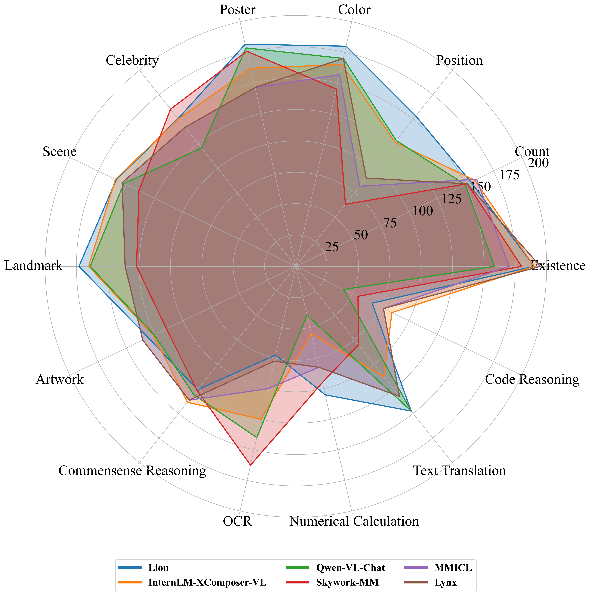

# MME: A Comprehensive Evaluation Benchmark for Multimodal Large Language Models


> Multimodal Large Language Model (MLLM) relies on the powerful LLM to perform multimodal tasks, showing amazing emergent abilities in recent studies, such as writing poems based on an image. However, it is difficult for these case studies to fully reflect the performance of MLLM, lacking a comprehensive evaluation. In this paper, we fill in this blank, presenting the first MLLM Evaluation benchmark MME. It measures both perception and cognition abilities on a total of 14 subtasks. In order to avoid data leakage that may arise from direct use of public datasets for evaluation, the annotations of instruction-answer pairs are all manually designed. The concise instruction design allows us to fairly compare MLLMs, instead of struggling in prompt engineering. Besides, with such an instruction, we can also easily carry out quantitative statistics. A total of 24 advanced MLLMs are comprehensively evaluated on our MME, which not only suggests that existing MLLMs still have a large room for improvement, but also reveals the potential directions for the subsequent model optimization.


## Our MLLM works

🔥🔥🔥 **A Survey on Multimodal Large Language Models**  
**[Project Page](https://github.com/BradyFU/Awesome-Multimodal-Large-Language-Models)** | **[Paper](https://arxiv.org/pdf/2306.13549.pdf)**

A curated list of Multimodal Large Language Models (MLLMs), including datasets, multimodal instruction tuning, multimodal in-context learning, multimodal chain-of-thought, llm-aided visual reasoning, foundation models, and others. This list will be updated in real time. :sparkles:

Welcome to join our WeChat group of MLLM communication! 

Please add WeChat ID (xjtupanda) to join the group. :star2:

---

🔥🔥🔥 **MME: A Comprehensive Evaluation Benchmark for Multimodal Large Language Models**  
**[Project Page [Leaderboards]](https://github.com/BradyFU/Awesome-Multimodal-Large-Language-Models/tree/Evaluation)** | **[Paper](https://arxiv.org/pdf/2306.13394.pdf)**

Leaderboards of **24** advanced MLLMs, including [**BLIP-2**](https://arxiv.org/pdf/2301.12597.pdf), [**InstructBLIP**](https://arxiv.org/pdf/2305.06500.pdf), [**LLaVA**](https://arxiv.org/pdf/2304.08485.pdf), [**MiniGPT-4**](https://arxiv.org/pdf/2304.10592.pdf), [**mPLUG-Owl**](https://arxiv.org/pdf/2304.14178.pdf), [**LLaMA-Adapter V2**](https://arxiv.org/pdf/2304.15010.pdf), [**ImageBind_LLM**](https://github.com/OpenGVLab/LLaMA-Adapter/tree/main), [**Otter**](https://arxiv.org/pdf/2305.03726.pdf), [**VisualGLM-6B**](https://github.com/THUDM/VisualGLM-6B), [**Multimodal-GPT**](https://arxiv.org/pdf/2305.04790.pdf), [**PandaGPT**](https://arxiv.org/pdf/2305.16355.pdf), [**VPGTrans**](https://arxiv.org/pdf/2305.01278.pdf), [**LaVIN**](https://arxiv.org/pdf/2305.15023.pdf), [**Lynx**](https://arxiv.org/pdf/2307.02469.pdf), [**Octopus**](https://github.com/gray311/UnifiedMultimodalInstructionTuning), [**LRV-Instruction**](https://arxiv.org/pdf/2306.14565.pdf), [**Cheetor**](https://arxiv.org/pdf/2308.04152.pdf), [**MMICL**](https://github.com/HaozheZhao/MIC), [**GIT2**](https://arxiv.org/pdf/2205.14100.pdf), [**BLIVA**](https://arxiv.org/pdf/2308.09936.pdf), [**Skywork-MM**](https://github.com/will-singularity/Skywork-MM/tree/main), [**Qwen-VL-Chat**](https://arxiv.org/pdf/2308.12966.pdf), [**InternLM-XComposer-VL**](https://arxiv.org/pdf/2309.15112.pdf), and [**Lion**](https://github.com/mynameischaos/Lion).

If you want to add your model in our leaderboards, please feel free to email bradyfu24@gmail.com. We will update the leaderboards in time. :sparkles:

<details><summary>Download MME :star2::star2: </summary>


The benchmark dataset is collected by Xiamen University for academic research only. You can email guilinli@stu.xmu.edu.cn to obtain the dataset, according to the following requirement. 

**Requirement**: A real-name system is encouraged for better academic communication. Your email suffix needs to match your affiliation, such as xx@stu.xmu.edu.cn and Xiamen University. Otherwise, you need to explain why. Please include the information bellow when sending your application email.

```
Name: (tell us who you are.)
Affiliation: (the name/url of your university or company)
Job Title: (e.g., professor, PhD, and researcher)
Email: (your email address)
How to use: (only for non-commercial use)
```

</details>

---

🔥🔥🔥 **Woodpecker: Hallucination Correction for MLLMs** 🚀🚀🚀  

<p align="center">
    
</p>

**[Source Code](https://github.com/BradyFU/Woodpecker)** | **[Online Demo](https://42976740ac53ddbe7d.gradio.live)** | **[Paper [Coming Soon]](https://github.com/BradyFU/Woodpecker)**

This is the first work to correct hallucination in multimodal large language models. The code and online demo have been released, and the paper will be coming soon!

---

If you find our projects helpful to your research, please cite the following papers:

```
@article{yin2023survey,
  title={A Survey on Multimodal Large Language Models},
  author={Yin, Shukang and Fu, Chaoyou and Zhao, Sirui and Li, Ke and Sun, Xing and Xu, Tong and Chen, Enhong},
  journal={arXiv preprint arXiv:2306.13549},
  year={2023}
}

@article{fu2023mme,
  title={MME: A Comprehensive Evaluation Benchmark for Multimodal Large Language Models},
  author={Fu, Chaoyou and Chen, Peixian and Shen, Yunhang and Qin, Yulei and Zhang, Mengdan and Lin, Xu and Qiu, Zhenyu and Lin, Wei and Yang, Jinrui and Zheng, Xiawu and Li, Ke and Sun, Xing and Ji, Rongrong},
  journal={arXiv preprint arXiv:2306.13394},
  year={2023}
}
```

---

# News 🚀

**[2023-09]** 

1. [09-28] Thanks to [**Huasong Zhong**](https://github.com/mynameischaos), [**Lion**](https://github.com/mynameischaos/Lion) is added. 🔥🔥
2. [09-27] Thanks to [**Xiaoyi Dong**](https://github.com/LightDXY), [**InternLM-XComposer-VL**](https://github.com/InternLM/InternLM-XComposer) joins our leaderboards. 🔥🔥
3. [09-05] Thanks to [**Jinze Bai**](https://github.com/jinze1994), our leaderboards usher in [**Qwen-VL-Chat**](https://github.com/QwenLM/Qwen-VL). 🔥🔥
4. [09-01] Thanks to [**Skywork Multi-Modal Group**](https://github.com/will-singularity), [**Skywork-MM**](https://github.com/will-singularity/Skywork-MM/tree/main) takes part in our leaderboards. 🔥🔥

**[2023-08]** 

1. [08-28] Thanks to [**UCSD MLPC**](https://github.com/mlpc-ucsd), we welcome [**BLIVA**](https://github.com/mlpc-ucsd/BLIVA) to join our leaderboards. 🔥🔥
2. [08-28] Thanks to [**Jianfeng Wang**](https://scholar.google.com.hk/citations?user=vJWEw_8AAAAJ&hl=zh-CN&oi=sra), [**GIT2**](https://github.com/microsoft/GenerativeImage2Text) is added to our leaderboards. 🔥🔥
3. [08-28] Thanks to [**Yike Yuan**](https://github.com/yyk-wew) and [**Songyang Zhang**](https://github.com/tonysy), the results of [**MiniGPT4**](https://arxiv.org/pdf/2304.10592.pdf) have been revised. 🔥🔥
4. [08-21] Thanks to [**Haozhe Zhao**](https://github.com/HaozheZhao), [**MMICL**](https://github.com/HaozheZhao/MIC) joins our leaderboards (The results are renewed on 09-17 by upgrading the checkpoint.). 🔥🔥
5. [08-13] Thanks to [**Zhejiang University DCD Lab**](https://github.com/DCDmllm), our leaderboards incorporate a new member [**Cheetor**](https://github.com/DCDmllm/Cheetah). 🔥🔥
6. [08-08] Thanks to [**Fuxiao Liu**](https://github.com/FuxiaoLiu), we add [**LRV-Instruction**](https://github.com/FuxiaoLiu/LRV-Instruction) to our leaderboards. 🔥🔥

**[2023-07]** 

1. [07-28] Thanks to [**Yingzi Ma**](https://gray311.github.io/), his work [**Octopus**](https://github.com/gray311/UnifiedMultimodalInstructionTuning) has been updated to our leaderboards.
2. [07-15] Thanks to [**Jiani Zheng**](https://github.com/Garlicisnotmyfavor), our leaderboards welcome a new member [**Lynx**](https://github.com/bytedance/lynx-llm).
3. [07-12] Thanks to [**Ao Zhang**](https://github.com/waxnkw), his work [**VPGTrans**](https://github.com/VPGTrans/VPGTrans) has been added in our leaderboards.
4. [07-09] Thanks to [**Bo Li**](https://github.com/Luodian), we have updated the evaluation of his work [**Otter**](https://github.com/Luodian/Otter). It uses the latest model [**OTTER-Image-MPT7B**](https://huggingface.co/luodian/OTTER-Image-MPT7B) that incoporates OpenFlamingv2 and enhances instruction following ability.

**[2023-06]** 

1. [06-30] Thanks to [**Renrui Zhang**](https://github.com/ZrrSkywalker), we have updated the evaluation of his two works, i.e., [**LLaMA-Adapter V2**](https://github.com/OpenGVLab/LLaMA-Adapter) and [**ImageBind_LLM**](https://github.com/OpenGVLab/LLaMA-Adapter/tree/main/imagebind_LLM). The former is re-evaluated after changing the model [**weights**](https://github.com/OpenGVLab/LLaMA-Adapter/releases/download/v.2.0.0/7fa55208379faf2dd862565284101b0e4a2a72114d6490a95e432cf9d9b6c813_BIAS-7B.pth), and the latter is a newly added MLLM.
2. [06-30] Thanks to [**Gen Luo**](https://github.com/luogen1996), we have added the evaluation of his work [**LaVIN**](https://github.com/luogen1996/LaVIN).
3. [06-30] The results of other models have also been updated, retrieving the answer from the beginning of the generated responses instead of the whole responses. [**An automated evaluation script**](https://github.com/BradyFU/Awesome-Multimodal-Large-Language-Models/blob/Evaluation/tools/eval_tool.zip) for the calculation of scores has been released!

---

# Evaluation Results

The top 5 on the perception and cognition leaderboards:




# Evaluation Leaderboards


---

<font size=5><center><b> Table of Leaderboards </b> </center></font>

- [Perception](#perception)
  - [Existence](#existence) | [Count](#count) | [Position](#position) | [Color](#color) | [Poster](#poster) | [Celebrity](#celebrity) | [Scene](#scene) | [Landmark](#landmark) | [Artwork](#artwork) | [OCR](#ocr)
- [Cognition](#cognition)
  - [Commonsense Reasoning](#commonsense-reasoning) | [Numerical Calculation](#numerical-calculation) | [Text Translation](#text-translation) | [Code Reasoning](#code-reasoning)

---

## Perception

Sum of the scores of all perception subtasks, including existence, count, position, color, poster, celebrity, scene, landmark, artwork, and OCR. The full score of each subtask is 200, and that of all perception is 2000.

| Rank |                            Model                             |                           Version                            |    Score    |
| :--: | :----------------------------------------------------------: | :----------------------------------------------------------: | :---------: |
|  🏅️   |      **[Lion](https://github.com/mynameischaos/Lion)**       |   **[InternLM-7B](https://github.com/mynameischaos/Lion)**   | **1545.80** |
|  🥈   | **[InternLM-XComposer-VL](https://github.com/InternLM/InternLM-XComposer)** | **[InternLM-7B](https://github.com/InternLM/InternLM-XComposer)** | **1528.45** |
|  🥉   |    **[Qwen-VL-Chat](https://github.com/QwenLM/Qwen-VL/)**    |       **[Qwen-7B](https://github.com/QwenLM/Qwen-VL)**       | **1487.58** |
|  4   | [Skywork-MM](https://github.com/will-singularity/Skywork-MM/tree/main) | [Skywork-MM-13B](https://github.com/will-singularity/Skywork-MM/tree/main) |   1419.08   |
|  5   |          [MMICL](https://github.com/HaozheZhao/MIC)          |      [FlanT5xxl](https://arxiv.org/pdf/2309.07915.pdf)       |   1381.73   |
|  6   |         [Lynx](https://arxiv.org/pdf/2307.02469.pdf)         |      [vicuna-7b](https://github.com/bytedance/lynx-llm)      |   1373.23   |
|  7   |        [BLIVA](https://arxiv.org/pdf/2308.09936.pdf)         |       [FlanT5xxl](https://github.com/mlpc-ucsd/BLIVA)        |   1337.73   |
|  8   |         [GIT2](https://arxiv.org/pdf/2205.14100.pdf)         | [VQAv2-finetuned](https://github.com/microsoft/GenerativeImage2Text) |   1332.05   |
|  9   |       [Cheetor](https://arxiv.org/pdf/2308.04152.pdf)        |       [vicuna-7b](https://github.com/DCDmllm/Cheetah)        |   1299.96   |
|  10  |   [LRV-Instruction](https://arxiv.org/pdf/2306.14565.pdf)    |    [LRV-7B](https://github.com/FuxiaoLiu/LRV-Instruction)    |   1299.78   |
|  11  |        [BLIP-2](https://arxiv.org/pdf/2301.12597.pdf)        | [blip2-pretrain-flant5xxl](https://github.com/salesforce/LAVIS/tree/main/projects/blip2) |   1293.84   |
|  12  |        [Otter](https://arxiv.org/pdf/2305.03726.pdf)         |    [OTTER-Image-MPT7B](https://github.com/Luodian/Otter)     |   1292.26   |
|  13  |     [InstructBLIP](https://arxiv.org/pdf/2305.06500.pdf)     | [blip2-instruct-flant5xxl](https://github.com/salesforce/LAVIS/tree/main/projects/instructblip) |   1212.82   |
|  14  | [Octopus](https://github.com/gray311/UnifiedMultimodalInstructionTuning) | [MPT7B](https://github.com/gray311/UnifiedMultimodalInstructionTuning) |   1095.76   |
|  15  |   [LLaMA-Adapter V2](https://arxiv.org/pdf/2304.15010.pdf)   | [LLaMAv2-7B](https://github.com/OpenGVLab/LLaMA-Adapter/tree/main/llama_adapter_v2_multimodal) |   972.67    |
|  16  |      [mPLUG-Owl](https://arxiv.org/pdf/2304.14178.pdf)       | [mplug-owl-llama-7b](https://huggingface.co/MAGAer13/mplug-owl-llama-7b) |   967.34    |
|  17  |        [LaVIN](https://arxiv.org/pdf/2305.15023.pdf)         |       [LAVIN-13B](https://github.com/luogen1996/LaVIN)       |   963.60    |
|  18  |       [VPGTrans](https://arxiv.org/pdf/2305.01278.pdf)       |     [vl-vicuna-7b](https://github.com/VPGTrans/VPGTrans)     |   790.45    |
|  19  | [ImageBind_LLM](https://github.com/OpenGVLab/LLaMA-Adapter/tree/main) | [imagebind_LLM-7B](https://github.com/OpenGVLab/LLaMA-Adapter/tree/main/imagebind_LLM) |   775.77    |
|  20  |    [VisualGLM-6B](https://github.com/THUDM/VisualGLM-6B)     |    [VisualGLM-6B](https://github.com/THUDM/VisualGLM-6B)     |   705.31    |
|  21  |    [Multimodal-GPT](https://arxiv.org/pdf/2305.04790.pdf)    | [Multimodal-GPT-9B](https://github.com/open-mmlab/Multimodal-GPT) |   654.72    |
|  22  |       [PandaGPT](https://arxiv.org/pdf/2305.16355.pdf)       | [pandagpt-7b-max-len-512](https://github.com/yxuansu/PandaGPT) |   642.59    |
|  23  |      [MiniGPT-4](https://arxiv.org/pdf/2304.10592.pdf)       | [minigpt4-aligned-with-vicuna13b](https://github.com/Vision-CAIR/MiniGPT-4) |   581.67    |
|  24  |        [LLaVA](https://arxiv.org/pdf/2304.08485.pdf)         |     [LLaVA-7B-v0](https://github.com/haotian-liu/LLaVA)      |   502.82    |

### Existence

| Rank |                            Model                             |                           Version                            |   Score    |
| :--: | :----------------------------------------------------------: | :----------------------------------------------------------: | :--------: |
|  🏅️   |      **[Otter](https://arxiv.org/pdf/2305.03726.pdf)**       |  **[OTTER-Image-MPT7B](https://github.com/Luodian/Otter)**   | **195.00** |
|  🏅️   |       **[Lynx](https://arxiv.org/pdf/2307.02469.pdf)**       |    **[vicuna-7b](https://github.com/bytedance/lynx-llm)**    | **195.00** |
|  🥈   |       **[GIT2](https://arxiv.org/pdf/2205.14100.pdf)**       | **[VQAv2-finetuned](https://github.com/microsoft/GenerativeImage2Text)** | **190.00** |
|  🥈   | **[InternLM-XComposer-VL](https://github.com/InternLM/InternLM-XComposer)** | **[InternLM-7B](https://github.com/InternLM/InternLM-XComposer)** | **190.00** |
|  🥈   |      **[Lion](https://github.com/mynameischaos/Lion)**       |   **[InternLM-7B](https://github.com/mynameischaos/Lion)**   | **190.00** |
|  🥉   |   **[InstructBLIP](https://arxiv.org/pdf/2305.06500.pdf)**   | **[blip2-instruct-flant5xxl](https://github.com/salesforce/LAVIS/tree/main/projects/instructblip)** | **185.00** |
|  🥉   |      **[LaVIN](https://arxiv.org/pdf/2305.15023.pdf)**       |     **[LAVIN-13B](https://github.com/luogen1996/LaVIN)**     | **185.00** |
|  4   | [Octopus](https://github.com/gray311/UnifiedMultimodalInstructionTuning) | [MPT7B](https://github.com/gray311/UnifiedMultimodalInstructionTuning) |   180.00   |
|  4   |       [Cheetor](https://arxiv.org/pdf/2308.04152.pdf)        |       [vicuna-7b](https://github.com/DCDmllm/Cheetah)        |   180.00   |
|  4   |        [BLIVA](https://arxiv.org/pdf/2308.09936.pdf)         |       [FlanT5xxl](https://github.com/mlpc-ucsd/BLIVA)        |   180.00   |
|  4   | [Skywork-MM](https://github.com/will-singularity/Skywork-MM/tree/main) | [Skywork-MM-13B](https://github.com/will-singularity/Skywork-MM/tree/main) |   180.00   |
|  5   |          [MMICL](https://github.com/HaozheZhao/MIC)          |      [FlanT5xxl](https://arxiv.org/pdf/2309.07915.pdf)       |   170.00   |
|  6   |   [LRV-Instruction](https://arxiv.org/pdf/2306.14565.pdf)    |    [LRV-7B](https://github.com/FuxiaoLiu/LRV-Instruction)    |   165.00   |
|  7   |        [BLIP-2](https://arxiv.org/pdf/2301.12597.pdf)        | [blip2-pretrain-flant5xxl](https://github.com/salesforce/LAVIS/tree/main/projects/blip2) |   160.00   |
|  8   |      [Qwen-VL-Chat](https://github.com/QwenLM/Qwen-VL/)      |         [Qwen-7B](https://github.com/QwenLM/Qwen-VL)         |   158.33   |
|  9   | [ImageBind_LLM](https://github.com/OpenGVLab/LLaMA-Adapter/tree/main) | [imagebind_LLM-7B](https://github.com/OpenGVLab/LLaMA-Adapter/tree/main/imagebind_LLM) |   128.33   |
|  10  |      [mPLUG-Owl](https://arxiv.org/pdf/2304.14178.pdf)       | [mplug-owl-llama-7b](https://huggingface.co/MAGAer13/mplug-owl-llama-7b) |   120.00   |
|  10  |   [LLaMA-Adapter V2](https://arxiv.org/pdf/2304.15010.pdf)   | [LLaMAv2-7B](https://github.com/OpenGVLab/LLaMA-Adapter/tree/main/llama_adapter_v2_multimodal) |   120.00   |
|  11  |    [VisualGLM-6B](https://github.com/THUDM/VisualGLM-6B)     |    [VisualGLM-6B](https://github.com/THUDM/VisualGLM-6B)     |   85.00    |
|  12  |       [PandaGPT](https://arxiv.org/pdf/2305.16355.pdf)       | [pandagpt-7b-max-len-512](https://github.com/yxuansu/PandaGPT) |   70.00    |
|  12  |       [VPGTrans](https://arxiv.org/pdf/2305.01278.pdf)       |     [vl-vicuna-7b](https://github.com/VPGTrans/VPGTrans)     |   70.00    |
|  13  |      [MiniGPT-4](https://arxiv.org/pdf/2304.10592.pdf)       | [minigpt4-aligned-with-vicuna13b](https://github.com/Vision-CAIR/MiniGPT-4) |   68.33    |
|  14  |    [Multimodal-GPT](https://arxiv.org/pdf/2305.04790.pdf)    | [Multimodal-GPT-9B](https://github.com/open-mmlab/Multimodal-GPT) |   61.67    |
|  15  |        [LLaVA](https://arxiv.org/pdf/2304.08485.pdf)         |     [LLaVA-7B-v0](https://github.com/haotian-liu/LLaVA)      |   50.00    |

### Count

| Rank |                            Model                             |                           Version                            |   Score    |
| :--: | :----------------------------------------------------------: | :----------------------------------------------------------: | :--------: |
|  🏅️   |        **[MMICL](https://github.com/HaozheZhao/MIC)**        |    **[FlanT5xxl](https://arxiv.org/pdf/2309.07915.pdf)**     | **160.00** |
|  🥈   | **[InternLM-XComposer-VL](https://github.com/InternLM/InternLM-XComposer)** | **[InternLM-7B](https://github.com/InternLM/InternLM-XComposer)** | **158.33** |
|  🥉   |      **[Lion](https://github.com/mynameischaos/Lion)**       |   **[InternLM-7B](https://github.com/mynameischaos/Lion)**   | **155.00** |
|  4   |         [Lynx](https://arxiv.org/pdf/2307.02469.pdf)         |      [vicuna-7b](https://github.com/bytedance/lynx-llm)      |   151.67   |
|  4   | [Skywork-MM](https://github.com/will-singularity/Skywork-MM/tree/main) | [Skywork-MM-13B](https://github.com/will-singularity/Skywork-MM/tree/main) |   151.67   |
|  5   |      [Qwen-VL-Chat](https://github.com/QwenLM/Qwen-VL/)      |         [Qwen-7B](https://github.com/QwenLM/Qwen-VL)         |   150.00   |
|  7   |     [InstructBLIP](https://arxiv.org/pdf/2305.06500.pdf)     | [blip2-instruct-flant5xxl](https://github.com/salesforce/LAVIS/tree/main/projects/instructblip) |   143.33   |
|  8   |        [BLIVA](https://arxiv.org/pdf/2308.09936.pdf)         |       [FlanT5xxl](https://github.com/mlpc-ucsd/BLIVA)        |   138.33   |
|  9   |        [BLIP-2](https://arxiv.org/pdf/2301.12597.pdf)        | [blip2-pretrain-flant5xxl](https://github.com/salesforce/LAVIS/tree/main/projects/blip2) |   135.00   |
|  10  |         [GIT2](https://arxiv.org/pdf/2205.14100.pdf)         | [VQAv2-finetuned](https://github.com/microsoft/GenerativeImage2Text) |   118.33   |
|  11  |   [LRV-Instruction](https://arxiv.org/pdf/2306.14565.pdf)    |    [LRV-7B](https://github.com/FuxiaoLiu/LRV-Instruction)    |   111.67   |
|  12  |       [Cheetor](https://arxiv.org/pdf/2308.04152.pdf)        |       [vicuna-7b](https://github.com/DCDmllm/Cheetah)        |   96.67    |
|  13  |        [Otter](https://arxiv.org/pdf/2305.03726.pdf)         |    [OTTER-Image-MPT7B](https://github.com/Luodian/Otter)     |   88.33    |
|  13  |        [LaVIN](https://arxiv.org/pdf/2305.15023.pdf)         |       [LAVIN-13B](https://github.com/luogen1996/LaVIN)       |   88.33    |
|  14  |       [VPGTrans](https://arxiv.org/pdf/2305.01278.pdf)       |     [vl-vicuna-7b](https://github.com/VPGTrans/VPGTrans)     |   85.00    |
|  15  | [ImageBind_LLM](https://github.com/OpenGVLab/LLaMA-Adapter/tree/main) | [imagebind_LLM-7B](https://github.com/OpenGVLab/LLaMA-Adapter/tree/main/imagebind_LLM) |   60.00    |
|  16  |      [MiniGPT-4](https://arxiv.org/pdf/2304.10592.pdf)       | [minigpt4-aligned-with-vicuna13b](https://github.com/Vision-CAIR/MiniGPT-4) |   55.00    |
|  16  |    [Multimodal-GPT](https://arxiv.org/pdf/2305.04790.pdf)    | [Multimodal-GPT-9B](https://github.com/open-mmlab/Multimodal-GPT) |   55.00    |
|  17  | [Octopus](https://github.com/gray311/UnifiedMultimodalInstructionTuning) | [MPT7B](https://github.com/gray311/UnifiedMultimodalInstructionTuning) |   53.33    |
|  18  |      [mPLUG-Owl](https://arxiv.org/pdf/2304.14178.pdf)       | [mplug-owl-llama-7b](https://huggingface.co/MAGAer13/mplug-owl-llama-7b) |   50.00    |
|  18  |   [LLaMA-Adapter V2](https://arxiv.org/pdf/2304.15010.pdf)   | [LLaMAv2-7B](https://github.com/OpenGVLab/LLaMA-Adapter/tree/main/llama_adapter_v2_multimodal) |   50.00    |
|  18  |    [VisualGLM-6B](https://github.com/THUDM/VisualGLM-6B)     |    [VisualGLM-6B](https://github.com/THUDM/VisualGLM-6B)     |   50.00    |
|  18  |       [PandaGPT](https://arxiv.org/pdf/2305.16355.pdf)       | [pandagpt-7b-max-len-512](https://github.com/yxuansu/PandaGPT) |   50.00    |
|  18  |        [LLaVA](https://arxiv.org/pdf/2304.08485.pdf)         |     [LLaVA-7B-v0](https://github.com/haotian-liu/LLaVA)      |   50.00    |

### Position

| Rank |                            Model                             |                           Version                            |   Score    |
| :--: | :----------------------------------------------------------: | :----------------------------------------------------------: | :--------: |
|  🏅️   |      **[Lion](https://github.com/mynameischaos/Lion)**       |   **[InternLM-7B](https://github.com/mynameischaos/Lion)**   | **153.33** |
|  🥈   |    **[Qwen-VL-Chat](https://github.com/QwenLM/Qwen-VL/)**    |       **[Qwen-7B](https://github.com/QwenLM/Qwen-VL)**       | **128.33** |
|  🥉   | **[InternLM-XComposer-VL](https://github.com/InternLM/InternLM-XComposer)** | **[InternLM-7B](https://github.com/InternLM/InternLM-XComposer)** | **126.67** |
|  4   |         [GIT2](https://arxiv.org/pdf/2205.14100.pdf)         | [VQAv2-finetuned](https://github.com/microsoft/GenerativeImage2Text) |   96.67    |
|  5   |         [Lynx](https://arxiv.org/pdf/2307.02469.pdf)         |      [vicuna-7b](https://github.com/bytedance/lynx-llm)      |   90.00    |
|  6   |        [Otter](https://arxiv.org/pdf/2305.03726.pdf)         |    [OTTER-Image-MPT7B](https://github.com/Luodian/Otter)     |   86.67    |
|  6   |   [LRV-Instruction](https://arxiv.org/pdf/2306.14565.pdf)    |    [LRV-7B](https://github.com/FuxiaoLiu/LRV-Instruction)    |   86.67    |
|  7   |          [MMICL](https://github.com/HaozheZhao/MIC)          |      [FlanT5xxl](https://arxiv.org/pdf/2309.07915.pdf)       |   81.67    |
|  7   |        [BLIVA](https://arxiv.org/pdf/2308.09936.pdf)         |       [FlanT5xxl](https://github.com/mlpc-ucsd/BLIVA)        |   81.67    |
|  8   |       [Cheetor](https://arxiv.org/pdf/2308.04152.pdf)        |       [vicuna-7b](https://github.com/DCDmllm/Cheetah)        |   80.00    |
|  9   |        [BLIP-2](https://arxiv.org/pdf/2301.12597.pdf)        | [blip2-pretrain-flant5xxl](https://github.com/salesforce/LAVIS/tree/main/projects/blip2) |   73.33    |
|  10  |     [InstructBLIP](https://arxiv.org/pdf/2305.06500.pdf)     | [blip2-instruct-flant5xxl](https://github.com/salesforce/LAVIS/tree/main/projects/instructblip) |   66.67    |
|  11  | [Skywork-MM](https://github.com/will-singularity/Skywork-MM/tree/main) | [Skywork-MM-13B](https://github.com/will-singularity/Skywork-MM/tree/main) |   63.33    |
|  11  |        [LaVIN](https://arxiv.org/pdf/2305.15023.pdf)         |       [LAVIN-13B](https://github.com/luogen1996/LaVIN)       |   63.33    |
|  11  |       [VPGTrans](https://arxiv.org/pdf/2305.01278.pdf)       |     [vl-vicuna-7b](https://github.com/VPGTrans/VPGTrans)     |   63.33    |
|  12  |    [Multimodal-GPT](https://arxiv.org/pdf/2305.04790.pdf)    | [Multimodal-GPT-9B](https://github.com/open-mmlab/Multimodal-GPT) |   58.33    |
|  13  |      [mPLUG-Owl](https://arxiv.org/pdf/2304.14178.pdf)       | [mplug-owl-llama-7b](https://huggingface.co/MAGAer13/mplug-owl-llama-7b) |   50.00    |
|  13  |       [PandaGPT](https://arxiv.org/pdf/2305.16355.pdf)       | [pandagpt-7b-max-len-512](https://github.com/yxuansu/PandaGPT) |   50.00    |
|  13  |        [LLaVA](https://arxiv.org/pdf/2304.08485.pdf)         |     [LLaVA-7B-v0](https://github.com/haotian-liu/LLaVA)      |   50.00    |
|  14  | [Octopus](https://github.com/gray311/UnifiedMultimodalInstructionTuning) | [MPT7B](https://github.com/gray311/UnifiedMultimodalInstructionTuning) |   48.33    |
|  14  |   [LLaMA-Adapter V2](https://arxiv.org/pdf/2304.15010.pdf)   | [LLaMAv2-7B](https://github.com/OpenGVLab/LLaMA-Adapter/tree/main/llama_adapter_v2_multimodal) |   48.33    |
|  14  |    [VisualGLM-6B](https://github.com/THUDM/VisualGLM-6B)     |    [VisualGLM-6B](https://github.com/THUDM/VisualGLM-6B)     |   48.33    |
|  15  | [ImageBind_LLM](https://github.com/OpenGVLab/LLaMA-Adapter/tree/main) | [imagebind_LLM-7B](https://github.com/OpenGVLab/LLaMA-Adapter/tree/main/imagebind_LLM) |   46.67    |
|  16  |      [MiniGPT-4](https://arxiv.org/pdf/2304.10592.pdf)       | [minigpt4-aligned-with-vicuna13b](https://github.com/Vision-CAIR/MiniGPT-4) |   43.33    |

### Color

| Rank |                            Model                             |                           Version                            |   Score    |
| :--: | :----------------------------------------------------------: | :----------------------------------------------------------: | :--------: |
|  🏅️   |      **[BLIVA](https://arxiv.org/pdf/2308.09936.pdf)**       |     **[FlanT5xxl](https://github.com/mlpc-ucsd/BLIVA)**      | **180.00** |
|  🏅️   |      **[Lion](https://github.com/mynameischaos/Lion)**       |   **[InternLM-7B](https://github.com/mynameischaos/Lion)**   | **180.00** |
|  🥈   |       **[Lynx](https://arxiv.org/pdf/2307.02469.pdf)**       |    **[vicuna-7b](https://github.com/bytedance/lynx-llm)**    | **170.00** |
|  🥈   |    **[Qwen-VL-Chat](https://github.com/QwenLM/Qwen-VL/)**    |       **[Qwen-7B](https://github.com/QwenLM/Qwen-VL)**       | **170.00** |
|  🥉   | **[LRV-Instruction](https://arxiv.org/pdf/2306.14565.pdf)**  |  **[LRV-7B](https://github.com/FuxiaoLiu/LRV-Instruction)**  | **165.00** |
|  🥉   | **[InternLM-XComposer-VL](https://github.com/InternLM/InternLM-XComposer)** | **[InternLM-7B](https://github.com/InternLM/InternLM-XComposer)** | **165.00** |
|  4   |         [GIT2](https://arxiv.org/pdf/2205.14100.pdf)         | [VQAv2-finetuned](https://github.com/microsoft/GenerativeImage2Text) |   158.33   |
|  5   |          [MMICL](https://github.com/HaozheZhao/MIC)          |      [FlanT5xxl](https://arxiv.org/pdf/2309.07915.pdf)       |   156.67   |
|  6   |     [InstructBLIP](https://arxiv.org/pdf/2305.06500.pdf)     | [blip2-instruct-flant5xxl](https://github.com/salesforce/LAVIS/tree/main/projects/instructblip) |   153.33   |
|  7   |        [BLIP-2](https://arxiv.org/pdf/2301.12597.pdf)        | [blip2-pretrain-flant5xxl](https://github.com/salesforce/LAVIS/tree/main/projects/blip2) |   148.33   |
|  8   | [Skywork-MM](https://github.com/will-singularity/Skywork-MM/tree/main) | [Skywork-MM-13B](https://github.com/will-singularity/Skywork-MM/tree/main) |   145.00   |
|  9   |       [Cheetor](https://arxiv.org/pdf/2308.04152.pdf)        |       [vicuna-7b](https://github.com/DCDmllm/Cheetah)        |   116.67   |
|  10  |        [Otter](https://arxiv.org/pdf/2305.03726.pdf)         |    [OTTER-Image-MPT7B](https://github.com/Luodian/Otter)     |   113.33   |
|  11  | [Octopus](https://github.com/gray311/UnifiedMultimodalInstructionTuning) | [MPT7B](https://github.com/gray311/UnifiedMultimodalInstructionTuning) |   103.33   |
|  12  |      [MiniGPT-4](https://arxiv.org/pdf/2304.10592.pdf)       | [minigpt4-aligned-with-vicuna13b](https://github.com/Vision-CAIR/MiniGPT-4) |   75.00    |
|  12  |   [LLaMA-Adapter V2](https://arxiv.org/pdf/2304.15010.pdf)   | [LLaMAv2-7B](https://github.com/OpenGVLab/LLaMA-Adapter/tree/main/llama_adapter_v2_multimodal) |   75.00    |
|  12  |        [LaVIN](https://arxiv.org/pdf/2305.15023.pdf)         |       [LAVIN-13B](https://github.com/luogen1996/LaVIN)       |   75.00    |
|  13  | [ImageBind_LLM](https://github.com/OpenGVLab/LLaMA-Adapter/tree/main) | [imagebind_LLM-7B](https://github.com/OpenGVLab/LLaMA-Adapter/tree/main/imagebind_LLM) |   73.33    |
|  13  |       [VPGTrans](https://arxiv.org/pdf/2305.01278.pdf)       |     [vl-vicuna-7b](https://github.com/VPGTrans/VPGTrans)     |   73.33    |
|  14  |    [Multimodal-GPT](https://arxiv.org/pdf/2305.04790.pdf)    | [Multimodal-GPT-9B](https://github.com/open-mmlab/Multimodal-GPT) |   68.33    |
|  15  |      [mPLUG-Owl](https://arxiv.org/pdf/2304.14178.pdf)       | [mplug-owl-llama-7b](https://huggingface.co/MAGAer13/mplug-owl-llama-7b) |   55.00    |
|  15  |    [VisualGLM-6B](https://github.com/THUDM/VisualGLM-6B)     |    [VisualGLM-6B](https://github.com/THUDM/VisualGLM-6B)     |   55.00    |
|  15  |        [LLaVA](https://arxiv.org/pdf/2304.08485.pdf)         |     [LLaVA-7B-v0](https://github.com/haotian-liu/LLaVA)      |   55.00    |
|  16  |       [PandaGPT](https://arxiv.org/pdf/2305.16355.pdf)       | [pandagpt-7b-max-len-512](https://github.com/yxuansu/PandaGPT) |   50.00    |

### Poster

| Rank |                            Model                             |                           Version                            |   Score    |
| :--: | :----------------------------------------------------------: | :----------------------------------------------------------: | :--------: |
|  🏅️   |      **[Lion](https://github.com/mynameischaos/Lion)**       |   **[InternLM-7B](https://github.com/mynameischaos/Lion)**   | **181.63** |
|  🥈   |    **[Qwen-VL-Chat](https://github.com/QwenLM/Qwen-VL/)**    |       **[Qwen-7B](https://github.com/QwenLM/Qwen-VL)**       | **178.57** |
|  🥉   | **[Skywork-MM](https://github.com/will-singularity/Skywork-MM/tree/main)** | **[Skywork-MM-13B](https://github.com/will-singularity/Skywork-MM/tree/main)** | **175.85** |
|  4   | [InternLM-XComposer-VL](https://github.com/InternLM/InternLM-XComposer) | [InternLM-7B](https://github.com/InternLM/InternLM-XComposer) |   161.90   |
|  5   |        [BLIVA](https://arxiv.org/pdf/2308.09936.pdf)         |       [FlanT5xxl](https://github.com/mlpc-ucsd/BLIVA)        |   155.10   |
|  6   |       [Cheetor](https://arxiv.org/pdf/2308.04152.pdf)        |       [vicuna-7b](https://github.com/DCDmllm/Cheetah)        |   147.28   |
|  7   |          [MMICL](https://github.com/HaozheZhao/MIC)          |      [FlanT5xxl](https://arxiv.org/pdf/2309.07915.pdf)       |   146.26   |
|  8   |        [BLIP-2](https://arxiv.org/pdf/2301.12597.pdf)        | [blip2-pretrain-flant5xxl](https://github.com/salesforce/LAVIS/tree/main/projects/blip2) |   141.84   |
|  9   |   [LRV-Instruction](https://arxiv.org/pdf/2306.14565.pdf)    |    [LRV-7B](https://github.com/FuxiaoLiu/LRV-Instruction)    |   139.04   |
|  10  |        [Otter](https://arxiv.org/pdf/2305.03726.pdf)         |    [OTTER-Image-MPT7B](https://github.com/Luodian/Otter)     |   138.78   |
|  11  | [Octopus](https://github.com/gray311/UnifiedMultimodalInstructionTuning) | [MPT7B](https://github.com/gray311/UnifiedMultimodalInstructionTuning) |   138.10   |
|  12  |      [mPLUG-Owl](https://arxiv.org/pdf/2304.14178.pdf)       | [mplug-owl-llama-7b](https://huggingface.co/MAGAer13/mplug-owl-llama-7b) |   136.05   |
|  13  |         [Lynx](https://arxiv.org/pdf/2307.02469.pdf)         |      [vicuna-7b](https://github.com/bytedance/lynx-llm)      |   124.83   |
|  14  |     [InstructBLIP](https://arxiv.org/pdf/2305.06500.pdf)     | [blip2-instruct-flant5xxl](https://github.com/salesforce/LAVIS/tree/main/projects/instructblip) |   123.81   |
|  15  |         [GIT2](https://arxiv.org/pdf/2205.14100.pdf)         | [VQAv2-finetuned](https://github.com/microsoft/GenerativeImage2Text) |   112.59   |
|  16  |   [LLaMA-Adapter V2](https://arxiv.org/pdf/2304.15010.pdf)   | [LLaMAv2-7B](https://github.com/OpenGVLab/LLaMA-Adapter/tree/main/llama_adapter_v2_multimodal) |   99.66    |
|  17  |       [VPGTrans](https://arxiv.org/pdf/2305.01278.pdf)       |     [vl-vicuna-7b](https://github.com/VPGTrans/VPGTrans)     |   84.01    |
|  18  |        [LaVIN](https://arxiv.org/pdf/2305.15023.pdf)         |       [LAVIN-13B](https://github.com/luogen1996/LaVIN)       |   79.59    |
|  19  |       [PandaGPT](https://arxiv.org/pdf/2305.16355.pdf)       | [pandagpt-7b-max-len-512](https://github.com/yxuansu/PandaGPT) |   76.53    |
|  20  |    [VisualGLM-6B](https://github.com/THUDM/VisualGLM-6B)     |    [VisualGLM-6B](https://github.com/THUDM/VisualGLM-6B)     |   65.99    |
|  21  | [ImageBind_LLM](https://github.com/OpenGVLab/LLaMA-Adapter/tree/main) | [imagebind_LLM-7B](https://github.com/OpenGVLab/LLaMA-Adapter/tree/main/imagebind_LLM) |   64.97    |
|  22  |    [Multimodal-GPT](https://arxiv.org/pdf/2305.04790.pdf)    | [Multimodal-GPT-9B](https://github.com/open-mmlab/Multimodal-GPT) |   57.82    |
|  23  |        [LLaVA](https://arxiv.org/pdf/2304.08485.pdf)         |     [LLaVA-7B-v0](https://github.com/haotian-liu/LLaVA)      |   50.00    |
|  24  |      [MiniGPT-4](https://arxiv.org/pdf/2304.10592.pdf)       | [minigpt4-aligned-with-vicuna13b](https://github.com/Vision-CAIR/MiniGPT-4) |   41.84    |

### Celebrity

| Rank |                            Model                             |                           Version                            |   Score    |
| :--: | :----------------------------------------------------------: | :----------------------------------------------------------: | :--------: |
|  🏅️   |      **[Otter](https://arxiv.org/pdf/2305.03726.pdf)**       |  **[OTTER-Image-MPT7B](https://github.com/Luodian/Otter)**   | **172.65** |
|  🥈   |     **[Cheetor](https://arxiv.org/pdf/2308.04152.pdf)**      |     **[vicuna-7b](https://github.com/DCDmllm/Cheetah)**      | **164.12** |
|  🥉   | **[Skywork-MM](https://github.com/will-singularity/Skywork-MM/tree/main)** | **[Skywork-MM-13B](https://github.com/will-singularity/Skywork-MM/tree/main)** | **160.29** |
|  4   |        [Lion](https://github.com/mynameischaos/Lion)         |     [InternLM-7B](https://github.com/mynameischaos/Lion)     |   150.59   |
|  5   | [InternLM-XComposer-VL](https://github.com/InternLM/InternLM-XComposer) | [InternLM-7B](https://github.com/InternLM/InternLM-XComposer) |   150.29   |
|  6   |         [GIT2](https://arxiv.org/pdf/2205.14100.pdf)         | [VQAv2-finetuned](https://github.com/microsoft/GenerativeImage2Text) |   145.88   |
|  7   |          [MMICL](https://github.com/HaozheZhao/MIC)          |      [FlanT5xxl](https://arxiv.org/pdf/2309.07915.pdf)       |   141.76   |
|  8   |        [BLIVA](https://arxiv.org/pdf/2308.09936.pdf)         |       [FlanT5xxl](https://github.com/mlpc-ucsd/BLIVA)        |   140.88   |
|  9   | [Octopus](https://github.com/gray311/UnifiedMultimodalInstructionTuning) | [MPT7B](https://github.com/gray311/UnifiedMultimodalInstructionTuning) |   129.41   |
|  10  |      [Qwen-VL-Chat](https://github.com/QwenLM/Qwen-VL/)      |         [Qwen-7B](https://github.com/QwenLM/Qwen-VL)         |   120.59   |
|  11  |         [Lynx](https://arxiv.org/pdf/2307.02469.pdf)         |      [vicuna-7b](https://github.com/bytedance/lynx-llm)      |   118.24   |
|  12  |   [LRV-Instruction](https://arxiv.org/pdf/2306.14565.pdf)    |    [LRV-7B](https://github.com/FuxiaoLiu/LRV-Instruction)    |   112.65   |
|  13  |        [BLIP-2](https://arxiv.org/pdf/2301.12597.pdf)        | [blip2-pretrain-flant5xxl](https://github.com/salesforce/LAVIS/tree/main/projects/blip2) |   105.59   |
|  14  |     [InstructBLIP](https://arxiv.org/pdf/2305.06500.pdf)     | [blip2-instruct-flant5xxl](https://github.com/salesforce/LAVIS/tree/main/projects/instructblip) |   101.18   |
|  15  |      [mPLUG-Owl](https://arxiv.org/pdf/2304.14178.pdf)       | [mplug-owl-llama-7b](https://huggingface.co/MAGAer13/mplug-owl-llama-7b) |   100.29   |
|  16  |   [LLaMA-Adapter V2](https://arxiv.org/pdf/2304.15010.pdf)   | [LLaMAv2-7B](https://github.com/OpenGVLab/LLaMA-Adapter/tree/main/llama_adapter_v2_multimodal) |   86.18    |
|  17  | [ImageBind_LLM](https://github.com/OpenGVLab/LLaMA-Adapter/tree/main) | [imagebind_LLM-7B](https://github.com/OpenGVLab/LLaMA-Adapter/tree/main/imagebind_LLM) |   76.47    |
|  18  |    [Multimodal-GPT](https://arxiv.org/pdf/2305.04790.pdf)    | [Multimodal-GPT-9B](https://github.com/open-mmlab/Multimodal-GPT) |   73.82    |
|  19  |       [PandaGPT](https://arxiv.org/pdf/2305.16355.pdf)       | [pandagpt-7b-max-len-512](https://github.com/yxuansu/PandaGPT) |   57.06    |
|  20  |      [MiniGPT-4](https://arxiv.org/pdf/2304.10592.pdf)       | [minigpt4-aligned-with-vicuna13b](https://github.com/Vision-CAIR/MiniGPT-4) |   54.41    |
|  21  |       [VPGTrans](https://arxiv.org/pdf/2305.01278.pdf)       |     [vl-vicuna-7b](https://github.com/VPGTrans/VPGTrans)     |   53.53    |
|  22  |    [VisualGLM-6B](https://github.com/THUDM/VisualGLM-6B)     |    [VisualGLM-6B](https://github.com/THUDM/VisualGLM-6B)     |   53.24    |
|  23  |        [LLaVA](https://arxiv.org/pdf/2304.08485.pdf)         |     [LLaVA-7B-v0](https://github.com/haotian-liu/LLaVA)      |   48.82    |
|  24  |        [LaVIN](https://arxiv.org/pdf/2305.15023.pdf)         |       [LAVIN-13B](https://github.com/luogen1996/LaVIN)       |   47.35    |

### Scene

| Rank |                            Model                             |                           Version                            |   Score    |
| :--: | :----------------------------------------------------------: | :----------------------------------------------------------: | :--------: |
|  🏅️   |       **[Lynx](https://arxiv.org/pdf/2307.02469.pdf)**       |    **[vicuna-7b](https://github.com/bytedance/lynx-llm)**    | **164.50** |
|  🥈   | **[InternLM-XComposer-VL](https://github.com/InternLM/InternLM-XComposer)** | **[InternLM-7B](https://github.com/InternLM/InternLM-XComposer)** | **159.75** |
|  🥉   |      **[Lion](https://github.com/mynameischaos/Lion)**       |   **[InternLM-7B](https://github.com/mynameischaos/Lion)**   | **159.00** |
|  4   |        [Otter](https://arxiv.org/pdf/2305.03726.pdf)         |    [OTTER-Image-MPT7B](https://github.com/Luodian/Otter)     |   158.75   |
|  5   |         [GIT2](https://arxiv.org/pdf/2205.14100.pdf)         | [VQAv2-finetuned](https://github.com/microsoft/GenerativeImage2Text) |   158.50   |
|  6   | [Octopus](https://github.com/gray311/UnifiedMultimodalInstructionTuning) | [MPT7B](https://github.com/gray311/UnifiedMultimodalInstructionTuning) |   157.25   |
|  7   |       [Cheetor](https://arxiv.org/pdf/2308.04152.pdf)        |       [vicuna-7b](https://github.com/DCDmllm/Cheetah)        |   156.00   |
|  8   |          [MMICL](https://github.com/HaozheZhao/MIC)          |      [FlanT5xxl](https://arxiv.org/pdf/2309.07915.pdf)       |   153.75   |
|  9   |     [InstructBLIP](https://arxiv.org/pdf/2305.06500.pdf)     | [blip2-instruct-flant5xxl](https://github.com/salesforce/LAVIS/tree/main/projects/instructblip) |   153.00   |
|  10  |      [Qwen-VL-Chat](https://github.com/QwenLM/Qwen-VL/)      |         [Qwen-7B](https://github.com/QwenLM/Qwen-VL)         |   152.25   |
|  11  |        [BLIVA](https://arxiv.org/pdf/2308.09936.pdf)         |       [FlanT5xxl](https://github.com/mlpc-ucsd/BLIVA)        |   151.50   |
|  12  |   [LLaMA-Adapter V2](https://arxiv.org/pdf/2304.15010.pdf)   | [LLaMAv2-7B](https://github.com/OpenGVLab/LLaMA-Adapter/tree/main/llama_adapter_v2_multimodal) |   148.50   |
|  13  |   [LRV-Instruction](https://arxiv.org/pdf/2306.14565.pdf)    |    [LRV-7B](https://github.com/FuxiaoLiu/LRV-Instruction)    |   147.98   |
|  14  |    [VisualGLM-6B](https://github.com/THUDM/VisualGLM-6B)     |    [VisualGLM-6B](https://github.com/THUDM/VisualGLM-6B)     |   146.25   |
|  15  |        [BLIP-2](https://arxiv.org/pdf/2301.12597.pdf)        | [blip2-pretrain-flant5xxl](https://github.com/salesforce/LAVIS/tree/main/projects/blip2) |   145.25   |
|  16  |       [VPGTrans](https://arxiv.org/pdf/2305.01278.pdf)       |     [vl-vicuna-7b](https://github.com/VPGTrans/VPGTrans)     |   141.75   |
|  17  | [Skywork-MM](https://github.com/will-singularity/Skywork-MM/tree/main) | [Skywork-MM-13B](https://github.com/will-singularity/Skywork-MM/tree/main) |   138.89   |
|  18  |        [LaVIN](https://arxiv.org/pdf/2305.15023.pdf)         |       [LAVIN-13B](https://github.com/luogen1996/LaVIN)       |   136.75   |
|  19  |      [mPLUG-Owl](https://arxiv.org/pdf/2304.14178.pdf)       | [mplug-owl-llama-7b](https://huggingface.co/MAGAer13/mplug-owl-llama-7b) |   135.50   |
|  20  |       [PandaGPT](https://arxiv.org/pdf/2305.16355.pdf)       | [pandagpt-7b-max-len-512](https://github.com/yxuansu/PandaGPT) |   118.00   |
|  21  | [ImageBind_LLM](https://github.com/OpenGVLab/LLaMA-Adapter/tree/main) | [imagebind_LLM-7B](https://github.com/OpenGVLab/LLaMA-Adapter/tree/main/imagebind_LLM) |   113.25   |
|  22  |      [MiniGPT-4](https://arxiv.org/pdf/2304.10592.pdf)       | [minigpt4-aligned-with-vicuna13b](https://github.com/Vision-CAIR/MiniGPT-4) |   71.75    |
|  23  |    [Multimodal-GPT](https://arxiv.org/pdf/2305.04790.pdf)    | [Multimodal-GPT-9B](https://github.com/open-mmlab/Multimodal-GPT) |   68.00    |
|  24  |        [LLaVA](https://arxiv.org/pdf/2304.08485.pdf)         |     [LLaVA-7B-v0](https://github.com/haotian-liu/LLaVA)      |   50.00    |

### Landmark

| Rank |                            Model                             |                           Version                            |   Score    |
| :--: | :----------------------------------------------------------: | :----------------------------------------------------------: | :--------: |
|  🏅️   |      **[Lion](https://github.com/mynameischaos/Lion)**       |   **[InternLM-7B](https://github.com/mynameischaos/Lion)**   | **173.00** |
|  🥈   | **[InternLM-XComposer-VL](https://github.com/InternLM/InternLM-XComposer)** | **[InternLM-7B](https://github.com/InternLM/InternLM-XComposer)** | **165.25** |
|  🥉   |    **[Qwen-VL-Chat](https://github.com/QwenLM/Qwen-VL/)**    |       **[Qwen-7B](https://github.com/QwenLM/Qwen-VL)**       | **164.00** |
|  4   |         [Lynx](https://arxiv.org/pdf/2307.02469.pdf)         |      [vicuna-7b](https://github.com/bytedance/lynx-llm)      |   162.00   |
|  5   |   [LRV-Instruction](https://arxiv.org/pdf/2306.14565.pdf)    |    [LRV-7B](https://github.com/FuxiaoLiu/LRV-Instruction)    |   160.53   |
|  6   |      [mPLUG-Owl](https://arxiv.org/pdf/2304.14178.pdf)       | [mplug-owl-llama-7b](https://huggingface.co/MAGAer13/mplug-owl-llama-7b) |   159.25   |
|  7   |   [LLaMA-Adapter V2](https://arxiv.org/pdf/2304.15010.pdf)   | [LLaMAv2-7B](https://github.com/OpenGVLab/LLaMA-Adapter/tree/main/llama_adapter_v2_multimodal) |   150.25   |
|  8   |       [Cheetor](https://arxiv.org/pdf/2308.04152.pdf)        |       [vicuna-7b](https://github.com/DCDmllm/Cheetah)        |   145.73   |
|  9   |         [GIT2](https://arxiv.org/pdf/2205.14100.pdf)         | [VQAv2-finetuned](https://github.com/microsoft/GenerativeImage2Text) |   140.50   |
|  10  |        [BLIP-2](https://arxiv.org/pdf/2301.12597.pdf)        | [blip2-pretrain-flant5xxl](https://github.com/salesforce/LAVIS/tree/main/projects/blip2) |   138.00   |
|  11  |        [Otter](https://arxiv.org/pdf/2305.03726.pdf)         |    [OTTER-Image-MPT7B](https://github.com/Luodian/Otter)     |   137.25   |
|  12  |          [MMICL](https://github.com/HaozheZhao/MIC)          |      [FlanT5xxl](https://arxiv.org/pdf/2309.07915.pdf)       |   136.13   |
|  13  | [Skywork-MM](https://github.com/will-singularity/Skywork-MM/tree/main) | [Skywork-MM-13B](https://github.com/will-singularity/Skywork-MM/tree/main) |   127.04   |
|  14  | [Octopus](https://github.com/gray311/UnifiedMultimodalInstructionTuning) | [MPT7B](https://github.com/gray311/UnifiedMultimodalInstructionTuning) |   126.00   |
|  15  |        [LaVIN](https://arxiv.org/pdf/2305.15023.pdf)         |       [LAVIN-13B](https://github.com/luogen1996/LaVIN)       |   93.50    |
|  16  |        [BLIVA](https://arxiv.org/pdf/2308.09936.pdf)         |       [FlanT5xxl](https://github.com/mlpc-ucsd/BLIVA)        |   89.50    |
|  17  |    [VisualGLM-6B](https://github.com/THUDM/VisualGLM-6B)     |    [VisualGLM-6B](https://github.com/THUDM/VisualGLM-6B)     |   83.75    |
|  18  |     [InstructBLIP](https://arxiv.org/pdf/2305.06500.pdf)     | [blip2-instruct-flant5xxl](https://github.com/salesforce/LAVIS/tree/main/projects/instructblip) |   79.75    |
|  19  |    [Multimodal-GPT](https://arxiv.org/pdf/2305.04790.pdf)    | [Multimodal-GPT-9B](https://github.com/open-mmlab/Multimodal-GPT) |   69.75    |
|  20  |       [PandaGPT](https://arxiv.org/pdf/2305.16355.pdf)       | [pandagpt-7b-max-len-512](https://github.com/yxuansu/PandaGPT) |   69.75    |
|  21  |       [VPGTrans](https://arxiv.org/pdf/2305.01278.pdf)       |     [vl-vicuna-7b](https://github.com/VPGTrans/VPGTrans)     |   64.75    |
|  22  | [ImageBind_LLM](https://github.com/OpenGVLab/LLaMA-Adapter/tree/main) | [imagebind_LLM-7B](https://github.com/OpenGVLab/LLaMA-Adapter/tree/main/imagebind_LLM) |   62.00    |
|  23  |      [MiniGPT-4](https://arxiv.org/pdf/2304.10592.pdf)       | [minigpt4-aligned-with-vicuna13b](https://github.com/Vision-CAIR/MiniGPT-4) |   54.00    |
|  24  |        [LLaVA](https://arxiv.org/pdf/2304.08485.pdf)         |     [LLaVA-7B-v0](https://github.com/haotian-liu/LLaVA)      |   50.00    |

### Artwork

| Rank |                            Model                             |                           Version                            |   Score    |
| :--: | :----------------------------------------------------------: | :----------------------------------------------------------: | :--------: |
|  🏅️   |       **[GIT2](https://arxiv.org/pdf/2205.14100.pdf)**       | **[VQAv2-finetuned](https://github.com/microsoft/GenerativeImage2Text)** | **146.25** |
|  🥈   |      **[BLIP-2](https://arxiv.org/pdf/2301.12597.pdf)**      | **[blip2-pretrain-flant5xxl](https://github.com/salesforce/LAVIS/tree/main/projects/blip2)** | **136.50** |
|  🥉   |        **[MMICL](https://github.com/HaozheZhao/MIC)**        |    **[FlanT5xxl](https://arxiv.org/pdf/2309.07915.pdf)**     | **135.50** |
|  4   |     [InstructBLIP](https://arxiv.org/pdf/2305.06500.pdf)     | [blip2-instruct-flant5xxl](https://github.com/salesforce/LAVIS/tree/main/projects/instructblip) |   134.25   |
|  5   |        [BLIVA](https://arxiv.org/pdf/2308.09936.pdf)         |       [FlanT5xxl](https://github.com/mlpc-ucsd/BLIVA)        |   133.25   |
|  6   |        [Lion](https://github.com/mynameischaos/Lion)         |     [InternLM-7B](https://github.com/mynameischaos/Lion)     |   130.75   |
|  7   |        [Otter](https://arxiv.org/pdf/2305.03726.pdf)         |    [OTTER-Image-MPT7B](https://github.com/Luodian/Otter)     |   129.00   |
|  8   | [InternLM-XComposer-VL](https://github.com/InternLM/InternLM-XComposer) | [InternLM-7B](https://github.com/InternLM/InternLM-XComposer) |   126.25   |
|  9   |      [Qwen-VL-Chat](https://github.com/QwenLM/Qwen-VL/)      |         [Qwen-7B](https://github.com/QwenLM/Qwen-VL)         |   125.50   |
|  10  |         [Lynx](https://arxiv.org/pdf/2307.02469.pdf)         |      [vicuna-7b](https://github.com/bytedance/lynx-llm)      |   119.50   |
|  11  | [Skywork-MM](https://github.com/will-singularity/Skywork-MM/tree/main) | [Skywork-MM-13B](https://github.com/will-singularity/Skywork-MM/tree/main) |   114.51   |
|  12  |       [Cheetor](https://arxiv.org/pdf/2308.04152.pdf)        |       [vicuna-7b](https://github.com/DCDmllm/Cheetah)        |   113.50   |
|  13  |   [LRV-Instruction](https://arxiv.org/pdf/2306.14565.pdf)    |    [LRV-7B](https://github.com/FuxiaoLiu/LRV-Instruction)    |   101.25   |
|  14  |      [mPLUG-Owl](https://arxiv.org/pdf/2304.14178.pdf)       | [mplug-owl-llama-7b](https://huggingface.co/MAGAer13/mplug-owl-llama-7b) |   96.25    |
|  15  | [Octopus](https://github.com/gray311/UnifiedMultimodalInstructionTuning) | [MPT7B](https://github.com/gray311/UnifiedMultimodalInstructionTuning) |   95.00    |
|  16  |        [LaVIN](https://arxiv.org/pdf/2305.15023.pdf)         |       [LAVIN-13B](https://github.com/luogen1996/LaVIN)       |   87.25    |
|  17  |       [VPGTrans](https://arxiv.org/pdf/2305.01278.pdf)       |     [vl-vicuna-7b](https://github.com/VPGTrans/VPGTrans)     |   77.25    |
|  18  |    [VisualGLM-6B](https://github.com/THUDM/VisualGLM-6B)     |    [VisualGLM-6B](https://github.com/THUDM/VisualGLM-6B)     |   75.25    |
|  19  | [ImageBind_LLM](https://github.com/OpenGVLab/LLaMA-Adapter/tree/main) | [imagebind_LLM-7B](https://github.com/OpenGVLab/LLaMA-Adapter/tree/main/imagebind_LLM) |   70.75    |
|  20  |   [LLaMA-Adapter V2](https://arxiv.org/pdf/2304.15010.pdf)   | [LLaMAv2-7B](https://github.com/OpenGVLab/LLaMA-Adapter/tree/main/llama_adapter_v2_multimodal) |   69.75    |
|  21  |      [MiniGPT-4](https://arxiv.org/pdf/2304.10592.pdf)       | [minigpt4-aligned-with-vicuna13b](https://github.com/Vision-CAIR/MiniGPT-4) |   60.50    |
|  22  |    [Multimodal-GPT](https://arxiv.org/pdf/2305.04790.pdf)    | [Multimodal-GPT-9B](https://github.com/open-mmlab/Multimodal-GPT) |   59.50    |
|  23  |       [PandaGPT](https://arxiv.org/pdf/2305.16355.pdf)       | [pandagpt-7b-max-len-512](https://github.com/yxuansu/PandaGPT) |   51.25    |
|  24  |        [LLaVA](https://arxiv.org/pdf/2304.08485.pdf)         |     [LLaVA-7B-v0](https://github.com/haotian-liu/LLaVA)      |   49.00    |

### OCR

| Rank |                            Model                             |                           Version                            |   Score    |
| :--: | :----------------------------------------------------------: | :----------------------------------------------------------: | :--------: |
|  🏅️   | **[Skywork-MM](https://github.com/will-singularity/Skywork-MM/tree/main)** | **[Skywork-MM-13B](https://github.com/will-singularity/Skywork-MM/tree/main)** | **162.50** |
|  🥈   |    **[Qwen-VL-Chat](https://github.com/QwenLM/Qwen-VL/)**    |       **[Qwen-7B](https://github.com/QwenLM/Qwen-VL)**       | **140.00** |
|  🥉   | **[LLaMA-Adapter V2](https://arxiv.org/pdf/2304.15010.pdf)** | **[LLaMAv2-7B](https://github.com/OpenGVLab/LLaMA-Adapter/tree/main/llama_adapter_v2_multimodal)** | **125.00** |
|  🥉   | **[InternLM-XComposer-VL](https://github.com/InternLM/InternLM-XComposer)** | **[InternLM-7B](https://github.com/InternLM/InternLM-XComposer)** | **125.00** |
|  4   |        [BLIP-2](https://arxiv.org/pdf/2301.12597.pdf)        | [blip2-pretrain-flant5xxl](https://github.com/salesforce/LAVIS/tree/main/projects/blip2) |   110.00   |
|  4   |   [LRV-Instruction](https://arxiv.org/pdf/2306.14565.pdf)    |    [LRV-7B](https://github.com/FuxiaoLiu/LRV-Instruction)    |   110.00   |
|  5   |        [LaVIN](https://arxiv.org/pdf/2305.15023.pdf)         |       [LAVIN-13B](https://github.com/luogen1996/LaVIN)       |   107.50   |
|  6   |       [Cheetor](https://arxiv.org/pdf/2308.04152.pdf)        |       [vicuna-7b](https://github.com/DCDmllm/Cheetah)        |   100.00   |
|  6   |          [MMICL](https://github.com/HaozheZhao/MIC)          |      [FlanT5xxl](https://arxiv.org/pdf/2309.07915.pdf)       |   100.00   |
|  7   |        [BLIVA](https://arxiv.org/pdf/2308.09936.pdf)         |       [FlanT5xxl](https://github.com/mlpc-ucsd/BLIVA)        |   87.50    |
|  8   |    [Multimodal-GPT](https://arxiv.org/pdf/2305.04790.pdf)    | [Multimodal-GPT-9B](https://github.com/open-mmlab/Multimodal-GPT) |   82.50    |
|  9   | [ImageBind_LLM](https://github.com/OpenGVLab/LLaMA-Adapter/tree/main) | [imagebind_LLM-7B](https://github.com/OpenGVLab/LLaMA-Adapter/tree/main/imagebind_LLM) |   80.00    |
|  10  |       [VPGTrans](https://arxiv.org/pdf/2305.01278.pdf)       |     [vl-vicuna-7b](https://github.com/VPGTrans/VPGTrans)     |   77.50    |
|  10  |         [Lynx](https://arxiv.org/pdf/2307.02469.pdf)         |      [vicuna-7b](https://github.com/bytedance/lynx-llm)      |   77.50    |
|  11  |     [InstructBLIP](https://arxiv.org/pdf/2305.06500.pdf)     | [blip2-instruct-flant5xxl](https://github.com/salesforce/LAVIS/tree/main/projects/instructblip) |   72.50    |
|  11  |        [Otter](https://arxiv.org/pdf/2305.03726.pdf)         |    [OTTER-Image-MPT7B](https://github.com/Luodian/Otter)     |   72.50    |
|  11  |        [Lion](https://github.com/mynameischaos/Lion)         |     [InternLM-7B](https://github.com/mynameischaos/Lion)     |   72.50    |
|  12  |      [mPLUG-Owl](https://arxiv.org/pdf/2304.14178.pdf)       | [mplug-owl-llama-7b](https://huggingface.co/MAGAer13/mplug-owl-llama-7b) |   65.00    |
|  12  | [Octopus](https://github.com/gray311/UnifiedMultimodalInstructionTuning) | [MPT7B](https://github.com/gray311/UnifiedMultimodalInstructionTuning) |   65.00    |
|  12  |         [GIT2](https://arxiv.org/pdf/2205.14100.pdf)         | [VQAv2-finetuned](https://github.com/microsoft/GenerativeImage2Text) |   65.00    |
|  13  |      [MiniGPT-4](https://arxiv.org/pdf/2304.10592.pdf)       | [minigpt4-aligned-with-vicuna13b](https://github.com/Vision-CAIR/MiniGPT-4) |   57.50    |
|  14  |       [PandaGPT](https://arxiv.org/pdf/2305.16355.pdf)       | [pandagpt-7b-max-len-512](https://github.com/yxuansu/PandaGPT) |   50.00    |
|  14  |        [LLaVA](https://arxiv.org/pdf/2304.08485.pdf)         |     [LLaVA-7B-v0](https://github.com/haotian-liu/LLaVA)      |   50.00    |
|  15  |    [VisualGLM-6B](https://github.com/THUDM/VisualGLM-6B)     |    [VisualGLM-6B](https://github.com/THUDM/VisualGLM-6B)     |   42.50    |

## Cognition

Sum of the scores of all cognition subtasks, including commonsense reasoning, numerical calculation, text translation, and code reasoning. The full score of each subtask is 200, and that of all cognition is 800.

| Rank |                            Model                             |                           Version                            |   Score    |
| :--: | :----------------------------------------------------------: | :----------------------------------------------------------: | :--------: |
|  🏅️   |      **[Lion](https://github.com/mynameischaos/Lion)**       |   **[InternLM-7B](https://github.com/mynameischaos/Lion)**   | **445.71** |
|  🥈   |        **[MMICL](https://github.com/HaozheZhao/MIC)**        |    **[FlanT5xxl](https://arxiv.org/pdf/2309.07915.pdf)**     | **428.93** |
|  🥉   | **[InternLM-XComposer-VL](https://github.com/InternLM/InternLM-XComposer)** | **[InternLM-7B](https://github.com/InternLM/InternLM-XComposer)** | **391.07** |
|  4   |      [Qwen-VL-Chat](https://github.com/QwenLM/Qwen-VL/)      |         [Qwen-7B](https://github.com/QwenLM/Qwen-VL)         |   360.71   |
|  5   | [Skywork-MM](https://github.com/will-singularity/Skywork-MM/tree/main) | [Skywork-MM-13B](https://github.com/will-singularity/Skywork-MM/tree/main) |   356.43   |
|  6   |        [BLIVA](https://arxiv.org/pdf/2308.09936.pdf)         |       [FlanT5xxl](https://github.com/mlpc-ucsd/BLIVA)        |   331.43   |
|  7   |   [LRV-Instruction](https://arxiv.org/pdf/2306.14565.pdf)    |    [LRV-7B](https://github.com/FuxiaoLiu/LRV-Instruction)    |   328.21   |
|  8   |       [Cheetor](https://arxiv.org/pdf/2308.04152.pdf)        |       [vicuna-7b](https://github.com/DCDmllm/Cheetah)        |   321.07   |
|  9   | [Octopus](https://github.com/gray311/UnifiedMultimodalInstructionTuning) | [MPT7B](https://github.com/gray311/UnifiedMultimodalInstructionTuning) |   312.50   |
|  10  |        [Otter](https://arxiv.org/pdf/2305.03726.pdf)         |    [OTTER-Image-MPT7B](https://github.com/Luodian/Otter)     |   306.43   |
|  11  |     [InstructBLIP](https://arxiv.org/pdf/2305.06500.pdf)     | [blip2-instruct-flant5xxl](https://github.com/salesforce/LAVIS/tree/main/projects/instructblip) |   291.79   |
|  12  |        [BLIP-2](https://arxiv.org/pdf/2301.12597.pdf)        | [blip2-pretrain-flant5xxl](https://github.com/salesforce/LAVIS/tree/main/projects/blip2) |   290.00   |
|  13  |      [mPLUG-Owl](https://arxiv.org/pdf/2304.14178.pdf)       | [mplug-owl-llama-7b](https://huggingface.co/MAGAer13/mplug-owl-llama-7b) |   276.07   |
|  14  |         [GIT2](https://arxiv.org/pdf/2205.14100.pdf)         | [VQAv2-finetuned](https://github.com/microsoft/GenerativeImage2Text) |   261.79   |
|  15  |        [LaVIN](https://arxiv.org/pdf/2305.15023.pdf)         |       [LAVIN-13B](https://github.com/luogen1996/LaVIN)       |   249.64   |
|  16  |       [VPGTrans](https://arxiv.org/pdf/2305.01278.pdf)       |     [vl-vicuna-7b](https://github.com/VPGTrans/VPGTrans)     |   249.29   |
|  17  |   [LLaMA-Adapter V2](https://arxiv.org/pdf/2304.15010.pdf)   | [LLaMAv2-7B](https://github.com/OpenGVLab/LLaMA-Adapter/tree/main/llama_adapter_v2_multimodal) |   248.93   |
|  18  |       [PandaGPT](https://arxiv.org/pdf/2305.16355.pdf)       | [pandagpt-7b-max-len-512](https://github.com/yxuansu/PandaGPT) |   228.57   |
|  19  |    [Multimodal-GPT](https://arxiv.org/pdf/2305.04790.pdf)    | [Multimodal-GPT-9B](https://github.com/open-mmlab/Multimodal-GPT) |   226.79   |
|  20  |         [Lynx](https://arxiv.org/pdf/2307.02469.pdf)         |      [vicuna-7b](https://github.com/bytedance/lynx-llm)      |   215.71   |
|  21  |        [LLaVA](https://arxiv.org/pdf/2304.08485.pdf)         |     [LLaVA-7B-v0](https://github.com/haotian-liu/LLaVA)      |   214.64   |
|  22  | [ImageBind_LLM](https://github.com/OpenGVLab/LLaMA-Adapter/tree/main) | [imagebind_LLM-7B](https://github.com/OpenGVLab/LLaMA-Adapter/tree/main/imagebind_LLM) |   213.57   |
|  23  |    [VisualGLM-6B](https://github.com/THUDM/VisualGLM-6B)     |    [VisualGLM-6B](https://github.com/THUDM/VisualGLM-6B)     |   181.79   |
|  24  |      [MiniGPT-4](https://arxiv.org/pdf/2304.10592.pdf)       | [minigpt4-aligned-with-vicuna13b](https://github.com/Vision-CAIR/MiniGPT-4) |   144.29   |

### Commonsense Reasoning

| Rank |                            Model                             |                           Version                            |   Score    |
| :--: | :----------------------------------------------------------: | :----------------------------------------------------------: | :--------: |
|  🏅️   | **[InternLM-XComposer-VL](https://github.com/InternLM/InternLM-XComposer)** | **[InternLM-7B](https://github.com/InternLM/InternLM-XComposer)** | **138.57** |
|  🥈   |      **[BLIVA](https://arxiv.org/pdf/2308.09936.pdf)**       |     **[FlanT5xxl](https://github.com/mlpc-ucsd/BLIVA)**      | **136.43** |
|  🥉   |        **[MMICL](https://github.com/HaozheZhao/MIC)**        |    **[FlanT5xxl](https://arxiv.org/pdf/2309.07915.pdf)**     | **136.43** |
|  4   |      [Qwen-VL-Chat](https://github.com/QwenLM/Qwen-VL/)      |         [Qwen-7B](https://github.com/QwenLM/Qwen-VL)         |   130.71   |
|  5   |     [InstructBLIP](https://arxiv.org/pdf/2305.06500.pdf)     | [blip2-instruct-flant5xxl](https://github.com/salesforce/LAVIS/tree/main/projects/instructblip) |   129.29   |
|  6   | [Skywork-MM](https://github.com/will-singularity/Skywork-MM/tree/main) | [Skywork-MM-13B](https://github.com/will-singularity/Skywork-MM/tree/main) |   126.43   |
|  7   |        [Lion](https://github.com/mynameischaos/Lion)         |     [InternLM-7B](https://github.com/mynameischaos/Lion)     |   125.71   |
|  8   |         [Lynx](https://arxiv.org/pdf/2307.02469.pdf)         |      [vicuna-7b](https://github.com/bytedance/lynx-llm)      |   110.71   |
|  9   |        [BLIP-2](https://arxiv.org/pdf/2301.12597.pdf)        | [blip2-pretrain-flant5xxl](https://github.com/salesforce/LAVIS/tree/main/projects/blip2) |   110.00   |
|  10  |        [Otter](https://arxiv.org/pdf/2305.03726.pdf)         |    [OTTER-Image-MPT7B](https://github.com/Luodian/Otter)     |   106.43   |
|  11  |   [LRV-Instruction](https://arxiv.org/pdf/2306.14565.pdf)    |    [LRV-7B](https://github.com/FuxiaoLiu/LRV-Instruction)    |   100.71   |
|  12  | [Octopus](https://github.com/gray311/UnifiedMultimodalInstructionTuning) | [MPT7B](https://github.com/gray311/UnifiedMultimodalInstructionTuning) |   100.00   |
|  13  |         [GIT2](https://arxiv.org/pdf/2205.14100.pdf)         | [VQAv2-finetuned](https://github.com/microsoft/GenerativeImage2Text) |   99.29    |
|  14  |       [Cheetor](https://arxiv.org/pdf/2308.04152.pdf)        |       [vicuna-7b](https://github.com/DCDmllm/Cheetah)        |   98.57    |
|  15  |        [LaVIN](https://arxiv.org/pdf/2305.15023.pdf)         |       [LAVIN-13B](https://github.com/luogen1996/LaVIN)       |   87.14    |
|  16  |   [LLaMA-Adapter V2](https://arxiv.org/pdf/2304.15010.pdf)   | [LLaMAv2-7B](https://github.com/OpenGVLab/LLaMA-Adapter/tree/main/llama_adapter_v2_multimodal) |   81.43    |
|  17  |      [mPLUG-Owl](https://arxiv.org/pdf/2304.14178.pdf)       | [mplug-owl-llama-7b](https://huggingface.co/MAGAer13/mplug-owl-llama-7b) |   78.57    |
|  18  |       [PandaGPT](https://arxiv.org/pdf/2305.16355.pdf)       | [pandagpt-7b-max-len-512](https://github.com/yxuansu/PandaGPT) |   73.57    |
|  19  |       [VPGTrans](https://arxiv.org/pdf/2305.01278.pdf)       |     [vl-vicuna-7b](https://github.com/VPGTrans/VPGTrans)     |   64.29    |
|  20  |      [MiniGPT-4](https://arxiv.org/pdf/2304.10592.pdf)       | [minigpt4-aligned-with-vicuna13b](https://github.com/Vision-CAIR/MiniGPT-4) |   59.29    |
|  21  |        [LLaVA](https://arxiv.org/pdf/2304.08485.pdf)         |     [LLaVA-7B-v0](https://github.com/haotian-liu/LLaVA)      |   57.14    |
|  22  |    [Multimodal-GPT](https://arxiv.org/pdf/2305.04790.pdf)    | [Multimodal-GPT-9B](https://github.com/open-mmlab/Multimodal-GPT) |   49.29    |
|  23  | [ImageBind_LLM](https://github.com/OpenGVLab/LLaMA-Adapter/tree/main) | [imagebind_LLM-7B](https://github.com/OpenGVLab/LLaMA-Adapter/tree/main/imagebind_LLM) |   48.57    |
|  24  |    [VisualGLM-6B](https://github.com/THUDM/VisualGLM-6B)     |    [VisualGLM-6B](https://github.com/THUDM/VisualGLM-6B)     |   39.29    |

### Numerical Calculation

| Rank |                            Model                             |                           Version                            |   Score    |
| :--: | :----------------------------------------------------------: | :----------------------------------------------------------: | :--------: |
|  🏅️   |      **[Lion](https://github.com/mynameischaos/Lion)**       |   **[InternLM-7B](https://github.com/mynameischaos/Lion)**   | **105.00** |
|  🥈   | **[Skywork-MM](https://github.com/will-singularity/Skywork-MM/tree/main)** | **[Skywork-MM-13B](https://github.com/will-singularity/Skywork-MM/tree/main)** | **95.00**  |
|  🥉   |        **[MMICL](https://github.com/HaozheZhao/MIC)**        |    **[FlanT5xxl](https://arxiv.org/pdf/2309.07915.pdf)**     | **82.50**  |
|  4   |       [Cheetor](https://arxiv.org/pdf/2308.04152.pdf)        |       [vicuna-7b](https://github.com/DCDmllm/Cheetah)        |   77.50    |
|  5   |        [Otter](https://arxiv.org/pdf/2305.03726.pdf)         |    [OTTER-Image-MPT7B](https://github.com/Luodian/Otter)     |   72.50    |
|  6   |   [LRV-Instruction](https://arxiv.org/pdf/2306.14565.pdf)    |    [LRV-7B](https://github.com/FuxiaoLiu/LRV-Instruction)    |   70.00    |
|  7   |        [LaVIN](https://arxiv.org/pdf/2305.15023.pdf)         |       [LAVIN-13B](https://github.com/luogen1996/LaVIN)       |   65.00    |
|  8   |   [LLaMA-Adapter V2](https://arxiv.org/pdf/2304.15010.pdf)   | [LLaMAv2-7B](https://github.com/OpenGVLab/LLaMA-Adapter/tree/main/llama_adapter_v2_multimodal) |   62.50    |
|  8   |    [Multimodal-GPT](https://arxiv.org/pdf/2305.04790.pdf)    | [Multimodal-GPT-9B](https://github.com/open-mmlab/Multimodal-GPT) |   62.50    |
|  9   |      [mPLUG-Owl](https://arxiv.org/pdf/2304.14178.pdf)       | [mplug-owl-llama-7b](https://huggingface.co/MAGAer13/mplug-owl-llama-7b) |   60.00    |
|  10  |        [BLIVA](https://arxiv.org/pdf/2308.09936.pdf)         |       [FlanT5xxl](https://github.com/mlpc-ucsd/BLIVA)        |   57.50    |
|  11  | [ImageBind_LLM](https://github.com/OpenGVLab/LLaMA-Adapter/tree/main) | [imagebind_LLM-7B](https://github.com/OpenGVLab/LLaMA-Adapter/tree/main/imagebind_LLM) |   55.00    |
|  11  | [InternLM-XComposer-VL](https://github.com/InternLM/InternLM-XComposer) | [InternLM-7B](https://github.com/InternLM/InternLM-XComposer) |   55.00    |
|  11  |       [PandaGPT](https://arxiv.org/pdf/2305.16355.pdf)       | [pandagpt-7b-max-len-512](https://github.com/yxuansu/PandaGPT) |   50.00    |
|  11  |        [LLaVA](https://arxiv.org/pdf/2304.08485.pdf)         |     [LLaVA-7B-v0](https://github.com/haotian-liu/LLaVA)      |   50.00    |
|  11  |       [VPGTrans](https://arxiv.org/pdf/2305.01278.pdf)       |     [vl-vicuna-7b](https://github.com/VPGTrans/VPGTrans)     |   50.00    |
|  11  |         [GIT2](https://arxiv.org/pdf/2205.14100.pdf)         | [VQAv2-finetuned](https://github.com/microsoft/GenerativeImage2Text) |   50.00    |
|  12  | [Octopus](https://github.com/gray311/UnifiedMultimodalInstructionTuning) | [MPT7B](https://github.com/gray311/UnifiedMultimodalInstructionTuning) |   47.50    |
|  13  |      [MiniGPT-4](https://arxiv.org/pdf/2304.10592.pdf)       | [minigpt4-aligned-with-vicuna13b](https://github.com/Vision-CAIR/MiniGPT-4) |   45.00    |
|  13  |    [VisualGLM-6B](https://github.com/THUDM/VisualGLM-6B)     |    [VisualGLM-6B](https://github.com/THUDM/VisualGLM-6B)     |   45.00    |
|  14  |        [BLIP-2](https://arxiv.org/pdf/2301.12597.pdf)        | [blip2-pretrain-flant5xxl](https://github.com/salesforce/LAVIS/tree/main/projects/blip2) |   40.00    |
|  14  |     [InstructBLIP](https://arxiv.org/pdf/2305.06500.pdf)     | [blip2-instruct-flant5xxl](https://github.com/salesforce/LAVIS/tree/main/projects/instructblip) |   40.00    |
|  14  |      [Qwen-VL-Chat](https://github.com/QwenLM/Qwen-VL/)      |         [Qwen-7B](https://github.com/QwenLM/Qwen-VL)         |   40.00    |
|  15  |         [Lynx](https://arxiv.org/pdf/2307.02469.pdf)         |      [vicuna-7b](https://github.com/bytedance/lynx-llm)      |   17.50    |

### Text Translation

| Rank |                            Model                             |                           Version                            |   Score    |
| :--: | :----------------------------------------------------------: | :----------------------------------------------------------: | :--------: |
|  🏅️   |      **[Lion](https://github.com/mynameischaos/Lion)**       |   **[InternLM-7B](https://github.com/mynameischaos/Lion)**   | **147.50** |
|  🏅️   |    **[Qwen-VL-Chat](https://github.com/QwenLM/Qwen-VL/)**    |       **[Qwen-7B](https://github.com/QwenLM/Qwen-VL)**       | **147.50** |
|  🥈   |        **[MMICL](https://github.com/HaozheZhao/MIC)**        |    **[FlanT5xxl](https://arxiv.org/pdf/2309.07915.pdf)**     | **132.50** |
|  🥉   | **[InternLM-XComposer-VL](https://github.com/InternLM/InternLM-XComposer)** | **[InternLM-7B](https://github.com/InternLM/InternLM-XComposer)** | **112.50** |
|  4   | [Octopus](https://github.com/gray311/UnifiedMultimodalInstructionTuning) | [MPT7B](https://github.com/gray311/UnifiedMultimodalInstructionTuning) |   102.50   |
|  5   |   [LRV-Instruction](https://arxiv.org/pdf/2306.14565.pdf)    |    [LRV-7B](https://github.com/FuxiaoLiu/LRV-Instruction)    |   85.00    |
|  6   | [Skywork-MM](https://github.com/will-singularity/Skywork-MM/tree/main) | [Skywork-MM-13B](https://github.com/will-singularity/Skywork-MM/tree/main) |   80.00    |
|  6   |      [mPLUG-Owl](https://arxiv.org/pdf/2304.14178.pdf)       | [mplug-owl-llama-7b](https://huggingface.co/MAGAer13/mplug-owl-llama-7b) |   80.00    |
|  7   |        [BLIVA](https://arxiv.org/pdf/2308.09936.pdf)         |       [FlanT5xxl](https://github.com/mlpc-ucsd/BLIVA)        |   77.50    |
|  7   |       [VPGTrans](https://arxiv.org/pdf/2305.01278.pdf)       |     [vl-vicuna-7b](https://github.com/VPGTrans/VPGTrans)     |   77.50    |
|  8   |         [GIT2](https://arxiv.org/pdf/2205.14100.pdf)         | [VQAv2-finetuned](https://github.com/microsoft/GenerativeImage2Text) |   67.50    |
|  9   |        [BLIP-2](https://arxiv.org/pdf/2301.12597.pdf)        | [blip2-pretrain-flant5xxl](https://github.com/salesforce/LAVIS/tree/main/projects/blip2) |   65.00    |
|  9   |     [InstructBLIP](https://arxiv.org/pdf/2305.06500.pdf)     | [blip2-instruct-flant5xxl](https://github.com/salesforce/LAVIS/tree/main/projects/instructblip) |   65.00    |
|  10  |    [Multimodal-GPT](https://arxiv.org/pdf/2305.04790.pdf)    | [Multimodal-GPT-9B](https://github.com/open-mmlab/Multimodal-GPT) |   60.00    |
|  11  |       [Cheetor](https://arxiv.org/pdf/2308.04152.pdf)        |       [vicuna-7b](https://github.com/DCDmllm/Cheetah)        |   57.50    |
|  11  |        [Otter](https://arxiv.org/pdf/2305.03726.pdf)         |    [OTTER-Image-MPT7B](https://github.com/Luodian/Otter)     |   57.50    |
|  11  |       [PandaGPT](https://arxiv.org/pdf/2305.16355.pdf)       | [pandagpt-7b-max-len-512](https://github.com/yxuansu/PandaGPT) |   57.50    |
|  11  |        [LLaVA](https://arxiv.org/pdf/2304.08485.pdf)         |     [LLaVA-7B-v0](https://github.com/haotian-liu/LLaVA)      |   57.50    |
|  12  |   [LLaMA-Adapter V2](https://arxiv.org/pdf/2304.15010.pdf)   | [LLaMAv2-7B](https://github.com/OpenGVLab/LLaMA-Adapter/tree/main/llama_adapter_v2_multimodal) |   50.00    |
|  12  | [ImageBind_LLM](https://github.com/OpenGVLab/LLaMA-Adapter/tree/main) | [imagebind_LLM-7B](https://github.com/OpenGVLab/LLaMA-Adapter/tree/main/imagebind_LLM) |   50.00    |
|  12  |    [VisualGLM-6B](https://github.com/THUDM/VisualGLM-6B)     |    [VisualGLM-6B](https://github.com/THUDM/VisualGLM-6B)     |   50.00    |
|  13  |        [LaVIN](https://arxiv.org/pdf/2305.15023.pdf)         |       [LAVIN-13B](https://github.com/luogen1996/LaVIN)       |   47.50    |
|  14  |         [Lynx](https://arxiv.org/pdf/2307.02469.pdf)         |      [vicuna-7b](https://github.com/bytedance/lynx-llm)      |   42.50    |
|  15  |      [MiniGPT-4](https://arxiv.org/pdf/2304.10592.pdf)       | [minigpt4-aligned-with-vicuna13b](https://github.com/Vision-CAIR/MiniGPT-4) |    0.00    |

### Code Reasoning

| Rank |                            Model                             |                           Version                            |   Score   |
| :--: | :----------------------------------------------------------: | :----------------------------------------------------------: | :-------: |
|  🏅️   |     **[Cheetor](https://arxiv.org/pdf/2308.04152.pdf)**      |     **[vicuna-7b](https://github.com/DCDmllm/Cheetah)**      | **87.50** |
|  🥈   | **[InternLM-XComposer-VL](https://github.com/InternLM/InternLM-XComposer)** | **[InternLM-7B](https://github.com/InternLM/InternLM-XComposer)** | **85.00** |
|  🥉   |        **[MMICL](https://github.com/HaozheZhao/MIC)**        |    **[FlanT5xxl](https://arxiv.org/pdf/2309.07915.pdf)**     | **77.50** |
|  4   |        [BLIP-2](https://arxiv.org/pdf/2301.12597.pdf)        | [blip2-pretrain-flant5xxl](https://github.com/salesforce/LAVIS/tree/main/projects/blip2) |   75.00   |
|  5   |   [LRV-Instruction](https://arxiv.org/pdf/2306.14565.pdf)    |    [LRV-7B](https://github.com/FuxiaoLiu/LRV-Instruction)    |   72.50   |
|  6   |        [Otter](https://arxiv.org/pdf/2305.03726.pdf)         |    [OTTER-Image-MPT7B](https://github.com/Luodian/Otter)     |   70.00   |
|  7   |        [Lion](https://github.com/mynameischaos/Lion)         |     [InternLM-7B](https://github.com/mynameischaos/Lion)     |   67.50   |
|  8   | [Octopus](https://github.com/gray311/UnifiedMultimodalInstructionTuning) | [MPT7B](https://github.com/gray311/UnifiedMultimodalInstructionTuning) |   62.50   |
|  9   | [ImageBind_LLM](https://github.com/OpenGVLab/LLaMA-Adapter/tree/main) | [imagebind_LLM-7B](https://github.com/OpenGVLab/LLaMA-Adapter/tree/main/imagebind_LLM) |   60.00   |
|  9   |        [BLIVA](https://arxiv.org/pdf/2308.09936.pdf)         |       [FlanT5xxl](https://github.com/mlpc-ucsd/BLIVA)        |   60.00   |
|  10  |      [mPLUG-Owl](https://arxiv.org/pdf/2304.14178.pdf)       | [mplug-owl-llama-7b](https://huggingface.co/MAGAer13/mplug-owl-llama-7b) |   57.50   |
|  10  |     [InstructBLIP](https://arxiv.org/pdf/2305.06500.pdf)     | [blip2-instruct-flant5xxl](https://github.com/salesforce/LAVIS/tree/main/projects/instructblip) |   57.50   |
|  10  |       [VPGTrans](https://arxiv.org/pdf/2305.01278.pdf)       |     [vl-vicuna-7b](https://github.com/VPGTrans/VPGTrans)     |   57.50   |
|  11  |   [LLaMA-Adapter V2](https://arxiv.org/pdf/2304.15010.pdf)   | [LLaMAv2-7B](https://github.com/OpenGVLab/LLaMA-Adapter/tree/main/llama_adapter_v2_multimodal) |   55.00   |
|  11  |    [Multimodal-GPT](https://arxiv.org/pdf/2305.04790.pdf)    | [Multimodal-GPT-9B](https://github.com/open-mmlab/Multimodal-GPT) |   55.00   |
|  11  | [Skywork-MM](https://github.com/will-singularity/Skywork-MM/tree/main) | [Skywork-MM-13B](https://github.com/will-singularity/Skywork-MM/tree/main) |   55.00   |
|  12  |        [LLaVA](https://arxiv.org/pdf/2304.08485.pdf)         |     [LLaVA-7B-v0](https://github.com/haotian-liu/LLaVA)      |   50.00   |
|  12  |        [LaVIN](https://arxiv.org/pdf/2305.15023.pdf)         |       [LAVIN-13B](https://github.com/luogen1996/LaVIN)       |   50.00   |
|  13  |    [VisualGLM-6B](https://github.com/THUDM/VisualGLM-6B)     |    [VisualGLM-6B](https://github.com/THUDM/VisualGLM-6B)     |   47.50   |
|  13  |       [PandaGPT](https://arxiv.org/pdf/2305.16355.pdf)       | [pandagpt-7b-max-len-512](https://github.com/yxuansu/PandaGPT) |   47.50   |
|  14  |         [Lynx](https://arxiv.org/pdf/2307.02469.pdf)         |      [vicuna-7b](https://github.com/bytedance/lynx-llm)      |   45.00   |
|  14  |         [GIT2](https://arxiv.org/pdf/2205.14100.pdf)         | [VQAv2-finetuned](https://github.com/microsoft/GenerativeImage2Text) |   45.00   |
|  15  |      [Qwen-VL-Chat](https://github.com/QwenLM/Qwen-VL/)      |         [Qwen-7B](https://github.com/QwenLM/Qwen-VL)         |   42.50   |
|  16  |      [MiniGPT-4](https://arxiv.org/pdf/2304.10592.pdf)       | [minigpt4-aligned-with-vicuna13b](https://github.com/Vision-CAIR/MiniGPT-4) |   40.00   |

