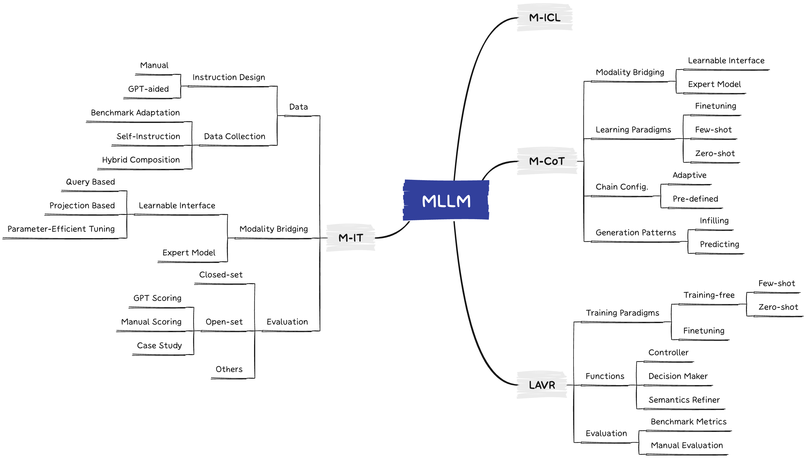

# Awesome-Multimodal-Large-Language-Models



## Our MLLM works

🔥🔥🔥 **A Survey on Multimodal Large Language Models**  
**[Project Page](https://github.com/BradyFU/Awesome-Multimodal-Large-Language-Models)** | **[Paper](https://arxiv.org/pdf/2306.13549.pdf)**

A curated list of Multimodal Large Language Models (MLLMs), including datasets, multimodal instruction tuning, multimodal in-context learning, multimodal chain-of-thought, llm-aided visual reasoning, foundation models, and others. This list will be updated in real time. :sparkles:

Welcome to join our WeChat group of MLLM communication! 

Please add WeChat ID (wmd_rz_ustc) to join the group. :star2:

---

🔥🔥🔥 **MME: A Comprehensive Evaluation Benchmark for Multimodal Large Language Models**  
**[Project Page [Leaderboards]](https://github.com/BradyFU/Awesome-Multimodal-Large-Language-Models/tree/Evaluation)** | **[Paper](https://arxiv.org/pdf/2306.13394.pdf)**

Please feel free to open an issue to add new evaluation results or if you have any questions about the evaluation. We will update the leaderboards in time. :sparkles:

<details><summary>Download MME :star2::star2: </summary>

The benchmark dataset is collected by Xiamen University for academic research only. You can email guilinli@stu.xmu.edu.cn to obtain the dataset, according to the following requirement. 

**Requirement**: A real-name system is encouraged for better academic communication. Your email suffix needs to match your affiliation, such as xx@stu.xmu.edu.cn and Xiamen University. Otherwise, you need to explain why. Please include the information bellow when sending your application email.

```
Name: (tell us who you are.)
Affiliation: (the name/url of your university or company)
Job Title: (e.g., professor, PhD, and researcher)
Email: (your email address)
How to use: (only for non-commercial use)
```
</details>


If you find our projects helpful to your research, please cite the following papers:
```
@article{yin2023survey,
  title={A Survey on Multimodal Large Language Models},
  author={Yin, Shukang and Fu, Chaoyou and Zhao, Sirui and Li, Ke and Sun, Xing and Xu, Tong and Chen, Enhong},
  journal={arXiv preprint arXiv:2306.13549},
  year={2023}
}

@article{fu2023mme,
  title={MME: A Comprehensive Evaluation Benchmark for Multimodal Large Language Models},
  author={Fu, Chaoyou and Chen, Peixian and Shen, Yunhang and Qin, Yulei and Zhang, Mengdan and Lin, Xu and Qiu, Zhenyu and Lin, Wei and Yang, Jinrui and Zheng, Xiawu and Li, Ke and Sun, Xing and Ji, Rongrong},
  journal={arXiv preprint arXiv:2306.13394},
  year={2023}
}
```


---

<font size=5><center><b> Table of Contents </b> </center></font>

- [Awesome Papers](#awesome-papers)
  - [Multimodal Instruction Tuning](#multimodal-instruction-tuning)
  - [Multimodal In-Context Learning](#multimodal-in-context-learning)
  - [Multimodal Chain-of-Thought](#multimodal-chain-of-thought)
  - [LLM-Aided Visual Reasoning](#llm-aided-visual-reasoning)
  - [Foundation Models](#foundation-models)
  - [Evaluation](#evaluation)
  - [Others](#others)
- [Awesome Datasets](#awesome-datasets)
  - [Datasets of Pre-Training for Alignment](#datasets-of-pre-training-for-alignment)
  - [Datasets of Multimodal Instruction Tuning](#datasets-of-multimodal-instruction-tuning)
  - [Datasets of In-Context Learning](#datasets-of-in-context-learning)
  - [Datasets of Multimodal Chain-of-Thought](#datasets-of-multimodal-chain-of-thought)
  - [Benchmarks for Evaluation](#benchmarks-for-evaluation)
  - [Others](#others-1)
---

# Awesome Papers

## Multimodal Instruction Tuning
|  Title  |   Venue  |   Date   |   Code   |   Demo   |
|:--------|:--------:|:--------:|:--------:|:--------:|
|  <br> [**LLaVAR: Enhanced Visual Instruction Tuning for Text-Rich Image Understanding**](https://arxiv.org/pdf/2306.17107.pdf) <br> | arXiv | 2023-06-29 | [Github](https://github.com/SALT-NLP/LLaVAR) | [Coming soon]() |
|  <br> [**Shikra: Unleashing Multimodal LLM's Referential Dialogue Magic**](https://arxiv.org/pdf/2306.15195.pdf) <br> | arXiv | 2023-06-27 | [Github](https://github.com/shikras/shikra) | - |
|  <br> [**Aligning Large Multi-Modal Model with Robust Instruction Tuning**](https://arxiv.org/pdf/2306.14565.pdf) <br> | arXiv | 2023-06-26 | [Github](https://github.com/FuxiaoLiu/LRV-Instruction) | [Demo](https://7b6590ed039a06475d.gradio.live/) |
|  <br> [**Macaw-LLM: Multi-Modal Language Modeling with Image, Audio, Video, and Text Integration**](https://arxiv.org/pdf/2306.09093.pdf) <br> | arXiv | 2023-06-15 | [Github](https://github.com/lyuchenyang/Macaw-LLM) | [Coming soon]() |
|  <br> [**LAMM: Language-Assisted Multi-Modal Instruction-Tuning Dataset, Framework, and Benchmark**](https://arxiv.org/pdf/2306.06687.pdf) <br> | arXiv | 2023-06-11 | [Github](https://github.com/OpenLAMM/LAMM) | [Demo](https://huggingface.co/spaces/openlamm/LAMM) | 
|  <br> [**Video-ChatGPT: Towards Detailed Video Understanding via Large Vision and Language Models**](https://arxiv.org/pdf/2306.05424.pdf) <br> | arXiv | 2023-06-08 | [Github](https://github.com/mbzuai-oryx/Video-ChatGPT) | [Demo](https://www.ival-mbzuai.com/video-chatgpt) |
|  <br> [**MIMIC-IT: Multi-Modal In-Context Instruction Tuning**](https://arxiv.org/pdf/2306.05425.pdf) <br> | arXiv | 2023-06-08 | [Github](https://github.com/Luodian/Otter) | [Demo](https://otter.cliangyu.com/) |
| [**M<sup>3</sup>IT: A Large-Scale Dataset towards Multi-Modal Multilingual Instruction Tuning**](https://arxiv.org/pdf/2306.04387.pdf) | arXiv | 2023-06-07 | - | - | 
|  <br> [**Video-LLaMA: An Instruction-tuned Audio-Visual Language Model for Video Understanding**](https://arxiv.org/pdf/2306.02858.pdf) <br> | arXiv | 2023-06-05 | [Github](https://github.com/DAMO-NLP-SG/Video-LLaMA) | [Demo](https://huggingface.co/spaces/DAMO-NLP-SG/Video-LLaMA) |
|  <br> [**LLaVA-Med: Training a Large Language-and-Vision Assistant for Biomedicine in One Day**](https://arxiv.org/pdf/2306.00890.pdf) <br> | arXiv | 2023-06-01 | [Github](https://github.com/microsoft/LLaVA-Med) | - |
|  <br> [**GPT4Tools: Teaching Large Language Model to Use Tools via Self-instruction**](https://arxiv.org/pdf/2305.18752.pdf) <br> | arXiv | 2023-05-30 | [Github](https://github.com/StevenGrove/GPT4Tools) | [Demo](https://huggingface.co/spaces/stevengrove/GPT4Tools) | 
|  <br> **ImageBind-LLM: Multi-Modality Instruction Tuning** <br> | - | 2023-05-29 | [Github](https://github.com/OpenGVLab/LLaMA-Adapter/tree/main/imagebind_LLM) | [Demo](http://imagebind-llm.opengvlab.com/) |
|  <br> [**PandaGPT: One Model To Instruction-Follow Them All**](https://arxiv.org/pdf/2305.16355.pdf) <br> | arXiv | 2023-05-25 | [Github](https://github.com/yxuansu/PandaGPT) | [Demo](https://huggingface.co/spaces/GMFTBY/PandaGPT) | 
|  <br> [**ChatBridge: Bridging Modalities with Large Language Model as a Language Catalyst**](https://arxiv.org/pdf/2305.16103.pdf) <br> | arXiv | 2023-05-25 | [Github](https://github.com/joez17/ChatBridge) | - | 
|  <br> [**Cheap and Quick: Efficient Vision-Language Instruction Tuning for Large Language Models**](https://arxiv.org/pdf/2305.15023.pdf) <br> | arXiv | 2023-05-24 | [Github](https://github.com/luogen1996/LaVIN) | Local Demo |
|  <br> [**DetGPT: Detect What You Need via Reasoning**](https://arxiv.org/pdf/2305.14167.pdf) <br> | arXiv | 2023-05-23 | [Github](https://github.com/OptimalScale/DetGPT) | [Demo](https://d3c431c0c77b1d9010.gradio.live/) | 
|  <br> [**VisionLLM: Large Language Model is also an Open-Ended Decoder for Vision-Centric Tasks**](https://arxiv.org/pdf/2305.11175.pdf) <br> | arXiv | 2023-05-18 | [Github](https://github.com/OpenGVLab/VisionLLM) | [Demo](https://igpt.opengvlab.com/) |
|  <br> [**Listen, Think, and Understand**](https://arxiv.org/pdf/2305.10790.pdf) <br> | arXiv | 2023-05-18 | [Github](https://github.com/YuanGongND/ltu) | [Demo](https://github.com/YuanGongND/ltu) |
|  <br> **VisualGLM-6B** <br> | - | 2023-05-17 | [Github](https://github.com/THUDM/VisualGLM-6B) | Local Demo |
|  <br> [**PMC-VQA: Visual Instruction Tuning for Medical Visual Question Answering**](https://arxiv.org/pdf/2305.10415.pdf) <br> | arXiv | 2023-05-17 | [Github](https://github.com/xiaoman-zhang/PMC-VQA) | - | 
|  <br> [**InstructBLIP: Towards General-purpose Vision-Language Models with Instruction Tuning**](https://arxiv.org/pdf/2305.06500.pdf) <br> | arXiv | 2023-05-11 | [Github](https://github.com/salesforce/LAVIS/tree/main/projects/instructblip) | Local Demo |
|  <br> [**VideoChat: Chat-Centric Video Understanding**](https://arxiv.org/pdf/2305.06355.pdf) <br> | arXiv | 2023-05-10 | [Github](https://github.com/OpenGVLab/Ask-Anything) | [Demo](https://ask.opengvlab.com/) |
|  <br> [**MultiModal-GPT: A Vision and Language Model for Dialogue with Humans**](https://arxiv.org/pdf/2305.04790.pdf) <br> | arXiv | 2023-05-08 | [Github](https://github.com/open-mmlab/Multimodal-GPT) | [Demo](https://mmgpt.openmmlab.org.cn/) |
|  <br> [**X-LLM: Bootstrapping Advanced Large Language Models by Treating Multi-Modalities as Foreign Languages**](https://arxiv.org/pdf/2305.04160.pdf) <br> | arXiv | 2023-05-07 | [Github](https://github.com/phellonchen/X-LLM) | - | 
|  <br> [**LMEye: An Interactive Perception Network for Large Language Models**](https://arxiv.org/pdf/2305.03701.pdf) <br> | arXiv | 2023-05-05 | [Github](https://github.com/YunxinLi/LingCloud) | Local Demo |
|  <br> [**LLaMA-Adapter V2: Parameter-Efficient Visual Instruction Model**](https://arxiv.org/pdf/2304.15010.pdf) <br> | arXiv | 2023-04-28 | [Github](https://github.com/OpenGVLab/LLaMA-Adapter) | [Demo](http://llama-adapter.opengvlab.com/) | 
|  <br> [**mPLUG-Owl: Modularization Empowers Large Language Models with Multimodality**](https://arxiv.org/pdf/2304.14178.pdf) <br> | arXiv | 2023-04-27 | [Github](https://github.com/X-PLUG/mPLUG-Owl) | [Demo](https://huggingface.co/spaces/MAGAer13/mPLUG-Owl) |
|  <br> [**MiniGPT-4: Enhancing Vision-Language Understanding with Advanced Large Language Models**](https://arxiv.org/pdf/2304.10592.pdf) <br> | arXiv | 2023-04-20 | [Github](https://github.com/Vision-CAIR/MiniGPT-4) | - |
|  <br> [**Visual Instruction Tuning**](https://arxiv.org/pdf/2304.08485.pdf) <br> | arXiv | 2023-04-17 | [GitHub](https://github.com/haotian-liu/LLaVA) | [Demo](https://llava.hliu.cc/) |
|  <br> [**LLaMA-Adapter: Efficient Fine-tuning of Language Models with Zero-init Attention**](https://arxiv.org/pdf/2303.16199.pdf) <br> | arXiv | 2023-03-28 | [Github](https://github.com/OpenGVLab/LLaMA-Adapter) | [Demo](https://huggingface.co/spaces/csuhan/LLaMA-Adapter) |
|  <br> [**MultiInstruct: Improving Multi-Modal Zero-Shot Learning via Instruction Tuning**](https://arxiv.org/pdf/2212.10773.pdf) <br> | ACL | 2022-12-21 | [Github](https://github.com/VT-NLP/MultiInstruct) | - | 


## Multimodal In-Context Learning
|  Title  |   Venue  |   Date   |   Code   |   Demo   |
|:--------|:--------:|:--------:|:--------:|:--------:|
|  <br> [**MIMIC-IT: Multi-Modal In-Context Instruction Tuning**](https://arxiv.org/pdf/2306.05425.pdf) <br> | arXiv | 2023-06-08 | [Github](https://github.com/Luodian/Otter) | [Demo](https://otter.cliangyu.com/) |
|  <br> [**Chameleon: Plug-and-Play Compositional Reasoning with Large Language Models**](https://arxiv.org/pdf/2304.09842.pdf) <br> | arXiv | 2023-04-19 | [Github](https://github.com/lupantech/chameleon-llm) | [Demo](https://chameleon-llm.github.io/) | 
|  <br> [**HuggingGPT: Solving AI Tasks with ChatGPT and its Friends in HuggingFace**](https://arxiv.org/pdf/2303.17580.pdf) <br> | arXiv | 2023-03-30 | [Github](https://github.com/microsoft/JARVIS) | [Demo](https://huggingface.co/spaces/microsoft/HuggingGPT) | 
|  <br> [**MM-REACT: Prompting ChatGPT for Multimodal Reasoning and Action**](https://arxiv.org/pdf/2303.11381.pdf) <br> | arXiv | 2023-03-20 | [Github](https://github.com/microsoft/MM-REACT) | [Demo](https://huggingface.co/spaces/microsoft-cognitive-service/mm-react) |
|  <br> [**Prompting Large Language Models with Answer Heuristics for Knowledge-based Visual Question Answering**](https://arxiv.org/pdf/2303.01903.pdf) <br> | CVPR | 2023-03-03 | [Github](https://github.com/MILVLG/prophet) | - |
|  <br> [**Visual Programming: Compositional visual reasoning without training**](https://openaccess.thecvf.com/content/CVPR2023/papers/Gupta_Visual_Programming_Compositional_Visual_Reasoning_Without_Training_CVPR_2023_paper.pdf) <br> | CVPR | 2022-11-18 | [Github](https://github.com/allenai/visprog) | Local Demo | 
|  <br> [**An Empirical Study of GPT-3 for Few-Shot Knowledge-Based VQA**](https://ojs.aaai.org/index.php/AAAI/article/download/20215/19974) <br> | AAAI | 2022-06-28 | [Github](https://github.com/microsoft/PICa) | - |
|  <br> [**Flamingo: a Visual Language Model for Few-Shot Learning**](https://arxiv.org/pdf/2204.14198.pdf) <br> | NeurIPS | 2022-04-29 | [Github](https://github.com/mlfoundations/open_flamingo) | [Demo](https://huggingface.co/spaces/dhansmair/flamingo-mini-cap) | 
| [**Multimodal Few-Shot Learning with Frozen Language Models**](https://arxiv.org/pdf/2106.13884.pdf) | NeurIPS | 2021-06-25 | - | - |


## Multimodal Chain-of-Thought
|  Title  |   Venue  |   Date   |   Code   |   Demo   |
|:--------|:--------:|:--------:|:--------:|:--------:|
|  <br> [**EmbodiedGPT: Vision-Language Pre-Training via Embodied Chain of Thought**](https://arxiv.org/pdf/2305.15021.pdf) <br> | arXiv | 2023-05-24 | [Github](https://github.com/EmbodiedGPT/EmbodiedGPT_Pytorch) | - | 
| [**Let’s Think Frame by Frame: Evaluating Video Chain of Thought with Video Infilling and Prediction**](https://arxiv.org/pdf/2305.13903.pdf) | arXiv | 2023-05-23 | - | - |
|  <br> [**Caption Anything: Interactive Image Description with Diverse Multimodal Controls**](https://arxiv.org/pdf/2305.02677.pdf) <br> | arXiv | 2023-05-04 | [Github](https://github.com/ttengwang/Caption-Anything) | [Demo](https://huggingface.co/spaces/TencentARC/Caption-Anything) |
| [**Visual Chain of Thought: Bridging Logical Gaps with Multimodal Infillings**](https://arxiv.org/pdf/2305.02317.pdf) | arXiv | 2023-05-03 | [Coming soon](https://github.com/dannyrose30/VCOT) | - |
|  <br> [**Chameleon: Plug-and-Play Compositional Reasoning with Large Language Models**](https://arxiv.org/pdf/2304.09842.pdf) <br> | arXiv | 2023-04-19 | [Github](https://github.com/lupantech/chameleon-llm) | [Demo](https://chameleon-llm.github.io/) | 
| [**Chain of Thought Prompt Tuning in Vision Language Models**](https://arxiv.org/pdf/2304.07919.pdf) | arXiv | 2023-04-16 | [Coming soon]() | - |
|  <br> [**MM-REACT: Prompting ChatGPT for Multimodal Reasoning and Action**](https://arxiv.org/pdf/2303.11381.pdf) <br> | arXiv | 2023-03-20 | [Github](https://github.com/microsoft/MM-REACT) | [Demo](https://huggingface.co/spaces/microsoft-cognitive-service/mm-react) |
|  <br> [**Visual ChatGPT: Talking, Drawing and Editing with Visual Foundation Models**](https://arxiv.org/pdf/2303.04671.pdf) <br> | arXiv | 2023-03-08 | [Github](https://github.com/microsoft/TaskMatrix) | [Demo](https://huggingface.co/spaces/microsoft/visual_chatgpt) |
|  <br> [**Multimodal Chain-of-Thought Reasoning in Language Models**](https://arxiv.org/pdf/2302.00923.pdf) <br> | arXiv | 2023-02-02 | [Github](https://github.com/amazon-science/mm-cot) | - |
|  <br> [**Visual Programming: Compositional visual reasoning without training**](https://openaccess.thecvf.com/content/CVPR2023/papers/Gupta_Visual_Programming_Compositional_Visual_Reasoning_Without_Training_CVPR_2023_paper.pdf) <br> | CVPR | 2022-11-18 | [Github](https://github.com/allenai/visprog) | Local Demo | 
|  <br> [**Learn to Explain: Multimodal Reasoning via Thought Chains for Science Question Answering**](https://proceedings.neurips.cc/paper_files/paper/2022/file/11332b6b6cf4485b84afadb1352d3a9a-Paper-Conference.pdf) <br> | NeurIPS | 2022-09-20 | [Github](https://github.com/lupantech/ScienceQA) | - |


## LLM-Aided Visual Reasoning
|  Title  |   Venue  |   Date   |   Code   |   Demo   |
|:--------|:--------:|:--------:|:--------:|:--------:|
| [**Retrieving-to-Answer: Zero-Shot Video Question Answering with Frozen Large Language Models**](https://arxiv.org/pdf/2306.11732.pdf) | arXiv | 2023-06-15 | - | - |
|  <br> [**AssistGPT: A General Multi-modal Assistant that can Plan, Execute, Inspect, and Learn**](https://arxiv.org/pdf/2306.08640.pdf) <br> | arXiv | 2023-06-14 | [Github](https://github.com/showlab/assistgpt) | - |
|  <br> [**GPT4Tools: Teaching Large Language Model to Use Tools via Self-instruction**](https://arxiv.org/pdf/2305.18752.pdf) <br> | arXiv | 2023-05-30 | [Github](https://github.com/StevenGrove/GPT4Tools) | [Demo](https://c60eb7e9400930f31b.gradio.live/) | 
| [**Mindstorms in Natural Language-Based Societies of Mind**](https://arxiv.org/pdf/2305.17066.pdf) | arXiv | 2023-05-26 | - | - | 
|  <br> [**LayoutGPT: Compositional Visual Planning and Generation with Large Language Models**](https://arxiv.org/pdf/2305.15393.pdf) <br> | arXiv | 2023-05-24 | [Github](https://github.com/weixi-feng/LayoutGPT) | - |
|  <br> [**IdealGPT: Iteratively Decomposing Vision and Language Reasoning via Large Language Models**](https://arxiv.org/pdf/2305.14985.pdf) <br> | arXiv | 2023-05-24 | [Github](https://github.com/Hxyou/IdealGPT) | Local Demo | 
|  <br> [**Accountable Textual-Visual Chat Learns to Reject Human Instructions in Image Re-creation**](https://arxiv.org/pdf/2303.05983.pdf) <br> | arXiv | 2023-05-10 | [Github](https://github.com/matrix-alpha/Accountable-Textual-Visual-Chat) | - |
|  <br> [**Caption Anything: Interactive Image Description with Diverse Multimodal Controls**](https://arxiv.org/pdf/2305.02677.pdf) <br> | arXiv | 2023-05-04 | [Github](https://github.com/ttengwang/Caption-Anything) | [Demo](https://huggingface.co/spaces/TencentARC/Caption-Anything) |
|  <br> [**Chameleon: Plug-and-Play Compositional Reasoning with Large Language Models**](https://arxiv.org/pdf/2304.09842.pdf) <br> | arXiv | 2023-04-19 | [Github](https://github.com/lupantech/chameleon-llm) | [Demo](https://chameleon-llm.github.io/) | 
|  <br> [**HuggingGPT: Solving AI Tasks with ChatGPT and its Friends in HuggingFace**](https://arxiv.org/pdf/2303.17580.pdf) <br> | arXiv | 2023-03-30 | [Github](https://github.com/microsoft/JARVIS) | [Demo](https://huggingface.co/spaces/microsoft/HuggingGPT) | 
|  <br> [**MM-REACT: Prompting ChatGPT for Multimodal Reasoning and Action**](https://arxiv.org/pdf/2303.11381.pdf) <br> | arXiv | 2023-03-20 | [Github](https://github.com/microsoft/MM-REACT) | [Demo](https://huggingface.co/spaces/microsoft-cognitive-service/mm-react) |
|  <br> [**ViperGPT: Visual Inference via Python Execution for Reasoning**](https://arxiv.org/pdf/2303.08128.pdf) <br> | arXiv | 2023-03-14 | [Github](https://github.com/cvlab-columbia/viper) | Local Demo | 
|  <br> [**ChatGPT Asks, BLIP-2 Answers: Automatic Questioning Towards Enriched Visual Descriptions**](https://arxiv.org/pdf/2303.06594.pdf) <br> | arXiv | 2023-03-12 | [Github](https://github.com/Vision-CAIR/ChatCaptioner) | Local Demo |
|  <br> [**Visual ChatGPT: Talking, Drawing and Editing with Visual Foundation Models**](https://arxiv.org/pdf/2303.04671.pdf) <br> | arXiv | 2023-03-08 | [Github](https://github.com/microsoft/TaskMatrix) | [Demo](https://huggingface.co/spaces/microsoft/visual_chatgpt) |
|  <br> [**Prompt, Generate, then Cache: Cascade of Foundation Models makes Strong Few-shot Learners**](https://arxiv.org/pdf/2303.02151.pdf) <br> | CVPR | 2023-03-03 | [Github](https://github.com/ZrrSkywalker/CaFo) | - |
|  <br> [**SuS-X: Training-Free Name-Only Transfer of Vision-Language Models**](https://arxiv.org/pdf/2211.16198.pdf) <br> | arXiv | 2022-11-28 | [Github](https://github.com/vishaal27/SuS-X) | - |
|  <br> [**PointCLIP V2: Adapting CLIP for Powerful 3D Open-world Learning**](https://arxiv.org/pdf/2211.11682.pdf) <br> | CVPR | 2022-11-21 | [Github](https://github.com/yangyangyang127/PointCLIP_V2) | - |
|  <br> [**Visual Programming: Compositional visual reasoning without training**](https://openaccess.thecvf.com/content/CVPR2023/papers/Gupta_Visual_Programming_Compositional_Visual_Reasoning_Without_Training_CVPR_2023_paper.pdf) <br> | CVPR | 2022-11-18 | [Github](https://github.com/allenai/visprog) | Local Demo | 
|  <br> [**Socratic Models: Composing Zero-Shot Multimodal Reasoning with Language**](https://arxiv.org/pdf/2204.00598.pdf) <br> | arXiv | 2022-04-01 | [Github](https://github.com/google-research/google-research/tree/master/socraticmodels) | - |


## Foundation Models
|  Title  |   Venue  |   Date   |   Code   |   Demo   |
|:--------|:--------:|:--------:|:--------:|:--------:|
|  <br> [**Kosmos-2: Grounding Multimodal Large Language Models to the World**](https://arxiv.org/pdf/2306.14824.pdf) <br> | arXiv | 2023-06-26 | [Github](https://github.com/microsoft/unilm/tree/master/kosmos-2) | - |
|  <br> [**Transfer Visual Prompt Generator across LLMs**](https://arxiv.org/pdf/2305.01278.pdf) <br> | arXiv | 2023-05-02 | [Github](https://github.com/VPGTrans/VPGTrans) | [Demo](https://3fc7715dbc44234a7f.gradio.live/) | 
| [**GPT-4 Technical Report**](https://arxiv.org/pdf/2303.08774.pdf) | arXiv | 2023-03-15 | - | - |
| [**PaLM-E: An Embodied Multimodal Language Model**](https://arxiv.org/pdf/2303.03378.pdf) | arXiv | 2023-03-06 | - | [Demo](https://palm-e.github.io/#demo) | 
|  <br> [**Prismer: A Vision-Language Model with An Ensemble of Experts**](https://arxiv.org/pdf/2303.02506.pdf) <br> | arXiv | 2023-03-04 | [Github](https://github.com/NVlabs/prismer) | [Demo](https://huggingface.co/spaces/lorenmt/prismer) |
|  <br> [**Language Is Not All You Need: Aligning Perception with Language Models**](https://arxiv.org/pdf/2302.14045.pdf) <br> | arXiv | 2023-02-27 | [Github](https://github.com/microsoft/unilm) | - |
|  <br> [**BLIP-2: Bootstrapping Language-Image Pre-training with Frozen Image Encoders and Large Language Models**](https://arxiv.org/pdf/2301.12597.pdf) <br> | arXiv | 2023-01-30 | [Github](https://github.com/salesforce/LAVIS/tree/main/projects/blip2) | [Demo](https://colab.research.google.com/github/salesforce/LAVIS/blob/main/examples/blip2_instructed_generation.ipynb) | 
|  <br> [**VIMA: General Robot Manipulation with Multimodal Prompts**](https://arxiv.org/pdf/2210.03094.pdf) <br> | ICML | 2022-10-06 | [Github](https://github.com/vimalabs/VIMA) | Local Demo | 
|  <br> [**MineDojo: Building Open-Ended Embodied Agents with Internet-Scale Knowledge**](https://arxiv.org/pdf/2206.08853.pdf) <br> | NeurIPS | 2022-06-17 | [Github](https://github.com/MineDojo/MineDojo) | - |
|  <br> [**Language Models are General-Purpose Interfaces**](https://arxiv.org/pdf/2206.06336.pdf) <br> | arXiv | 2022-06-13 | [Github](https://github.com/microsoft/unilm) | - |

## Evaluation
|  Title  |   Venue  |   Date   |   Page   |
|:--------|:--------:|:--------:|:--------:|
|  <br> [**MME: A Comprehensive Evaluation Benchmark for Multimodal Large Language Models**](https://arxiv.org/pdf/2306.13394.pdf) <br> | arXiv | 2023-06-23 | [Github](https://github.com/BradyFU/Awesome-Multimodal-Large-Language-Models/tree/Evaluation) |
|  <br> [**LVLM-eHub: A Comprehensive Evaluation Benchmark for Large Vision-Language Models**](https://arxiv.org/pdf/2306.09265.pdf) <br> | arXiv | 2023-06-15 | [Github](https://github.com/OpenGVLab/Multi-Modality-Arena) | 
|  <br> [**LAMM: Language-Assisted Multi-Modal Instruction-Tuning Dataset, Framework, and Benchmark**](https://arxiv.org/pdf/2306.06687.pdf) <br> | arXiv | 2023-06-11 | [Github](https://github.com/OpenLAMM/LAMM#lamm-benchmark) |
|  <br> [**M3Exam: A Multilingual, Multimodal, Multilevel Benchmark for Examining Large Language Models**](https://arxiv.org/pdf/2306.05179.pdf) <br> | arXiv | 2023-06-08 | [Github](https://github.com/DAMO-NLP-SG/M3Exam) | 

## Others
|  Title  |   Venue  |   Date   |   Code   |   Demo   |
|:--------|:--------:|:--------:|:--------:|:--------:|
| [**Can Large Pre-trained Models Help Vision Models on Perception Tasks?**](https://arxiv.org/pdf/2306.00693.pdf) | arXiv | 2023-06-01 | [Coming soon]() | - | 
|  <br> [**Contextual Object Detection with Multimodal Large Language Models**](https://arxiv.org/pdf/2305.18279.pdf) <br> | arXiv | 2023-05-29 | [Github](https://github.com/yuhangzang/ContextDET) | [Demo](https://huggingface.co/spaces/yuhangzang/ContextDet-Demo) |
|  <br> [**Generating Images with Multimodal Language Models**](https://arxiv.org/pdf/2305.17216.pdf) <br> | arXiv | 2023-05-26 | [Github](https://github.com/kohjingyu/gill) | - |
|  <br> [**On Evaluating Adversarial Robustness of Large Vision-Language Models**](https://arxiv.org/pdf/2305.16934.pdf) <br> | arXiv | 2023-05-26 | [Github](https://github.com/yunqing-me/AttackVLM) | - | 
|  <br> [**Evaluating Object Hallucination in Large Vision-Language Models**](https://arxiv.org/pdf/2305.10355.pdf) <br> | arXiv | 2023-05-17 | [Github](https://github.com/RUCAIBox/POPE) | - |
|  <br> [**Grounding Language Models to Images for Multimodal Inputs and Outputs**](https://arxiv.org/pdf/2301.13823.pdf) <br> | ICML | 2023-01-31 | [Github](https://github.com/kohjingyu/fromage) | [Demo](https://huggingface.co/spaces/jykoh/fromage) |

---

# Awesome Datasets

## Datasets of Pre-Training for Alignment
| Name | Paper | Type | Modalities |
|:-----|:-----:|:----:|:----------:|
| **MS-COCO** | [Microsoft COCO: Common Objects in Context](https://arxiv.org/pdf/1405.0312.pdf) | Caption | Image-Text |
| **SBU Captions** | [Im2Text: Describing Images Using 1 Million Captioned Photographs](https://proceedings.neurips.cc/paper/2011/file/5dd9db5e033da9c6fb5ba83c7a7ebea9-Paper.pdf) | Caption | Image-Text |
| **Conceptual Captions** | [Conceptual Captions: A Cleaned, Hypernymed, Image Alt-text Dataset For Automatic Image Captioning](https://aclanthology.org/P18-1238.pdf) | Caption | Image-Text |
| **LAION-400M** | [LAION-400M: Open Dataset of CLIP-Filtered 400 Million Image-Text Pairs](https://arxiv.org/pdf/2111.02114.pdf) | Caption | Image-Text |
| **VG Captions** |[Visual Genome: Connecting Language and Vision Using Crowdsourced Dense Image Annotations](https://link.springer.com/content/pdf/10.1007/s11263-016-0981-7.pdf) | Caption | Image-Text |
| **Flickr30k** | [Flickr30k Entities: Collecting Region-to-Phrase Correspondences for Richer Image-to-Sentence Models](https://openaccess.thecvf.com/content_iccv_2015/papers/Plummer_Flickr30k_Entities_Collecting_ICCV_2015_paper.pdf) | Caption | Image-Text |
| **AI-Caps** | [AI Challenger : A Large-scale Dataset for Going Deeper in Image Understanding](https://arxiv.org/pdf/1711.06475.pdf) | Caption | Image-Text | 
| **Wukong Captions** | [Wukong: A 100 Million Large-scale Chinese Cross-modal Pre-training Benchmark](https://proceedings.neurips.cc/paper_files/paper/2022/file/a90b9a09a6ee43d6631cf42e225d73b4-Paper-Datasets_and_Benchmarks.pdf) | Caption | Image-Text |
| **Youku-mPLUG** | [Youku-mPLUG: A 10 Million Large-scale Chinese Video-Language Dataset for Pre-training and Benchmarks](https://arxiv.org/pdf/2306.04362.pdf) | Caption | Video-Text |
| **MSR-VTT** | [MSR-VTT: A Large Video Description Dataset for Bridging Video and Language](https://openaccess.thecvf.com/content_cvpr_2016/papers/Xu_MSR-VTT_A_Large_CVPR_2016_paper.pdf) | Caption | Video-Text |
| **Webvid10M** | [Frozen in Time: A Joint Video and Image Encoder for End-to-End Retrieval](https://arxiv.org/pdf/2104.00650.pdf) | Caption | Video-Text |
| **WavCaps** | [WavCaps: A ChatGPT-Assisted Weakly-Labelled Audio Captioning Dataset for Audio-Language Multimodal Research](https://arxiv.org/pdf/2303.17395.pdf) | Caption | Audio-Text |
| **AISHELL-1** | [AISHELL-1: An open-source Mandarin speech corpus and a speech recognition baseline](https://arxiv.org/pdf/1709.05522.pdf) | ASR | Audio-Text |
| **AISHELL-2** | [AISHELL-2: Transforming Mandarin ASR Research Into Industrial Scale](https://arxiv.org/pdf/1808.10583.pdf) | ASR | Audio-Text |
| **VSDial-CN** | [X-LLM: Bootstrapping Advanced Large Language Models by Treating Multi-Modalities as Foreign Languages](https://arxiv.org/pdf/2305.04160.pdf) | ASR | Image-Audio-Text |


## Datasets of Multimodal Instruction Tuning
| Name | Paper | Link | Notes |
|:-----|:-----:|:----:|:-----:|
| **LLaVAR** | [LLaVAR: Enhanced Visual Instruction Tuning for Text-Rich Image Understanding](https://arxiv.org/pdf/2306.17107.pdf) | [Link](https://llavar.github.io/#data) | A visual instruction-tuning dataset for Text-rich Image Understanding | 
| **LRV-Instruction** | [Aligning Large Multi-Modal Model with Robust Instruction Tuning](https://arxiv.org/pdf/2306.14565.pdf) | [Link](https://github.com/FuxiaoLiu/LRV-Instruction#visual-instruction-data-lrv-instruction) | Visual instruction tuning dataset for addressing hallucination issue | 
| **Macaw-LLM** | [Macaw-LLM: Multi-Modal Language Modeling with Image, Audio, Video, and Text Integration](https://arxiv.org/pdf/2306.09093.pdf) | [Link](https://github.com/lyuchenyang/Macaw-LLM/tree/main/data) | A large-scale multi-modal instruction dataset in terms of multi-turn dialogue | 
| **LAMM-Dataset** | [LAMM: Language-Assisted Multi-Modal Instruction-Tuning Dataset, Framework, and Benchmark](https://arxiv.org/pdf/2306.06687.pdf) | [Link](https://github.com/OpenLAMM/LAMM#lamm-dataset) | A comprehensive multi-modal instruction tuning dataset |
| **Video-ChatGPT** | [Video-ChatGPT: Towards Detailed Video Understanding via Large Vision and Language Models](https://arxiv.org/pdf/2306.05424.pdf) | [Link](https://github.com/mbzuai-oryx/Video-ChatGPT#video-instruction-dataset-open_file_folder) | 100K high-quality video instruction dataset | 
| **MIMIC-IT** | [MIMIC-IT: Multi-Modal In-Context Instruction Tuning](https://arxiv.org/pdf/2306.05425.pdf) | [Coming soon](https://github.com/Luodian/Otter) | Multimodal in-context instruction tuning |
| **M<sup>3</sup>IT** | [M<sup>3</sup>IT: A Large-Scale Dataset towards Multi-Modal Multilingual Instruction Tuning](https://arxiv.org/pdf/2306.04387.pdf) | [Link](https://huggingface.co/datasets/MMInstruction/M3IT) | Large-scale, broad-coverage multimodal instruction tuning dataset | 
| **LLaVA-Med** | [LLaVA-Med: Training a Large Language-and-Vision Assistant for Biomedicine in One Day](https://arxiv.org/pdf/2306.00890.pdf) | [Coming soon](https://github.com/microsoft/LLaVA-Med#llava-med-dataset) | A large-scale, broad-coverage biomedical instruction-following dataset |
| **GPT4Tools** | [GPT4Tools: Teaching Large Language Model to Use Tools via Self-instruction](https://arxiv.org/pdf/2305.18752.pdf) | [Link](https://github.com/StevenGrove/GPT4Tools#dataset) | Tool-related instruction datasets |
| **MULTIS** | [ChatBridge: Bridging Modalities with Large Language Model as a Language Catalyst](https://arxiv.org/pdf/2305.16103.pdf) | [Coming soon](https://iva-chatbridge.github.io/) | Multimodal instruction tuning dataset covering 16 multimodal tasks |
| **DetGPT** | [DetGPT: Detect What You Need via Reasoning](https://arxiv.org/pdf/2305.14167.pdf) | [Link](https://github.com/OptimalScale/DetGPT/tree/main/dataset) |  Instruction-tuning dataset with 5000 images and around 30000 query-answer pairs|
| **PMC-VQA** | [PMC-VQA: Visual Instruction Tuning for Medical Visual Question Answering](https://arxiv.org/pdf/2305.10415.pdf) | [Coming soon](https://xiaoman-zhang.github.io/PMC-VQA/) | Large-scale medical visual question-answering dataset |
| **VideoChat** | [VideoChat: Chat-Centric Video Understanding](https://arxiv.org/pdf/2305.06355.pdf) | [Link](https://github.com/OpenGVLab/InternVideo/tree/main/Data/instruction_data) | Video-centric multimodal instruction dataset |
| **X-LLM** | [X-LLM: Bootstrapping Advanced Large Language Models by Treating Multi-Modalities as Foreign Languages](https://arxiv.org/pdf/2305.04160.pdf) | [Link](https://github.com/phellonchen/X-LLM) | Chinese multimodal instruction dataset |
| **LMEye** | [LMEye: An Interactive Perception Network for Large Language Models](https://arxiv.org/pdf/2305.03701.pdf) | [Link](https://huggingface.co/datasets/YunxinLi/Multimodal_Insturction_Data_V2) | A multi-modal instruction-tuning dataset |
| **cc-sbu-align** | [MiniGPT-4: Enhancing Vision-Language Understanding with Advanced Large Language Models](https://arxiv.org/pdf/2304.10592.pdf) | [Link](https://huggingface.co/datasets/Vision-CAIR/cc_sbu_align) | Multimodal aligned dataset for improving model's usability and generation's fluency |
| **LLaVA-Instruct-150K** | [Visual Instruction Tuning](https://arxiv.org/pdf/2304.08485.pdf) | [Link](https://huggingface.co/datasets/liuhaotian/LLaVA-Instruct-150K) | Multimodal instruction-following data generated by GPT|
| **MultiInstruct** | [MultiInstruct: Improving Multi-Modal Zero-Shot Learning via Instruction Tuning](https://arxiv.org/pdf/2212.10773.pdf) | [Link](https://github.com/VT-NLP/MultiInstruct) | The first multimodal instruction tuning benchmark dataset |

## Datasets of In-Context Learning
| Name | Paper | Link | Notes |
|:-----|:-----:|:----:|:-----:|
| **MIMIC-IT** | [MIMIC-IT: Multi-Modal In-Context Instruction Tuning](https://arxiv.org/pdf/2306.05425.pdf) | [Coming soon](https://github.com/Luodian/Otter) | Multimodal in-context instruction dataset|

## Datasets of Multimodal Chain-of-Thought
| Name | Paper | Link | Notes |
|:-----|:-----:|:----:|:-----:|
| **EgoCOT** | [EmbodiedGPT: Vision-Language Pre-Training via Embodied Chain of Thought](https://arxiv.org/pdf/2305.15021.pdf) | [Coming soon](https://github.com/EmbodiedGPT/EmbodiedGPT_Pytorch) | Large-scale embodied planning dataset |
| **VIP** | [Let’s Think Frame by Frame: Evaluating Video Chain of Thought with Video Infilling and Prediction](https://arxiv.org/pdf/2305.13903.pdf) | [Coming soon]() | An inference-time dataset that can be used to evaluate VideoCOT |
| **ScienceQA** | [Learn to Explain: Multimodal Reasoning via Thought Chains for Science Question Answering](https://proceedings.neurips.cc/paper_files/paper/2022/file/11332b6b6cf4485b84afadb1352d3a9a-Paper-Conference.pdf) | [Link](https://github.com/lupantech/ScienceQA#ghost-download-the-dataset) | Large-scale multi-choice dataset, featuring multimodal science questions and diverse domains | 

## Benchmarks for Evaluation
| Name | Paper | Link | Notes |
|:-----|:-----:|:----:|:-----:|
| **MME** | [MME: A Comprehensive Evaluation Benchmark for Multimodal Large Language Models](https://arxiv.org/pdf/2306.13394.pdf) | [Link](https://github.com/BradyFU/Awesome-Multimodal-Large-Language-Models/tree/Evaluation) | A comprehensive MLLM Evaluation benchmark |
| **LVLM-eHub** | [LVLM-eHub: A Comprehensive Evaluation Benchmark for Large Vision-Language Models](https://arxiv.org/pdf/2306.09265.pdf) | [Link](https://github.com/OpenGVLab/Multi-Modality-Arena) | An evaluation platform for MLLMs |
| **LAMM-Benchmark** | [LAMM: Language-Assisted Multi-Modal Instruction-Tuning Dataset, Framework, and Benchmark](https://arxiv.org/pdf/2306.06687.pdf) | [Link](https://github.com/OpenLAMM/LAMM#lamm-benchmark) | A benchmark for evaluating  the quantitative performance of MLLMs on various2D/3D vision tasks |
| **M3Exam** | [M3Exam: A Multilingual, Multimodal, Multilevel Benchmark for Examining Large Language Models](https://arxiv.org/pdf/2306.05179.pdf) | [Link](https://github.com/DAMO-NLP-SG/M3Exam) |  A multilingual, multimodal, multilevel benchmark for evaluating MLLM |
| **OwlEval** | [mPLUG-Owl: Modularization Empowers Large Language Models with Multimodality](https://arxiv.org/pdf/2304.14178.pdf) | [Link](https://github.com/X-PLUG/mPLUG-Owl/tree/main/OwlEval) | Dataset for evaluation on multiple capabilities |

## Others
| Name | Paper | Link | Notes |
|:-----|:-----:|:----:|:-----:|
| **IMAD** | [IMAD: IMage-Augmented multi-modal Dialogue](https://arxiv.org/pdf/2305.10512.pdf) | [Link](https://github.com/VityaVitalich/IMAD) | Multimodal dialogue dataset|
| **Video-ChatGPT** | [Video-ChatGPT: Towards Detailed Video Understanding via Large Vision and Language Models](https://arxiv.org/pdf/2306.05424.pdf) | [Link](https://github.com/mbzuai-oryx/Video-ChatGPT#quantitative-evaluation-bar_chart) | A quantitative evaluation framework for video-based dialogue models |
| **CLEVR-ATVC** | [Accountable Textual-Visual Chat Learns to Reject Human Instructions in Image Re-creation](https://arxiv.org/pdf/2303.05983.pdf) | [Link](https://drive.google.com/drive/folders/1TqBzkyqxOSg1hgCXF8JjpYIAuRV-uVft) | A synthetic multimodal fine-tuning dataset for learning to reject instructions |
| **Fruit-ATVC** | [Accountable Textual-Visual Chat Learns to Reject Human Instructions in Image Re-creation](https://arxiv.org/pdf/2303.05983.pdf) | [Link](https://drive.google.com/drive/folders/1Saaia2rRRb1nz5sKdmpzYdS4jHiMDaP0) | A manually pictured multimodal fine-tuning dataset for learning to reject instructions |
| **InfoSeek** | [Can Pre-trained Vision and Language Models Answer Visual Information-Seeking Questions?](https://arxiv.org/pdf/2302.11713.pdf) | [Coming soon](https://open-vision-language.github.io/infoseek/) |A VQA dataset that focuses on asking information-seeking questions |

