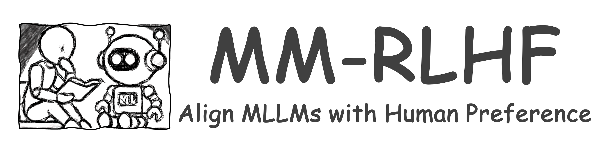
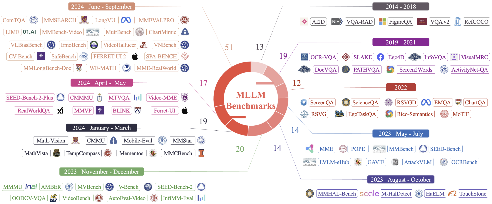

# Awesome-Multimodal-Large-Language-Models

    

## Our MLLM works

🔥🔥🔥 **A Survey on Multimodal Large Language Models**  
**[Project Page [This Page]](https://github.com/BradyFU/Awesome-Multimodal-Large-Language-Models)** | **[Paper](https://arxiv.org/pdf/2306.13549.pdf)** | :black_nib: **[Citation](./images/bib_survey.txt)** | **[💬 WeChat (MLLM微信交流群，欢迎加入)](./images/wechat-group.png)**

The first comprehensive survey for Multimodal Large Language Models (MLLMs). :sparkles:  

---

🔥🔥🔥 **VITA: Towards Open-Source Interactive Omni Multimodal LLM**  

    

 [[📽 VITA-1.5 Demo Show! Here We Go! 🔥](https://youtu.be/tyi6SVFT5mM?si=fkMQCrwa5fVnmEe7)] 
  

 [[📖 VITA-1.5 Paper](https://arxiv.org/pdf/2501.01957)] [[🌟 GitHub](https://github.com/VITA-MLLM/VITA)] [[🤖 Basic Demo](https://modelscope.cn/studios/modelscope/VITA1.5_demo)] [[🍎 VITA-1.0](https://vita-home.github.io/)] [[💬 WeChat (微信)](https://github.com/VITA-MLLM/VITA/blob/main/asset/wechat-group.jpg)]
  

 We are excited to introduce the **VITA-1.5**, a more powerful and more real-time version. ✨ 

**All codes of VITA-1.5 have been released**! :star2: 
  

You can experience our [Basic Demo](https://modelscope.cn/studios/modelscope/VITA1.5_demo) on ModelScope directly. The Real-Time Interactive Demo needs to be configured according to the [instructions](https://github.com/VITA-MLLM/VITA?tab=readme-ov-file#-real-time-interactive-demo).

---

🔥🔥🔥 **Long-VITA: Scaling Large Multi-modal Models to 1 Million Tokens with Leading Short-Context Accuracy**  

    

 [[📖 arXiv Paper](https://arxiv.org/pdf/2502.05177)] [[🌟 GitHub](https://github.com/VITA-MLLM/Long-VITA)]
  

 Process more than **4K frames** or over **1M visual tokens**. State-of-the-art on Video-MME under 20B models!  ✨ 

---

🔥🔥🔥 **MM-RLHF: The Next Step Forward in Multimodal LLM Alignment**  

    

 [[📖 arXiv Paper](https://arxiv.org/pdf/2502.10391)] [[🌟 GitHub](https://github.com/Kwai-YuanQi/MM-RLHF)] [[📊 MM-RLHF Data](https://huggingface.co/datasets/yifanzhang114/MM-RLHF)] 
  

Align MLLMs with human preference, including a high-quality dataset, a strong reward model, a new alignmen algorithm, and two new benchmarks.✨

---

🔥🔥🔥 **MME-Survey: A Comprehensive Survey on Evaluation of Multimodal LLMs**  

    

 [[🍎 Project Page](https://github.com/BradyFU/Awesome-Multimodal-Large-Language-Models/tree/Benchmarks)] [[📖 arXiv Paper](https://arxiv.org/pdf/2411.15296)] 

 Jointly introduced by **MME**, **MMBench**, and **LLaVA** teams. ✨ 

---

🔥🔥🔥 **Video-MME: The First-Ever Comprehensive Evaluation Benchmark of Multi-modal LLMs in Video Analysis**  
**[Project Page](https://video-mme.github.io/)** | **[Paper](https://arxiv.org/pdf/2405.21075)** | **[GitHub](https://github.com/BradyFU/Video-MME)** | **[Dataset](https://github.com/BradyFU/Video-MME?tab=readme-ov-file#-dataset)** | **[Leaderboard](https://video-mme.github.io/home_page.html#leaderboard)**

We are very proud to launch Video-MME, the first-ever comprehensive evaluation benchmark of MLLMs in Video Analysis! 🌟  

It includes short- (< 2min), medium- (4min\~15min), and long-term (30min\~60min) videos, ranging from <b>11 seconds to 1 hour</b>. All data are newly collected and annotated by humans, not from any existing video dataset. ✨ 

---

🔥🔥🔥 **MME: A Comprehensive Evaluation Benchmark for Multimodal Large Language Models**  
**[Paper](https://arxiv.org/pdf/2306.13394.pdf)** | **[Download](https://huggingface.co/datasets/darkyarding/MME/blob/main/MME_Benchmark_release_version.zip)** | **[Eval Tool](https://github.com/BradyFU/Awesome-Multimodal-Large-Language-Models/blob/Evaluation/tools/eval_tool.zip)** | :black_nib: **[Citation](./images/bib_mme.txt)**

A representative evaluation benchmark for MLLMs. :sparkles:  

---

🔥🔥🔥 **Woodpecker: Hallucination Correction for Multimodal Large Language Models**  
**[Paper](https://arxiv.org/pdf/2310.16045)** | **[GitHub](https://github.com/BradyFU/Woodpecker)**

This is the first work to correct hallucination in multimodal large language models. :sparkles:  

---

<b> Table of Contents </b> 

- [Awesome Papers](#awesome-papers)
  - [Multimodal Instruction Tuning](#multimodal-instruction-tuning)
  - [Multimodal Hallucination](#multimodal-hallucination)
  - [Multimodal In-Context Learning](#multimodal-in-context-learning)
  - [Multimodal Chain-of-Thought](#multimodal-chain-of-thought)
  - [LLM-Aided Visual Reasoning](#llm-aided-visual-reasoning)
  - [Foundation Models](#foundation-models)
  - [Evaluation](#evaluation)
  - [Multimodal RLHF](#multimodal-rlhf)
  - [Others](#others)
- [Awesome Datasets](#awesome-datasets)
  - [Datasets of Pre-Training for Alignment](#datasets-of-pre-training-for-alignment)
  - [Datasets of Multimodal Instruction Tuning](#datasets-of-multimodal-instruction-tuning)
  - [Datasets of In-Context Learning](#datasets-of-in-context-learning)
  - [Datasets of Multimodal Chain-of-Thought](#datasets-of-multimodal-chain-of-thought)
  - [Datasets of Multimodal RLHF](#datasets-of-multimodal-rlhf)
  - [Benchmarks for Evaluation](#benchmarks-for-evaluation)
  - [Others](#others-1)
---

# Awesome Papers

## Multimodal Instruction Tuning
|  Title  |   Venue  |   Date   |   Code   |   Demo   |
|:--------|:--------:|:--------:|:--------:|:--------:|
|    [**InternVL3: Exploring Advanced Training and Test-Time Recipes for Open-Source Multimodal Models**](https://arxiv.org/abs/2504.10479)   | arXiv | 2025-04-14 | [Github](https://github.com/OpenGVLab/InternVL) | [Demo](https://internvl.opengvlab.com/) |
| [**Introducing GPT-4.1 in the API**](https://openai.com/index/gpt-4-1/) | OpenAI | 2025-04-14 | - | - |
|    [**Kimi-VL Technical Report**](https://arxiv.org/pdf/2504.07491)   | arXiv | 2025-04-10 | [Github](https://github.com/MoonshotAI/Kimi-VL) | [Demo](https://huggingface.co/spaces/moonshotai/Kimi-VL-A3B-Thinking) |
| [**The Llama 4 herd: The beginning of a new era of natively multimodal AI innovation**](https://ai.meta.com/blog/llama-4-multimodal-intelligence/) | Meta | 2025-04-05 | [Hugging Face](https://huggingface.co/collections/meta-llama/llama-4-67f0c30d9fe03840bc9d0164) | - |
|    [**Qwen2.5-Omni Technical Report**](https://github.com/QwenLM/Qwen2.5-Omni/blob/main/assets/Qwen2.5_Omni.pdf)   | Qwen | 2025-03-26 | [Github](https://github.com/QwenLM/Qwen2.5-Omni) | [Demo](https://huggingface.co/spaces/Qwen/Qwen2.5-Omni-7B-Demo) |
| [**Addendum to GPT-4o System Card: Native image generation**](https://cdn.openai.com/11998be9-5319-4302-bfbf-1167e093f1fb/Native_Image_Generation_System_Card.pdf) | OpenAI | 2025-03-25 | - | - |
|    [**Sparrow: Data-Efficient Video-LLM with Text-to-Image Augmentation**](https://arxiv.org/pdf/2411.19951)   | arXiv | 2025-03-17 | [Github](https://github.com/VITA-MLLM/Sparrow) | - |
| [**Nexus-O: An Omni-Perceptive And -Interactive Model for Language, Audio, And Vision**](https://arxiv.org/pdf/2503.01879) | arXiv | 2025-03-07 | - | - |
| [**Phi-4-Mini Technical Report: Compact yet Powerful Multimodal Language Models via Mixture-of-LoRAs**](https://arxiv.org/pdf/2503.01743) | arXiv | 2025-03-03 | [Hugging Face](https://huggingface.co/microsoft/Phi-4-multimodal-instruct) | [Demo](https://huggingface.co/spaces/microsoft/phi-4-multimodal) | 
|    [**Long-VITA: Scaling Large Multi-modal Models to 1 Million Tokens with Leading Short-Context Accuray**](https://arxiv.org/pdf/2502.05177)   | arXiv | 2025-02-19 | [Github](https://github.com/VITA-MLLM/Long-VITA) | - |
|    [**Qwen2.5-VL Technical Report**](https://arxiv.org/pdf/2502.13923)   | arXiv | 2025-02-19 | [Github](https://github.com/QwenLM/Qwen2.5-VL) | [Demo](https://huggingface.co/spaces/Qwen/Qwen2.5-VL) |
|    [**Baichuan-Omni-1.5 Technical Report**](https://github.com/baichuan-inc/Baichuan-Omni-1.5/blob/main/baichuan_omni_1_5.pdf)   | Tech Report | 2025-01-26 | [Github](https://github.com/baichuan-inc/Baichuan-Omni-1.5) | Local Demo |
|    [**LlamaV-o1: Rethinking Step-by-step Visual Reasoning in LLMs**](https://arxiv.org/pdf/2501.06186)   | arXiv | 2025-01-10 | [Github](https://github.com/mbzuai-oryx/LlamaV-o1) | - |
|    [**VITA-1.5: Towards GPT-4o Level Real-Time Vision and Speech Interaction**](https://arxiv.org/pdf/2501.01957)   | arXiv | 2025-01-03 | [Github](https://github.com/VITA-MLLM/VITA) | - |
|    [**QVQ: To See the World with Wisdom**](https://qwenlm.github.io/blog/qvq-72b-preview/)   | Qwen | 2024-12-25 | [Github](https://github.com/QwenLM/Qwen2-VL) | [Demo](https://qwenlm.github.io/blog/qvq-72b-preview/) |
|    [**DeepSeek-VL2: Mixture-of-Experts Vision-Language Models for Advanced Multimodal Understanding**](https://arxiv.org/pdf/2412.10302)   | arXiv | 2024-12-13 | [Github](https://github.com/deepseek-ai/DeepSeek-VL2) | - |
| [**Apollo: An Exploration of Video Understanding in Large Multimodal Models**](https://arxiv.org/pdf/2412.10360) | arXiv | 2024-12-13 | - | - |
|    [**InternLM-XComposer2.5-OmniLive: A Comprehensive Multimodal System for Long-term Streaming Video and Audio Interactions**](https://arxiv.org/pdf/2412.09596)   | arXiv | 2024-12-12 | [Github](https://github.com/InternLM/InternLM-XComposer/tree/main/InternLM-XComposer-2.5-OmniLive) | Local Demo |
| [**StreamChat: Chatting with Streaming Video**](https://arxiv.org/pdf/2412.08646) | arXiv | 2024-12-11 | Coming soon | - |
| [**CompCap: Improving Multimodal Large Language Models with Composite Captions**](https://arxiv.org/pdf/2412.05243) | arXiv | 2024-12-06 | - | - |
|    [**LinVT: Empower Your Image-level Large Language Model to Understand Videos**](https://arxiv.org/pdf/2412.05185)   | arXiv | 2024-12-06 | [Github](https://github.com/gls0425/LinVT) | - |
|    [**Expanding Performance Boundaries of Open-Source Multimodal Models with Model, Data, and Test-Time Scaling**](https://arxiv.org/pdf/2412.05271)   | arXiv | 2024-12-06 | [Github](https://github.com/OpenGVLab/InternVL) | [Demo](https://internvl.opengvlab.com) |
|    [**NVILA: Efficient Frontier Visual Language Models**](https://arxiv.org/pdf/2412.04468)   | arXiv | 2024-12-05 | [Github](https://github.com/NVlabs/VILA) | [Demo](https://vila.mit.edu) |
|    [**Inst-IT: Boosting Multimodal Instance Understanding via Explicit Visual Prompt Instruction Tuning**](https://arxiv.org/pdf/2412.03565)   | arXiv | 2024-12-04 | [Github](https://github.com/inst-it/inst-it) | - |
|    [**TimeMarker: A Versatile Video-LLM for Long and Short Video Understanding with Superior Temporal Localization Ability**](https://arxiv.org/pdf/2411.18211)   | arXiv | 2024-11-27 | [Github](https://github.com/TimeMarker-LLM/TimeMarker/) | - |
|    [**ChatRex: Taming Multimodal LLM for Joint Perception and Understanding**](https://arxiv.org/pdf/2411.18363)   | arXiv | 2024-11-27 | [Github](https://github.com/IDEA-Research/ChatRex) | Local Demo | 
|    [**LongVU: Spatiotemporal Adaptive Compression for Long Video-Language Understanding**](https://arxiv.org/pdf/2410.17434)   | arXiv | 2024-10-22 | [Github](https://github.com/Vision-CAIR/LongVU) | [Demo](https://huggingface.co/spaces/Vision-CAIR/LongVU) |
|    [**Deciphering Cross-Modal Alignment in Large Vision-Language Models with Modality Integration Rate**](https://arxiv.org/pdf/2410.07167)   | arXiv | 2024-10-09 | [Github](https://github.com/shikiw/Modality-Integration-Rate) | - |
|    [**AuroraCap: Efficient, Performant Video Detailed Captioning and a New Benchmark**](https://arxiv.org/pdf/2410.03051)   | arXiv | 2024-10-04 | [Github](https://github.com/rese1f/aurora) | Local Demo |
|    [**EMOVA: Empowering Language Models to See, Hear and Speak with Vivid Emotions**](https://arxiv.org/pdf/2409.18042)   | CVPR | 2024-09-26 | [Github](https://github.com/emova-ollm/EMOVA) | [Demo](https://huggingface.co/spaces/Emova-ollm/EMOVA-demo) | 
| [**Molmo and PixMo: Open Weights and Open Data for State-of-the-Art Multimodal Models**](https://arxiv.org/pdf/2409.17146) | arXiv | 2024-09-25 | [Huggingface](https://huggingface.co/allenai/MolmoE-1B-0924) | [Demo](https://molmo.allenai.org) |
|    [**Qwen2-VL: Enhancing Vision-Language Model's Perception of the World at Any Resolution**](https://arxiv.org/pdf/2409.12191)   | arXiv | 2024-09-18 | [Github](https://github.com/QwenLM/Qwen2-VL) | [Demo](https://huggingface.co/spaces/Qwen/Qwen2-VL) |
|    [**ChartMoE: Mixture of Expert Connector for Advanced Chart Understanding**](https://arxiv.org/pdf/2409.03277)   | ICLR | 2024-09-05 | [Github](https://github.com/IDEA-FinAI/ChartMoE) | Local Demo |
|    [**LongLLaVA: Scaling Multi-modal LLMs to 1000 Images Efficiently via Hybrid Architecture**](https://arxiv.org/pdf/2409.02889)   | arXiv | 2024-09-04 | [Github](https://github.com/FreedomIntelligence/LongLLaVA) | - | 
|    [**EAGLE: Exploring The Design Space for Multimodal LLMs with Mixture of Encoders**](https://arxiv.org/pdf/2408.15998)   | arXiv | 2024-08-28 | [Github](https://github.com/NVlabs/Eagle) | [Demo](https://huggingface.co/spaces/NVEagle/Eagle-X5-13B-Chat) |
|    [**LLaVA-MoD: Making LLaVA Tiny via MoE Knowledge Distillation**](https://arxiv.org/pdf/2408.15881)   | arXiv | 2024-08-28 | [Github](https://github.com/shufangxun/LLaVA-MoD) | - |
|    [**mPLUG-Owl3: Towards Long Image-Sequence Understanding in Multi-Modal Large Language Models**](https://www.arxiv.org/pdf/2408.04840)   | arXiv | 2024-08-09 | [Github](https://github.com/X-PLUG/mPLUG-Owl) | - |
|    [**VITA: Towards Open-Source Interactive Omni Multimodal LLM**](https://arxiv.org/pdf/2408.05211)   | arXiv | 2024-08-09 | [Github](https://github.com/VITA-MLLM/VITA) | - | 
|    [**LLaVA-OneVision: Easy Visual Task Transfer**](https://arxiv.org/pdf/2408.03326)   | arXiv | 2024-08-06 | [Github](https://github.com/LLaVA-VL/LLaVA-NeXT) | [Demo](https://llava-onevision.lmms-lab.com) | 
|    [**MiniCPM-V: A GPT-4V Level MLLM on Your Phone**](https://arxiv.org/pdf/2408.01800)   | arXiv | 2024-08-03 | [Github](https://github.com/OpenBMB/MiniCPM-V) | [Demo](https://huggingface.co/spaces/openbmb/MiniCPM-Llama3-V-2_5) |
| [**VILA^2: VILA Augmented VILA**](https://arxiv.org/pdf/2407.17453) | arXiv | 2024-07-24 | - | - |
| [**SlowFast-LLaVA: A Strong Training-Free Baseline for Video Large Language Models**](https://arxiv.org/pdf/2407.15841) | arXiv | 2024-07-22 | - | - |
| [**EVLM: An Efficient Vision-Language Model for Visual Understanding**](https://arxiv.org/pdf/2407.14177) | arXiv | 2024-07-19 | - | - |
|    [**IDA-VLM: Towards Movie Understanding via ID-Aware Large Vision-Language Model**](https://arxiv.org/pdf/2407.07577)   | arXiv | 2024-07-10 | [Github](https://github.com/jiyt17/IDA-VLM) | - |
|    [**InternLM-XComposer-2.5: A Versatile Large Vision Language Model Supporting Long-Contextual Input and Output**](https://arxiv.org/pdf/2407.03320)   | arXiv | 2024-07-03 | [Github](https://github.com/InternLM/InternLM-XComposer) | [Demo](https://openxlab.org.cn/apps/detail/WillowBreeze/InternLM-XComposer) |
|    [**OMG-LLaVA: Bridging Image-level, Object-level, Pixel-level Reasoning and Understanding**](https://arxiv.org/pdf/2406.19389)   | arXiv | 2024-06-27 | [Github](https://github.com/lxtGH/OMG-Seg) | Local Demo |
|    [**DocKylin: A Large Multimodal Model for Visual Document Understanding with Efficient Visual Slimming**](https://arxiv.org/pdf/2406.19101)   | AAAI | 2024-06-27 | [Github](https://github.com/ZZZHANG-jx/DocKylin) | - |
|    [**Cambrian-1: A Fully Open, Vision-Centric Exploration of Multimodal LLMs**](https://arxiv.org/pdf/2406.16860)   | arXiv | 2024-06-24 | [Github](https://github.com/cambrian-mllm/cambrian) | Local Demo |
|    [**Long Context Transfer from Language to Vision**](https://arxiv.org/pdf/2406.16852)   | arXiv | 2024-06-24 | [Github](https://github.com/EvolvingLMMs-Lab/LongVA) | Local Demo |
|    [**video-SALMONN: Speech-Enhanced Audio-Visual Large Language Models**](https://arxiv.org/pdf/2406.15704)   | ICML | 2024-06-22 | [Github](https://github.com/bytedance/SALMONN) | - |
|    [**TroL: Traversal of Layers for Large Language and Vision Models**](https://arxiv.org/pdf/2406.12246)   | EMNLP | 2024-06-18 | [Github](https://github.com/ByungKwanLee/TroL) | Local Demo |
|    [**Unveiling Encoder-Free Vision-Language Models**](https://arxiv.org/pdf/2406.11832)   | arXiv | 2024-06-17 | [Github](https://github.com/baaivision/EVE) | Local Demo |
|    [**VideoLLM-online: Online Video Large Language Model for Streaming Video**](https://arxiv.org/pdf/2406.11816)   | CVPR | 2024-06-17 | [Github](https://github.com/showlab/VideoLLM-online) | Local Demo |
|    [**RoboPoint: A Vision-Language Model for Spatial Affordance Prediction for Robotics**](https://arxiv.org/pdf/2406.10721)   | CoRL | 2024-06-15 | [Github](https://github.com/wentaoyuan/RoboPoint) | [Demo](https://007e03d34429a2517b.gradio.live/) | 
|    [**Comparison Visual Instruction Tuning**](https://arxiv.org/abs/2406.09240)   | arXiv | 2024-06-13 | [Github](https://wlin-at.github.io/cad_vi) | Local Demo |
|    [**Beyond LLaVA-HD: Diving into High-Resolution Large Multimodal Models**](https://arxiv.org/pdf/2406.08487)   | arXiv | 2024-06-12 | [Github](https://github.com/yfzhang114/SliME) | - |
|    [**VideoLLaMA 2: Advancing Spatial-Temporal Modeling and Audio Understanding in Video-LLMs**](https://arxiv.org/pdf/2406.07476)   | arXiv | 2024-06-11 | [Github](https://github.com/DAMO-NLP-SG/VideoLLaMA2) | Local Demo |
|    [**Parrot: Multilingual Visual Instruction Tuning**](https://arxiv.org/pdf/2406.02539)   | arXiv | 2024-06-04 | [Github](https://github.com/AIDC-AI/Parrot) | - |
|    [**Ovis: Structural Embedding Alignment for Multimodal Large Language Model**](https://arxiv.org/pdf/2405.20797)   | arXiv | 2024-05-31 | [Github](https://github.com/AIDC-AI/Ovis/) | - |
|    [**Matryoshka Query Transformer for Large Vision-Language Models**](https://arxiv.org/pdf/2405.19315)   | arXiv | 2024-05-29 | [Github](https://github.com/gordonhu608/MQT-LLaVA) | [Demo](https://huggingface.co/spaces/gordonhu/MQT-LLaVA) |
|    [**ConvLLaVA: Hierarchical Backbones as Visual Encoder for Large Multimodal Models**](https://arxiv.org/pdf/2405.15738)   | arXiv | 2024-05-24 | [Github](https://github.com/alibaba/conv-llava) | - |
|    [**Meteor: Mamba-based Traversal of Rationale for Large Language and Vision Models**](https://arxiv.org/pdf/2405.15574)   | arXiv | 2024-05-24 | [Github](https://github.com/ByungKwanLee/Meteor) | [Demo](https://huggingface.co/spaces/BK-Lee/Meteor) | 
|    [**Libra: Building Decoupled Vision System on Large Language Models**](https://arxiv.org/pdf/2405.10140)   | ICML | 2024-05-16 | [Github](https://github.com/YifanXu74/Libra) | Local Demo |
|    [**CuMo: Scaling Multimodal LLM with Co-Upcycled Mixture-of-Experts**](https://arxiv.org/pdf/2405.05949)   | arXiv | 2024-05-09 | [Github](https://github.com/SHI-Labs/CuMo) | Local Demo |
|    [**How Far Are We to GPT-4V? Closing the Gap to Commercial Multimodal Models with Open-Source Suites**](https://arxiv.org/pdf/2404.16821)   | arXiv | 2024-04-25 | [Github](https://github.com/OpenGVLab/InternVL) | [Demo](https://internvl.opengvlab.com) |
|    [**Graphic Design with Large Multimodal Model**](https://arxiv.org/pdf/2404.14368)   | arXiv | 2024-04-22 | [Github](https://github.com/graphic-design-ai/graphist) | - |
| [**BRAVE: Broadening the visual encoding of vision-language models**](https://arxiv.org/abs/2404.07204) | ECCV | 2024-04-10 | - | - |
|    [**InternLM-XComposer2-4KHD: A Pioneering Large Vision-Language Model Handling Resolutions from 336 Pixels to 4K HD**](https://arxiv.org/pdf/2404.06512.pdf)   | arXiv | 2024-04-09 | [Github](https://github.com/InternLM/InternLM-XComposer) | [Demo](https://huggingface.co/spaces/Willow123/InternLM-XComposer) |
| [**Ferret-UI: Grounded Mobile UI Understanding with Multimodal LLMs**](https://arxiv.org/pdf/2404.05719.pdf) | arXiv | 2024-04-08 | - | - |
|    [**MA-LMM: Memory-Augmented Large Multimodal Model for Long-Term Video Understanding**](https://arxiv.org/pdf/2404.05726.pdf)   | CVPR | 2024-04-08 | [Github](https://github.com/boheumd/MA-LMM) | - |
|    [**VITRON: A Unified Pixel-level Vision LLM for Understanding, Generating, Segmenting, Editing**](https://haofei.vip/downloads/papers/Skywork_Vitron_2024.pdf)   | NeurIPS | 2024-04-04 | [Github](https://github.com/SkyworkAI/Vitron) | Local Demo |
| [**TOMGPT: Reliable Text-Only Training Approach for Cost-Effective Multi-modal Large Language Model**](https://dl.acm.org/doi/pdf/10.1145/3654674) | ACM TKDD | 2024-03-28 | - | - |
|    [**LITA: Language Instructed Temporal-Localization Assistant**](https://arxiv.org/pdf/2403.19046) | arXiv | 2024-03-27 | [Github](https://github.com/NVlabs/LITA) | Local Demo |
|    [**Mini-Gemini: Mining the Potential of Multi-modality Vision Language Models**](https://arxiv.org/pdf/2403.18814.pdf)   | arXiv | 2024-03-27 | [Github](https://github.com/dvlab-research/MiniGemini) | [Demo](http://103.170.5.190:7860) |
| [**MM1: Methods, Analysis & Insights from Multimodal LLM Pre-training**](https://arxiv.org/pdf/2403.09611.pdf) | arXiv | 2024-03-14 | - | - |
|    [**MoAI: Mixture of All Intelligence for Large Language and Vision Models**](https://arxiv.org/pdf/2403.07508.pdf)   | arXiv | 2024-03-12 | [Github](https://github.com/ByungKwanLee/MoAI) | Local Demo |
|    [**DeepSeek-VL: Towards Real-World Vision-Language Understanding**](https://arxiv.org/pdf/2403.05525)   | arXiv | 2024-03-08 | [Github](https://github.com/deepseek-ai/DeepSeek-VL) | [Demo](https://huggingface.co/spaces/deepseek-ai/DeepSeek-VL-7B) |
|    [**TextMonkey: An OCR-Free Large Multimodal Model for Understanding Document**](https://arxiv.org/pdf/2403.04473.pdf)   | arXiv | 2024-03-07 | [Github](https://github.com/Yuliang-Liu/Monkey) | [Demo](http://vlrlab-monkey.xyz:7684) |
|    [**The All-Seeing Project V2: Towards General Relation Comprehension of the Open World**](https://arxiv.org/pdf/2402.19474.pdf) | arXiv | 2024-02-29 | [Github](https://github.com/OpenGVLab/all-seeing) | - |
| [**GROUNDHOG: Grounding Large Language Models to Holistic Segmentation**](https://arxiv.org/pdf/2402.16846.pdf) | CVPR | 2024-02-26 | Coming soon | Coming soon |
|    [**AnyGPT: Unified Multimodal LLM with Discrete Sequence Modeling**](https://arxiv.org/pdf/2402.12226.pdf)   | arXiv | 2024-02-19 | [Github](https://github.com/OpenMOSS/AnyGPT) | - |
|    [**Momentor: Advancing Video Large Language Model with Fine-Grained Temporal Reasoning**](https://arxiv.org/pdf/2402.11435.pdf)   | arXiv | 2024-02-18 | [Github](https://github.com/DCDmllm/Momentor) | - |
|    [**ALLaVA: Harnessing GPT4V-synthesized Data for A Lite Vision-Language Model**](https://arxiv.org/pdf/2402.11684.pdf)   | arXiv | 2024-02-18 | [Github](https://github.com/FreedomIntelligence/ALLaVA) | [Demo](https://huggingface.co/FreedomIntelligence/ALLaVA-3B) |
|    [**CoLLaVO: Crayon Large Language and Vision mOdel**](https://arxiv.org/pdf/2402.11248.pdf)   | arXiv | 2024-02-17 | [Github](https://github.com/ByungKwanLee/CoLLaVO-Crayon-Large-Language-and-Vision-mOdel) | - |
|    [**Prismatic VLMs: Investigating the Design Space of Visually-Conditioned Language Models**](https://arxiv.org/pdf/2402.07865)   | ICML | 2024-02-12 | [Github](https://github.com/TRI-ML/prismatic-vlms) | - | 
|    [**CogCoM: Train Large Vision-Language Models Diving into Details through Chain of Manipulations**](https://arxiv.org/pdf/2402.04236.pdf)   | arXiv | 2024-02-06 | [Github](https://github.com/THUDM/CogCoM) | - |
|    [**MobileVLM V2: Faster and Stronger Baseline for Vision Language Model**](https://arxiv.org/pdf/2402.03766.pdf)   | arXiv | 2024-02-06 | [Github](https://github.com/Meituan-AutoML/MobileVLM) | - |
|    [**GITA: Graph to Visual and Textual Integration for Vision-Language Graph Reasoning**](https://arxiv.org/pdf/2402.02130)   | NeurIPS | 2024-02-03 | [Github](https://github.com/WEIYanbin1999/GITA/) | - |
| [**Enhancing Multimodal Large Language Models with Vision Detection Models: An Empirical Study**](https://arxiv.org/pdf/2401.17981.pdf) | arXiv | 2024-01-31 | [Coming soon]() | - |
|    [**LLaVA-NeXT: Improved reasoning, OCR, and world knowledge**](https://llava-vl.github.io/blog/2024-01-30-llava-next/) | Blog | 2024-01-30 | [Github](https://github.com/haotian-liu/LLaVA) | [Demo](https://llava.hliu.cc) |
|    [**MoE-LLaVA: Mixture of Experts for Large Vision-Language Models**](https://arxiv.org/pdf/2401.15947.pdf)   | arXiv | 2024-01-29 | [Github](https://github.com/PKU-YuanGroup/MoE-LLaVA) | [Demo](https://huggingface.co/spaces/LanguageBind/MoE-LLaVA) |
|    [**InternLM-XComposer2: Mastering Free-form Text-Image Composition and Comprehension in Vision-Language Large Model**](https://arxiv.org/pdf/2401.16420.pdf)   | arXiv | 2024-01-29 | [Github](https://github.com/InternLM/InternLM-XComposer) | [Demo](https://openxlab.org.cn/apps/detail/WillowBreeze/InternLM-XComposer) |
|    [**Yi-VL**](https://github.com/01-ai/Yi/tree/main/VL)   | - | 2024-01-23 | [Github](https://github.com/01-ai/Yi/tree/main/VL) | Local Demo |
| [**SpatialVLM: Endowing Vision-Language Models with Spatial Reasoning Capabilities**](https://arxiv.org/pdf/2401.12168.pdf) | arXiv | 2024-01-22 | - | - |
|    [**ChartAssisstant: A Universal Chart Multimodal Language Model via Chart-to-Table Pre-training and Multitask Instruction Tuning**](https://arxiv.org/pdf/2401.02384)   | ACL | 2024-01-04 | [Github](https://github.com/OpenGVLab/ChartAst) | Local Demo | 
|    [**MobileVLM : A Fast, Reproducible and Strong Vision Language Assistant for Mobile Devices**](https://arxiv.org/pdf/2312.16886.pdf)   | arXiv | 2023-12-28 | [Github](https://github.com/Meituan-AutoML/MobileVLM) | - | 
|    [**InternVL: Scaling up Vision Foundation Models and Aligning for Generic Visual-Linguistic Tasks**](https://arxiv.org/pdf/2312.14238.pdf)   | CVPR | 2023-12-21 | [Github](https://github.com/OpenGVLab/InternVL) | [Demo](https://internvl.opengvlab.com) |
|    [**Osprey: Pixel Understanding with Visual Instruction Tuning**](https://arxiv.org/pdf/2312.10032.pdf)   | CVPR | 2023-12-15 | [Github](https://github.com/CircleRadon/Osprey) | [Demo](http://111.0.123.204:8000/) |
|    [**CogAgent: A Visual Language Model for GUI Agents**](https://arxiv.org/pdf/2312.08914.pdf)   | arXiv | 2023-12-14 | [Github](https://github.com/THUDM/CogVLM) | [Coming soon]() |
| [**Pixel Aligned Language Models**](https://arxiv.org/pdf/2312.09237.pdf) | arXiv | 2023-12-14 | [Coming soon]() | - |
|    [**VILA: On Pre-training for Visual Language Models**](https://arxiv.org/pdf/2312.07533)   | CVPR | 2023-12-13 | [Github](https://github.com/NVlabs/VILA) | Local Demo |
| [**See, Say, and Segment: Teaching LMMs to Overcome False Premises**](https://arxiv.org/pdf/2312.08366.pdf) | arXiv | 2023-12-13 | [Coming soon]() | - | 
|    [**Vary: Scaling up the Vision Vocabulary for Large Vision-Language Models**](https://arxiv.org/pdf/2312.06109.pdf)   | ECCV | 2023-12-11 | [Github](https://github.com/Ucas-HaoranWei/Vary) | [Demo](http://region-31.seetacloud.com:22701/) |
|    [**Honeybee: Locality-enhanced Projector for Multimodal LLM**](https://arxiv.org/pdf/2312.06742.pdf)   | CVPR | 2023-12-11 | [Github](https://github.com/kakaobrain/honeybee) | - |
| [**Gemini: A Family of Highly Capable Multimodal Models**](https://storage.googleapis.com/deepmind-media/gemini/gemini_1_report.pdf) | Google | 2023-12-06 | - | - |
|    [**OneLLM: One Framework to Align All Modalities with Language**](https://arxiv.org/pdf/2312.03700.pdf)   | arXiv | 2023-12-06 | [Github](https://github.com/csuhan/OneLLM) | [Demo](https://huggingface.co/spaces/csuhan/OneLLM) |
|    [**Lenna: Language Enhanced Reasoning Detection Assistant**](https://arxiv.org/pdf/2312.02433.pdf)   | arXiv | 2023-12-05 | [Github](https://github.com/Meituan-AutoML/Lenna) | - | 
| [**VaQuitA: Enhancing Alignment in LLM-Assisted Video Understanding**](https://arxiv.org/pdf/2312.02310.pdf) | arXiv | 2023-12-04 | - | - |
|    [**TimeChat: A Time-sensitive Multimodal Large Language Model for Long Video Understanding**](https://arxiv.org/pdf/2312.02051.pdf)   | arXiv | 2023-12-04 | [Github](https://github.com/RenShuhuai-Andy/TimeChat) | Local Demo | 
|    [**Making Large Multimodal Models Understand Arbitrary Visual Prompts**](https://arxiv.org/pdf/2312.00784.pdf)   | CVPR | 2023-12-01 | [Github](https://github.com/mu-cai/vip-llava) | [Demo](https://pages.cs.wisc.edu/~mucai/vip-llava.html) | 
|    [**Dolphins: Multimodal Language Model for Driving**](https://arxiv.org/pdf/2312.00438.pdf)   | arXiv | 2023-12-01 | [Github](https://github.com/vlm-driver/Dolphins) | - |
|    [**LL3DA: Visual Interactive Instruction Tuning for Omni-3D Understanding, Reasoning, and Planning**](https://arxiv.org/pdf/2311.18651.pdf)   | arXiv | 2023-11-30 | [Github](https://github.com/Open3DA/LL3DA) | [Coming soon]() |
|    [**VTimeLLM: Empower LLM to Grasp Video Moments**](https://arxiv.org/pdf/2311.18445.pdf)   | arXiv | 2023-11-30 | [Github](https://github.com/huangb23/VTimeLLM/) | Local Demo |
|    [**mPLUG-PaperOwl: Scientific Diagram Analysis with the Multimodal Large Language Model**](https://arxiv.org/pdf/2311.18248.pdf)   | arXiv | 2023-11-30 | [Github](https://github.com/X-PLUG/mPLUG-DocOwl/tree/main/PaperOwl) | - |
|    [**LLaMA-VID: An Image is Worth 2 Tokens in Large Language Models**](https://arxiv.org/pdf/2311.17043.pdf)   | arXiv | 2023-11-28 | [Github](https://github.com/dvlab-research/LLaMA-VID) | [Coming soon]() |
|    [**LLMGA: Multimodal Large Language Model based Generation Assistant**](https://arxiv.org/pdf/2311.16500.pdf)   | arXiv | 2023-11-27 | [Github](https://github.com/dvlab-research/LLMGA) | [Demo](https://baa55ef8590b623f18.gradio.live/) |
|    [**ChartLlama: A Multimodal LLM for Chart Understanding and Generation**](https://arxiv.org/pdf/2311.16483.pdf)   | arXiv | 2023-11-27 | [Github](https://github.com/tingxueronghua/ChartLlama-code) | - |
|    [**ShareGPT4V: Improving Large Multi-Modal Models with Better Captions**](https://arxiv.org/pdf/2311.12793.pdf)   | arXiv | 2023-11-21 | [Github](https://github.com/InternLM/InternLM-XComposer/tree/main/projects/ShareGPT4V) | [Demo](https://huggingface.co/spaces/Lin-Chen/ShareGPT4V-7B) |
|    [**LION : Empowering Multimodal Large Language Model with Dual-Level Visual Knowledge**](https://arxiv.org/pdf/2311.11860.pdf)   | arXiv | 2023-11-20 | [Github](https://github.com/rshaojimmy/JiuTian) | - |
|    [**An Embodied Generalist Agent in 3D World**](https://arxiv.org/pdf/2311.12871.pdf)   | arXiv | 2023-11-18 | [Github](https://github.com/embodied-generalist/embodied-generalist) | [Demo](https://www.youtube.com/watch?v=mlnjz4eSjB4) |
|    [**Video-LLaVA: Learning United Visual Representation by Alignment Before Projection**](https://arxiv.org/pdf/2311.10122.pdf)   | arXiv | 2023-11-16 | [Github](https://github.com/PKU-YuanGroup/Video-LLaVA) | [Demo](https://huggingface.co/spaces/LanguageBind/Video-LLaVA) |
|    [**Chat-UniVi: Unified Visual Representation Empowers Large Language Models with Image and Video Understanding**](https://arxiv.org/pdf/2311.08046)   | CVPR | 2023-11-14 | [Github](https://github.com/PKU-YuanGroup/Chat-UniVi) | - |
|    [**To See is to Believe: Prompting GPT-4V for Better Visual Instruction Tuning**](https://arxiv.org/pdf/2311.07574.pdf)   | arXiv | 2023-11-13 | [Github](https://github.com/X2FD/LVIS-INSTRUCT4V) | - |
|    [**SPHINX: The Joint Mixing of Weights, Tasks, and Visual Embeddings for Multi-modal Large Language Models**](https://arxiv.org/pdf/2311.07575.pdf)   | arXiv | 2023-11-13 | [Github](https://github.com/Alpha-VLLM/LLaMA2-Accessory) | [Demo](http://imagebind-llm.opengvlab.com/) |
|    [**Monkey: Image Resolution and Text Label Are Important Things for Large Multi-modal Models**](https://arxiv.org/pdf/2311.06607.pdf)   | CVPR | 2023-11-11 | [Github](https://github.com/Yuliang-Liu/Monkey) | [Demo](http://27.17.184.224:7681/) |
|    [**LLaVA-Plus: Learning to Use Tools for Creating Multimodal Agents**](https://arxiv.org/pdf/2311.05437.pdf)   | arXiv | 2023-11-09 | [Github](https://github.com/LLaVA-VL/LLaVA-Plus-Codebase) | [Demo](https://llavaplus.ngrok.io/) |
|    [**NExT-Chat: An LMM for Chat, Detection and Segmentation**](https://arxiv.org/pdf/2311.04498.pdf)   | arXiv | 2023-11-08 | [Github](https://github.com/NExT-ChatV/NExT-Chat) | Local Demo | 
|    [**mPLUG-Owl2: Revolutionizing Multi-modal Large Language Model with Modality Collaboration**](https://arxiv.org/pdf/2311.04257.pdf)   | arXiv | 2023-11-07 | [Github](https://github.com/X-PLUG/mPLUG-Owl/tree/main/mPLUG-Owl2) | [Demo](https://modelscope.cn/studios/damo/mPLUG-Owl2/summary) |
|    [**OtterHD: A High-Resolution Multi-modality Model**](https://arxiv.org/pdf/2311.04219.pdf)   | arXiv | 2023-11-07 | [Github](https://github.com/Luodian/Otter) | - |
| [**CoVLM: Composing Visual Entities and Relationships in Large Language Models Via Communicative Decoding**](https://arxiv.org/pdf/2311.03354.pdf) | arXiv | 2023-11-06 | [Coming soon]() | - |
|    [**GLaMM: Pixel Grounding Large Multimodal Model**](https://arxiv.org/pdf/2311.03356.pdf)   | CVPR | 2023-11-06 | [Github](https://github.com/mbzuai-oryx/groundingLMM) | [Demo](https://glamm.mbzuai-oryx.ngrok.app/) |
|    [**What Makes for Good Visual Instructions? Synthesizing Complex Visual Reasoning Instructions for Visual Instruction Tuning**](https://arxiv.org/pdf/2311.01487.pdf)   | arXiv | 2023-11-02| [Github](https://github.com/RUCAIBox/ComVint) | - |
|    [**MiniGPT-v2: large language model as a unified interface for vision-language multi-task learning**](https://arxiv.org/pdf/2310.09478.pdf)   | arXiv | 2023-10-14 | [Github](https://github.com/Vision-CAIR/MiniGPT-4) | Local Demo | 
|    [**SALMONN: Towards Generic Hearing Abilities for Large Language Models**](https://arxiv.org/pdf/2310.13289)   | ICLR | 2023-10-20 | [Github](https://github.com/bytedance/SALMONN) | - |
|    [**Ferret: Refer and Ground Anything Anywhere at Any Granularity**](https://arxiv.org/pdf/2310.07704.pdf)   | arXiv | 2023-10-11 | [Github](https://github.com/apple/ml-ferret) | - |
|    [**CogVLM: Visual Expert For Large Language Models**](https://arxiv.org/pdf/2311.03079.pdf)   | arXiv | 2023-10-09 | [Github](https://github.com/THUDM/CogVLM) | [Demo](http://36.103.203.44:7861/) | 
|    [**Improved Baselines with Visual Instruction Tuning**](https://arxiv.org/pdf/2310.03744.pdf)   | arXiv | 2023-10-05 | [Github](https://github.com/haotian-liu/LLaVA) | [Demo](https://llava.hliu.cc/) |
|    [**LanguageBind: Extending Video-Language Pretraining to N-modality by Language-based Semantic Alignment**](https://arxiv.org/pdf/2310.01852.pdf)   | ICLR | 2023-10-03 | [Github](https://github.com/PKU-YuanGroup/LanguageBind) | [Demo](https://huggingface.co/spaces/LanguageBind/LanguageBind) | 
   [**Pink: Unveiling the Power of Referential Comprehension for Multi-modal LLMs**](https://arxiv.org/pdf/2310.00582.pdf) | arXiv | 2023-10-01 | [Github](https://github.com/SY-Xuan/Pink) | - |
|    [**Reformulating Vision-Language Foundation Models and Datasets Towards Universal Multimodal Assistants**](https://arxiv.org/pdf/2310.00653.pdf)   | arXiv | 2023-10-01 | [Github](https://github.com/thunlp/Muffin) | Local Demo | 
| [**AnyMAL: An Efficient and Scalable Any-Modality Augmented Language Model**](https://arxiv.org/pdf/2309.16058.pdf) | arXiv | 2023-09-27 | - | - |
|    [**InternLM-XComposer: A Vision-Language Large Model for Advanced Text-image Comprehension and Composition**](https://arxiv.org/pdf/2309.15112.pdf)   | arXiv | 2023-09-26 | [Github](https://github.com/InternLM/InternLM-XComposer) | Local Demo |
|    [**DreamLLM: Synergistic Multimodal Comprehension and Creation**](https://arxiv.org/pdf/2309.11499.pdf)   | ICLR | 2023-09-20 | [Github](https://github.com/RunpeiDong/DreamLLM) | [Coming soon]() |
| [**An Empirical Study of Scaling Instruction-Tuned Large Multimodal Models**](https://arxiv.org/pdf/2309.09958.pdf) | arXiv | 2023-09-18 | [Coming soon]() | - |
|    [**TextBind: Multi-turn Interleaved Multimodal Instruction-following**](https://arxiv.org/pdf/2309.08637.pdf)   | arXiv | 2023-09-14 | [Github](https://github.com/SihengLi99/TextBind) | [Demo](https://ailabnlp.tencent.com/research_demos/textbind/) |
|    [**NExT-GPT: Any-to-Any Multimodal LLM**](https://arxiv.org/pdf/2309.05519.pdf)   | arXiv | 2023-09-11 | [Github](https://github.com/NExT-GPT/NExT-GPT) | [Demo](https://fc7a82a1c76b336b6f.gradio.live/) |
|    [**Sight Beyond Text: Multi-Modal Training Enhances LLMs in Truthfulness and Ethics**](https://arxiv.org/pdf/2309.07120.pdf)   | arXiv | 2023-09-13 | [Github](https://github.com/UCSC-VLAA/Sight-Beyond-Text) | - |
|    [**ImageBind-LLM: Multi-modality Instruction Tuning**](https://arxiv.org/pdf/2309.03905.pdf)   | arXiv | 2023-09-07 | [Github](https://github.com/OpenGVLab/LLaMA-Adapter) | [Demo](http://imagebind-llm.opengvlab.com/) |
| [**Scaling Autoregressive Multi-Modal Models: Pretraining and Instruction Tuning**](https://arxiv.org/pdf/2309.02591.pdf) | arXiv | 2023-09-05 | - | - | 
|    [**PointLLM: Empowering Large Language Models to Understand Point Clouds**](https://arxiv.org/pdf/2308.16911.pdf)   | arXiv | 2023-08-31 | [Github](https://github.com/OpenRobotLab/PointLLM) | [Demo](http://101.230.144.196/) |
|    [**✨Sparkles: Unlocking Chats Across Multiple Images for Multimodal Instruction-Following Models**](https://arxiv.org/pdf/2308.16463.pdf)   | arXiv | 2023-08-31 | [Github](https://github.com/HYPJUDY/Sparkles) | Local Demo |
|    [**MLLM-DataEngine: An Iterative Refinement Approach for MLLM**](https://arxiv.org/pdf/2308.13566.pdf)   | arXiv | 2023-08-25 | [Github](https://github.com/opendatalab/MLLM-DataEngine) | - |
|    [**Position-Enhanced Visual Instruction Tuning for Multimodal Large Language Models**](https://arxiv.org/pdf/2308.13437.pdf)   | arXiv | 2023-08-25 | [Github](https://github.com/PVIT-official/PVIT) | [Demo](https://huggingface.co/spaces/PVIT/pvit) |  
|    [**Qwen-VL: A Frontier Large Vision-Language Model with Versatile Abilities**](https://arxiv.org/pdf/2308.12966.pdf)   | arXiv | 2023-08-24 | [Github](https://github.com/QwenLM/Qwen-VL) | [Demo](https://modelscope.cn/studios/qwen/Qwen-VL-Chat-Demo/summary) | 
|    [**Large Multilingual Models Pivot Zero-Shot Multimodal Learning across Languages**](https://arxiv.org/pdf/2308.12038.pdf)   | ICLR | 2023-08-23 | [Github](https://github.com/OpenBMB/VisCPM) | [Demo](https://huggingface.co/spaces/openbmb/viscpm-chat) | 
|    [**StableLLaVA: Enhanced Visual Instruction Tuning with Synthesized Image-Dialogue Data**](https://arxiv.org/pdf/2308.10253.pdf)   | arXiv | 2023-08-20 | [Github](https://github.com/icoz69/StableLLAVA) | - |
|    [**BLIVA: A Simple Multimodal LLM for Better Handling of Text-rich Visual Questions**](https://arxiv.org/pdf/2308.09936.pdf)   | arXiv | 2023-08-19 | [Github](https://github.com/mlpc-ucsd/BLIVA) | [Demo](https://huggingface.co/spaces/mlpc-lab/BLIVA) |
|    [**Fine-tuning Multimodal LLMs to Follow Zero-shot Demonstrative Instructions**](https://arxiv.org/pdf/2308.04152.pdf)   | arXiv | 2023-08-08 | [Github](https://github.com/DCDmllm/Cheetah) | - |
|    [**The All-Seeing Project: Towards Panoptic Visual Recognition and Understanding of the Open World**](https://arxiv.org/pdf/2308.01907.pdf)   | ICLR | 2023-08-03 | [Github](https://github.com/OpenGVLab/All-Seeing) | [Demo](https://huggingface.co/spaces/OpenGVLab/all-seeing) | 
|    [**LISA: Reasoning Segmentation via Large Language Model**](https://arxiv.org/pdf/2308.00692.pdf)   | arXiv | 2023-08-01 | [Github](https://github.com/dvlab-research/LISA) | [Demo](http://103.170.5.190:7860) |
|    [**MovieChat: From Dense Token to Sparse Memory for Long Video Understanding**](https://arxiv.org/pdf/2307.16449.pdf)   | arXiv | 2023-07-31 | [Github](https://github.com/rese1f/MovieChat) | Local Demo |
|    [**3D-LLM: Injecting the 3D World into Large Language Models**](https://arxiv.org/pdf/2307.12981.pdf)   | arXiv | 2023-07-24 | [Github](https://github.com/UMass-Foundation-Model/3D-LLM) | - | 
| [**ChatSpot: Bootstrapping Multimodal LLMs via Precise Referring Instruction Tuning**](https://arxiv.org/pdf/2307.09474.pdf)   | arXiv | 2023-07-18 | - | [Demo](https://chatspot.streamlit.app/) |
|    [**BuboGPT: Enabling Visual Grounding in Multi-Modal LLMs**](https://arxiv.org/pdf/2307.08581.pdf)   | arXiv | 2023-07-17 | [Github](https://github.com/magic-research/bubogpt) | [Demo](https://huggingface.co/spaces/magicr/BuboGPT) |
|    [**SVIT: Scaling up Visual Instruction Tuning**](https://arxiv.org/pdf/2307.04087.pdf)   | arXiv | 2023-07-09 | [Github](https://github.com/BAAI-DCAI/Visual-Instruction-Tuning) | - |
|    [**GPT4RoI: Instruction Tuning Large Language Model on Region-of-Interest**](https://arxiv.org/pdf/2307.03601.pdf)   | arXiv | 2023-07-07 | [Github](https://github.com/jshilong/GPT4RoI) | [Demo](http://139.196.83.164:7000/) |
|    [**What Matters in Training a GPT4-Style Language Model with Multimodal Inputs?**](https://arxiv.org/pdf/2307.02469.pdf)   | arXiv | 2023-07-05 | [Github](https://github.com/bytedance/lynx-llm)  | - | 
|    [**mPLUG-DocOwl: Modularized Multimodal Large Language Model for Document Understanding**](https://arxiv.org/pdf/2307.02499.pdf)   | arXiv | 2023-07-04 | [Github](https://github.com/X-PLUG/mPLUG-DocOwl) | [Demo](https://modelscope.cn/studios/damo/mPLUG-DocOwl/summary) | 
|    [**Visual Instruction Tuning with Polite Flamingo**](https://arxiv.org/pdf/2307.01003.pdf)  | arXiv | 2023-07-03 | [Github](https://github.com/ChenDelong1999/polite_flamingo) | [Demo](http://clever_flamingo.xiaoice.com/) |
|    [**LLaVAR: Enhanced Visual Instruction Tuning for Text-Rich Image Understanding**](https://arxiv.org/pdf/2306.17107.pdf)   | arXiv | 2023-06-29 | [Github](https://github.com/SALT-NLP/LLaVAR) | [Demo](https://eba470c07c805702b8.gradio.live/) |
|    [**Shikra: Unleashing Multimodal LLM's Referential Dialogue Magic**](https://arxiv.org/pdf/2306.15195.pdf)   | arXiv | 2023-06-27 | [Github](https://github.com/shikras/shikra) | [Demo](http://demo.zhaozhang.net:7860/) |
|    [**MotionGPT: Human Motion as a Foreign Language**](https://arxiv.org/pdf/2306.14795.pdf)   | arXiv | 2023-06-26 | [Github](https://github.com/OpenMotionLab/MotionGPT) | - | 
|    [**Macaw-LLM: Multi-Modal Language Modeling with Image, Audio, Video, and Text Integration**](https://arxiv.org/pdf/2306.09093.pdf)   | arXiv | 2023-06-15 | [Github](https://github.com/lyuchenyang/Macaw-LLM) | [Coming soon]() |
|    [**LAMM: Language-Assisted Multi-Modal Instruction-Tuning Dataset, Framework, and Benchmark**](https://arxiv.org/pdf/2306.06687.pdf)   | arXiv | 2023-06-11 | [Github](https://github.com/OpenLAMM/LAMM) | [Demo](https://huggingface.co/spaces/openlamm/LAMM) | 
|    [**Video-ChatGPT: Towards Detailed Video Understanding via Large Vision and Language Models**](https://arxiv.org/pdf/2306.05424.pdf)   | arXiv | 2023-06-08 | [Github](https://github.com/mbzuai-oryx/Video-ChatGPT) | [Demo](https://www.ival-mbzuai.com/video-chatgpt) |
|    [**MIMIC-IT: Multi-Modal In-Context Instruction Tuning**](https://arxiv.org/pdf/2306.05425.pdf)   | arXiv | 2023-06-08 | [Github](https://github.com/Luodian/Otter) | [Demo](https://otter.cliangyu.com/) |
| [**M3IT: A Large-Scale Dataset towards Multi-Modal Multilingual Instruction Tuning**](https://arxiv.org/pdf/2306.04387.pdf) | arXiv | 2023-06-07 | - | - | 
|    [**Video-LLaMA: An Instruction-tuned Audio-Visual Language Model for Video Understanding**](https://arxiv.org/pdf/2306.02858.pdf)   | arXiv | 2023-06-05 | [Github](https://github.com/DAMO-NLP-SG/Video-LLaMA) | [Demo](https://huggingface.co/spaces/DAMO-NLP-SG/Video-LLaMA) |
|    [**LLaVA-Med: Training a Large Language-and-Vision Assistant for Biomedicine in One Day**](https://arxiv.org/pdf/2306.00890.pdf)   | arXiv | 2023-06-01 | [Github](https://github.com/microsoft/LLaVA-Med) | - |
|    [**GPT4Tools: Teaching Large Language Model to Use Tools via Self-instruction**](https://arxiv.org/pdf/2305.18752.pdf)   | arXiv | 2023-05-30 | [Github](https://github.com/StevenGrove/GPT4Tools) | [Demo](https://huggingface.co/spaces/stevengrove/GPT4Tools) | 
|    [**PandaGPT: One Model To Instruction-Follow Them All**](https://arxiv.org/pdf/2305.16355.pdf)   | arXiv | 2023-05-25 | [Github](https://github.com/yxuansu/PandaGPT) | [Demo](https://huggingface.co/spaces/GMFTBY/PandaGPT) | 
|    [**ChatBridge: Bridging Modalities with Large Language Model as a Language Catalyst**](https://arxiv.org/pdf/2305.16103.pdf)   | arXiv | 2023-05-25 | [Github](https://github.com/joez17/ChatBridge) | - | 
|    [**Cheap and Quick: Efficient Vision-Language Instruction Tuning for Large Language Models**](https://arxiv.org/pdf/2305.15023.pdf)   | arXiv | 2023-05-24 | [Github](https://github.com/luogen1996/LaVIN) | Local Demo |
|    [**DetGPT: Detect What You Need via Reasoning**](https://arxiv.org/pdf/2305.14167.pdf)   | arXiv | 2023-05-23 | [Github](https://github.com/OptimalScale/DetGPT) | [Demo](https://d3c431c0c77b1d9010.gradio.live/) | 
|    [**Pengi: An Audio Language Model for Audio Tasks**](https://arxiv.org/pdf/2305.11834.pdf)   | NeurIPS | 2023-05-19 | [Github](https://github.com/microsoft/Pengi) | - |
|    [**VisionLLM: Large Language Model is also an Open-Ended Decoder for Vision-Centric Tasks**](https://arxiv.org/pdf/2305.11175.pdf)   | arXiv | 2023-05-18 | [Github](https://github.com/OpenGVLab/VisionLLM) | - |
|    [**Listen, Think, and Understand**](https://arxiv.org/pdf/2305.10790.pdf)   | arXiv | 2023-05-18 | [Github](https://github.com/YuanGongND/ltu) | [Demo](https://github.com/YuanGongND/ltu) |
|    **VisualGLM-6B**   | - | 2023-05-17 | [Github](https://github.com/THUDM/VisualGLM-6B) | Local Demo |
|    [**PMC-VQA: Visual Instruction Tuning for Medical Visual Question Answering**](https://arxiv.org/pdf/2305.10415.pdf)   | arXiv | 2023-05-17 | [Github](https://github.com/xiaoman-zhang/PMC-VQA) | - | 
|    [**InstructBLIP: Towards General-purpose Vision-Language Models with Instruction Tuning**](https://arxiv.org/pdf/2305.06500.pdf)   | arXiv | 2023-05-11 | [Github](https://github.com/salesforce/LAVIS/tree/main/projects/instructblip) | Local Demo |
|    [**VideoChat: Chat-Centric Video Understanding**](https://arxiv.org/pdf/2305.06355.pdf)   | arXiv | 2023-05-10 | [Github](https://github.com/OpenGVLab/Ask-Anything) | [Demo](https://ask.opengvlab.com/) |
|    [**MultiModal-GPT: A Vision and Language Model for Dialogue with Humans**](https://arxiv.org/pdf/2305.04790.pdf)   | arXiv | 2023-05-08 | [Github](https://github.com/open-mmlab/Multimodal-GPT) | [Demo](https://mmgpt.openmmlab.org.cn/) |
|    [**X-LLM: Bootstrapping Advanced Large Language Models by Treating Multi-Modalities as Foreign Languages**](https://arxiv.org/pdf/2305.04160.pdf)   | arXiv | 2023-05-07 | [Github](https://github.com/phellonchen/X-LLM) | - | 
|    [**LMEye: An Interactive Perception Network for Large Language Models**](https://arxiv.org/pdf/2305.03701.pdf)   | arXiv | 2023-05-05 | [Github](https://github.com/YunxinLi/LingCloud) | Local Demo |
|    [**LLaMA-Adapter V2: Parameter-Efficient Visual Instruction Model**](https://arxiv.org/pdf/2304.15010.pdf)   | arXiv | 2023-04-28 | [Github](https://github.com/OpenGVLab/LLaMA-Adapter) | [Demo](http://llama-adapter.opengvlab.com/) | 
|    [**mPLUG-Owl: Modularization Empowers Large Language Models with Multimodality**](https://arxiv.org/pdf/2304.14178.pdf)   | arXiv | 2023-04-27 | [Github](https://github.com/X-PLUG/mPLUG-Owl) | [Demo](https://huggingface.co/spaces/MAGAer13/mPLUG-Owl) |
|    [**MiniGPT-4: Enhancing Vision-Language Understanding with Advanced Large Language Models**](https://arxiv.org/pdf/2304.10592.pdf)   | arXiv | 2023-04-20 | [Github](https://github.com/Vision-CAIR/MiniGPT-4) | - |
|    [**Visual Instruction Tuning**](https://arxiv.org/pdf/2304.08485.pdf)   | NeurIPS | 2023-04-17 | [GitHub](https://github.com/haotian-liu/LLaVA) | [Demo](https://llava.hliu.cc/) |
|    [**LLaMA-Adapter: Efficient Fine-tuning of Language Models with Zero-init Attention**](https://arxiv.org/pdf/2303.16199.pdf)   | ICLR | 2023-03-28 | [Github](https://github.com/OpenGVLab/LLaMA-Adapter) | [Demo](https://huggingface.co/spaces/csuhan/LLaMA-Adapter) |
|    [**MultiInstruct: Improving Multi-Modal Zero-Shot Learning via Instruction Tuning**](https://arxiv.org/pdf/2212.10773.pdf)   | ACL | 2022-12-21 | [Github](https://github.com/VT-NLP/MultiInstruct) | - | 

## Multimodal Hallucination
|  Title  |   Venue  |   Date   |   Code   |   Demo   |
|:--------|:--------:|:--------:|:--------:|:--------:|
|    [**Look Twice Before You Answer: Memory-Space Visual Retracing for Hallucination Mitigation in Multimodal Large Language Models**](https://arxiv.org/pdf/2410.03577)   | arXiv | 2024-10-04 | [Github](https://github.com/1zhou-Wang/MemVR) | - |
|    [**Interpreting and Editing Vision-Language Representations to Mitigate Hallucinations**](https://arxiv.org/pdf/2410.02762)   | arXiv | 2024-10-03 | [Github](https://github.com/nickjiang2378/vl-interp/) | - |
| [**FIHA: Autonomous Hallucination Evaluation in Vision-Language Models with Davidson Scene Graphs**](https://arxiv.org/pdf/2409.13612) | arXiv | 2024-09-20 | [Link](https://anonymous.4open.science/r/FIHA-45BB) | - | 
| [**Alleviating Hallucination in Large Vision-Language Models with Active Retrieval Augmentation**](https://arxiv.org/pdf/2408.00555) | arXiv | 2024-08-01 | - | - |
|    [**Paying More Attention to Image: A Training-Free Method for Alleviating Hallucination in LVLMs**](https://arxiv.org/pdf/2407.21771)   | ECCV | 2024-07-31 | [Github](https://github.com/LALBJ/PAI) | - |
|    [**Evaluating and Analyzing Relationship Hallucinations in LVLMs**](https://arxiv.org/pdf/2406.16449)   | ICML | 2024-06-24 | [Github](https://github.com/mrwu-mac/R-Bench) | - |
|    [**AGLA: Mitigating Object Hallucinations in Large Vision-Language Models with Assembly of Global and Local Attention**](https://arxiv.org/pdf/2406.12718)   | arXiv | 2024-06-18 | [Github](https://github.com/Lackel/AGLA) | - |
| [**CODE: Contrasting Self-generated Description to Combat Hallucination in Large Multi-modal Models**](https://arxiv.org/pdf/2406.01920) | arXiv | 2024-06-04 | [Coming soon]() | - |
| [**Mitigating Object Hallucination via Data Augmented Contrastive Tuning**](https://arxiv.org/pdf/2405.18654) | arXiv | 2024-05-28 | [Coming soon]() | - |
| [**VDGD: Mitigating LVLM Hallucinations in Cognitive Prompts by Bridging the Visual Perception Gap**](https://arxiv.org/pdf/2405.15683) | arXiv | 2024-05-24 | [Coming soon]() | - |
| [**Detecting and Mitigating Hallucination in Large Vision Language Models via Fine-Grained AI Feedback**](https://arxiv.org/pdf/2404.14233.pdf) | arXiv | 2024-04-22 | - | - |
| [**Mitigating Hallucinations in Large Vision-Language Models with Instruction Contrastive Decoding**](https://arxiv.org/pdf/2403.18715.pdf) | arXiv | 2024-03-27 | - | - |
|    [**What if...?: Counterfactual Inception to Mitigate Hallucination Effects in Large Multimodal Models**](https://arxiv.org/pdf/2403.13513.pdf)   | arXiv | 2024-03-20 | [Github](https://github.com/IVY-LVLM/Counterfactual-Inception) | - |
| [**Strengthening Multimodal Large Language Model with Bootstrapped Preference Optimization**](https://arxiv.org/pdf/2403.08730.pdf) | arXiv | 2024-03-13 | - | - |
|    [**Debiasing Multimodal Large Language Models**](https://arxiv.org/pdf/2403.05262)   | arXiv | 2024-03-08 | [Github](https://github.com/yfzhang114/LLaVA-Align) | - |
|    [**HALC: Object Hallucination Reduction via Adaptive Focal-Contrast Decoding**](https://arxiv.org/pdf/2403.00425.pdf)   | arXiv | 2024-03-01 | [Github](https://github.com/BillChan226/HALC) | - |
| [**IBD: Alleviating Hallucinations in Large Vision-Language Models via Image-Biased Decoding**](https://arxiv.org/pdf/2402.18476.pdf) | arXiv | 2024-02-28 | - | - |
|    [**Less is More: Mitigating Multimodal Hallucination from an EOS Decision Perspective**](https://arxiv.org/pdf/2402.14545.pdf)   | arXiv | 2024-02-22 | [Github](https://github.com/yuezih/less-is-more) | - |
|    [**Logical Closed Loop: Uncovering Object Hallucinations in Large Vision-Language Models**](https://arxiv.org/pdf/2402.11622.pdf)   | arXiv | 2024-02-18 | [Github](https://github.com/Hyperwjf/LogicCheckGPT) | - | 
|    [**The Instinctive Bias: Spurious Images lead to Hallucination in MLLMs**](https://arxiv.org/pdf/2402.03757.pdf)   | arXiv | 2024-02-06 | [Github](https://github.com/MasaiahHan/CorrelationQA) | - |
|    [**Unified Hallucination Detection for Multimodal Large Language Models**](https://arxiv.org/pdf/2402.03190.pdf)   | arXiv | 2024-02-05 | [Github](https://github.com/OpenKG-ORG/EasyDetect) | - |
| [**A Survey on Hallucination in Large Vision-Language Models**](https://arxiv.org/pdf/2402.00253.pdf) | arXiv | 2024-02-01 | - | - |
| [**Temporal Insight Enhancement: Mitigating Temporal Hallucination in Multimodal Large Language Models**](https://arxiv.org/pdf/2401.09861.pdf) | arXiv | 2024-01-18 | - | - |
|    [**Hallucination Augmented Contrastive Learning for Multimodal Large Language Model**](https://arxiv.org/pdf/2312.06968.pdf)   | arXiv | 2023-12-12 | [Github](https://github.com/X-PLUG/mPLUG-HalOwl/tree/main/hacl) | - |
|    [**MOCHa: Multi-Objective Reinforcement Mitigating Caption Hallucinations**](https://arxiv.org/pdf/2312.03631.pdf)   | arXiv | 2023-12-06 | [Github](https://github.com/assafbk/mocha_code) | - |
|    [**Mitigating Fine-Grained Hallucination by Fine-Tuning Large Vision-Language Models with Caption Rewrites**](https://arxiv.org/pdf/2312.01701.pdf)   | arXiv | 2023-12-04 | [Github](https://github.com/Anonymousanoy/FOHE) | - |
|    [**RLHF-V: Towards Trustworthy MLLMs via Behavior Alignment from Fine-grained Correctional Human Feedback**](https://arxiv.org/pdf/2312.00849.pdf)   | arXiv | 2023-12-01 | [Github](https://github.com/RLHF-V/RLHF-V) | [Demo](http://120.92.209.146:8081/) |
|    [**OPERA: Alleviating Hallucination in Multi-Modal Large Language Models via Over-Trust Penalty and Retrospection-Allocation**](https://arxiv.org/pdf/2311.17911.pdf)   | CVPR | 2023-11-29 | [Github](https://github.com/shikiw/OPERA) | - |
|    [**Mitigating Object Hallucinations in Large Vision-Language Models through Visual Contrastive Decoding**](https://arxiv.org/pdf/2311.16922.pdf)   | CVPR | 2023-11-28 | [Github](https://github.com/DAMO-NLP-SG/VCD) | - |
| [**Beyond Hallucinations: Enhancing LVLMs through Hallucination-Aware Direct Preference Optimization**](https://arxiv.org/pdf/2311.16839.pdf) | arXiv | 2023-11-28 | [Github](https://github.com/opendatalab/HA-DPO) | [Comins Soon]() |
| [**Mitigating Hallucination in Visual Language Models with Visual Supervision**](https://arxiv.org/pdf/2311.16479.pdf) | arXiv | 2023-11-27 | - | - |
|    [**HalluciDoctor: Mitigating Hallucinatory Toxicity in Visual Instruction Data**](https://arxiv.org/pdf/2311.13614.pdf)   | arXiv | 2023-11-22 | [Github](https://github.com/Yuqifan1117/HalluciDoctor) | - |
|    [**An LLM-free Multi-dimensional Benchmark for MLLMs Hallucination Evaluation**](https://arxiv.org/pdf/2311.07397.pdf)   | arXiv | 2023-11-13 | [Github](https://github.com/junyangwang0410/AMBER) | - |
|    [**FAITHSCORE: Evaluating Hallucinations in Large Vision-Language Models**](https://arxiv.org/pdf/2311.01477.pdf)   | arXiv | 2023-11-02 | [Github](https://github.com/bcdnlp/FAITHSCORE) | - |
|    [**Woodpecker: Hallucination Correction for Multimodal Large Language Models**](https://arxiv.org/pdf/2310.16045.pdf)   | arXiv | 2023-10-24 | [Github](https://github.com/BradyFU/Woodpecker) | [Demo](https://deb6a97bae6fab67ae.gradio.live/) |
| [**Negative Object Presence Evaluation (NOPE) to Measure Object Hallucination in Vision-Language Models**](https://arxiv.org/pdf/2310.05338.pdf) | arXiv | 2023-10-09 | - | - |
|    [**HallE-Switch: Rethinking and Controlling Object Existence Hallucinations in Large Vision Language Models for Detailed Caption**](https://arxiv.org/pdf/2310.01779.pdf)   | arXiv | 2023-10-03 | [Github](https://github.com/bronyayang/HallE_Switch) | - |
|    [**Analyzing and Mitigating Object Hallucination in Large Vision-Language Models**](https://arxiv.org/pdf/2310.00754.pdf)   | ICLR | 2023-10-01 | [Github](https://github.com/YiyangZhou/LURE) | - |
|    [**Aligning Large Multimodal Models with Factually Augmented RLHF**](https://arxiv.org/pdf/2309.14525.pdf)   | arXiv | 2023-09-25 | [Github](https://github.com/llava-rlhf/LLaVA-RLHF) | [Demo](http://pitt.lti.cs.cmu.edu:7890/) |
| [**Evaluation and Mitigation of Agnosia in Multimodal Large Language Models**](https://arxiv.org/pdf/2309.04041.pdf) | arXiv | 2023-09-07 | - | - |
| [**CIEM: Contrastive Instruction Evaluation Method for Better Instruction Tuning**](https://arxiv.org/pdf/2309.02301.pdf) | arXiv | 2023-09-05 | - | - | 
|    [**Evaluation and Analysis of Hallucination in Large Vision-Language Models**](https://arxiv.org/pdf/2308.15126.pdf)   | arXiv | 2023-08-29 | [Github](https://github.com/junyangwang0410/HaELM) | - |
|    [**VIGC: Visual Instruction Generation and Correction**](https://arxiv.org/pdf/2308.12714.pdf)   | arXiv | 2023-08-24 | [Github](https://github.com/opendatalab/VIGC) | [Demo](https://opendatalab.github.io/VIGC) | 
| [**Detecting and Preventing Hallucinations in Large Vision Language Models**](https://arxiv.org/pdf/2308.06394.pdf) | arXiv | 2023-08-11 | - | - |
|    [**Mitigating Hallucination in Large Multi-Modal Models via Robust Instruction Tuning**](https://arxiv.org/pdf/2306.14565.pdf)   | ICLR | 2023-06-26 | [Github](https://github.com/FuxiaoLiu/LRV-Instruction) | [Demo](https://7b6590ed039a06475d.gradio.live/) |
|    [**Evaluating Object Hallucination in Large Vision-Language Models**](https://arxiv.org/pdf/2305.10355.pdf)   | EMNLP | 2023-05-17 | [Github](https://github.com/RUCAIBox/POPE) | - |

## Multimodal In-Context Learning
|  Title  |   Venue  |   Date   |   Code   |   Demo   |
|:--------|:--------:|:--------:|:--------:|:--------:|
| [**Visual In-Context Learning for Large Vision-Language Models**](https://arxiv.org/pdf/2402.11574.pdf) | arXiv | 2024-02-18 | - | - |
|    [**RAG-Driver: Generalisable Driving Explanations with Retrieval-Augmented In-Context Learning in Multi-Modal Large Language Model**](https://arxiv.org/abs/2402.10828)   | RSS | 2024-02-16 | [Github](https://github.com/YuanJianhao508/RAG-Driver) | - |
|    [**Can MLLMs Perform Text-to-Image In-Context Learning?**](https://arxiv.org/pdf/2402.01293.pdf)   | arXiv | 2024-02-02 | [Github](https://github.com/UW-Madison-Lee-Lab/CoBSAT) | - |
|    [**Generative Multimodal Models are In-Context Learners**](https://arxiv.org/pdf/2312.13286)   | CVPR | 2023-12-20 | [Github](https://github.com/baaivision/Emu/tree/main/Emu2) | [Demo](https://huggingface.co/spaces/BAAI/Emu2) |
| [**Hijacking Context in Large Multi-modal Models**](https://arxiv.org/pdf/2312.07553.pdf) | arXiv | 2023-12-07 | - | - |
| [**Towards More Unified In-context Visual Understanding**](https://arxiv.org/pdf/2312.02520.pdf) | arXiv | 2023-12-05 | - | - | 
|    [**MMICL: Empowering Vision-language Model with Multi-Modal In-Context Learning**](https://arxiv.org/pdf/2309.07915.pdf)   | arXiv | 2023-09-14 | [Github](https://github.com/HaozheZhao/MIC) | [Demo](https://8904cdd23621858859.gradio.live/) |
|    [**Link-Context Learning for Multimodal LLMs**](https://arxiv.org/pdf/2308.07891.pdf)   | arXiv | 2023-08-15 | [Github](https://github.com/isekai-portal/Link-Context-Learning) | [Demo](http://117.144.81.99:20488/) | 
|    [**OpenFlamingo: An Open-Source Framework for Training Large Autoregressive Vision-Language Models**](https://arxiv.org/pdf/2308.01390.pdf)   | arXiv | 2023-08-02 | [Github](https://github.com/mlfoundations/open_flamingo) | [Demo](https://huggingface.co/spaces/openflamingo/OpenFlamingo) | 
|    [**Med-Flamingo: a Multimodal Medical Few-shot Learner**](https://arxiv.org/pdf/2307.15189.pdf)   | arXiv | 2023-07-27 | [Github](https://github.com/snap-stanford/med-flamingo) | Local Demo | 
|    [**Generative Pretraining in Multimodality**](https://arxiv.org/pdf/2307.05222.pdf)   | ICLR | 2023-07-11 | [Github](https://github.com/baaivision/Emu/tree/main/Emu1) | [Demo](http://218.91.113.230:9002/) |
| [**AVIS: Autonomous Visual Information Seeking with Large Language Models**](https://arxiv.org/pdf/2306.08129.pdf) | arXiv | 2023-06-13 | - | - |
|    [**MIMIC-IT: Multi-Modal In-Context Instruction Tuning**](https://arxiv.org/pdf/2306.05425.pdf)   | arXiv | 2023-06-08 | [Github](https://github.com/Luodian/Otter) | [Demo](https://otter.cliangyu.com/) |
|    [**Exploring Diverse In-Context Configurations for Image Captioning**](https://arxiv.org/pdf/2305.14800.pdf)   | NeurIPS | 2023-05-24 | [Github](https://github.com/yongliang-wu/ExploreCfg) | - |
|    [**Chameleon: Plug-and-Play Compositional Reasoning with Large Language Models**](https://arxiv.org/pdf/2304.09842.pdf)   | arXiv | 2023-04-19 | [Github](https://github.com/lupantech/chameleon-llm) | [Demo](https://chameleon-llm.github.io/) | 
|    [**HuggingGPT: Solving AI Tasks with ChatGPT and its Friends in HuggingFace**](https://arxiv.org/pdf/2303.17580.pdf)   | arXiv | 2023-03-30 | [Github](https://github.com/microsoft/JARVIS) | [Demo](https://huggingface.co/spaces/microsoft/HuggingGPT) | 
|    [**MM-REACT: Prompting ChatGPT for Multimodal Reasoning and Action**](https://arxiv.org/pdf/2303.11381.pdf)   | arXiv | 2023-03-20 | [Github](https://github.com/microsoft/MM-REACT) | [Demo](https://huggingface.co/spaces/microsoft-cognitive-service/mm-react) |
|    [**ICL-D3IE: In-Context Learning with Diverse Demonstrations Updating for Document Information Extraction**](https://arxiv.org/pdf/2303.05063.pdf)   | ICCV | 2023-03-09 | [Github](https://github.com/MAEHCM/ICL-D3IE) | - |
|    [**Prompting Large Language Models with Answer Heuristics for Knowledge-based Visual Question Answering**](https://arxiv.org/pdf/2303.01903.pdf)   | CVPR | 2023-03-03 | [Github](https://github.com/MILVLG/prophet) | - |
|    [**Visual Programming: Compositional visual reasoning without training**](https://openaccess.thecvf.com/content/CVPR2023/papers/Gupta_Visual_Programming_Compositional_Visual_Reasoning_Without_Training_CVPR_2023_paper.pdf)   | CVPR | 2022-11-18 | [Github](https://github.com/allenai/visprog) | Local Demo | 
|    [**An Empirical Study of GPT-3 for Few-Shot Knowledge-Based VQA**](https://ojs.aaai.org/index.php/AAAI/article/download/20215/19974)   | AAAI | 2022-06-28 | [Github](https://github.com/microsoft/PICa) | - |
|    [**Flamingo: a Visual Language Model for Few-Shot Learning**](https://arxiv.org/pdf/2204.14198.pdf)   | NeurIPS | 2022-04-29 | [Github](https://github.com/mlfoundations/open_flamingo) | [Demo](https://huggingface.co/spaces/dhansmair/flamingo-mini-cap) | 
| [**Multimodal Few-Shot Learning with Frozen Language Models**](https://arxiv.org/pdf/2106.13884.pdf) | NeurIPS | 2021-06-25 | - | - |

## Multimodal Chain-of-Thought
|  Title  |   Venue  |   Date   |   Code   |   Demo   |
|:--------|:--------:|:--------:|:--------:|:--------:|
|    [**Insight-V: Exploring Long-Chain Visual Reasoning with Multimodal Large Language Models**](https://arxiv.org/pdf/2411.14432)   | arXiv | 2024-11-21 | [Github](https://github.com/dongyh20/Insight-V) | - |
|    [**Cantor: Inspiring Multimodal Chain-of-Thought of MLLM**](https://arxiv.org/pdf/2404.16033.pdf)   | arXiv | 2024-04-24 | [Github](https://github.com/ggg0919/cantor) | Local Demo |
|    [**Visual CoT: Unleashing Chain-of-Thought Reasoning in Multi-Modal Language Models**](https://arxiv.org/pdf/2403.16999.pdf)   | arXiv | 2024-03-25 | [Github](https://github.com/deepcs233/Visual-CoT) | Local Demo |
|    [**Compositional Chain-of-Thought Prompting for Large Multimodal Models**](https://arxiv.org/pdf/2311.17076)   | CVPR | 2023-11-27 | [Github](https://github.com/chancharikmitra/CCoT) | - |
|    [**DDCoT: Duty-Distinct Chain-of-Thought Prompting for Multimodal Reasoning in Language Models**](https://arxiv.org/pdf/2310.16436.pdf)   | NeurIPS | 2023-10-25 | [Github](https://github.com/SooLab/DDCOT) | - |
|    [**Shikra: Unleashing Multimodal LLM's Referential Dialogue Magic**](https://arxiv.org/pdf/2306.15195.pdf)   | arXiv | 2023-06-27 | [Github](https://github.com/shikras/shikra) | [Demo](http://demo.zhaozhang.net:7860/) |
|    [**Explainable Multimodal Emotion Reasoning**](https://arxiv.org/pdf/2306.15401.pdf)   | arXiv | 2023-06-27 | [Github](https://github.com/zeroQiaoba/Explainable-Multimodal-Emotion-Reasoning) | - | 
|    [**EmbodiedGPT: Vision-Language Pre-Training via Embodied Chain of Thought**](https://arxiv.org/pdf/2305.15021.pdf)   | arXiv | 2023-05-24 | [Github](https://github.com/EmbodiedGPT/EmbodiedGPT_Pytorch) | - | 
| [**Let’s Think Frame by Frame: Evaluating Video Chain of Thought with Video Infilling and Prediction**](https://arxiv.org/pdf/2305.13903.pdf) | arXiv | 2023-05-23 | - | - |
| [**T-SciQ: Teaching Multimodal Chain-of-Thought Reasoning via Large Language Model Signals for Science Question Answering**](https://arxiv.org/pdf/2305.03453.pdf) | arXiv | 2023-05-05 | - | - |
|    [**Caption Anything: Interactive Image Description with Diverse Multimodal Controls**](https://arxiv.org/pdf/2305.02677.pdf)   | arXiv | 2023-05-04 | [Github](https://github.com/ttengwang/Caption-Anything) | [Demo](https://huggingface.co/spaces/TencentARC/Caption-Anything) |
| [**Visual Chain of Thought: Bridging Logical Gaps with Multimodal Infillings**](https://arxiv.org/pdf/2305.02317.pdf) | arXiv | 2023-05-03 | [Coming soon](https://github.com/dannyrose30/VCOT) | - |
|    [**Chameleon: Plug-and-Play Compositional Reasoning with Large Language Models**](https://arxiv.org/pdf/2304.09842.pdf)   | arXiv | 2023-04-19 | [Github](https://github.com/lupantech/chameleon-llm) | [Demo](https://chameleon-llm.github.io/) | 
| [**Chain of Thought Prompt Tuning in Vision Language Models**](https://arxiv.org/pdf/2304.07919.pdf) | arXiv | 2023-04-16 | [Coming soon]() | - |
|    [**MM-REACT: Prompting ChatGPT for Multimodal Reasoning and Action**](https://arxiv.org/pdf/2303.11381.pdf)   | arXiv | 2023-03-20 | [Github](https://github.com/microsoft/MM-REACT) | [Demo](https://huggingface.co/spaces/microsoft-cognitive-service/mm-react) |
|    [**Visual ChatGPT: Talking, Drawing and Editing with Visual Foundation Models**](https://arxiv.org/pdf/2303.04671.pdf)   | arXiv | 2023-03-08 | [Github](https://github.com/microsoft/TaskMatrix) | [Demo](https://huggingface.co/spaces/microsoft/visual_chatgpt) |
|    [**Multimodal Chain-of-Thought Reasoning in Language Models**](https://arxiv.org/pdf/2302.00923.pdf)   | arXiv | 2023-02-02 | [Github](https://github.com/amazon-science/mm-cot) | - |
|    [**Visual Programming: Compositional visual reasoning without training**](https://openaccess.thecvf.com/content/CVPR2023/papers/Gupta_Visual_Programming_Compositional_Visual_Reasoning_Without_Training_CVPR_2023_paper.pdf)   | CVPR | 2022-11-18 | [Github](https://github.com/allenai/visprog) | Local Demo | 
|    [**Learn to Explain: Multimodal Reasoning via Thought Chains for Science Question Answering**](https://proceedings.neurips.cc/paper_files/paper/2022/file/11332b6b6cf4485b84afadb1352d3a9a-Paper-Conference.pdf)   | NeurIPS | 2022-09-20 | [Github](https://github.com/lupantech/ScienceQA) | - |

## LLM-Aided Visual Reasoning
|  Title  |   Venue  |   Date   |   Code   |   Demo   |
|:--------|:--------:|:--------:|:--------:|:--------:|
|    [**Beyond Embeddings: The Promise of Visual Table in Multi-Modal Models**](https://arxiv.org/pdf/2403.18252.pdf)   | arXiv | 2024-03-27 | [Github](https://github.com/LaVi-Lab/Visual-Table) | - |
|    [**V∗: Guided Visual Search as a Core Mechanism in Multimodal LLMs**](https://arxiv.org/pdf/2312.14135.pdf)   | arXiv | 2023-12-21 | [Github](https://github.com/penghao-wu/vstar) | Local Demo |
|    [**LLaVA-Interactive: An All-in-One Demo for Image Chat, Segmentation, Generation and Editing**](https://arxiv.org/pdf/2311.00571.pdf)   | arXiv | 2023-11-01 | [Github](https://github.com/LLaVA-VL/LLaVA-Interactive-Demo) | [Demo](https://6dd3-20-163-117-69.ngrok-free.app/) |
| [**MM-VID: Advancing Video Understanding with GPT-4V(vision)**](https://arxiv.org/pdf/2310.19773.pdf) | arXiv | 2023-10-30 | - | - |
|    [**ControlLLM: Augment Language Models with Tools by Searching on Graphs**](https://arxiv.org/pdf/2310.17796.pdf)   | arXiv | 2023-10-26 | [Github](https://github.com/OpenGVLab/ControlLLM) | - |
|    [**Woodpecker: Hallucination Correction for Multimodal Large Language Models**](https://arxiv.org/pdf/2310.16045.pdf)   | arXiv | 2023-10-24 | [Github](https://github.com/BradyFU/Woodpecker) | [Demo](https://deb6a97bae6fab67ae.gradio.live/) |
|    [**MindAgent: Emergent Gaming Interaction**](https://arxiv.org/pdf/2309.09971.pdf)   | arXiv | 2023-09-18 | [Github](https://github.com/mindagent/mindagent) | - | 
|    [**Towards Language Models That Can See: Computer Vision Through the LENS of Natural Language**](https://arxiv.org/pdf/2306.16410.pdf)   | arXiv | 2023-06-28 | [Github](https://github.com/ContextualAI/lens) | [Demo](https://lens.contextual.ai/) |
| [**Retrieving-to-Answer: Zero-Shot Video Question Answering with Frozen Large Language Models**](https://arxiv.org/pdf/2306.11732.pdf) | arXiv | 2023-06-15 | - | - |
|    [**AssistGPT: A General Multi-modal Assistant that can Plan, Execute, Inspect, and Learn**](https://arxiv.org/pdf/2306.08640.pdf)   | arXiv | 2023-06-14 | [Github](https://github.com/showlab/assistgpt) | - |
| [**AVIS: Autonomous Visual Information Seeking with Large Language Models**](https://arxiv.org/pdf/2306.08129.pdf) | arXiv | 2023-06-13 | - | - |
|    [**GPT4Tools: Teaching Large Language Model to Use Tools via Self-instruction**](https://arxiv.org/pdf/2305.18752.pdf)   | arXiv | 2023-05-30 | [Github](https://github.com/StevenGrove/GPT4Tools) | [Demo](https://c60eb7e9400930f31b.gradio.live/) | 
| [**Mindstorms in Natural Language-Based Societies of Mind**](https://arxiv.org/pdf/2305.17066.pdf) | arXiv | 2023-05-26 | - | - | 
|    [**LayoutGPT: Compositional Visual Planning and Generation with Large Language Models**](https://arxiv.org/pdf/2305.15393.pdf)   | arXiv | 2023-05-24 | [Github](https://github.com/weixi-feng/LayoutGPT) | - |
|    [**IdealGPT: Iteratively Decomposing Vision and Language Reasoning via Large Language Models**](https://arxiv.org/pdf/2305.14985.pdf)   | arXiv | 2023-05-24 | [Github](https://github.com/Hxyou/IdealGPT) | Local Demo | 
|    [**Accountable Textual-Visual Chat Learns to Reject Human Instructions in Image Re-creation**](https://arxiv.org/pdf/2303.05983.pdf)   | arXiv | 2023-05-10 | [Github](https://github.com/matrix-alpha/Accountable-Textual-Visual-Chat) | - |
|    [**Caption Anything: Interactive Image Description with Diverse Multimodal Controls**](https://arxiv.org/pdf/2305.02677.pdf)   | arXiv | 2023-05-04 | [Github](https://github.com/ttengwang/Caption-Anything) | [Demo](https://huggingface.co/spaces/TencentARC/Caption-Anything) |
|    [**Chameleon: Plug-and-Play Compositional Reasoning with Large Language Models**](https://arxiv.org/pdf/2304.09842.pdf)   | arXiv | 2023-04-19 | [Github](https://github.com/lupantech/chameleon-llm) | [Demo](https://chameleon-llm.github.io/) | 
|    [**HuggingGPT: Solving AI Tasks with ChatGPT and its Friends in HuggingFace**](https://arxiv.org/pdf/2303.17580.pdf)   | arXiv | 2023-03-30 | [Github](https://github.com/microsoft/JARVIS) | [Demo](https://huggingface.co/spaces/microsoft/HuggingGPT) | 
|    [**MM-REACT: Prompting ChatGPT for Multimodal Reasoning and Action**](https://arxiv.org/pdf/2303.11381.pdf)   | arXiv | 2023-03-20 | [Github](https://github.com/microsoft/MM-REACT) | [Demo](https://huggingface.co/spaces/microsoft-cognitive-service/mm-react) |
|    [**ViperGPT: Visual Inference via Python Execution for Reasoning**](https://arxiv.org/pdf/2303.08128.pdf)   | arXiv | 2023-03-14 | [Github](https://github.com/cvlab-columbia/viper) | Local Demo | 
|    [**ChatGPT Asks, BLIP-2 Answers: Automatic Questioning Towards Enriched Visual Descriptions**](https://arxiv.org/pdf/2303.06594.pdf)   | arXiv | 2023-03-12 | [Github](https://github.com/Vision-CAIR/ChatCaptioner) | Local Demo |
| [**ICL-D3IE: In-Context Learning with Diverse Demonstrations Updating for Document Information Extraction**](https://arxiv.org/pdf/2303.05063.pdf) | ICCV | 2023-03-09 | - | - |
|    [**Visual ChatGPT: Talking, Drawing and Editing with Visual Foundation Models**](https://arxiv.org/pdf/2303.04671.pdf)   | arXiv | 2023-03-08 | [Github](https://github.com/microsoft/TaskMatrix) | [Demo](https://huggingface.co/spaces/microsoft/visual_chatgpt) |
|    [**Prompt, Generate, then Cache: Cascade of Foundation Models makes Strong Few-shot Learners**](https://arxiv.org/pdf/2303.02151.pdf)   | CVPR | 2023-03-03 | [Github](https://github.com/ZrrSkywalker/CaFo) | - |
|    [**From Images to Textual Prompts: Zero-shot VQA with Frozen Large Language Models**](https://arxiv.org/pdf/2212.10846.pdf)   | CVPR | 2022-12-21 | [Github](https://github.com/salesforce/LAVIS/tree/main/projects/img2llm-vqa) | [Demo](https://colab.research.google.com/github/salesforce/LAVIS/blob/main/projects/img2llm-vqa/img2llm_vqa.ipynb) | 
|    [**SuS-X: Training-Free Name-Only Transfer of Vision-Language Models**](https://arxiv.org/pdf/2211.16198.pdf)   | arXiv | 2022-11-28 | [Github](https://github.com/vishaal27/SuS-X) | - |
|    [**PointCLIP V2: Adapting CLIP for Powerful 3D Open-world Learning**](https://arxiv.org/pdf/2211.11682.pdf)   | CVPR | 2022-11-21 | [Github](https://github.com/yangyangyang127/PointCLIP_V2) | - |
|    [**Visual Programming: Compositional visual reasoning without training**](https://openaccess.thecvf.com/content/CVPR2023/papers/Gupta_Visual_Programming_Compositional_Visual_Reasoning_Without_Training_CVPR_2023_paper.pdf)   | CVPR | 2022-11-18 | [Github](https://github.com/allenai/visprog) | Local Demo | 
|    [**Socratic Models: Composing Zero-Shot Multimodal Reasoning with Language**](https://arxiv.org/pdf/2204.00598.pdf)   | arXiv | 2022-04-01 | [Github](https://github.com/google-research/google-research/tree/master/socraticmodels) | - |

## Foundation Models
|  Title  |   Venue  |   Date   |   Code   |   Demo   |
|:--------|:--------:|:--------:|:--------:|:--------:|
|    [**VideoLLaMA 3: Frontier Multimodal Foundation Models for Image and Video Understanding**](https://arxiv.org/pdf/2501.13106)   | arXiv | 2025-01-22 | [Github](https://github.com/DAMO-NLP-SG/VideoLLaMA3) | [Demo](https://huggingface.co/spaces/lixin4ever/VideoLLaMA3) |
|    [**Emu3: Next-Token Prediction is All You Need**](https://arxiv.org/pdf/2409.18869)   | arXiv | 2024-09-27 | [Github](https://github.com/baaivision/Emu3) | Local Demo |
| [**Llama 3.2: Revolutionizing edge AI and vision with open, customizable models**](https://ai.meta.com/blog/llama-3-2-connect-2024-vision-edge-mobile-devices/) | Meta | 2024-09-25 | - | [Demo](https://huggingface.co/meta-llama/Llama-3.2-11B-Vision-Instruct) | 
| [**Pixtral-12B**](https://mistral.ai/news/pixtral-12b/) | Mistral | 2024-09-17 | - | - |
|    [**xGen-MM (BLIP-3): A Family of Open Large Multimodal Models**](https://arxiv.org/pdf/2408.08872)   | arXiv | 2024-08-16 | [Github](https://github.com/salesforce/LAVIS/tree/xgen-mm) | - |
| [**The Llama 3 Herd of Models**](https://arxiv.org/pdf/2407.21783) | arXiv | 2024-07-31 | - | - |
| [**Chameleon: Mixed-Modal Early-Fusion Foundation Models**](https://arxiv.org/pdf/2405.09818) | arXiv | 2024-05-16 | - | - |
| [**Hello GPT-4o**](https://openai.com/index/hello-gpt-4o/) | OpenAI | 2024-05-13 | - | - | 
| [**The Claude 3 Model Family: Opus, Sonnet, Haiku**](https://www-cdn.anthropic.com/de8ba9b01c9ab7cbabf5c33b80b7bbc618857627/Model_Card_Claude_3.pdf) | Anthropic | 2024-03-04 | - | - |
| [**Gemini 1.5: Unlocking multimodal understanding across millions of tokens of context**](https://storage.googleapis.com/deepmind-media/gemini/gemini_v1_5_report.pdf) | Google | 2024-02-15 | - | - |
| [**Gemini: A Family of Highly Capable Multimodal Models**](https://storage.googleapis.com/deepmind-media/gemini/gemini_1_report.pdf) | Google | 2023-12-06 | - | - |
| [**Fuyu-8B: A Multimodal Architecture for AI Agents**](https://www.adept.ai/blog/fuyu-8b) | blog | 2023-10-17 | [Huggingface](https://huggingface.co/adept/fuyu-8b) | [Demo](https://huggingface.co/adept/fuyu-8b) 
|    [**Unified Model for Image, Video, Audio and Language Tasks**](https://arxiv.org/pdf/2307.16184.pdf)   | arXiv | 2023-07-30 | [Github](https://github.com/mshukor/UnIVAL) | [Demo](https://huggingface.co/spaces/mshukor/UnIVAL) |
| [**PaLI-3 Vision Language Models: Smaller, Faster, Stronger**](https://arxiv.org/pdf/2310.09199.pdf) | arXiv | 2023-10-13 | - | - |
| [**GPT-4V(ision) System Card**](https://cdn.openai.com/papers/GPTV_System_Card.pdf) | OpenAI | 2023-09-25 | - | - |
|    [**Unified Language-Vision Pretraining in LLM with Dynamic Discrete Visual Tokenization**](https://arxiv.org/pdf/2309.04669.pdf)   | arXiv | 2023-09-09 | [Github](https://github.com/jy0205/LaVIT) | - |
| [**Multimodal Foundation Models: From Specialists to General-Purpose Assistants**](https://browse.arxiv.org/pdf/2309.10020.pdf) | arXiv | 2023-09-18 | - | - |
|    [**Bootstrapping Vision-Language Learning with Decoupled Language Pre-training**](https://arxiv.org/pdf/2307.07063.pdf)   | NeurIPS | 2023-07-13 | [Github](https://github.com/yiren-jian/BLIText) | - |
|    [**Generative Pretraining in Multimodality**](https://arxiv.org/pdf/2307.05222.pdf)   | arXiv | 2023-07-11 | [Github](https://github.com/baaivision/Emu) | [Demo](http://218.91.113.230:9002/) |
|    [**Kosmos-2: Grounding Multimodal Large Language Models to the World**](https://arxiv.org/pdf/2306.14824.pdf)   | arXiv | 2023-06-26 | [Github](https://github.com/microsoft/unilm/tree/master/kosmos-2) | [Demo](https://aka.ms/kosmos-2-demo) |
|    [**Transfer Visual Prompt Generator across LLMs**](https://arxiv.org/pdf/2305.01278.pdf)   | arXiv | 2023-05-02 | [Github](https://github.com/VPGTrans/VPGTrans) | [Demo](https://3fc7715dbc44234a7f.gradio.live/) | 
| [**GPT-4 Technical Report**](https://arxiv.org/pdf/2303.08774.pdf) | arXiv | 2023-03-15 | - | - |
| [**PaLM-E: An Embodied Multimodal Language Model**](https://arxiv.org/pdf/2303.03378.pdf) | arXiv | 2023-03-06 | - | [Demo](https://palm-e.github.io/#demo) | 
|    [**Prismer: A Vision-Language Model with An Ensemble of Experts**](https://arxiv.org/pdf/2303.02506.pdf)   | arXiv | 2023-03-04 | [Github](https://github.com/NVlabs/prismer) | [Demo](https://huggingface.co/spaces/lorenmt/prismer) |
|    [**Language Is Not All You Need: Aligning Perception with Language Models**](https://arxiv.org/pdf/2302.14045.pdf)   | arXiv | 2023-02-27 | [Github](https://github.com/microsoft/unilm) | - |
|    [**BLIP-2: Bootstrapping Language-Image Pre-training with Frozen Image Encoders and Large Language Models**](https://arxiv.org/pdf/2301.12597.pdf)   | arXiv | 2023-01-30 | [Github](https://github.com/salesforce/LAVIS/tree/main/projects/blip2) | [Demo](https://colab.research.google.com/github/salesforce/LAVIS/blob/main/examples/blip2_instructed_generation.ipynb) | 
|    [**VIMA: General Robot Manipulation with Multimodal Prompts**](https://arxiv.org/pdf/2210.03094.pdf)   | ICML | 2022-10-06 | [Github](https://github.com/vimalabs/VIMA) | Local Demo | 
|    [**MineDojo: Building Open-Ended Embodied Agents with Internet-Scale Knowledge**](https://arxiv.org/pdf/2206.08853.pdf)   | NeurIPS | 2022-06-17 | [Github](https://github.com/MineDojo/MineDojo) | - |
|    [**Write and Paint: Generative Vision-Language Models are Unified Modal Learners**](https://arxiv.org/pdf/2206.07699.pdf)   | ICLR | 2022-06-15 | [Github](https://github.com/shizhediao/DaVinci) | - |
|    [**Language Models are General-Purpose Interfaces**](https://arxiv.org/pdf/2206.06336.pdf)   | arXiv | 2022-06-13 | [Github](https://github.com/microsoft/unilm) | - |

## Evaluation
|  Title  |   Venue  |   Date   |   Page   |
|:--------|:--------:|:--------:|:--------:|
|    [**Thinking in Space: How Multimodal Large Language Models See, Remember, and Recall Spaces**](https://arxiv.org/pdf/2412.14171)   | arXiv | 2024-12-18 | [Github](https://github.com/vision-x-nyu/thinking-in-space) |
|    [**MMGenBench: Evaluating the Limits of LMMs from the Text-to-Image Generation Perspective**](https://arxiv.org/pdf/2411.14062)   | arXiv | 2024-11-21 | [Github](https://github.com/lerogo/MMGenBench) | 
|    [**OmniBench: Towards The Future of Universal Omni-Language Models**](https://arxiv.org/pdf/2409.15272)   | arXiv | 2024-09-23 | [Github](https://github.com/multimodal-art-projection/OmniBench) | 
|    [**MME-RealWorld: Could Your Multimodal LLM Challenge High-Resolution Real-World Scenarios that are Difficult for Humans?**](https://arxiv.org/pdf/2408.13257)   | arXiv | 2024-08-23 | [Github](https://github.com/yfzhang114/MME-RealWorld) | 
|    [**UNK-VQA: A Dataset and a Probe into the Abstention Ability of Multi-modal Large Models**](https://arxiv.org/pdf/2310.10942)   | TPAMI | 2023-10-17 | [Github](https://github.com/guoyang9/UNK-VQA) |
|    [**MMEvalPro: Calibrating Multimodal Benchmarks Towards Trustworthy and Efficient Evaluation**](https://arxiv.org/pdf/2407.00468)   | arXiv | 2024-06-29 | [Github](https://github.com/chenllliang/MMEvalPro) |
|    [**Web2Code: A Large-scale Webpage-to-Code Dataset and Evaluation Framework for Multimodal LLMs**](https://arxiv.org/pdf/2406.20098)   | arXiv | 2024-06-28 | [Github](https://github.com/MBZUAI-LLM/web2code) |
|    [**CharXiv: Charting Gaps in Realistic Chart Understanding in Multimodal LLMs**](https://arxiv.org/pdf/2406.18521)   | arXiv | 2024-06-26 | [Github](https://github.com/princeton-nlp/CharXiv) |
|    [**ChartMimic: Evaluating LMM's Cross-Modal Reasoning Capability via Chart-to-Code Generation**](https://arxiv.org/pdf/2406.09961)   | arXiv | 2024-04-15 | [Github](https://github.com/ChartMimic/ChartMimic) | 
|    [**Video-MME: The First-Ever Comprehensive Evaluation Benchmark of Multi-modal LLMs in Video Analysis**](https://arxiv.org/pdf/2405.21075)   | arXiv | 2024-05-31 | [Github](https://github.com/BradyFU/Video-MME) | 
|    [**Benchmarking Large Multimodal Models against Common Corruptions**](https://arxiv.org/pdf/2401.11943.pdf)   | NAACL | 2024-01-22 | [Github](https://github.com/sail-sg/MMCBench) |
|    [**Eyes Wide Shut? Exploring the Visual Shortcomings of Multimodal LLMs**](https://arxiv.org/pdf/2401.06209.pdf)   | arXiv | 2024-01-11 | [Github](https://github.com/tsb0601/MMVP) | 
|    [**A Challenger to GPT-4V? Early Explorations of Gemini in Visual Expertise**](https://arxiv.org/pdf/2312.12436.pdf)   | arXiv | 2023-12-19 | [Github](https://github.com/BradyFU/Awesome-Multimodal-Large-Language-Models) | 
|    [**BenchLMM: Benchmarking Cross-style Visual Capability of Large Multimodal Models**](https://arxiv.org/pdf/2312.02896.pdf)   | arXiv | 2023-12-05 | [Github](https://github.com/AIFEG/BenchLMM) |
|    [**How Many Unicorns Are in This Image? A Safety Evaluation Benchmark for Vision LLMs**](https://arxiv.org/pdf/2311.16101.pdf)   | arXiv | 2023-11-27 | [Github](https://github.com/UCSC-VLAA/vllm-safety-benchmark) |
|    [**Charting New Territories: Exploring the Geographic and Geospatial Capabilities of Multimodal LLMs**](https://arxiv.org/pdf/2311.14656.pdf)   | arXiv | 2023-11-24 | [Github](https://github.com/jonathan-roberts1/charting-new-territories) |
|    [**MLLM-Bench, Evaluating Multi-modal LLMs using GPT-4V**](https://arxiv.org/pdf/2311.13951)   | arXiv | 2023-11-23 | [Github](https://github.com/FreedomIntelligence/MLLM-Bench) |
| [**VLM-Eval: A General Evaluation on Video Large Language Models**](https://arxiv.org/pdf/2311.11865.pdf) | arXiv | 2023-11-20 | [Coming soon]() |
|    [**Holistic Analysis of Hallucination in GPT-4V(ision): Bias and Interference Challenges**](https://arxiv.org/pdf/2311.03287.pdf)   | arXiv | 2023-11-06 | [Github](https://github.com/gzcch/Bingo) |
|    [**On the Road with GPT-4V(ision): Early Explorations of Visual-Language Model on Autonomous Driving**](https://arxiv.org/pdf/2311.05332.pdf)   | arXiv | 2023-11-09 | [Github](https://github.com/PJLab-ADG/GPT4V-AD-Exploration) |
| [**Towards Generic Anomaly Detection and Understanding: Large-scale Visual-linguistic Model (GPT-4V) Takes the Lead**](https://arxiv.org/pdf/2311.02782.pdf) | arXiv | 2023-11-05 | - |
| [**A Comprehensive Study of GPT-4V's Multimodal Capabilities in Medical Imaging**](https://arxiv.org/pdf/2310.20381.pdf) | arXiv | 2023-10-31 | - |
|    [**An Early Evaluation of GPT-4V(ision)**](https://arxiv.org/pdf/2310.16534.pdf)   | arXiv | 2023-10-25 | [Github](https://github.com/albertwy/GPT-4V-Evaluation) |
|    [**Exploring OCR Capabilities of GPT-4V(ision) : A Quantitative and In-depth Evaluation**](https://arxiv.org/pdf/2310.16809.pdf)   | arXiv | 2023-10-25 | [Github](https://github.com/SCUT-DLVCLab/GPT-4V_OCR) |
|    [**HallusionBench: You See What You Think? Or You Think What You See? An Image-Context Reasoning Benchmark Challenging for GPT-4V(ision), LLaVA-1.5, and Other Multi-modality Models**](https://arxiv.org/pdf/2310.14566.pdf)   | CVPR | 2023-10-23 | [Github](https://github.com/tianyi-lab/HallusionBench) |
|    [**MathVista: Evaluating Math Reasoning in Visual Contexts with GPT-4V, Bard, and Other Large Multimodal Models**](https://arxiv.org/pdf/2310.02255.pdf)   | ICLR | 2023-10-03 | [Github](https://github.com/lupantech/MathVista) |
|    [**Fool Your (Vision and) Language Model With Embarrassingly Simple Permutations**](https://arxiv.org/pdf/2310.01651.pdf)   | arXiv | 2023-10-02 | [Github](https://github.com/ys-zong/FoolyourVLLMs) | 
|    [**Beyond Task Performance: Evaluating and Reducing the Flaws of Large Multimodal Models with In-Context Learning**](https://arxiv.org/pdf/2310.00647.pdf)   | arXiv | 2023-10-01 | [Github](https://github.com/mshukor/EvALign-ICL) | 
|    [**Can We Edit Multimodal Large Language Models?**](https://arxiv.org/pdf/2310.08475.pdf)   | arXiv | 2023-10-12 | [Github](https://github.com/zjunlp/EasyEdit) | 
|    [**REVO-LION: Evaluating and Refining Vision-Language Instruction Tuning Datasets**](https://arxiv.org/pdf/2310.06594.pdf)   | arXiv | 2023-10-10 | [Github](https://github.com/liaoning97/REVO-LION) |
| [**The Dawn of LMMs: Preliminary Explorations with GPT-4V(vision)**](https://arxiv.org/pdf/2309.17421.pdf) | arXiv | 2023-09-29 | - |
|    [**TouchStone: Evaluating Vision-Language Models by Language Models**](https://arxiv.org/pdf/2308.16890.pdf)  | arXiv | 2023-08-31 | [Github](https://github.com/OFA-Sys/TouchStone) |
|    [**✨Sparkles: Unlocking Chats Across Multiple Images for Multimodal Instruction-Following Models**](https://arxiv.org/pdf/2308.16463.pdf)   | arXiv | 2023-08-31 | [Github](https://github.com/HYPJUDY/Sparkles#sparkleseval) |
|    [**SciGraphQA: A Large-Scale Synthetic Multi-Turn Question-Answering Dataset for Scientific Graphs**](https://arxiv.org/pdf/2308.03349.pdf)   | arXiv | 2023-08-07 | [Github](https://github.com/findalexli/SciGraphQA) | 
|    [**Tiny LVLM-eHub: Early Multimodal Experiments with Bard**](https://arxiv.org/pdf/2308.03729.pdf)   | arXiv | 2023-08-07 | [Github](https://github.com/OpenGVLab/Multi-Modality-Arena) | 
|    [**MM-Vet: Evaluating Large Multimodal Models for Integrated Capabilities**](https://arxiv.org/pdf/2308.02490.pdf)   | arXiv | 2023-08-04 | [Github](https://github.com/yuweihao/MM-Vet) |
|    [**SEED-Bench: Benchmarking Multimodal LLMs with Generative Comprehension**](https://arxiv.org/pdf/2307.16125.pdf)   | CVPR | 2023-07-30 | [Github](https://github.com/AILab-CVC/SEED-Bench) |
|    [**MMBench: Is Your Multi-modal Model an All-around Player?**](https://arxiv.org/pdf/2307.06281.pdf)   | arXiv | 2023-07-12 | [Github](https://github.com/open-compass/MMBench) |
|    [**MME: A Comprehensive Evaluation Benchmark for Multimodal Large Language Models**](https://arxiv.org/pdf/2306.13394.pdf)   | arXiv | 2023-06-23 | [Github](https://github.com/BradyFU/Awesome-Multimodal-Large-Language-Models/tree/Evaluation) |
|    [**LVLM-eHub: A Comprehensive Evaluation Benchmark for Large Vision-Language Models**](https://arxiv.org/pdf/2306.09265.pdf)   | arXiv | 2023-06-15 | [Github](https://github.com/OpenGVLab/Multi-Modality-Arena) | 
|    [**LAMM: Language-Assisted Multi-Modal Instruction-Tuning Dataset, Framework, and Benchmark**](https://arxiv.org/pdf/2306.06687.pdf)   | arXiv | 2023-06-11 | [Github](https://github.com/OpenLAMM/LAMM#lamm-benchmark) |
|    [**M3Exam: A Multilingual, Multimodal, Multilevel Benchmark for Examining Large Language Models**](https://arxiv.org/pdf/2306.05179.pdf)   | arXiv | 2023-06-08 | [Github](https://github.com/DAMO-NLP-SG/M3Exam) | 
|    [**On The Hidden Mystery of OCR in Large Multimodal Models**](https://arxiv.org/pdf/2305.07895.pdf)   | arXiv | 2023-05-13 | [Github](https://github.com/Yuliang-Liu/MultimodalOCR) | 

## Multimodal RLHF
|  Title  |   Venue  |   Date   |   Code   |   Demo   |
|:--------|:--------:|:--------:|:--------:|:--------:|
|    [**MM-RLHF: The Next Step Forward in Multimodal LLM Alignment**](https://arxiv.org/pdf/2502.10391)   | arXiv | 2025-02-14 | [Github](https://github.com/Kwai-YuanQi/MM-RLHF) | - |
| [**Enhancing Multimodal LLM for Detailed and Accurate Video Captioning using Multi-Round Preference Optimization**](https://arxiv.org/pdf/2410.06682) | arXiv | 2024-10-09 | - | - |
|    [**Silkie: Preference Distillation for Large Visual Language Models**](https://arxiv.org/pdf/2312.10665.pdf)   | arXiv | 2023-12-17 | [Github](https://github.com/vlf-silkie/VLFeedback) | - |
|    [**RLHF-V: Towards Trustworthy MLLMs via Behavior Alignment from Fine-grained Correctional Human Feedback**](https://arxiv.org/pdf/2312.00849.pdf)   | arXiv | 2023-12-01 | [Github](https://github.com/RLHF-V/RLHF-V) | [Demo](http://120.92.209.146:8081/) |
|    [**Aligning Large Multimodal Models with Factually Augmented RLHF**](https://arxiv.org/pdf/2309.14525.pdf)   | arXiv | 2023-09-25 | [Github](https://github.com/llava-rlhf/LLaVA-RLHF) | [Demo](http://pitt.lti.cs.cmu.edu:7890/) |
|    [**RoVRM: A Robust Visual Reward Model Optimized via Auxiliary Textual Preference Data**](https://arxiv.org/pdf/2408.12109)   | arXiv | 2024-08-22 | [Github](https://github.com/wangclnlp/Vision-LLM-Alignment) | - |

## Others
|  Title  |   Venue  |   Date   |   Code   |   Demo   |
|:--------|:--------:|:--------:|:--------:|:--------:|
|    [**TS-LLaVA: Constructing Visual Tokens through Thumbnail-and-Sampling for Training-Free Video Large Language Models**](https://arxiv.org/pdf/2411.11066)   | arXiv | 2024-11-17 | [Github](https://github.com/tingyu215/TS-LLaVA) | - |
|    [**Safety Fine-Tuning at (Almost) No Cost: A Baseline for Vision Large Language Models**](https://arxiv.org/pdf/2402.02207.pdf)   | arXiv | 2024-02-03 | [Github](https://github.com/ys-zong/VLGuard) | - |
|    [**VCoder: Versatile Vision Encoders for Multimodal Large Language Models**](https://arxiv.org/pdf/2312.14233.pdf)   | arXiv | 2023-12-21 | [Github](https://github.com/SHI-Labs/VCoder) | Local Demo | 
|    [**Prompt Highlighter: Interactive Control for Multi-Modal LLMs**](https://arxiv.org/pdf/2312.04302.pdf)   | arXiv | 2023-12-07 | [Github](https://github.com/dvlab-research/Prompt-Highlighter) | - |
|    [**Planting a SEED of Vision in Large Language Model**](https://arxiv.org/pdf/2307.08041.pdf)   | arXiv | 2023-07-16 | [Github](https://github.com/AILab-CVC/SEED) |
|    [**Can Large Pre-trained Models Help Vision Models on Perception Tasks?**](https://arxiv.org/pdf/2306.00693.pdf)   | arXiv | 2023-06-01 | [Github](https://github.com/huawei-noah/Efficient-Computing/tree/master/GPT4Image/) | - | 
|    [**Contextual Object Detection with Multimodal Large Language Models**](https://arxiv.org/pdf/2305.18279.pdf)   | arXiv | 2023-05-29 | [Github](https://github.com/yuhangzang/ContextDET) | [Demo](https://huggingface.co/spaces/yuhangzang/ContextDet-Demo) |
|    [**Generating Images with Multimodal Language Models**](https://arxiv.org/pdf/2305.17216.pdf)   | arXiv | 2023-05-26 | [Github](https://github.com/kohjingyu/gill) | - |
|    [**On Evaluating Adversarial Robustness of Large Vision-Language Models**](https://arxiv.org/pdf/2305.16934.pdf)   | arXiv | 2023-05-26 | [Github](https://github.com/yunqing-me/AttackVLM) | - | 
|    [**Grounding Language Models to Images for Multimodal Inputs and Outputs**](https://arxiv.org/pdf/2301.13823.pdf)   | ICML | 2023-01-31 | [Github](https://github.com/kohjingyu/fromage) | [Demo](https://huggingface.co/spaces/jykoh/fromage) |

---

# Awesome Datasets

## Datasets of Pre-Training for Alignment
| Name | Paper | Type | Modalities |
|:-----|:-----:|:----:|:----------:|
| **ShareGPT4Video** | [ShareGPT4Video: Improving Video Understanding and Generation with Better Captions](https://arxiv.org/pdf/2406.04325v1) | Caption | Video-Text |
| **COYO-700M** | [COYO-700M: Image-Text Pair Dataset](https://github.com/kakaobrain/coyo-dataset/) | Caption | Image-Text |
| **ShareGPT4V** | [ShareGPT4V: Improving Large Multi-Modal Models with Better Captions](https://arxiv.org/pdf/2311.12793.pdf) | Caption | Image-Text |
| **AS-1B** | [The All-Seeing Project: Towards Panoptic Visual Recognition and Understanding of the Open World](https://arxiv.org/pdf/2308.01907.pdf) | Hybrid | Image-Text |
| **InternVid** | [InternVid: A Large-scale Video-Text Dataset for Multimodal Understanding and Generation](https://arxiv.org/pdf/2307.06942.pdf) | Caption | Video-Text |
| **MS-COCO** | [Microsoft COCO: Common Objects in Context](https://arxiv.org/pdf/1405.0312.pdf) | Caption | Image-Text |
| **SBU Captions** | [Im2Text: Describing Images Using 1 Million Captioned Photographs](https://proceedings.neurips.cc/paper/2011/file/5dd9db5e033da9c6fb5ba83c7a7ebea9-Paper.pdf) | Caption | Image-Text |
| **Conceptual Captions** | [Conceptual Captions: A Cleaned, Hypernymed, Image Alt-text Dataset For Automatic Image Captioning](https://aclanthology.org/P18-1238.pdf) | Caption | Image-Text |
| **LAION-400M** | [LAION-400M: Open Dataset of CLIP-Filtered 400 Million Image-Text Pairs](https://arxiv.org/pdf/2111.02114.pdf) | Caption | Image-Text |
| **VG Captions** |[Visual Genome: Connecting Language and Vision Using Crowdsourced Dense Image Annotations](https://link.springer.com/content/pdf/10.1007/s11263-016-0981-7.pdf) | Caption | Image-Text |
| **Flickr30k** | [Flickr30k Entities: Collecting Region-to-Phrase Correspondences for Richer Image-to-Sentence Models](https://openaccess.thecvf.com/content_iccv_2015/papers/Plummer_Flickr30k_Entities_Collecting_ICCV_2015_paper.pdf) | Caption | Image-Text |
| **AI-Caps** | [AI Challenger : A Large-scale Dataset for Going Deeper in Image Understanding](https://arxiv.org/pdf/1711.06475.pdf) | Caption | Image-Text | 
| **Wukong Captions** | [Wukong: A 100 Million Large-scale Chinese Cross-modal Pre-training Benchmark](https://proceedings.neurips.cc/paper_files/paper/2022/file/a90b9a09a6ee43d6631cf42e225d73b4-Paper-Datasets_and_Benchmarks.pdf) | Caption | Image-Text |
| **GRIT** | [Kosmos-2: Grounding Multimodal Large Language Models to the World](https://arxiv.org/pdf/2306.14824.pdf) | Caption | Image-Text-Bounding-Box |
| **Youku-mPLUG** | [Youku-mPLUG: A 10 Million Large-scale Chinese Video-Language Dataset for Pre-training and Benchmarks](https://arxiv.org/pdf/2306.04362.pdf) | Caption | Video-Text |
| **MSR-VTT** | [MSR-VTT: A Large Video Description Dataset for Bridging Video and Language](https://openaccess.thecvf.com/content_cvpr_2016/papers/Xu_MSR-VTT_A_Large_CVPR_2016_paper.pdf) | Caption | Video-Text |
| **Webvid10M** | [Frozen in Time: A Joint Video and Image Encoder for End-to-End Retrieval](https://arxiv.org/pdf/2104.00650.pdf) | Caption | Video-Text |
| **WavCaps** | [WavCaps: A ChatGPT-Assisted Weakly-Labelled Audio Captioning Dataset for Audio-Language Multimodal Research](https://arxiv.org/pdf/2303.17395.pdf) | Caption | Audio-Text |
| **AISHELL-1** | [AISHELL-1: An open-source Mandarin speech corpus and a speech recognition baseline](https://arxiv.org/pdf/1709.05522.pdf) | ASR | Audio-Text |
| **AISHELL-2** | [AISHELL-2: Transforming Mandarin ASR Research Into Industrial Scale](https://arxiv.org/pdf/1808.10583.pdf) | ASR | Audio-Text |
| **VSDial-CN** | [X-LLM: Bootstrapping Advanced Large Language Models by Treating Multi-Modalities as Foreign Languages](https://arxiv.org/pdf/2305.04160.pdf) | ASR | Image-Audio-Text |

## Datasets of Multimodal Instruction Tuning
| Name | Paper | Link | Notes |
|:-----|:-----:|:----:|:-----:|
| **Inst-IT Dataset** | [Inst-IT: Boosting Multimodal Instance Understanding via Explicit Visual Prompt Instruction Tuning](https://arxiv.org/pdf/2412.03565) | [Link](https://github.com/inst-it/inst-it) | An instruction-tuning dataset which contains fine-grained multi-level annotations for 21k videos and 51k images |
| **E.T. Instruct 164K** | [E.T. Bench: Towards Open-Ended Event-Level Video-Language Understanding](https://arxiv.org/pdf/2409.18111) | [Link](https://github.com/PolyU-ChenLab/ETBench) | An instruction-tuning dataset for time-sensitive video understanding |
| **MSQA** | [Multi-modal Situated Reasoning in 3D Scenes](https://arxiv.org/pdf/2409.02389) | [Link](https://msr3d.github.io/) | A large scale dataset for multi-modal situated reasoning in 3D scenes |
| **MM-Evol** | [MMEvol: Empowering Multimodal Large Language Models with Evol-Instruct](https://arxiv.org/pdf/2409.05840) | [Link](https://mmevol.github.io/home_page.html) | An instruction dataset with rich diversity | 
| **UNK-VQA** | [UNK-VQA: A Dataset and a Probe into the Abstention Ability of Multi-modal Large Models](https://arxiv.org/pdf/2310.10942) | [Link](https://github.com/guoyang9/UNK-VQA) | A dataset designed to teach models to refrain from answering unanswerable questions |
| **VEGA** | [VEGA: Learning Interleaved Image-Text Comprehension in Vision-Language Large Models](https://arxiv.org/pdf/2406.10228) | [Link](https://github.com/zhourax/VEGA) | A dataset for enhancing model capabilities in comprehension of interleaved information | 
| **ALLaVA-4V** | [ALLaVA: Harnessing GPT4V-synthesized Data for A Lite Vision-Language Model](https://arxiv.org/pdf/2402.11684.pdf) | [Link](https://huggingface.co/datasets/FreedomIntelligence/ALLaVA-4V) | Vision and language caption and instruction dataset generated by GPT4V | 
| **IDK** | [Visually Dehallucinative Instruction Generation: Know What You Don't Know](https://arxiv.org/pdf/2402.09717.pdf) | [Link](https://github.com/ncsoft/idk) | Dehallucinative visual instruction for "I Know" hallucination |
| **CAP2QA** | [Visually Dehallucinative Instruction Generation](https://arxiv.org/pdf/2402.08348.pdf) | [Link](https://github.com/ncsoft/cap2qa) | Image-aligned visual instruction dataset |
| **M3DBench** | [M3DBench: Let's Instruct Large Models with Multi-modal 3D Prompts](https://arxiv.org/pdf/2312.10763.pdf) | [Link](https://github.com/OpenM3D/M3DBench) | A large-scale 3D instruction tuning dataset |
| **ViP-LLaVA-Instruct** | [Making Large Multimodal Models Understand Arbitrary Visual Prompts](https://arxiv.org/pdf/2312.00784.pdf) | [Link](https://huggingface.co/datasets/mucai/ViP-LLaVA-Instruct) |  A mixture of LLaVA-1.5 instruction data and the region-level visual prompting data |
| **LVIS-Instruct4V** | [To See is to Believe: Prompting GPT-4V for Better Visual Instruction Tuning](https://arxiv.org/pdf/2311.07574.pdf) | [Link](https://huggingface.co/datasets/X2FD/LVIS-Instruct4V) | A visual instruction dataset via self-instruction from GPT-4V |
| **ComVint** | [What Makes for Good Visual Instructions? Synthesizing Complex Visual Reasoning Instructions for Visual Instruction Tuning](https://arxiv.org/pdf/2311.01487.pdf) | [Link](https://github.com/RUCAIBox/ComVint#comvint-data) | A synthetic instruction dataset for complex visual reasoning |
| **SparklesDialogue** | [✨Sparkles: Unlocking Chats Across Multiple Images for Multimodal Instruction-Following Models](https://arxiv.org/pdf/2308.16463.pdf) | [Link](https://github.com/HYPJUDY/Sparkles#sparklesdialogue) | A machine-generated dialogue dataset tailored for word-level interleaved multi-image and text interactions to augment the conversational competence of instruction-following LLMs across multiple images and dialogue turns. |
| **StableLLaVA** | [StableLLaVA: Enhanced Visual Instruction Tuning with Synthesized Image-Dialogue Data](https://arxiv.org/pdf/2308.10253v1.pdf) | [Link](https://github.com/icoz69/StableLLAVA) | A cheap and effective approach to collect visual instruction tuning data |
| **M-HalDetect** | [Detecting and Preventing Hallucinations in Large Vision Language Models](https://arxiv.org/pdf/2308.06394.pdf) | [Coming soon]() | A dataset used to train and benchmark models for hallucination detection and prevention | 
| **MGVLID** | [ChatSpot: Bootstrapping Multimodal LLMs via Precise Referring Instruction Tuning](https://arxiv.org/pdf/2307.09474.pdf) | - | A high-quality instruction-tuning dataset including image-text and region-text pairs |
| **BuboGPT** | [BuboGPT: Enabling Visual Grounding in Multi-Modal LLMs](https://arxiv.org/pdf/2307.08581.pdf) | [Link](https://huggingface.co/datasets/magicr/BuboGPT) | A high-quality instruction-tuning dataset including audio-text audio caption data and audio-image-text localization data |
| **SVIT** | [SVIT: Scaling up Visual Instruction Tuning](https://arxiv.org/pdf/2307.04087.pdf) | [Link](https://huggingface.co/datasets/BAAI/SVIT) | A large-scale dataset with 4.2M informative visual instruction tuning data, including conversations, detailed descriptions, complex reasoning and referring QAs |
| **mPLUG-DocOwl** | [mPLUG-DocOwl: Modularized Multimodal Large Language Model for Document Understanding](https://arxiv.org/pdf/2307.02499.pdf) | [Link](https://github.com/X-PLUG/mPLUG-DocOwl/tree/main/DocLLM) | An instruction tuning dataset featuring a wide range of visual-text understanding tasks including OCR-free document understanding | 
| **PF-1M** | [Visual Instruction Tuning with Polite Flamingo](https://arxiv.org/pdf/2307.01003.pdf) | [Link](https://huggingface.co/datasets/chendelong/PF-1M/tree/main) | A collection of 37 vision-language datasets with responses rewritten by Polite Flamingo. | 
| **ChartLlama** | [ChartLlama: A Multimodal LLM for Chart Understanding and Generation](https://arxiv.org/pdf/2311.16483.pdf) | [Link](https://huggingface.co/datasets/listen2you002/ChartLlama-Dataset) | A multi-modal instruction-tuning dataset for chart understanding and generation |
| **LLaVAR** | [LLaVAR: Enhanced Visual Instruction Tuning for Text-Rich Image Understanding](https://arxiv.org/pdf/2306.17107.pdf) | [Link](https://llavar.github.io/#data) | A visual instruction-tuning dataset for Text-rich Image Understanding | 
| **MotionGPT** | [MotionGPT: Human Motion as a Foreign Language](https://arxiv.org/pdf/2306.14795.pdf) | [Link](https://github.com/OpenMotionLab/MotionGPT) | A instruction-tuning dataset including multiple human motion-related tasks |
| **LRV-Instruction** | [Mitigating Hallucination in Large Multi-Modal Models via Robust Instruction Tuning](https://arxiv.org/pdf/2306.14565.pdf) | [Link](https://github.com/FuxiaoLiu/LRV-Instruction#visual-instruction-data-lrv-instruction) | Visual instruction tuning dataset for addressing hallucination issue | 
| **Macaw-LLM** | [Macaw-LLM: Multi-Modal Language Modeling with Image, Audio, Video, and Text Integration](https://arxiv.org/pdf/2306.09093.pdf) | [Link](https://github.com/lyuchenyang/Macaw-LLM/tree/main/data) | A large-scale multi-modal instruction dataset in terms of multi-turn dialogue | 
| **LAMM-Dataset** | [LAMM: Language-Assisted Multi-Modal Instruction-Tuning Dataset, Framework, and Benchmark](https://arxiv.org/pdf/2306.06687.pdf) | [Link](https://github.com/OpenLAMM/LAMM#lamm-dataset) | A comprehensive multi-modal instruction tuning dataset |
| **Video-ChatGPT** | [Video-ChatGPT: Towards Detailed Video Understanding via Large Vision and Language Models](https://arxiv.org/pdf/2306.05424.pdf) | [Link](https://github.com/mbzuai-oryx/Video-ChatGPT#video-instruction-dataset-open_file_folder) | 100K high-quality video instruction dataset | 
| **MIMIC-IT** | [MIMIC-IT: Multi-Modal In-Context Instruction Tuning](https://arxiv.org/pdf/2306.05425.pdf) | [Link](https://github.com/Luodian/Otter/blob/main/mimic-it/README.md) | Multimodal in-context instruction tuning |
| **M3IT** | [M3IT: A Large-Scale Dataset towards Multi-Modal Multilingual Instruction Tuning](https://arxiv.org/pdf/2306.04387.pdf) | [Link](https://huggingface.co/datasets/MMInstruction/M3IT) | Large-scale, broad-coverage multimodal instruction tuning dataset | 
| **LLaVA-Med** | [LLaVA-Med: Training a Large Language-and-Vision Assistant for Biomedicine in One Day](https://arxiv.org/pdf/2306.00890.pdf) | [Coming soon](https://github.com/microsoft/LLaVA-Med#llava-med-dataset) | A large-scale, broad-coverage biomedical instruction-following dataset |
| **GPT4Tools** | [GPT4Tools: Teaching Large Language Model to Use Tools via Self-instruction](https://arxiv.org/pdf/2305.18752.pdf) | [Link](https://github.com/StevenGrove/GPT4Tools#dataset) | Tool-related instruction datasets |
| **MULTIS** | [ChatBridge: Bridging Modalities with Large Language Model as a Language Catalyst](https://arxiv.org/pdf/2305.16103.pdf) | [Coming soon](https://iva-chatbridge.github.io/) | Multimodal instruction tuning dataset covering 16 multimodal tasks |
| **DetGPT** | [DetGPT: Detect What You Need via Reasoning](https://arxiv.org/pdf/2305.14167.pdf) | [Link](https://github.com/OptimalScale/DetGPT/tree/main/dataset) |  Instruction-tuning dataset with 5000 images and around 30000 query-answer pairs|
| **PMC-VQA** | [PMC-VQA: Visual Instruction Tuning for Medical Visual Question Answering](https://arxiv.org/pdf/2305.10415.pdf) | [Coming soon](https://xiaoman-zhang.github.io/PMC-VQA/) | Large-scale medical visual question-answering dataset |
| **VideoChat** | [VideoChat: Chat-Centric Video Understanding](https://arxiv.org/pdf/2305.06355.pdf) | [Link](https://github.com/OpenGVLab/InternVideo/tree/main/Data/instruction_data) | Video-centric multimodal instruction dataset |
| **X-LLM** | [X-LLM: Bootstrapping Advanced Large Language Models by Treating Multi-Modalities as Foreign Languages](https://arxiv.org/pdf/2305.04160.pdf) | [Link](https://github.com/phellonchen/X-LLM) | Chinese multimodal instruction dataset |
| **LMEye** | [LMEye: An Interactive Perception Network for Large Language Models](https://arxiv.org/pdf/2305.03701.pdf) | [Link](https://huggingface.co/datasets/YunxinLi/Multimodal_Insturction_Data_V2) | A multi-modal instruction-tuning dataset |
| **cc-sbu-align** | [MiniGPT-4: Enhancing Vision-Language Understanding with Advanced Large Language Models](https://arxiv.org/pdf/2304.10592.pdf) | [Link](https://huggingface.co/datasets/Vision-CAIR/cc_sbu_align) | Multimodal aligned dataset for improving model's usability and generation's fluency |
| **LLaVA-Instruct-150K** | [Visual Instruction Tuning](https://arxiv.org/pdf/2304.08485.pdf) | [Link](https://huggingface.co/datasets/liuhaotian/LLaVA-Instruct-150K) | Multimodal instruction-following data generated by GPT|
| **MultiInstruct** | [MultiInstruct: Improving Multi-Modal Zero-Shot Learning via Instruction Tuning](https://arxiv.org/pdf/2212.10773.pdf) | [Link](https://github.com/VT-NLP/MultiInstruct) | The first multimodal instruction tuning benchmark dataset |

## Datasets of In-Context Learning
| Name | Paper | Link | Notes |
|:-----|:-----:|:----:|:-----:|
| **MIC** | [MMICL: Empowering Vision-language Model with Multi-Modal In-Context Learning](https://arxiv.org/pdf/2309.07915.pdf) | [Link](https://huggingface.co/datasets/BleachNick/MIC_full) | A manually constructed instruction tuning dataset including interleaved text-image inputs, inter-related multiple image inputs, and multimodal in-context learning inputs. |
| **MIMIC-IT** | [MIMIC-IT: Multi-Modal In-Context Instruction Tuning](https://arxiv.org/pdf/2306.05425.pdf) | [Link](https://github.com/Luodian/Otter/blob/main/mimic-it/README.md) | Multimodal in-context instruction dataset|

## Datasets of Multimodal Chain-of-Thought
| Name | Paper | Link | Notes |
|:-----|:-----:|:----:|:-----:|
| **EMER** | [Explainable Multimodal Emotion Reasoning](https://arxiv.org/pdf/2306.15401.pdf) | [Coming soon](https://github.com/zeroQiaoba/Explainable-Multimodal-Emotion-Reasoning) | A benchmark dataset for explainable emotion reasoning task |
| **EgoCOT** | [EmbodiedGPT: Vision-Language Pre-Training via Embodied Chain of Thought](https://arxiv.org/pdf/2305.15021.pdf) | [Coming soon](https://github.com/EmbodiedGPT/EmbodiedGPT_Pytorch) | Large-scale embodied planning dataset |
| **VIP** | [Let’s Think Frame by Frame: Evaluating Video Chain of Thought with Video Infilling and Prediction](https://arxiv.org/pdf/2305.13903.pdf) | [Coming soon]() | An inference-time dataset that can be used to evaluate VideoCOT |
| **ScienceQA** | [Learn to Explain: Multimodal Reasoning via Thought Chains for Science Question Answering](https://proceedings.neurips.cc/paper_files/paper/2022/file/11332b6b6cf4485b84afadb1352d3a9a-Paper-Conference.pdf) | [Link](https://github.com/lupantech/ScienceQA#ghost-download-the-dataset) | Large-scale multi-choice dataset, featuring multimodal science questions and diverse domains | 

## Datasets of Multimodal RLHF
| Name | Paper | Link | Notes |
|:-----|:-----:|:----:|:-----:|
| **VLFeedback** | [Silkie: Preference Distillation for Large Visual Language Models](https://arxiv.org/pdf/2312.10665.pdf) | [Link](https://huggingface.co/datasets/MMInstruction/VLFeedback) | A vision-language feedback dataset annotated by AI |

## Benchmarks for Evaluation
| Name | Paper | Link | Notes |
|:-----|:-----:|:----:|:-----:|
| **Inst-IT Bench** | [Inst-IT: Boosting Multimodal Instance Understanding via Explicit Visual Prompt Instruction Tuning](https://arxiv.org/pdf/2412.03565) | [Link](https://github.com/inst-it/inst-it) | A benchmark to evaluate fine-grained instance-level understanding in images and videos |
| **M3CoT** | [M3CoT: A Novel Benchmark for Multi-Domain Multi-step Multi-modal Chain-of-Thought](https://arxiv.org/pdf/2405.16473) | [Link](https://github.com/LightChen233/M3CoT) | A multi-domain, multi-step benchmark for multimodal CoT |
| **MMGenBench** | [MMGenBench: Evaluating the Limits of LMMs from the Text-to-Image Generation Perspective](https://arxiv.org/pdf/2411.14062) | [Link](https://github.com/lerogo/MMGenBench) | A benchmark that gauges the performance of constructing image-generation prompt given an image |
| **MiCEval** | [MiCEval: Unveiling Multimodal Chain of Thought's Quality via Image Description and Reasoning Steps](https://arxiv.org/pdf/2410.14668) | [Link](https://github.com/alenai97/MiCEval) | A multimodal CoT benchmark to evaluate MLLMs' reasoning capabilities |
| **LiveXiv** | [LiveXiv -- A Multi-Modal Live Benchmark Based on Arxiv Papers Content](https://arxiv.org/pdf/2410.10783) | [Link](https://huggingface.co/datasets/LiveXiv/LiveXiv) | A live benchmark based on arXiv papers |
| **TemporalBench** | [TemporalBench: Benchmarking Fine-grained Temporal Understanding for Multimodal Video Models](https://arxiv.org/pdf/2410.10818) | [Link](https://huggingface.co/datasets/microsoft/TemporalBench) | A benchmark for evaluation of fine-grained temporal understanding |
| **OmniBench** | [OmniBench: Towards The Future of Universal Omni-Language Models](https://arxiv.org/pdf/2409.15272) | [Link](https://huggingface.co/datasets/m-a-p/OmniBench) | A benchmark that evaluates models' capabilities of processing visual, acoustic, and textual inputs simultaneously |
| **MME-RealWorld** | [MME-RealWorld: Could Your Multimodal LLM Challenge High-Resolution Real-World Scenarios that are Difficult for Humans?](https://arxiv.org/pdf/2408.13257) | [Link](https://huggingface.co/datasets/yifanzhang114/MME-RealWorld) | A challenging benchmark that involves real-life scenarios |
| **VELOCITI** | [VELOCITI: Can Video-Language Models Bind Semantic Concepts through Time?](https://arxiv.org/pdf/2406.10889) | [Link](https://github.com/katha-ai/VELOCITI) | A video benhcmark that evaluates on perception and binding capabilities |
| **MMR** | [Seeing Clearly, Answering Incorrectly: A Multimodal Robustness Benchmark for Evaluating MLLMs on Leading Questions](https://arxiv.org/pdf/2406.10638.pdf) | [Link](https://github.com/BAAI-DCAI/Multimodal-Robustness-Benchmark) | A benchmark for measuring MLLMs' understanding capability and robustness to leading questions |
| **CharXiv** | [CharXiv: Charting Gaps in Realistic Chart Understanding in Multimodal LLMs](https://arxiv.org/pdf/2406.18521) | [Link](https://huggingface.co/datasets/princeton-nlp/CharXiv) | Chart understanding benchmark curated by human experts |
| **Video-MME** | [Video-MME: The First-Ever Comprehensive Evaluation Benchmark of Multi-modal LLMs in Video Analysis](https://arxiv.org/pdf/2405.21075) | [Link](https://github.com/BradyFU/Video-MME) | A comprehensive evaluation benchmark of Multi-modal LLMs in video analysis |
| **VL-ICL Bench** | [VL-ICL Bench: The Devil in the Details of Benchmarking Multimodal In-Context Learning](https://arxiv.org/pdf/2403.13164.pdf) | [Link](https://github.com/ys-zong/VL-ICL) | A benchmark for M-ICL evaluation, covering a wide spectrum of tasks |
| **TempCompass** | [TempCompass: Do Video LLMs Really Understand Videos?](https://arxiv.org/pdf/2403.00476.pdf) | [Link](https://github.com/llyx97/TempCompass) | A benchmark to evaluate the temporal perception ability of Video LLMs |
| **GVLQA** | [GITA: Graph to Visual and Textual Integration for Vision-Language Graph Reasoning](https://arxiv.org/pdf/2402.02130) | [Link](https://huggingface.co/collections/Yanbin99/gvlqa-datasets-65c705c9488606617e246bd3) | A benchmark for evaluation of graph reasoning capabilities |
| **CoBSAT** | [Can MLLMs Perform Text-to-Image In-Context Learning?](https://arxiv.org/pdf/2402.01293.pdf) | [Link](https://huggingface.co/datasets/yzeng58/CoBSAT) | A benchmark for text-to-image ICL |
| **VQAv2-IDK** | [Visually Dehallucinative Instruction Generation: Know What You Don't Know](https://arxiv.org/pdf/2402.09717.pdf) | [Link](https://github.com/ncsoft/idk) | A benchmark for assessing "I Know" visual hallucination |
| **Math-Vision** | [Measuring Multimodal Mathematical Reasoning with MATH-Vision Dataset](https://arxiv.org/pdf/2402.14804.pdf) | [Link](https://github.com/mathvision-cuhk/MathVision) | A diverse mathematical reasoning benchmark |
| **SciMMIR** | [SciMMIR: Benchmarking Scientific Multi-modal Information Retrieval](https://arxiv.org/pdf/2401.13478) | [Link](https://github.com/Wusiwei0410/SciMMIR) | | A benchmark for multi-modal information retrieval in the science domain |
| **CMMMU** | [CMMMU: A Chinese Massive Multi-discipline Multimodal Understanding Benchmark](https://arxiv.org/pdf/2401.11944.pdf) | [Link](https://github.com/CMMMU-Benchmark/CMMMU) | A Chinese benchmark involving reasoning and knowledge across multiple disciplines |
| **MMCBench** | [Benchmarking Large Multimodal Models against Common Corruptions](https://arxiv.org/pdf/2401.11943.pdf) | [Link](https://github.com/sail-sg/MMCBench) | A benchmark for examining self-consistency under common corruptions |
| **MMVP** | [Eyes Wide Shut? Exploring the Visual Shortcomings of Multimodal LLMs](https://arxiv.org/pdf/2401.06209.pdf) | [Link](https://github.com/tsb0601/MMVP) | A benchmark for assessing visual capabilities |
| **TimeIT** | [TimeChat: A Time-sensitive Multimodal Large Language Model for Long Video Understanding](https://arxiv.org/pdf/2312.02051.pdf) | [Link](https://huggingface.co/datasets/ShuhuaiRen/TimeIT) | A video instruction-tuning dataset with timestamp annotations, covering diverse time-sensitive video-understanding tasks. |
| **ViP-Bench** | [Making Large Multimodal Models Understand Arbitrary Visual Prompts](https://arxiv.org/pdf/2312.00784.pdf) | [Link](https://huggingface.co/datasets/mucai/ViP-Bench) | A benchmark for visual prompts |
| **M3DBench** | [M3DBench: Let's Instruct Large Models with Multi-modal 3D Prompts](https://arxiv.org/pdf/2312.10763.pdf) | [Link](https://github.com/OpenM3D/M3DBench) | A 3D-centric benchmark |
| **Video-Bench** | [Video-Bench: A Comprehensive Benchmark and Toolkit for Evaluating Video-based Large Language Models](https://arxiv.org/pdf/2311.16103.pdf) | [Link](https://github.com/PKU-YuanGroup/Video-Bench) | A benchmark for video-MLLM evaluation |
| **Charting-New-Territories** | [Charting New Territories: Exploring the Geographic and Geospatial Capabilities of Multimodal LLMs](https://arxiv.org/pdf/2311.14656.pdf) | [Link](https://github.com/jonathan-roberts1/charting-new-territories) | A benchmark for evaluating geographic and geospatial capabilities |
| **MLLM-Bench** | [MLLM-Bench, Evaluating Multi-modal LLMs using GPT-4V](https://arxiv.org/pdf/2311.13951.pdf) | [Link](https://github.com/FreedomIntelligence/MLLM-Bench) | GPT-4V evaluation with per-sample criteria |
| **BenchLMM** | [BenchLMM: Benchmarking Cross-style Visual Capability of Large Multimodal Models](https://arxiv.org/pdf/2312.02896.pdf) | [Link](https://huggingface.co/datasets/AIFEG/BenchLMM) | A benchmark for assessment of the robustness against different image styles |
| **MMC-Benchmark** | [MMC: Advancing Multimodal Chart Understanding with Large-scale Instruction Tuning](https://arxiv.org/pdf/2311.10774.pdf) | [Link](https://github.com/FuxiaoLiu/MMC) | A comprehensive human-annotated benchmark with distinct tasks evaluating reasoning capabilities over charts |
| **MVBench** | [MVBench: A Comprehensive Multi-modal Video Understanding Benchmark](https://arxiv.org/pdf/2311.17005.pdf) | [Link](https://github.com/OpenGVLab/Ask-Anything/blob/main/video_chat2/MVBENCH.md) | A comprehensive multimodal benchmark for video understanding |
| **Bingo** | [Holistic Analysis of Hallucination in GPT-4V(ision): Bias and Interference Challenges](https://arxiv.org/pdf/2311.03287.pdf) | [Link](https://github.com/gzcch/Bingo) | A benchmark for hallucination evaluation that focuses on two common types |
| **MagnifierBench** | [OtterHD: A High-Resolution Multi-modality Model](https://arxiv.org/pdf/2311.04219.pdf) | [Link](https://huggingface.co/datasets/Otter-AI/MagnifierBench) | A benchmark designed to probe models' ability of fine-grained perception |
| **HallusionBench** | [HallusionBench: You See What You Think? Or You Think What You See? An Image-Context Reasoning Benchmark Challenging for GPT-4V(ision), LLaVA-1.5, and Other Multi-modality Models](https://arxiv.org/pdf/2310.14566.pdf) | [Link](https://github.com/tianyi-lab/HallusionBench) |An image-context reasoning benchmark for evaluation of hallucination |
| **PCA-EVAL** | [Towards End-to-End Embodied Decision Making via Multi-modal Large Language Model: Explorations with GPT4-Vision and Beyond](https://arxiv.org/pdf/2310.02071.pdf) | [Link](https://github.com/pkunlp-icler/PCA-EVAL) | A benchmark for evaluating multi-domain embodied decision-making. |
| **MMHal-Bench** | [Aligning Large Multimodal Models with Factually Augmented RLHF](https://arxiv.org/pdf/2309.14525.pdf) | [Link](https://huggingface.co/datasets/Shengcao1006/MMHal-Bench) | A benchmark for hallucination evaluation |
| **MathVista** | [MathVista: Evaluating Math Reasoning in Visual Contexts with GPT-4V, Bard, and Other Large Multimodal Models](https://arxiv.org/pdf/2310.02255.pdf) | [Link](https://huggingface.co/datasets/AI4Math/MathVista) | A benchmark that challenges both visual and math reasoning capabilities |
| **SparklesEval** | [✨Sparkles: Unlocking Chats Across Multiple Images for Multimodal Instruction-Following Models](https://arxiv.org/pdf/2308.16463.pdf) | [Link](https://github.com/HYPJUDY/Sparkles#sparkleseval) | A GPT-assisted benchmark for quantitatively assessing a model's conversational competence across multiple images and dialogue turns based on three distinct criteria. |
| **ISEKAI** | [Link-Context Learning for Multimodal LLMs](https://arxiv.org/pdf/2308.07891.pdf) | [Link](https://huggingface.co/ISEKAI-Portal) | A benchmark comprising exclusively of unseen generated image-label pairs designed for link-context learning |
| **M-HalDetect** | [Detecting and Preventing Hallucinations in Large Vision Language Models](https://arxiv.org/pdf/2308.06394.pdf) | [Coming soon]() | A dataset used to train and benchmark models for hallucination detection and prevention | 
| **I4** | [Empowering Vision-Language Models to Follow Interleaved Vision-Language Instructions](https://arxiv.org/pdf/2308.04152.pdf) | [Link](https://github.com/DCDmllm/Cheetah) | A benchmark to comprehensively evaluate the instruction following ability on complicated interleaved vision-language instructions | 
| **SciGraphQA** | [SciGraphQA: A Large-Scale Synthetic Multi-Turn Question-Answering Dataset for Scientific Graphs](https://arxiv.org/pdf/2308.03349.pdf) | [Link](https://github.com/findalexli/SciGraphQA#data) | A large-scale chart-visual question-answering dataset |
| **MM-Vet**| [MM-Vet: Evaluating Large Multimodal Models for Integrated Capabilities](https://arxiv.org/pdf/2308.02490.pdf) | [Link](https://github.com/yuweihao/MM-Vet) | An evaluation benchmark that examines large multimodal models on complicated multimodal tasks |
| **SEED-Bench** | [SEED-Bench: Benchmarking Multimodal LLMs with Generative Comprehension](https://arxiv.org/pdf/2307.16125.pdf) | [Link](https://github.com/AILab-CVC/SEED-Bench) | A benchmark for evaluation of generative comprehension in MLLMs | 
| **MMBench** | [MMBench: Is Your Multi-modal Model an All-around Player?](https://arxiv.org/pdf/2307.06281.pdf) | [Link](https://github.com/open-compass/MMBench) | A systematically-designed objective benchmark for robustly evaluating the various abilities of vision-language models|
| **Lynx** | [What Matters in Training a GPT4-Style Language Model with Multimodal Inputs?](https://arxiv.org/pdf/2307.02469.pdf) | [Link](https://github.com/bytedance/lynx-llm#prepare-data) |  A comprehensive evaluation benchmark including both image and video tasks |
| **GAVIE** | [Mitigating Hallucination in Large Multi-Modal Models via Robust Instruction Tuning](https://arxiv.org/pdf/2306.14565.pdf) | [Link](https://github.com/FuxiaoLiu/LRV-Instruction#evaluationgavie) | A benchmark to evaluate the hallucination and instruction following ability | 
| **MME** | [MME: A Comprehensive Evaluation Benchmark for Multimodal Large Language Models](https://arxiv.org/pdf/2306.13394.pdf) | [Link](https://github.com/BradyFU/Awesome-Multimodal-Large-Language-Models/tree/Evaluation) | A comprehensive MLLM Evaluation benchmark |
| **LVLM-eHub** | [LVLM-eHub: A Comprehensive Evaluation Benchmark for Large Vision-Language Models](https://arxiv.org/pdf/2306.09265.pdf) | [Link](https://github.com/OpenGVLab/Multi-Modality-Arena) | An evaluation platform for MLLMs |
| **LAMM-Benchmark** | [LAMM: Language-Assisted Multi-Modal Instruction-Tuning Dataset, Framework, and Benchmark](https://arxiv.org/pdf/2306.06687.pdf) | [Link](https://github.com/OpenLAMM/LAMM#lamm-benchmark) | A benchmark for evaluating  the quantitative performance of MLLMs on various2D/3D vision tasks |
| **M3Exam** | [M3Exam: A Multilingual, Multimodal, Multilevel Benchmark for Examining Large Language Models](https://arxiv.org/pdf/2306.05179.pdf) | [Link](https://github.com/DAMO-NLP-SG/M3Exam) |  A multilingual, multimodal, multilevel benchmark for evaluating MLLM |
| **OwlEval** | [mPLUG-Owl: Modularization Empowers Large Language Models with Multimodality](https://arxiv.org/pdf/2304.14178.pdf) | [Link](https://github.com/X-PLUG/mPLUG-Owl/tree/main/OwlEval) | Dataset for evaluation on multiple capabilities |

## Others
| Name | Paper | Link | Notes |
|:-----|:-----:|:----:|:-----:|
| **IMAD** | [IMAD: IMage-Augmented multi-modal Dialogue](https://arxiv.org/pdf/2305.10512.pdf) | [Link](https://github.com/VityaVitalich/IMAD) | Multimodal dialogue dataset|
| **Video-ChatGPT** | [Video-ChatGPT: Towards Detailed Video Understanding via Large Vision and Language Models](https://arxiv.org/pdf/2306.05424.pdf) | [Link](https://github.com/mbzuai-oryx/Video-ChatGPT#quantitative-evaluation-bar_chart) | A quantitative evaluation framework for video-based dialogue models |
| **CLEVR-ATVC** | [Accountable Textual-Visual Chat Learns to Reject Human Instructions in Image Re-creation](https://arxiv.org/pdf/2303.05983.pdf) | [Link](https://drive.google.com/drive/folders/1TqBzkyqxOSg1hgCXF8JjpYIAuRV-uVft) | A synthetic multimodal fine-tuning dataset for learning to reject instructions |
| **Fruit-ATVC** | [Accountable Textual-Visual Chat Learns to Reject Human Instructions in Image Re-creation](https://arxiv.org/pdf/2303.05983.pdf) | [Link](https://drive.google.com/drive/folders/1Saaia2rRRb1nz5sKdmpzYdS4jHiMDaP0) | A manually pictured multimodal fine-tuning dataset for learning to reject instructions |
| **InfoSeek** | [Can Pre-trained Vision and Language Models Answer Visual Information-Seeking Questions?](https://arxiv.org/pdf/2302.11713.pdf) | [Link](https://open-vision-language.github.io/infoseek/) | A VQA dataset that focuses on asking information-seeking questions |
| **OVEN** | [Open-domain Visual Entity Recognition: Towards Recognizing Millions of Wikipedia Entities](https://arxiv.org/pdf/2302.11154.pdf) | [Link](https://open-vision-language.github.io/oven/) | A dataset that focuses on recognizing the Visual Entity on the Wikipedia, from images in the wild |
