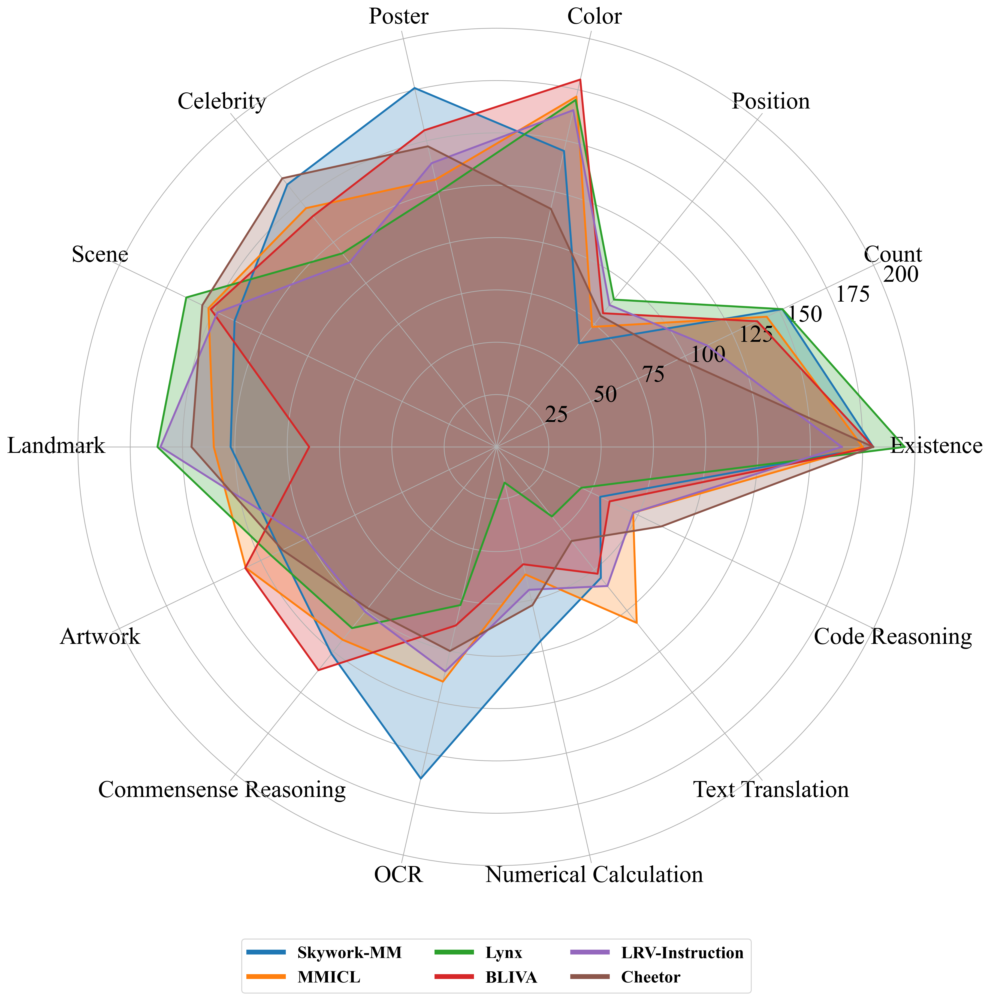

# MME: A Comprehensive Evaluation Benchmark for Multimodal Large Language Models


> Multimodal Large Language Model (MLLM) relies on the powerful LLM to perform multimodal tasks, showing amazing emergent abilities in recent studies, such as writing poems based on an image. However, it is difficult for these case studies to fully reflect the performance of MLLM, lacking a comprehensive evaluation. In this paper, we fill in this blank, presenting the first MLLM Evaluation benchmark MME. It measures both perception and cognition abilities on a total of 14 subtasks. In order to avoid data leakage that may arise from direct use of public datasets for evaluation, the annotations of instruction-answer pairs are all manually designed. The concise instruction design allows us to fairly compare MLLMs, instead of struggling in prompt engineering. Besides, with such an instruction, we can also easily carry out quantitative statistics. A total of 21 advanced MLLMs are comprehensively evaluated on our MME, which not only suggests that existing MLLMs still have a large room for improvement, but also reveals the potential directions for the subsequent model optimization.


## Our MLLM works

🔥🔥🔥 **A Survey on Multimodal Large Language Models**  
**[Project Page](https://github.com/BradyFU/Awesome-Multimodal-Large-Language-Models)** | **[Paper](https://arxiv.org/pdf/2306.13549.pdf)**

A curated list of Multimodal Large Language Models (MLLMs), including datasets, multimodal instruction tuning, multimodal in-context learning, multimodal chain-of-thought, llm-aided visual reasoning, foundation models, and others. This list will be updated in real time. :sparkles:

Welcome to join our WeChat group of MLLM communication! 

Please add WeChat ID (xjtupanda) to join the group. :star2:

---

🔥🔥🔥 **MME: A Comprehensive Evaluation Benchmark for Multimodal Large Language Models**  
**[Project Page [Leaderboards]](https://github.com/BradyFU/Awesome-Multimodal-Large-Language-Models/tree/Evaluation)** | **[Paper](https://arxiv.org/pdf/2306.13394.pdf)**

Leaderboards of **21** advanced MLLMs, including [**BLIP-2**](https://arxiv.org/pdf/2301.12597.pdf), [**InstructBLIP**](https://arxiv.org/pdf/2305.06500.pdf), [**LLaVA**](https://arxiv.org/pdf/2304.08485.pdf), [**MiniGPT-4**](https://arxiv.org/pdf/2304.10592.pdf), [**mPLUG-Owl**](https://arxiv.org/pdf/2304.14178.pdf), [**LLaMA-Adapter V2**](https://arxiv.org/pdf/2304.15010.pdf), [**ImageBind_LLM**](https://github.com/OpenGVLab/LLaMA-Adapter/tree/main), [**Otter**](https://arxiv.org/pdf/2305.03726.pdf), [**VisualGLM-6B**](https://github.com/THUDM/VisualGLM-6B), [**Multimodal-GPT**](https://arxiv.org/pdf/2305.04790.pdf), [**PandaGPT**](https://arxiv.org/pdf/2305.16355.pdf), [**VPGTrans**](https://arxiv.org/pdf/2305.01278.pdf), [**LaVIN**](https://arxiv.org/pdf/2305.15023.pdf), [**Lynx**](https://arxiv.org/pdf/2307.02469.pdf), [**Octopus**](https://5e517712ad3e493895.gradio.live/), [**LRV-Instruction**](https://arxiv.org/pdf/2306.14565.pdf), [**Cheetor**](https://arxiv.org/pdf/2308.04152.pdf), [**MMICL**](https://github.com/HaozheZhao/MIC), [**GIT2**](https://arxiv.org/pdf/2205.14100.pdf), [**BLIVA**](https://arxiv.org/pdf/2308.09936.pdf), and [**Skywork-MM**](https://github.com/will-singularity/Skywork-MM/tree/main).

If you want to add your model in our leaderboards, please feel free to email bradyfu24@gmail.com. We will update the leaderboards in time. :sparkles:

<details><summary>Download MME :star2::star2: </summary>


The benchmark dataset is collected by Xiamen University for academic research only. You can email guilinli@stu.xmu.edu.cn to obtain the dataset, according to the following requirement. 

**Requirement**: A real-name system is encouraged for better academic communication. Your email suffix needs to match your affiliation, such as xx@stu.xmu.edu.cn and Xiamen University. Otherwise, you need to explain why. Please include the information bellow when sending your application email.

```
Name: (tell us who you are.)
Affiliation: (the name/url of your university or company)
Job Title: (e.g., professor, PhD, and researcher)
Email: (your email address)
How to use: (only for non-commercial use)
```

</details>

If you find our projects helpful to your research, please cite the following papers:

```
@article{yin2023survey,
  title={A Survey on Multimodal Large Language Models},
  author={Yin, Shukang and Fu, Chaoyou and Zhao, Sirui and Li, Ke and Sun, Xing and Xu, Tong and Chen, Enhong},
  journal={arXiv preprint arXiv:2306.13549},
  year={2023}
}

@article{fu2023mme,
  title={MME: A Comprehensive Evaluation Benchmark for Multimodal Large Language Models},
  author={Fu, Chaoyou and Chen, Peixian and Shen, Yunhang and Qin, Yulei and Zhang, Mengdan and Lin, Xu and Qiu, Zhenyu and Lin, Wei and Yang, Jinrui and Zheng, Xiawu and Li, Ke and Sun, Xing and Ji, Rongrong},
  journal={arXiv preprint arXiv:2306.13394},
  year={2023}
}
```

---

# News 🚀

**[2023-08]** 

1. [09-01] Thanks to [**Will Zhang**](https://github.com/will-singularity), [**Skywork-MM**](https://github.com/will-singularity/Skywork-MM/tree/main) takes part in our leaderboards. 🔥🔥

**[2023-08]** 

1. [08-28] Thanks to [**UCSD MLPC**](https://github.com/mlpc-ucsd), we welcome [**BLIVA**](https://github.com/mlpc-ucsd/BLIVA) to join our leaderboards. 🔥🔥
2. [08-28] Thanks to [**Jianfeng Wang**](https://scholar.google.com.hk/citations?user=vJWEw_8AAAAJ&hl=zh-CN&oi=sra), [**GIT2**](https://github.com/microsoft/GenerativeImage2Text) is added to our leaderboards. 🔥🔥
3. [08-28] Thanks to [**Yike Yuan**](https://github.com/yyk-wew) and [**Songyang Zhang**](https://github.com/tonysy), the results of [**MiniGPT4**](https://arxiv.org/pdf/2304.10592.pdf) have been revised. 🔥🔥
4. [08-21] Thanks to [**Haozhe Zhao**](https://github.com/HaozheZhao), [**MMICL**](https://github.com/HaozheZhao/MIC) joins our leaderboards. 🔥🔥
5. [08-13] Thanks to [**Zhejiang University DCD Lab**](https://github.com/DCDmllm), our leaderboards incorporate a new member [**Cheetor**](https://github.com/DCDmllm/Cheetah). 🔥🔥
6. [08-08] Thanks to [**Fuxiao Liu**](https://github.com/FuxiaoLiu), we add [**LRV-Instruction**](https://github.com/FuxiaoLiu/LRV-Instruction) to our leaderboards. 🔥🔥

**[2023-07]** 

1. [07-28] Thanks to [**Yingzi Ma**](https://gray311.github.io/), his work [**Octopus**](https://5e517712ad3e493895.gradio.live/) has been updated to our leaderboards.
2. [07-15] Thanks to [**Jiani Zheng**](https://github.com/Garlicisnotmyfavor), our leaderboards welcome a new member [**Lynx**](https://github.com/bytedance/lynx-llm).
3. [07-12] Thanks to [**Ao Zhang**](https://github.com/waxnkw), his work [**VPGTrans**](https://github.com/VPGTrans/VPGTrans) has been added in our leaderboards.
4. [07-09] Thanks to [**Bo Li**](https://github.com/Luodian), we have updated the evaluation of his work [**Otter**](https://github.com/Luodian/Otter). It uses the latest model [**OTTER-Image-MPT7B**](https://huggingface.co/luodian/OTTER-Image-MPT7B) that incoporates OpenFlamingv2 and enhances instruction following ability.

**[2023-06]** 

1. [06-30] Thanks to [**Renrui Zhang**](https://github.com/ZrrSkywalker), we have updated the evaluation of his two works, i.e., [**LLaMA-Adapter V2**](https://github.com/OpenGVLab/LLaMA-Adapter) and [**ImageBind_LLM**](https://github.com/OpenGVLab/LLaMA-Adapter/tree/main/imagebind_LLM). The former is re-evaluated after changing the model [**weights**](https://github.com/OpenGVLab/LLaMA-Adapter/releases/download/v.2.0.0/7fa55208379faf2dd862565284101b0e4a2a72114d6490a95e432cf9d9b6c813_BIAS-7B.pth), and the latter is a newly added MLLM.
2. [06-30] Thanks to [**Gen Luo**](https://github.com/luogen1996), we have added the evaluation of his work [**LaVIN**](https://github.com/luogen1996/LaVIN).
3. [06-30] The results of other models have also been updated, retrieving the answer from the beginning of the generated responses instead of the whole responses. [**An automated evaluation script**](https://github.com/BradyFU/Awesome-Multimodal-Large-Language-Models/blob/Evaluation/tools/eval_tool.zip) for the calculation of scores has been released!

---

# Evaluation Results

The top 5 on the perception and cognition leaderboards:




# Evaluation Leaderboards


---

<font size=5><center><b> Table of Leaderboards </b> </center></font>

- [Perception](#perception)
  - [Existence](#existence) | [Count](#count) | [Position](#position) | [Color](#color) | [Poster](#poster) | [Celebrity](#celebrity) | [Scene](#scene) | [Landmark](#landmark) | [Artwork](#artwork) | [OCR](#ocr)
- [Cognition](#cognition)
  - [Commonsense Reasoning](#commonsense-reasoning) | [Numerical Calculation](#numerical-calculation) | [Text Translation](#text-translation) | [Code Reasoning](#code-reasoning)

---


## Perception

Sum of the scores of all perception subtasks, including existence, count, position, color, poster, celebrity, scene, landmark, artwork, and OCR. The full score of each subtask is 200, and that of all perception is 2000.

| Rank |                            Model                             |                           Version                            |    Score    |
| :--: | :----------------------------------------------------------: | :----------------------------------------------------------: | :---------: |
|  🏅️   | **[Skywork-MM](https://github.com/will-singularity/Skywork-MM/tree/main)** | **[Skywork-MM-13B](https://github.com/will-singularity/Skywork-MM/tree/main)** | **1419.08** |
|  🥈   |        **[MMICL](https://github.com/HaozheZhao/MIC)**        |      **[FlanT5xxl](https://github.com/HaozheZhao/MIC)**      | **1376.00** |
|  🥉   |       **[Lynx](https://arxiv.org/pdf/2307.02469.pdf)**       |    **[vicuna-7b](https://github.com/bytedance/lynx-llm)**    | **1373.23** |
|  4   |        [BLIVA](https://arxiv.org/pdf/2308.09936.pdf)         |       [FlanT5xxl](https://github.com/mlpc-ucsd/BLIVA)        |   1337.73   |
|  5   |         [GIT2](https://arxiv.org/pdf/2205.14100.pdf)         | [VQAv2-finetuned](https://github.com/microsoft/GenerativeImage2Text) |   1332.05   |
|  6   |       [Cheetor](https://arxiv.org/pdf/2308.04152.pdf)        |       [vicuna-7b](https://github.com/DCDmllm/Cheetah)        |   1299.96   |
|  7   |   [LRV-Instruction](https://arxiv.org/pdf/2306.14565.pdf)    |    [LRV-7B](https://github.com/FuxiaoLiu/LRV-Instruction)    |   1299.78   |
|  8   |        [BLIP-2](https://arxiv.org/pdf/2301.12597.pdf)        | [blip2-pretrain-flant5xxl](https://github.com/salesforce/LAVIS/tree/main/projects/blip2) |   1293.84   |
|  9   |        [Otter](https://arxiv.org/pdf/2305.03726.pdf)         |    [OTTER-Image-MPT7B](https://github.com/Luodian/Otter)     |   1292.26   |
|  10  |     [InstructBLIP](https://arxiv.org/pdf/2305.06500.pdf)     | [blip2-instruct-flant5xxl](https://github.com/salesforce/LAVIS/tree/main/projects/instructblip) |   1212.82   |
|  11  |      [Octopus](https://5e517712ad3e493895.gradio.live/)      |                            MPT7B                             |   1095.76   |
|  12  |   [LLaMA-Adapter V2](https://arxiv.org/pdf/2304.15010.pdf)   | [LLaMAv2-7B](https://github.com/OpenGVLab/LLaMA-Adapter/tree/main/llama_adapter_v2_multimodal) |   972.67    |
|  13  |      [mPLUG-Owl](https://arxiv.org/pdf/2304.14178.pdf)       | [mplug-owl-llama-7b](https://huggingface.co/MAGAer13/mplug-owl-llama-7b) |   967.34    |
|  14  |        [LaVIN](https://arxiv.org/pdf/2305.15023.pdf)         |       [LAVIN-13B](https://github.com/luogen1996/LaVIN)       |   963.60    |
|  15  |       [VPGTrans](https://arxiv.org/pdf/2305.01278.pdf)       |     [vl-vicuna-7b](https://github.com/VPGTrans/VPGTrans)     |   790.45    |
|  16  | [ImageBind_LLM](https://github.com/OpenGVLab/LLaMA-Adapter/tree/main) | [imagebind_LLM-7B](https://github.com/OpenGVLab/LLaMA-Adapter/tree/main/imagebind_LLM) |   775.77    |
|  17  |    [VisualGLM-6B](https://github.com/THUDM/VisualGLM-6B)     |    [VisualGLM-6B](https://github.com/THUDM/VisualGLM-6B)     |   705.31    |
|  18  |    [Multimodal-GPT](https://arxiv.org/pdf/2305.04790.pdf)    | [Multimodal-GPT-9B](https://github.com/open-mmlab/Multimodal-GPT) |   654.72    |
|  19  |       [PandaGPT](https://arxiv.org/pdf/2305.16355.pdf)       | [pandagpt-7b-max-len-512](https://github.com/yxuansu/PandaGPT) |   642.59    |
|  20  |      [MiniGPT-4](https://arxiv.org/pdf/2304.10592.pdf)       | [minigpt4-aligned-with-vicuna13b](https://github.com/Vision-CAIR/MiniGPT-4) |   581.67    |
|  21  |        [LLaVA](https://arxiv.org/pdf/2304.08485.pdf)         |     [LLaVA-7B-v0](https://github.com/haotian-liu/LLaVA)      |   502.82    |

### Existence

| Rank |                            Model                             |                           Version                            |   Score    |
| :--: | :----------------------------------------------------------: | :----------------------------------------------------------: | :--------: |
|  🏅️   |      **[Otter](https://arxiv.org/pdf/2305.03726.pdf)**       |  **[OTTER-Image-MPT7B](https://github.com/Luodian/Otter)**   | **195.00** |
|  🏅️   |       **[Lynx](https://arxiv.org/pdf/2307.02469.pdf)**       |    **[vicuna-7b](https://github.com/bytedance/lynx-llm)**    | **195.00** |
|  🥈   |       **[GIT2](https://arxiv.org/pdf/2205.14100.pdf)**       | **[VQAv2-finetuned](https://github.com/microsoft/GenerativeImage2Text)** | **190.00** |
|  🥉   |   **[InstructBLIP](https://arxiv.org/pdf/2305.06500.pdf)**   | **[blip2-instruct-flant5xxl](https://github.com/salesforce/LAVIS/tree/main/projects/instructblip)** | **185.00** |
|  🥉   |      **[LaVIN](https://arxiv.org/pdf/2305.15023.pdf)**       |     **[LAVIN-13B](https://github.com/luogen1996/LaVIN)**     | **185.00** |
|  4   |      [Octopus](https://5e517712ad3e493895.gradio.live/)      |                            MPT7B                             |   180.00   |
|  4   |       [Cheetor](https://arxiv.org/pdf/2308.04152.pdf)        |       [vicuna-7b](https://github.com/DCDmllm/Cheetah)        |   180.00   |
|  4   |        [BLIVA](https://arxiv.org/pdf/2308.09936.pdf)         |       [FlanT5xxl](https://github.com/mlpc-ucsd/BLIVA)        |   180.00   |
|  4   | [Skywork-MM](https://github.com/will-singularity/Skywork-MM/tree/main) | [Skywork-MM-13B](https://github.com/will-singularity/Skywork-MM/tree/main) |   180.00   |
|  5   |          [MMICL](https://github.com/HaozheZhao/MIC)          |        [FlanT5xxl](https://github.com/HaozheZhao/MIC)        |   175.00   |
|  6   |   [LRV-Instruction](https://arxiv.org/pdf/2306.14565.pdf)    |    [LRV-7B](https://github.com/FuxiaoLiu/LRV-Instruction)    |   165.00   |
|  7   |        [BLIP-2](https://arxiv.org/pdf/2301.12597.pdf)        | [blip2-pretrain-flant5xxl](https://github.com/salesforce/LAVIS/tree/main/projects/blip2) |   160.00   |
|  8   | [ImageBind_LLM](https://github.com/OpenGVLab/LLaMA-Adapter/tree/main) | [imagebind_LLM-7B](https://github.com/OpenGVLab/LLaMA-Adapter/tree/main/imagebind_LLM) |   128.33   |
|  9   |      [mPLUG-Owl](https://arxiv.org/pdf/2304.14178.pdf)       | [mplug-owl-llama-7b](https://huggingface.co/MAGAer13/mplug-owl-llama-7b) |   120.00   |
|  9   |   [LLaMA-Adapter V2](https://arxiv.org/pdf/2304.15010.pdf)   | [LLaMAv2-7B](https://github.com/OpenGVLab/LLaMA-Adapter/tree/main/llama_adapter_v2_multimodal) |   120.00   |
|  10  |    [VisualGLM-6B](https://github.com/THUDM/VisualGLM-6B)     |    [VisualGLM-6B](https://github.com/THUDM/VisualGLM-6B)     |   85.00    |
|  11  |       [PandaGPT](https://arxiv.org/pdf/2305.16355.pdf)       | [pandagpt-7b-max-len-512](https://github.com/yxuansu/PandaGPT) |   70.00    |
|  11  |       [VPGTrans](https://arxiv.org/pdf/2305.01278.pdf)       |     [vl-vicuna-7b](https://github.com/VPGTrans/VPGTrans)     |   70.00    |
|  12  |      [MiniGPT-4](https://arxiv.org/pdf/2304.10592.pdf)       | [minigpt4-aligned-with-vicuna13b](https://github.com/Vision-CAIR/MiniGPT-4) |   68.33    |
|  13  |    [Multimodal-GPT](https://arxiv.org/pdf/2305.04790.pdf)    | [Multimodal-GPT-9B](https://github.com/open-mmlab/Multimodal-GPT) |   61.67    |
|  14  |        [LLaVA](https://arxiv.org/pdf/2304.08485.pdf)         |     [LLaVA-7B-v0](https://github.com/haotian-liu/LLaVA)      |   50.00    |

### Count

| Rank |                            Model                             |                           Version                            |   Score    |
| :--: | :----------------------------------------------------------: | :----------------------------------------------------------: | :--------: |
|  🏅️   |       **[Lynx](https://arxiv.org/pdf/2307.02469.pdf)**       |    **[vicuna-7b](https://github.com/bytedance/lynx-llm)**    | **151.67** |
|  🏅️   | **[Skywork-MM](https://github.com/will-singularity/Skywork-MM/tree/main)** | **[Skywork-MM-13B](https://github.com/will-singularity/Skywork-MM/tree/main)** | **151.67** |
|  🥈   |        **[MMICL](https://github.com/HaozheZhao/MIC)**        |      **[FlanT5xxl](https://github.com/HaozheZhao/MIC)**      | **143.33** |
|  🥈   |   **[InstructBLIP](https://arxiv.org/pdf/2305.06500.pdf)**   | **[blip2-instruct-flant5xxl](https://github.com/salesforce/LAVIS/tree/main/projects/instructblip)** | **143.33** |
|  🥉   |      **[BLIVA](https://arxiv.org/pdf/2308.09936.pdf)**       |     **[FlanT5xxl](https://github.com/mlpc-ucsd/BLIVA)**      | **138.33** |
|  4   |        [BLIP-2](https://arxiv.org/pdf/2301.12597.pdf)        | [blip2-pretrain-flant5xxl](https://github.com/salesforce/LAVIS/tree/main/projects/blip2) |   135.00   |
|  5   |         [GIT2](https://arxiv.org/pdf/2205.14100.pdf)         | [VQAv2-finetuned](https://github.com/microsoft/GenerativeImage2Text) |   118.33   |
|  6   |   [LRV-Instruction](https://arxiv.org/pdf/2306.14565.pdf)    |    [LRV-7B](https://github.com/FuxiaoLiu/LRV-Instruction)    |   111.67   |
|  7   |       [Cheetor](https://arxiv.org/pdf/2308.04152.pdf)        |       [vicuna-7b](https://github.com/DCDmllm/Cheetah)        |   96.67    |
|  8   |        [Otter](https://arxiv.org/pdf/2305.03726.pdf)         |    [OTTER-Image-MPT7B](https://github.com/Luodian/Otter)     |   88.33    |
|  8   |        [LaVIN](https://arxiv.org/pdf/2305.15023.pdf)         |       [LAVIN-13B](https://github.com/luogen1996/LaVIN)       |   88.33    |
|  9   |       [VPGTrans](https://arxiv.org/pdf/2305.01278.pdf)       |     [vl-vicuna-7b](https://github.com/VPGTrans/VPGTrans)     |   85.00    |
|  10  | [ImageBind_LLM](https://github.com/OpenGVLab/LLaMA-Adapter/tree/main) | [imagebind_LLM-7B](https://github.com/OpenGVLab/LLaMA-Adapter/tree/main/imagebind_LLM) |   60.00    |
|  11  |      [MiniGPT-4](https://arxiv.org/pdf/2304.10592.pdf)       | [minigpt4-aligned-with-vicuna13b](https://github.com/Vision-CAIR/MiniGPT-4) |   55.00    |
|  11  |    [Multimodal-GPT](https://arxiv.org/pdf/2305.04790.pdf)    | [Multimodal-GPT-9B](https://github.com/open-mmlab/Multimodal-GPT) |   55.00    |
|  12  |      [Octopus](https://5e517712ad3e493895.gradio.live/)      |                            MPT7B                             |   53.33    |
|  13  |      [mPLUG-Owl](https://arxiv.org/pdf/2304.14178.pdf)       | [mplug-owl-llama-7b](https://huggingface.co/MAGAer13/mplug-owl-llama-7b) |   50.00    |
|  13  |   [LLaMA-Adapter V2](https://arxiv.org/pdf/2304.15010.pdf)   | [LLaMAv2-7B](https://github.com/OpenGVLab/LLaMA-Adapter/tree/main/llama_adapter_v2_multimodal) |   50.00    |
|  13  |    [VisualGLM-6B](https://github.com/THUDM/VisualGLM-6B)     |    [VisualGLM-6B](https://github.com/THUDM/VisualGLM-6B)     |   50.00    |
|  13  |       [PandaGPT](https://arxiv.org/pdf/2305.16355.pdf)       | [pandagpt-7b-max-len-512](https://github.com/yxuansu/PandaGPT) |   50.00    |
|  13  |        [LLaVA](https://arxiv.org/pdf/2304.08485.pdf)         |     [LLaVA-7B-v0](https://github.com/haotian-liu/LLaVA)      |   50.00    |

### Position

| Rank |                            Model                             |                           Version                            | Score     |
| :--: | :----------------------------------------------------------: | :----------------------------------------------------------: | --------- |
|  🏅️   |       **[GIT2](https://arxiv.org/pdf/2205.14100.pdf)**       | **[VQAv2-finetuned](https://github.com/microsoft/GenerativeImage2Text)** | **96.67** |
|  🥈   |       **[Lynx](https://arxiv.org/pdf/2307.02469.pdf)**       |    **[vicuna-7b](https://github.com/bytedance/lynx-llm)**    | **90.00** |
|  🥉   |      **[Otter](https://arxiv.org/pdf/2305.03726.pdf)**       |  **[OTTER-Image-MPT7B](https://github.com/Luodian/Otter)**   | **86.67** |
|  🥉   | **[LRV-Instruction](https://arxiv.org/pdf/2306.14565.pdf)**  |  **[LRV-7B](https://github.com/FuxiaoLiu/LRV-Instruction)**  | **86.67** |
|  4   |        [BLIVA](https://arxiv.org/pdf/2308.09936.pdf)         |       [FlanT5xxl](https://github.com/mlpc-ucsd/BLIVA)        | 81.67     |
|  5   |       [Cheetor](https://arxiv.org/pdf/2308.04152.pdf)        |       [vicuna-7b](https://github.com/DCDmllm/Cheetah)        | 80.00     |
|  6   |          [MMICL](https://github.com/HaozheZhao/MIC)          |        [FlanT5xxl](https://github.com/HaozheZhao/MIC)        | 73.33     |
|  6   |        [BLIP-2](https://arxiv.org/pdf/2301.12597.pdf)        | [blip2-pretrain-flant5xxl](https://github.com/salesforce/LAVIS/tree/main/projects/blip2) | 73.33     |
|  7   |     [InstructBLIP](https://arxiv.org/pdf/2305.06500.pdf)     | [blip2-instruct-flant5xxl](https://github.com/salesforce/LAVIS/tree/main/projects/instructblip) | 66.67     |
|  8   | [Skywork-MM](https://github.com/will-singularity/Skywork-MM/tree/main) | [Skywork-MM-13B](https://github.com/will-singularity/Skywork-MM/tree/main) | 63.33     |
|  8   |        [LaVIN](https://arxiv.org/pdf/2305.15023.pdf)         |       [LAVIN-13B](https://github.com/luogen1996/LaVIN)       | 63.33     |
|  8   |       [VPGTrans](https://arxiv.org/pdf/2305.01278.pdf)       |     [vl-vicuna-7b](https://github.com/VPGTrans/VPGTrans)     | 63.33     |
|  9   |    [Multimodal-GPT](https://arxiv.org/pdf/2305.04790.pdf)    | [Multimodal-GPT-9B](https://github.com/open-mmlab/Multimodal-GPT) | 58.33     |
|  10  |      [mPLUG-Owl](https://arxiv.org/pdf/2304.14178.pdf)       | [mplug-owl-llama-7b](https://huggingface.co/MAGAer13/mplug-owl-llama-7b) | 50.00     |
|  10  |       [PandaGPT](https://arxiv.org/pdf/2305.16355.pdf)       | [pandagpt-7b-max-len-512](https://github.com/yxuansu/PandaGPT) | 50.00     |
|  10  |        [LLaVA](https://arxiv.org/pdf/2304.08485.pdf)         |     [LLaVA-7B-v0](https://github.com/haotian-liu/LLaVA)      | 50.00     |
|  11  |      [Octopus](https://5e517712ad3e493895.gradio.live/)      |                            MPT7B                             | 48.33     |
|  11  |   [LLaMA-Adapter V2](https://arxiv.org/pdf/2304.15010.pdf)   | [LLaMAv2-7B](https://github.com/OpenGVLab/LLaMA-Adapter/tree/main/llama_adapter_v2_multimodal) | 48.33     |
|  11  |    [VisualGLM-6B](https://github.com/THUDM/VisualGLM-6B)     |    [VisualGLM-6B](https://github.com/THUDM/VisualGLM-6B)     | 48.33     |
|  12  | [ImageBind_LLM](https://github.com/OpenGVLab/LLaMA-Adapter/tree/main) | [imagebind_LLM-7B](https://github.com/OpenGVLab/LLaMA-Adapter/tree/main/imagebind_LLM) | 46.67     |
|  13  |      [MiniGPT-4](https://arxiv.org/pdf/2304.10592.pdf)       | [minigpt4-aligned-with-vicuna13b](https://github.com/Vision-CAIR/MiniGPT-4) | 43.33     |

### Color

| Rank |                            Model                             |                           Version                            | Score  |
| :--: | :----------------------------------------------------------: | :----------------------------------------------------------: | :----: |
|  🏅️   |        [BLIVA](https://arxiv.org/pdf/2308.09936.pdf)         |       [FlanT5xxl](https://github.com/mlpc-ucsd/BLIVA)        | 180.00 |
|  🥈   |          [MMICL](https://github.com/HaozheZhao/MIC)          |        [FlanT5xxl](https://github.com/HaozheZhao/MIC)        | 171.67 |
|  🥉   |         [Lynx](https://arxiv.org/pdf/2307.02469.pdf)         |      [vicuna-7b](https://github.com/bytedance/lynx-llm)      | 170.00 |
|  4   |   [LRV-Instruction](https://arxiv.org/pdf/2306.14565.pdf)    |    [LRV-7B](https://github.com/FuxiaoLiu/LRV-Instruction)    | 165.00 |
|  5   |         [GIT2](https://arxiv.org/pdf/2205.14100.pdf)         | [VQAv2-finetuned](https://github.com/microsoft/GenerativeImage2Text) | 158.33 |
|  6   |     [InstructBLIP](https://arxiv.org/pdf/2305.06500.pdf)     | [blip2-instruct-flant5xxl](https://github.com/salesforce/LAVIS/tree/main/projects/instructblip) | 153.33 |
|  7   |        [BLIP-2](https://arxiv.org/pdf/2301.12597.pdf)        | [blip2-pretrain-flant5xxl](https://github.com/salesforce/LAVIS/tree/main/projects/blip2) | 148.33 |
|  8   | [Skywork-MM](https://github.com/will-singularity/Skywork-MM/tree/main) | [Skywork-MM-13B](https://github.com/will-singularity/Skywork-MM/tree/main) | 145.00 |
|  9   |       [Cheetor](https://arxiv.org/pdf/2308.04152.pdf)        |       [vicuna-7b](https://github.com/DCDmllm/Cheetah)        | 116.67 |
|  10  |        [Otter](https://arxiv.org/pdf/2305.03726.pdf)         |    [OTTER-Image-MPT7B](https://github.com/Luodian/Otter)     | 113.33 |
|  11  |      [Octopus](https://5e517712ad3e493895.gradio.live/)      |                            MPT7B                             | 103.33 |
|  12  |      [MiniGPT-4](https://arxiv.org/pdf/2304.10592.pdf)       | [minigpt4-aligned-with-vicuna13b](https://github.com/Vision-CAIR/MiniGPT-4) | 75.00  |
|  13  |   [LLaMA-Adapter V2](https://arxiv.org/pdf/2304.15010.pdf)   | [LLaMAv2-7B](https://github.com/OpenGVLab/LLaMA-Adapter/tree/main/llama_adapter_v2_multimodal) | 75.00  |
|  14  |        [LaVIN](https://arxiv.org/pdf/2305.15023.pdf)         |       [LAVIN-13B](https://github.com/luogen1996/LaVIN)       | 75.00  |
|  15  | [ImageBind_LLM](https://github.com/OpenGVLab/LLaMA-Adapter/tree/main) | [imagebind_LLM-7B](https://github.com/OpenGVLab/LLaMA-Adapter/tree/main/imagebind_LLM) | 73.33  |
|  16  |       [VPGTrans](https://arxiv.org/pdf/2305.01278.pdf)       |     [vl-vicuna-7b](https://github.com/VPGTrans/VPGTrans)     | 73.33  |
|  17  |    [Multimodal-GPT](https://arxiv.org/pdf/2305.04790.pdf)    | [Multimodal-GPT-9B](https://github.com/open-mmlab/Multimodal-GPT) | 68.33  |
|  18  |      [mPLUG-Owl](https://arxiv.org/pdf/2304.14178.pdf)       | [mplug-owl-llama-7b](https://huggingface.co/MAGAer13/mplug-owl-llama-7b) | 55.00  |
|  19  |    [VisualGLM-6B](https://github.com/THUDM/VisualGLM-6B)     |    [VisualGLM-6B](https://github.com/THUDM/VisualGLM-6B)     | 55.00  |
|  20  |        [LLaVA](https://arxiv.org/pdf/2304.08485.pdf)         |     [LLaVA-7B-v0](https://github.com/haotian-liu/LLaVA)      | 55.00  |
|  21  |       [PandaGPT](https://arxiv.org/pdf/2305.16355.pdf)       | [pandagpt-7b-max-len-512](https://github.com/yxuansu/PandaGPT) | 50.00  |

### Poster

| Rank |                            Model                             |                           Version                            |   Score    |
| :--: | :----------------------------------------------------------: | :----------------------------------------------------------: | :--------: |
|  🏅️   | **[Skywork-MM](https://github.com/will-singularity/Skywork-MM/tree/main)** | **[Skywork-MM-13B](https://github.com/will-singularity/Skywork-MM/tree/main)** | **175.85** |
|  🥈   |      **[BLIVA](https://arxiv.org/pdf/2308.09936.pdf)**       |     **[FlanT5xxl](https://github.com/mlpc-ucsd/BLIVA)**      | **155.10** |
|  🥉   |     **[Cheetor](https://arxiv.org/pdf/2308.04152.pdf)**      |     **[vicuna-7b](https://github.com/DCDmllm/Cheetah)**      | **147.28** |
|  4   |        [BLIP-2](https://arxiv.org/pdf/2301.12597.pdf)        | [blip2-pretrain-flant5xxl](https://github.com/salesforce/LAVIS/tree/main/projects/blip2) |   141.84   |
|  5   |   [LRV-Instruction](https://arxiv.org/pdf/2306.14565.pdf)    |    [LRV-7B](https://github.com/FuxiaoLiu/LRV-Instruction)    |   139.04   |
|  6   |        [Otter](https://arxiv.org/pdf/2305.03726.pdf)         |    [OTTER-Image-MPT7B](https://github.com/Luodian/Otter)     |   138.78   |
|  7   |      [Octopus](https://5e517712ad3e493895.gradio.live/)      |                            MPT7B                             |   138.10   |
|  8   |      [mPLUG-Owl](https://arxiv.org/pdf/2304.14178.pdf)       | [mplug-owl-llama-7b](https://huggingface.co/MAGAer13/mplug-owl-llama-7b) |   136.05   |
|  9   |          [MMICL](https://github.com/HaozheZhao/MIC)          |        [FlanT5xxl](https://github.com/HaozheZhao/MIC)        |   130.95   |
|  10  |         [Lynx](https://arxiv.org/pdf/2307.02469.pdf)         |      [vicuna-7b](https://github.com/bytedance/lynx-llm)      |   124.83   |
|  11  |     [InstructBLIP](https://arxiv.org/pdf/2305.06500.pdf)     | [blip2-instruct-flant5xxl](https://github.com/salesforce/LAVIS/tree/main/projects/instructblip) |   123.81   |
|  12  |         [GIT2](https://arxiv.org/pdf/2205.14100.pdf)         | [VQAv2-finetuned](https://github.com/microsoft/GenerativeImage2Text) |   112.59   |
|  13  |   [LLaMA-Adapter V2](https://arxiv.org/pdf/2304.15010.pdf)   | [LLaMAv2-7B](https://github.com/OpenGVLab/LLaMA-Adapter/tree/main/llama_adapter_v2_multimodal) |   99.66    |
|  14  |       [VPGTrans](https://arxiv.org/pdf/2305.01278.pdf)       |     [vl-vicuna-7b](https://github.com/VPGTrans/VPGTrans)     |   84.01    |
|  15  |        [LaVIN](https://arxiv.org/pdf/2305.15023.pdf)         |       [LAVIN-13B](https://github.com/luogen1996/LaVIN)       |   79.59    |
|  16  |       [PandaGPT](https://arxiv.org/pdf/2305.16355.pdf)       | [pandagpt-7b-max-len-512](https://github.com/yxuansu/PandaGPT) |   76.53    |
|  17  |    [VisualGLM-6B](https://github.com/THUDM/VisualGLM-6B)     |    [VisualGLM-6B](https://github.com/THUDM/VisualGLM-6B)     |   65.99    |
|  18  | [ImageBind_LLM](https://github.com/OpenGVLab/LLaMA-Adapter/tree/main) | [imagebind_LLM-7B](https://github.com/OpenGVLab/LLaMA-Adapter/tree/main/imagebind_LLM) |   64.97    |
|  19  |    [Multimodal-GPT](https://arxiv.org/pdf/2305.04790.pdf)    | [Multimodal-GPT-9B](https://github.com/open-mmlab/Multimodal-GPT) |   57.82    |
|  20  |        [LLaVA](https://arxiv.org/pdf/2304.08485.pdf)         |     [LLaVA-7B-v0](https://github.com/haotian-liu/LLaVA)      |   50.00    |
|  21  |      [MiniGPT-4](https://arxiv.org/pdf/2304.10592.pdf)       | [minigpt4-aligned-with-vicuna13b](https://github.com/Vision-CAIR/MiniGPT-4) |   41.84    |

### Celebrity

| Rank |                            Model                             |                           Version                            |   Score    |
| :--: | :----------------------------------------------------------: | :----------------------------------------------------------: | :--------: |
|  🏅️   |      **[Otter](https://arxiv.org/pdf/2305.03726.pdf)**       |  **[OTTER-Image-MPT7B](https://github.com/Luodian/Otter)**   | **172.65** |
|  🥈   |     **[Cheetor](https://arxiv.org/pdf/2308.04152.pdf)**      |     **[vicuna-7b](https://github.com/DCDmllm/Cheetah)**      | **164.12** |
|  🥉   | **[Skywork-MM](https://github.com/will-singularity/Skywork-MM/tree/main)** | **[Skywork-MM-13B](https://github.com/will-singularity/Skywork-MM/tree/main)** | **160.29** |
|  4   |          [MMICL](https://github.com/HaozheZhao/MIC)          |        [FlanT5xxl](https://github.com/HaozheZhao/MIC)        |   145.88   |
|  4   |         [GIT2](https://arxiv.org/pdf/2205.14100.pdf)         | [VQAv2-finetuned](https://github.com/microsoft/GenerativeImage2Text) |   145.88   |
|  5   |        [BLIVA](https://arxiv.org/pdf/2308.09936.pdf)         |       [FlanT5xxl](https://github.com/mlpc-ucsd/BLIVA)        |   140.88   |
|  6   |      [Octopus](https://5e517712ad3e493895.gradio.live/)      |                            MPT7B                             |   129.41   |
|  7   |         [Lynx](https://arxiv.org/pdf/2307.02469.pdf)         |      [vicuna-7b](https://github.com/bytedance/lynx-llm)      |   118.24   |
|  8   |   [LRV-Instruction](https://arxiv.org/pdf/2306.14565.pdf)    |    [LRV-7B](https://github.com/FuxiaoLiu/LRV-Instruction)    |   112.65   |
|  9   |        [BLIP-2](https://arxiv.org/pdf/2301.12597.pdf)        | [blip2-pretrain-flant5xxl](https://github.com/salesforce/LAVIS/tree/main/projects/blip2) |   105.59   |
|  10  |     [InstructBLIP](https://arxiv.org/pdf/2305.06500.pdf)     | [blip2-instruct-flant5xxl](https://github.com/salesforce/LAVIS/tree/main/projects/instructblip) |   101.18   |
|  11  |      [mPLUG-Owl](https://arxiv.org/pdf/2304.14178.pdf)       | [mplug-owl-llama-7b](https://huggingface.co/MAGAer13/mplug-owl-llama-7b) |   100.29   |
|  12  |   [LLaMA-Adapter V2](https://arxiv.org/pdf/2304.15010.pdf)   | [LLaMAv2-7B](https://github.com/OpenGVLab/LLaMA-Adapter/tree/main/llama_adapter_v2_multimodal) |   86.18    |
|  13  | [ImageBind_LLM](https://github.com/OpenGVLab/LLaMA-Adapter/tree/main) | [imagebind_LLM-7B](https://github.com/OpenGVLab/LLaMA-Adapter/tree/main/imagebind_LLM) |   76.47    |
|  14  |    [Multimodal-GPT](https://arxiv.org/pdf/2305.04790.pdf)    | [Multimodal-GPT-9B](https://github.com/open-mmlab/Multimodal-GPT) |   73.82    |
|  15  |       [PandaGPT](https://arxiv.org/pdf/2305.16355.pdf)       | [pandagpt-7b-max-len-512](https://github.com/yxuansu/PandaGPT) |   57.06    |
|  16  |      [MiniGPT-4](https://arxiv.org/pdf/2304.10592.pdf)       | [minigpt4-aligned-with-vicuna13b](https://github.com/Vision-CAIR/MiniGPT-4) |   54.41    |
|  17  |       [VPGTrans](https://arxiv.org/pdf/2305.01278.pdf)       |     [vl-vicuna-7b](https://github.com/VPGTrans/VPGTrans)     |   53.53    |
|  18  |    [VisualGLM-6B](https://github.com/THUDM/VisualGLM-6B)     |    [VisualGLM-6B](https://github.com/THUDM/VisualGLM-6B)     |   53.24    |
|  19  |        [LLaVA](https://arxiv.org/pdf/2304.08485.pdf)         |     [LLaVA-7B-v0](https://github.com/haotian-liu/LLaVA)      |   48.82    |
|  20  |        [LaVIN](https://arxiv.org/pdf/2305.15023.pdf)         |       [LAVIN-13B](https://github.com/luogen1996/LaVIN)       |   47.35    |

### Scene

| Rank |                            Model                             |                           Version                            |   Score    |
| :--: | :----------------------------------------------------------: | :----------------------------------------------------------: | :--------: |
|  🏅️   |       **[Lynx](https://arxiv.org/pdf/2307.02469.pdf)**       |    **[vicuna-7b](https://github.com/bytedance/lynx-llm)**    | **164.50** |
|  🥈   |      **[Otter](https://arxiv.org/pdf/2305.03726.pdf)**       |  **[OTTER-Image-MPT7B](https://github.com/Luodian/Otter)**   | **158.75** |
|  🥉   |       **[GIT2](https://arxiv.org/pdf/2205.14100.pdf)**       | **[VQAv2-finetuned](https://github.com/microsoft/GenerativeImage2Text)** | **158.50** |
|  4   |      [Octopus](https://5e517712ad3e493895.gradio.live/)      |                            MPT7B                             |   157.25   |
|  5   |       [Cheetor](https://arxiv.org/pdf/2308.04152.pdf)        |       [vicuna-7b](https://github.com/DCDmllm/Cheetah)        |   156.00   |
|  6   |     [InstructBLIP](https://arxiv.org/pdf/2305.06500.pdf)     | [blip2-instruct-flant5xxl](https://github.com/salesforce/LAVIS/tree/main/projects/instructblip) |   153.00   |
|  7   |          [MMICL](https://github.com/HaozheZhao/MIC)          |        [FlanT5xxl](https://github.com/HaozheZhao/MIC)        |   152.75   |
|  8   |        [BLIVA](https://arxiv.org/pdf/2308.09936.pdf)         |       [FlanT5xxl](https://github.com/mlpc-ucsd/BLIVA)        |   151.50   |
|  9   |   [LLaMA-Adapter V2](https://arxiv.org/pdf/2304.15010.pdf)   | [LLaMAv2-7B](https://github.com/OpenGVLab/LLaMA-Adapter/tree/main/llama_adapter_v2_multimodal) |   148.50   |
|  10  |   [LRV-Instruction](https://arxiv.org/pdf/2306.14565.pdf)    |    [LRV-7B](https://github.com/FuxiaoLiu/LRV-Instruction)    |   147.98   |
|  11  |    [VisualGLM-6B](https://github.com/THUDM/VisualGLM-6B)     |    [VisualGLM-6B](https://github.com/THUDM/VisualGLM-6B)     |   146.25   |
|  12  |        [BLIP-2](https://arxiv.org/pdf/2301.12597.pdf)        | [blip2-pretrain-flant5xxl](https://github.com/salesforce/LAVIS/tree/main/projects/blip2) |   145.25   |
|  13  |       [VPGTrans](https://arxiv.org/pdf/2305.01278.pdf)       |     [vl-vicuna-7b](https://github.com/VPGTrans/VPGTrans)     |   141.75   |
|  14  | [Skywork-MM](https://github.com/will-singularity/Skywork-MM/tree/main) | [Skywork-MM-13B](https://github.com/will-singularity/Skywork-MM/tree/main) |   138.89   |
|  15  |        [LaVIN](https://arxiv.org/pdf/2305.15023.pdf)         |       [LAVIN-13B](https://github.com/luogen1996/LaVIN)       |   136.75   |
|  16  |      [mPLUG-Owl](https://arxiv.org/pdf/2304.14178.pdf)       | [mplug-owl-llama-7b](https://huggingface.co/MAGAer13/mplug-owl-llama-7b) |   135.50   |
|  17  |       [PandaGPT](https://arxiv.org/pdf/2305.16355.pdf)       | [pandagpt-7b-max-len-512](https://github.com/yxuansu/PandaGPT) |   118.00   |
|  18  | [ImageBind_LLM](https://github.com/OpenGVLab/LLaMA-Adapter/tree/main) | [imagebind_LLM-7B](https://github.com/OpenGVLab/LLaMA-Adapter/tree/main/imagebind_LLM) |   113.25   |
|  19  |      [MiniGPT-4](https://arxiv.org/pdf/2304.10592.pdf)       | [minigpt4-aligned-with-vicuna13b](https://github.com/Vision-CAIR/MiniGPT-4) |   71.75    |
|  20  |    [Multimodal-GPT](https://arxiv.org/pdf/2305.04790.pdf)    | [Multimodal-GPT-9B](https://github.com/open-mmlab/Multimodal-GPT) |   68.00    |
|  21  |        [LLaVA](https://arxiv.org/pdf/2304.08485.pdf)         |     [LLaVA-7B-v0](https://github.com/haotian-liu/LLaVA)      |   50.00    |

### Landmark

| Rank |                            Model                             |                           Version                            |   Score    |
| :--: | :----------------------------------------------------------: | :----------------------------------------------------------: | :--------: |
|  🏅️   |       **[Lynx](https://arxiv.org/pdf/2307.02469.pdf)**       |    **[vicuna-7b](https://github.com/bytedance/lynx-llm)**    | **162.00** |
|  🥈   | **[LRV-Instruction](https://arxiv.org/pdf/2306.14565.pdf)**  |  **[LRV-7B](https://github.com/FuxiaoLiu/LRV-Instruction)**  | **160.53** |
|  🥉   |    **[mPLUG-Owl](https://arxiv.org/pdf/2304.14178.pdf)**     | **[mplug-owl-llama-7b](https://huggingface.co/MAGAer13/mplug-owl-llama-7b)** | **159.25** |
|  4   |   [LLaMA-Adapter V2](https://arxiv.org/pdf/2304.15010.pdf)   | [LLaMAv2-7B](https://github.com/OpenGVLab/LLaMA-Adapter/tree/main/llama_adapter_v2_multimodal) |   150.25   |
|  5   |       [Cheetor](https://arxiv.org/pdf/2308.04152.pdf)        |       [vicuna-7b](https://github.com/DCDmllm/Cheetah)        |   145.73   |
|  6   |         [GIT2](https://arxiv.org/pdf/2205.14100.pdf)         | [VQAv2-finetuned](https://github.com/microsoft/GenerativeImage2Text) |   140.50   |
|  7   |        [BLIP-2](https://arxiv.org/pdf/2301.12597.pdf)        | [blip2-pretrain-flant5xxl](https://github.com/salesforce/LAVIS/tree/main/projects/blip2) |   138.00   |
|  8   |        [Otter](https://arxiv.org/pdf/2305.03726.pdf)         |    [OTTER-Image-MPT7B](https://github.com/Luodian/Otter)     |   137.25   |
|  9   |          [MMICL](https://github.com/HaozheZhao/MIC)          |        [FlanT5xxl](https://github.com/HaozheZhao/MIC)        |   135.08   |
|  10  | [Skywork-MM](https://github.com/will-singularity/Skywork-MM/tree/main) | [Skywork-MM-13B](https://github.com/will-singularity/Skywork-MM/tree/main) |   127.04   |
|  11  |      [Octopus](https://5e517712ad3e493895.gradio.live/)      |                            MPT7B                             |   126.00   |
|  12  |        [LaVIN](https://arxiv.org/pdf/2305.15023.pdf)         |       [LAVIN-13B](https://github.com/luogen1996/LaVIN)       |   93.50    |
|  13  |        [BLIVA](https://arxiv.org/pdf/2308.09936.pdf)         |       [FlanT5xxl](https://github.com/mlpc-ucsd/BLIVA)        |   89.50    |
|  14  |    [VisualGLM-6B](https://github.com/THUDM/VisualGLM-6B)     |    [VisualGLM-6B](https://github.com/THUDM/VisualGLM-6B)     |   83.75    |
|  15  |     [InstructBLIP](https://arxiv.org/pdf/2305.06500.pdf)     | [blip2-instruct-flant5xxl](https://github.com/salesforce/LAVIS/tree/main/projects/instructblip) |   79.75    |
|  16  |    [Multimodal-GPT](https://arxiv.org/pdf/2305.04790.pdf)    | [Multimodal-GPT-9B](https://github.com/open-mmlab/Multimodal-GPT) |   69.75    |
|  16  |       [PandaGPT](https://arxiv.org/pdf/2305.16355.pdf)       | [pandagpt-7b-max-len-512](https://github.com/yxuansu/PandaGPT) |   69.75    |
|  17  |       [VPGTrans](https://arxiv.org/pdf/2305.01278.pdf)       |     [vl-vicuna-7b](https://github.com/VPGTrans/VPGTrans)     |   64.75    |
|  18  | [ImageBind_LLM](https://github.com/OpenGVLab/LLaMA-Adapter/tree/main) | [imagebind_LLM-7B](https://github.com/OpenGVLab/LLaMA-Adapter/tree/main/imagebind_LLM) |   62.00    |
|  19  |      [MiniGPT-4](https://arxiv.org/pdf/2304.10592.pdf)       | [minigpt4-aligned-with-vicuna13b](https://github.com/Vision-CAIR/MiniGPT-4) |   54.00    |
|  20  |        [LLaVA](https://arxiv.org/pdf/2304.08485.pdf)         |     [LLaVA-7B-v0](https://github.com/haotian-liu/LLaVA)      |   50.00    |

### Artwork

| Rank |                            Model                             |                           Version                            |   Score    |
| :--: | :----------------------------------------------------------: | :----------------------------------------------------------: | :--------: |
|  🏅️   |       **[GIT2](https://arxiv.org/pdf/2205.14100.pdf)**       | **[VQAv2-finetuned](https://github.com/microsoft/GenerativeImage2Text)** | **146.25** |
|  🥈   |      **[BLIP-2](https://arxiv.org/pdf/2301.12597.pdf)**      | **[blip2-pretrain-flant5xxl](https://github.com/salesforce/LAVIS/tree/main/projects/blip2)** | **136.50** |
|  🥉   |   **[InstructBLIP](https://arxiv.org/pdf/2305.06500.pdf)**   | **[blip2-instruct-flant5xxl](https://github.com/salesforce/LAVIS/tree/main/projects/instructblip)** | **134.25** |
|  4   |        [BLIVA](https://arxiv.org/pdf/2308.09936.pdf)         |       [FlanT5xxl](https://github.com/mlpc-ucsd/BLIVA)        |   133.25   |
|  5   |          [MMICL](https://github.com/HaozheZhao/MIC)          |        [FlanT5xxl](https://github.com/HaozheZhao/MIC)        |   133.00   |
|  6   |        [Otter](https://arxiv.org/pdf/2305.03726.pdf)         |    [OTTER-Image-MPT7B](https://github.com/Luodian/Otter)     |   129.00   |
|  7   |         [Lynx](https://arxiv.org/pdf/2307.02469.pdf)         |      [vicuna-7b](https://github.com/bytedance/lynx-llm)      |   119.50   |
|  8   | [Skywork-MM](https://github.com/will-singularity/Skywork-MM/tree/main) | [Skywork-MM-13B](https://github.com/will-singularity/Skywork-MM/tree/main) |   114.51   |
|  9   |       [Cheetor](https://arxiv.org/pdf/2308.04152.pdf)        |       [vicuna-7b](https://github.com/DCDmllm/Cheetah)        |   113.50   |
|  10  |   [LRV-Instruction](https://arxiv.org/pdf/2306.14565.pdf)    |    [LRV-7B](https://github.com/FuxiaoLiu/LRV-Instruction)    |   101.25   |
|  11  |      [mPLUG-Owl](https://arxiv.org/pdf/2304.14178.pdf)       | [mplug-owl-llama-7b](https://huggingface.co/MAGAer13/mplug-owl-llama-7b) |   96.25    |
|  12  |      [Octopus](https://5e517712ad3e493895.gradio.live/)      |                            MPT7B                             |   95.00    |
|  13  |        [LaVIN](https://arxiv.org/pdf/2305.15023.pdf)         |       [LAVIN-13B](https://github.com/luogen1996/LaVIN)       |   87.25    |
|  14  |       [VPGTrans](https://arxiv.org/pdf/2305.01278.pdf)       |     [vl-vicuna-7b](https://github.com/VPGTrans/VPGTrans)     |   77.25    |
|  15  |    [VisualGLM-6B](https://github.com/THUDM/VisualGLM-6B)     |    [VisualGLM-6B](https://github.com/THUDM/VisualGLM-6B)     |   75.25    |
|  16  | [ImageBind_LLM](https://github.com/OpenGVLab/LLaMA-Adapter/tree/main) | [imagebind_LLM-7B](https://github.com/OpenGVLab/LLaMA-Adapter/tree/main/imagebind_LLM) |   70.75    |
|  17  |   [LLaMA-Adapter V2](https://arxiv.org/pdf/2304.15010.pdf)   | [LLaMAv2-7B](https://github.com/OpenGVLab/LLaMA-Adapter/tree/main/llama_adapter_v2_multimodal) |   69.75    |
|  18  |      [MiniGPT-4](https://arxiv.org/pdf/2304.10592.pdf)       | [minigpt4-aligned-with-vicuna13b](https://github.com/Vision-CAIR/MiniGPT-4) |   60.50    |
|  19  |    [Multimodal-GPT](https://arxiv.org/pdf/2305.04790.pdf)    | [Multimodal-GPT-9B](https://github.com/open-mmlab/Multimodal-GPT) |   59.50    |
|  20  |       [PandaGPT](https://arxiv.org/pdf/2305.16355.pdf)       | [pandagpt-7b-max-len-512](https://github.com/yxuansu/PandaGPT) |   51.25    |
|  21  |        [LLaVA](https://arxiv.org/pdf/2304.08485.pdf)         |     [LLaVA-7B-v0](https://github.com/haotian-liu/LLaVA)      |   49.00    |

### OCR

| Rank |                            Model                             |                           Version                            |   Score    |
| :--: | :----------------------------------------------------------: | :----------------------------------------------------------: | :--------: |
|  🏅️   | **[Skywork-MM](https://github.com/will-singularity/Skywork-MM/tree/main)** | **[Skywork-MM-13B](https://github.com/will-singularity/Skywork-MM/tree/main)** | **162.50** |
|  🥈   | **[LLaMA-Adapter V2](https://arxiv.org/pdf/2304.15010.pdf)** | **[LLaMAv2-7B](https://github.com/OpenGVLab/LLaMA-Adapter/tree/main/llama_adapter_v2_multimodal)** | **125.00** |
|  🥉   |        **[MMICL](https://github.com/HaozheZhao/MIC)**        |      **[FlanT5xxl](https://github.com/HaozheZhao/MIC)**      | **115.00** |
|  4   |        [BLIP-2](https://arxiv.org/pdf/2301.12597.pdf)        | [blip2-pretrain-flant5xxl](https://github.com/salesforce/LAVIS/tree/main/projects/blip2) |   110.00   |
|  4   |   [LRV-Instruction](https://arxiv.org/pdf/2306.14565.pdf)    |    [LRV-7B](https://github.com/FuxiaoLiu/LRV-Instruction)    |   110.00   |
|  5   |        [LaVIN](https://arxiv.org/pdf/2305.15023.pdf)         |       [LAVIN-13B](https://github.com/luogen1996/LaVIN)       |   107.50   |
|  6   |       [Cheetor](https://arxiv.org/pdf/2308.04152.pdf)        |       [vicuna-7b](https://github.com/DCDmllm/Cheetah)        |   100.00   |
|  7   |        [BLIVA](https://arxiv.org/pdf/2308.09936.pdf)         |       [FlanT5xxl](https://github.com/mlpc-ucsd/BLIVA)        |   87.50    |
|  8   |    [Multimodal-GPT](https://arxiv.org/pdf/2305.04790.pdf)    | [Multimodal-GPT-9B](https://github.com/open-mmlab/Multimodal-GPT) |   82.50    |
|  9   | [ImageBind_LLM](https://github.com/OpenGVLab/LLaMA-Adapter/tree/main) | [imagebind_LLM-7B](https://github.com/OpenGVLab/LLaMA-Adapter/tree/main/imagebind_LLM) |   80.00    |
|  10  |       [VPGTrans](https://arxiv.org/pdf/2305.01278.pdf)       |     [vl-vicuna-7b](https://github.com/VPGTrans/VPGTrans)     |   77.50    |
|  10  |         [Lynx](https://arxiv.org/pdf/2307.02469.pdf)         |      [vicuna-7b](https://github.com/bytedance/lynx-llm)      |   77.50    |
|  11  |     [InstructBLIP](https://arxiv.org/pdf/2305.06500.pdf)     | [blip2-instruct-flant5xxl](https://github.com/salesforce/LAVIS/tree/main/projects/instructblip) |   72.50    |
|  11  |        [Otter](https://arxiv.org/pdf/2305.03726.pdf)         |    [OTTER-Image-MPT7B](https://github.com/Luodian/Otter)     |   72.50    |
|  12  |      [mPLUG-Owl](https://arxiv.org/pdf/2304.14178.pdf)       | [mplug-owl-llama-7b](https://huggingface.co/MAGAer13/mplug-owl-llama-7b) |   65.00    |
|  12  |      [Octopus](https://5e517712ad3e493895.gradio.live/)      |                            MPT7B                             |   65.00    |
|  12  |         [GIT2](https://arxiv.org/pdf/2205.14100.pdf)         | [VQAv2-finetuned](https://github.com/microsoft/GenerativeImage2Text) |   65.00    |
|  13  |      [MiniGPT-4](https://arxiv.org/pdf/2304.10592.pdf)       | [minigpt4-aligned-with-vicuna13b](https://github.com/Vision-CAIR/MiniGPT-4) |   57.50    |
|  14  |       [PandaGPT](https://arxiv.org/pdf/2305.16355.pdf)       | [pandagpt-7b-max-len-512](https://github.com/yxuansu/PandaGPT) |   50.00    |
|  14  |        [LLaVA](https://arxiv.org/pdf/2304.08485.pdf)         |     [LLaVA-7B-v0](https://github.com/haotian-liu/LLaVA)      |   50.00    |
|  15  |    [VisualGLM-6B](https://github.com/THUDM/VisualGLM-6B)     |    [VisualGLM-6B](https://github.com/THUDM/VisualGLM-6B)     |   42.50    |

## Cognition

Sum of the scores of all cognition subtasks, including commonsense reasoning, numerical calculation, text translation, and code reasoning. The full score of each subtask is 200, and that of all cognition is 800.

| Rank |                            Model                             |                           Version                            |   Score    |
| :--: | :----------------------------------------------------------: | :----------------------------------------------------------: | :--------: |
|  🏅️   |        **[MMICL](https://github.com/HaozheZhao/MIC)**        |      **[FlanT5xxl](https://github.com/HaozheZhao/MIC)**      | **360.36** |
|  🥈   | **[Skywork-MM](https://github.com/will-singularity/Skywork-MM/tree/main)** | **[Skywork-MM-13B](https://github.com/will-singularity/Skywork-MM/tree/main)** | **356.43** |
|  🥉   |      **[BLIVA](https://arxiv.org/pdf/2308.09936.pdf)**       |     **[FlanT5xxl](https://github.com/mlpc-ucsd/BLIVA)**      | **331.43** |
|  4   |   [LRV-Instruction](https://arxiv.org/pdf/2306.14565.pdf)    |    [LRV-7B](https://github.com/FuxiaoLiu/LRV-Instruction)    |   328.21   |
|  5   |       [Cheetor](https://arxiv.org/pdf/2308.04152.pdf)        |       [vicuna-7b](https://github.com/DCDmllm/Cheetah)        |   321.07   |
|  6   |      [Octopus](https://5e517712ad3e493895.gradio.live/)      |                            MPT7B                             |   312.50   |
|  7   |        [Otter](https://arxiv.org/pdf/2305.03726.pdf)         |    [OTTER-Image-MPT7B](https://github.com/Luodian/Otter)     |   306.43   |
|  8   |     [InstructBLIP](https://arxiv.org/pdf/2305.06500.pdf)     | [blip2-instruct-flant5xxl](https://github.com/salesforce/LAVIS/tree/main/projects/instructblip) |   291.79   |
|  9   |        [BLIP-2](https://arxiv.org/pdf/2301.12597.pdf)        | [blip2-pretrain-flant5xxl](https://github.com/salesforce/LAVIS/tree/main/projects/blip2) |   290.00   |
|  10  |      [mPLUG-Owl](https://arxiv.org/pdf/2304.14178.pdf)       | [mplug-owl-llama-7b](https://huggingface.co/MAGAer13/mplug-owl-llama-7b) |   276.07   |
|  11  |         [GIT2](https://arxiv.org/pdf/2205.14100.pdf)         | [VQAv2-finetuned](https://github.com/microsoft/GenerativeImage2Text) |   261.79   |
|  12  |        [LaVIN](https://arxiv.org/pdf/2305.15023.pdf)         |       [LAVIN-13B](https://github.com/luogen1996/LaVIN)       |   249.64   |
|  13  |       [VPGTrans](https://arxiv.org/pdf/2305.01278.pdf)       |     [vl-vicuna-7b](https://github.com/VPGTrans/VPGTrans)     |   249.29   |
|  14  |   [LLaMA-Adapter V2](https://arxiv.org/pdf/2304.15010.pdf)   | [LLaMAv2-7B](https://github.com/OpenGVLab/LLaMA-Adapter/tree/main/llama_adapter_v2_multimodal) |   248.93   |
|  15  |       [PandaGPT](https://arxiv.org/pdf/2305.16355.pdf)       | [pandagpt-7b-max-len-512](https://github.com/yxuansu/PandaGPT) |   228.57   |
|  16  |    [Multimodal-GPT](https://arxiv.org/pdf/2305.04790.pdf)    | [Multimodal-GPT-9B](https://github.com/open-mmlab/Multimodal-GPT) |   226.79   |
|  17  |         [Lynx](https://arxiv.org/pdf/2307.02469.pdf)         |      [vicuna-7b](https://github.com/bytedance/lynx-llm)      |   215.71   |
|  18  |        [LLaVA](https://arxiv.org/pdf/2304.08485.pdf)         |     [LLaVA-7B-v0](https://github.com/haotian-liu/LLaVA)      |   214.64   |
|  19  | [ImageBind_LLM](https://github.com/OpenGVLab/LLaMA-Adapter/tree/main) | [imagebind_LLM-7B](https://github.com/OpenGVLab/LLaMA-Adapter/tree/main/imagebind_LLM) |   213.57   |
|  20  |    [VisualGLM-6B](https://github.com/THUDM/VisualGLM-6B)     |    [VisualGLM-6B](https://github.com/THUDM/VisualGLM-6B)     |   181.79   |
|  21  |      [MiniGPT-4](https://arxiv.org/pdf/2304.10592.pdf)       | [minigpt4-aligned-with-vicuna13b](https://github.com/Vision-CAIR/MiniGPT-4) |   144.29   |

### Commonsense Reasoning

| Rank |                            Model                             |                           Version                            |   Score    |
| :--: | :----------------------------------------------------------: | :----------------------------------------------------------: | :--------: |
|  🏅️   |      **[BLIVA](https://arxiv.org/pdf/2308.09936.pdf)**       |     **[FlanT5xxl](https://github.com/mlpc-ucsd/BLIVA)**      | **136.43** |
|  🥈   |   **[InstructBLIP](https://arxiv.org/pdf/2305.06500.pdf)**   | **[blip2-instruct-flant5xxl](https://github.com/salesforce/LAVIS/tree/main/projects/instructblip)** | **129.29** |
|  🥉   | **[Skywork-MM](https://github.com/will-singularity/Skywork-MM/tree/main)** | **[Skywork-MM-13B](https://github.com/will-singularity/Skywork-MM/tree/main)** | **126.43** |
|  4   |          [MMICL](https://github.com/HaozheZhao/MIC)          |        [FlanT5xxl](https://github.com/HaozheZhao/MIC)        |   117.86   |
|  5   |         [Lynx](https://arxiv.org/pdf/2307.02469.pdf)         |      [vicuna-7b](https://github.com/bytedance/lynx-llm)      |   110.71   |
|  6   |        [BLIP-2](https://arxiv.org/pdf/2301.12597.pdf)        | [blip2-pretrain-flant5xxl](https://github.com/salesforce/LAVIS/tree/main/projects/blip2) |   110.00   |
|  7   |        [Otter](https://arxiv.org/pdf/2305.03726.pdf)         |    [OTTER-Image-MPT7B](https://github.com/Luodian/Otter)     |   106.43   |
|  8   |   [LRV-Instruction](https://arxiv.org/pdf/2306.14565.pdf)    |    [LRV-7B](https://github.com/FuxiaoLiu/LRV-Instruction)    |   100.71   |
|  9   |      [Octopus](https://5e517712ad3e493895.gradio.live/)      |                            MPT7B                             |   100.00   |
|  10  |         [GIT2](https://arxiv.org/pdf/2205.14100.pdf)         | [VQAv2-finetuned](https://github.com/microsoft/GenerativeImage2Text) |   99.29    |
|  11  |       [Cheetor](https://arxiv.org/pdf/2308.04152.pdf)        |       [vicuna-7b](https://github.com/DCDmllm/Cheetah)        |   98.57    |
|  12  |        [LaVIN](https://arxiv.org/pdf/2305.15023.pdf)         |       [LAVIN-13B](https://github.com/luogen1996/LaVIN)       |   87.14    |
|  13  |   [LLaMA-Adapter V2](https://arxiv.org/pdf/2304.15010.pdf)   | [LLaMAv2-7B](https://github.com/OpenGVLab/LLaMA-Adapter/tree/main/llama_adapter_v2_multimodal) |   81.43    |
|  14  |      [mPLUG-Owl](https://arxiv.org/pdf/2304.14178.pdf)       | [mplug-owl-llama-7b](https://huggingface.co/MAGAer13/mplug-owl-llama-7b) |   78.57    |
|  15  |       [PandaGPT](https://arxiv.org/pdf/2305.16355.pdf)       | [pandagpt-7b-max-len-512](https://github.com/yxuansu/PandaGPT) |   73.57    |
|  16  |       [VPGTrans](https://arxiv.org/pdf/2305.01278.pdf)       |     [vl-vicuna-7b](https://github.com/VPGTrans/VPGTrans)     |   64.29    |
|  17  |      [MiniGPT-4](https://arxiv.org/pdf/2304.10592.pdf)       | [minigpt4-aligned-with-vicuna13b](https://github.com/Vision-CAIR/MiniGPT-4) |   59.29    |
|  18  |        [LLaVA](https://arxiv.org/pdf/2304.08485.pdf)         |     [LLaVA-7B-v0](https://github.com/haotian-liu/LLaVA)      |   57.14    |
|  19  |    [Multimodal-GPT](https://arxiv.org/pdf/2305.04790.pdf)    | [Multimodal-GPT-9B](https://github.com/open-mmlab/Multimodal-GPT) |   49.29    |
|  20  | [ImageBind_LLM](https://github.com/OpenGVLab/LLaMA-Adapter/tree/main) | [imagebind_LLM-7B](https://github.com/OpenGVLab/LLaMA-Adapter/tree/main/imagebind_LLM) |   48.57    |
|  21  |    [VisualGLM-6B](https://github.com/THUDM/VisualGLM-6B)     |    [VisualGLM-6B](https://github.com/THUDM/VisualGLM-6B)     |   39.29    |

### Numerical Calculation

| Rank |                            Model                             |                           Version                            |   Score   |
| :--: | :----------------------------------------------------------: | :----------------------------------------------------------: | :-------: |
|  🏅️   | **[Skywork-MM](https://github.com/will-singularity/Skywork-MM/tree/main)** | **[Skywork-MM-13B](https://github.com/will-singularity/Skywork-MM/tree/main)** | **95.00** |
|  🥈   |     **[Cheetor](https://arxiv.org/pdf/2308.04152.pdf)**      |     **[vicuna-7b](https://github.com/DCDmllm/Cheetah)**      | **77.50** |
|  🥉   |      **[Otter](https://arxiv.org/pdf/2305.03726.pdf)**       |  **[OTTER-Image-MPT7B](https://github.com/Luodian/Otter)**   | **72.50** |
|  4   |   [LRV-Instruction](https://arxiv.org/pdf/2306.14565.pdf)    |    [LRV-7B](https://github.com/FuxiaoLiu/LRV-Instruction)    |   70.00   |
|  5   |        [LaVIN](https://arxiv.org/pdf/2305.15023.pdf)         |       [LAVIN-13B](https://github.com/luogen1996/LaVIN)       |   65.00   |
|  6   |   [LLaMA-Adapter V2](https://arxiv.org/pdf/2304.15010.pdf)   | [LLaMAv2-7B](https://github.com/OpenGVLab/LLaMA-Adapter/tree/main/llama_adapter_v2_multimodal) |   62.50   |
|  6   |    [Multimodal-GPT](https://arxiv.org/pdf/2305.04790.pdf)    | [Multimodal-GPT-9B](https://github.com/open-mmlab/Multimodal-GPT) |   62.50   |
|  6   |          [MMICL](https://github.com/HaozheZhao/MIC)          |        [FlanT5xxl](https://github.com/HaozheZhao/MIC)        |   62.50   |
|  7   |      [mPLUG-Owl](https://arxiv.org/pdf/2304.14178.pdf)       | [mplug-owl-llama-7b](https://huggingface.co/MAGAer13/mplug-owl-llama-7b) |   60.00   |
|  8   |        [BLIVA](https://arxiv.org/pdf/2308.09936.pdf)         |       [FlanT5xxl](https://github.com/mlpc-ucsd/BLIVA)        |   57.50   |
|  9   | [ImageBind_LLM](https://github.com/OpenGVLab/LLaMA-Adapter/tree/main) | [imagebind_LLM-7B](https://github.com/OpenGVLab/LLaMA-Adapter/tree/main/imagebind_LLM) |   55.00   |
|  10  |       [PandaGPT](https://arxiv.org/pdf/2305.16355.pdf)       | [pandagpt-7b-max-len-512](https://github.com/yxuansu/PandaGPT) |   50.00   |
|  10  |        [LLaVA](https://arxiv.org/pdf/2304.08485.pdf)         |     [LLaVA-7B-v0](https://github.com/haotian-liu/LLaVA)      |   50.00   |
|  10  |       [VPGTrans](https://arxiv.org/pdf/2305.01278.pdf)       |     [vl-vicuna-7b](https://github.com/VPGTrans/VPGTrans)     |   50.00   |
|  10  |         [GIT2](https://arxiv.org/pdf/2205.14100.pdf)         | [VQAv2-finetuned](https://github.com/microsoft/GenerativeImage2Text) |   50.00   |
|  11  |      [Octopus](https://5e517712ad3e493895.gradio.live/)      |                            MPT7B                             |   47.50   |
|  12  |      [MiniGPT-4](https://arxiv.org/pdf/2304.10592.pdf)       | [minigpt4-aligned-with-vicuna13b](https://github.com/Vision-CAIR/MiniGPT-4) |   45.00   |
|  12  |    [VisualGLM-6B](https://github.com/THUDM/VisualGLM-6B)     |    [VisualGLM-6B](https://github.com/THUDM/VisualGLM-6B)     |   45.00   |
|  13  |        [BLIP-2](https://arxiv.org/pdf/2301.12597.pdf)        | [blip2-pretrain-flant5xxl](https://github.com/salesforce/LAVIS/tree/main/projects/blip2) |   40.00   |
|  13  |     [InstructBLIP](https://arxiv.org/pdf/2305.06500.pdf)     | [blip2-instruct-flant5xxl](https://github.com/salesforce/LAVIS/tree/main/projects/instructblip) |   40.00   |
|  14  |         [Lynx](https://arxiv.org/pdf/2307.02469.pdf)         |      [vicuna-7b](https://github.com/bytedance/lynx-llm)      |   17.50   |

### Text Translation

| Rank |                            Model                             |                           Version                            |   Score    |
| :--: | :----------------------------------------------------------: | :----------------------------------------------------------: | :--------: |
|  🏅️   |        **[MMICL](https://github.com/HaozheZhao/MIC)**        |      **[FlanT5xxl](https://github.com/HaozheZhao/MIC)**      | **107.50** |
|  🥈   |    **[Octopus](https://5e517712ad3e493895.gradio.live/)**    |                          **MPT7B**                           | **102.50** |
|  🥉   | **[LRV-Instruction](https://arxiv.org/pdf/2306.14565.pdf)**  |  **[LRV-7B](https://github.com/FuxiaoLiu/LRV-Instruction)**  | **85.00**  |
|  4   |      [mPLUG-Owl](https://arxiv.org/pdf/2304.14178.pdf)       | [mplug-owl-llama-7b](https://huggingface.co/MAGAer13/mplug-owl-llama-7b) |   80.00    |
|  4   | [Skywork-MM](https://github.com/will-singularity/Skywork-MM/tree/main) | [Skywork-MM-13B](https://github.com/will-singularity/Skywork-MM/tree/main) |   80.00    |
|  5   |       [VPGTrans](https://arxiv.org/pdf/2305.01278.pdf)       |     [vl-vicuna-7b](https://github.com/VPGTrans/VPGTrans)     |   77.50    |
|  5   |        [BLIVA](https://arxiv.org/pdf/2308.09936.pdf)         |       [FlanT5xxl](https://github.com/mlpc-ucsd/BLIVA)        |   77.50    |
|  6   |         [GIT2](https://arxiv.org/pdf/2205.14100.pdf)         | [VQAv2-finetuned](https://github.com/microsoft/GenerativeImage2Text) |   67.50    |
|  7   |        [BLIP-2](https://arxiv.org/pdf/2301.12597.pdf)        | [blip2-pretrain-flant5xxl](https://github.com/salesforce/LAVIS/tree/main/projects/blip2) |   65.00    |
|  7   |     [InstructBLIP](https://arxiv.org/pdf/2305.06500.pdf)     | [blip2-instruct-flant5xxl](https://github.com/salesforce/LAVIS/tree/main/projects/instructblip) |   65.00    |
|  8   |    [Multimodal-GPT](https://arxiv.org/pdf/2305.04790.pdf)    | [Multimodal-GPT-9B](https://github.com/open-mmlab/Multimodal-GPT) |   60.00    |
|  9   |        [Otter](https://arxiv.org/pdf/2305.03726.pdf)         |    [OTTER-Image-MPT7B](https://github.com/Luodian/Otter)     |   57.50    |
|  9   |       [PandaGPT](https://arxiv.org/pdf/2305.16355.pdf)       | [pandagpt-7b-max-len-512](https://github.com/yxuansu/PandaGPT) |   57.50    |
|  9   |        [LLaVA](https://arxiv.org/pdf/2304.08485.pdf)         |     [LLaVA-7B-v0](https://github.com/haotian-liu/LLaVA)      |   57.50    |
|  9   |       [Cheetor](https://arxiv.org/pdf/2308.04152.pdf)        |       [vicuna-7b](https://github.com/DCDmllm/Cheetah)        |   57.50    |
|  10  | [ImageBind_LLM](https://github.com/OpenGVLab/LLaMA-Adapter/tree/main) | [imagebind_LLM-7B](https://github.com/OpenGVLab/LLaMA-Adapter/tree/main/imagebind_LLM) |   50.00    |
|  10  |   [LLaMA-Adapter V2](https://arxiv.org/pdf/2304.15010.pdf)   | [LLaMAv2-7B](https://github.com/OpenGVLab/LLaMA-Adapter/tree/main/llama_adapter_v2_multimodal) |   50.00    |
|  10  |    [VisualGLM-6B](https://github.com/THUDM/VisualGLM-6B)     |    [VisualGLM-6B](https://github.com/THUDM/VisualGLM-6B)     |   50.00    |
|  11  |        [LaVIN](https://arxiv.org/pdf/2305.15023.pdf)         |       [LAVIN-13B](https://github.com/luogen1996/LaVIN)       |   47.50    |
|  12  |         [Lynx](https://arxiv.org/pdf/2307.02469.pdf)         |      [vicuna-7b](https://github.com/bytedance/lynx-llm)      |   42.50    |
|  13  |      [MiniGPT-4](https://arxiv.org/pdf/2304.10592.pdf)       | [minigpt4-aligned-with-vicuna13b](https://github.com/Vision-CAIR/MiniGPT-4) |    0.00    |

### Code Reasoning

| Rank |                            Model                             |                           Version                            |   Score   |
| :--: | :----------------------------------------------------------: | :----------------------------------------------------------: | :-------: |
|  🏅️   |     **[Cheetor](https://arxiv.org/pdf/2308.04152.pdf)**      |     **[vicuna-7b](https://github.com/DCDmllm/Cheetah)**      | **87.50** |
|  🥈   |      **[BLIP-2](https://arxiv.org/pdf/2301.12597.pdf)**      | **[blip2-pretrain-flant5xxl](https://github.com/salesforce/LAVIS/tree/main/projects/blip2)** | **75.00** |
|  🥉   | **[LRV-Instruction](https://arxiv.org/pdf/2306.14565.pdf)**  |  **[LRV-7B](https://github.com/FuxiaoLiu/LRV-Instruction)**  | **72.50** |
|  🥉   |        **[MMICL](https://github.com/HaozheZhao/MIC)**        |      **[FlanT5xxl](https://github.com/HaozheZhao/MIC)**      | **72.50** |
|  4   |        [Otter](https://arxiv.org/pdf/2305.03726.pdf)         |    [OTTER-Image-MPT7B](https://github.com/Luodian/Otter)     |   70.00   |
|  5   |      [Octopus](https://5e517712ad3e493895.gradio.live/)      |                            MPT7B                             |   62.50   |
|  6   | [ImageBind_LLM](https://github.com/OpenGVLab/LLaMA-Adapter/tree/main) | [imagebind_LLM-7B](https://github.com/OpenGVLab/LLaMA-Adapter/tree/main/imagebind_LLM) |   60.00   |
|  6   |        [BLIVA](https://arxiv.org/pdf/2308.09936.pdf)         |       [FlanT5xxl](https://github.com/mlpc-ucsd/BLIVA)        |   60.00   |
|  7   |      [mPLUG-Owl](https://arxiv.org/pdf/2304.14178.pdf)       | [mplug-owl-llama-7b](https://huggingface.co/MAGAer13/mplug-owl-llama-7b) |   57.50   |
|  7   |     [InstructBLIP](https://arxiv.org/pdf/2305.06500.pdf)     | [blip2-instruct-flant5xxl](https://github.com/salesforce/LAVIS/tree/main/projects/instructblip) |   57.50   |
|  7   |       [VPGTrans](https://arxiv.org/pdf/2305.01278.pdf)       |     [vl-vicuna-7b](https://github.com/VPGTrans/VPGTrans)     |   57.50   |
|  8   |   [LLaMA-Adapter V2](https://arxiv.org/pdf/2304.15010.pdf)   | [LLaMAv2-7B](https://github.com/OpenGVLab/LLaMA-Adapter/tree/main/llama_adapter_v2_multimodal) |   55.00   |
|  8   |    [Multimodal-GPT](https://arxiv.org/pdf/2305.04790.pdf)    | [Multimodal-GPT-9B](https://github.com/open-mmlab/Multimodal-GPT) |   55.00   |
|  8   | [Skywork-MM](https://github.com/will-singularity/Skywork-MM/tree/main) | [Skywork-MM-13B](https://github.com/will-singularity/Skywork-MM/tree/main) |   55.00   |
|  9   |        [LLaVA](https://arxiv.org/pdf/2304.08485.pdf)         |     [LLaVA-7B-v0](https://github.com/haotian-liu/LLaVA)      |   50.00   |
|  9   |        [LaVIN](https://arxiv.org/pdf/2305.15023.pdf)         |       [LAVIN-13B](https://github.com/luogen1996/LaVIN)       |   50.00   |
|  10  |    [VisualGLM-6B](https://github.com/THUDM/VisualGLM-6B)     |    [VisualGLM-6B](https://github.com/THUDM/VisualGLM-6B)     |   47.50   |
|  10  |       [PandaGPT](https://arxiv.org/pdf/2305.16355.pdf)       | [pandagpt-7b-max-len-512](https://github.com/yxuansu/PandaGPT) |   47.50   |
|  11  |         [Lynx](https://arxiv.org/pdf/2307.02469.pdf)         |      [vicuna-7b](https://github.com/bytedance/lynx-llm)      |   45.00   |
|  11  |         [GIT2](https://arxiv.org/pdf/2205.14100.pdf)         | [VQAv2-finetuned](https://github.com/microsoft/GenerativeImage2Text) |   45.00   |
|  12  |      [MiniGPT-4](https://arxiv.org/pdf/2304.10592.pdf)       | [minigpt4-aligned-with-vicuna13b](https://github.com/Vision-CAIR/MiniGPT-4) |   40.00   |
