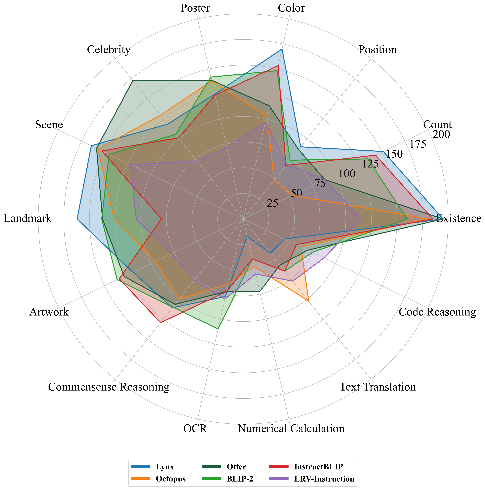

# MME: A Comprehensive Evaluation Benchmark for Multimodal Large Language Models

> Multimodal Large Language Model (MLLM) relies on the powerful LLM to perform multimodal tasks, showing amazing emergent abilities in recent studies, such as writing poems based on an image. However, it is difficult for these case studies to fully reflect the performance of MLLM, lacking a comprehensive evaluation. In this paper, we fill in this blank, presenting the first MLLM Evaluation benchmark MME. It measures both perception and cognition abilities on a total of 14 subtasks. In order to avoid data leakage that may arise from direct use of public datasets for evaluation, the annotations of instruction-answer pairs are all manually designed. The concise instruction design allows us to fairly compare MLLMs, instead of struggling in prompt engineering. Besides, with such an instruction, we can also easily carry out quantitative statistics. A total of 10 advanced MLLMs are comprehensively evaluated on our MME, which not only suggests that existing MLLMs still have a large room for improvement, but also reveals the potential directions for the subsequent model optimization.

## Our MLLM works

🔥🔥🔥 **A Survey on Multimodal Large Language Models**  
**[Project Page](https://github.com/BradyFU/Awesome-Multimodal-Large-Language-Models)** | **[Paper](https://arxiv.org/pdf/2306.13549.pdf)**

A curated list of Multimodal Large Language Models (MLLMs), including datasets, multimodal instruction tuning, multimodal in-context learning, multimodal chain-of-thought, llm-aided visual reasoning, foundation models, and others. This list will be updated in real time. :sparkles:

Welcome to join our WeChat group of MLLM communication! 

Please add WeChat ID (xjtupanda) to join the group. :star2:

---

🔥🔥🔥 **MME: A Comprehensive Evaluation Benchmark for Multimodal Large Language Models**  
**[Project Page [Leaderboards]](https://github.com/BradyFU/Awesome-Multimodal-Large-Language-Models/tree/Evaluation)** | **[Paper](https://arxiv.org/pdf/2306.13394.pdf)**

The benchmark dataset is collected by Xiamen University for academic research only. You can email guilinli@stu.xmu.edu.cn to obtain the dataset. :sparkles:

Please feel free to open an issue to add new evaluation results or if you have any questions about the evaluation. We will update the leaderboards in time. :star2:

# Evaluation Results

# Evaluation Leaderboards

---

<b> Table of Leaderboards </b> 

- [Perception](#Perception)
  - [Existence](#Existence) | [Count](#Count) | [Position](#Position) | [Color](#Color) | [Poster](#Poster) | [Celebrity](#Celebrity) | [Scene](#Scene) | [Landmark](#Landmark) | [Artwork](#Artwork) | [OCR](#OCR)
- [Cognition](#Cognition)
  - [Commonsense Reasoning](#Commonsense-Reasoning) | [Numerical Calculation](#Numerical-Calculation) | [Text Translation](#Text-Translation) | [Code Reasoning](#Code-Reasoning)

---

## Perception
Sum of the scores of all perception subtasks, including existence, count, position, color, poster, celebrity, scene, landmark, artwork, and OCR. The full score of each subtask is 200, and that of all perception is 2000.

| Rank |                          Model                           |                           Version                            |    Score    |
| :--: | :------------------------------------------------------: | :----------------------------------------------------------: | :---------: |
|  🏅️   |    [**BLIP-2**](https://arxiv.org/pdf/2301.12597.pdf)    | **[blip2-pretrain-flant5xx](https://github.com/salesforce/LAVIS/tree/main/projects/blip2)** | **1293.84** |
|  🥈   | [**InstructBLIP**](https://arxiv.org/pdf/2305.06500.pdf) | **[blip2-instruct-flant5xx](https://github.com/salesforce/LAVIS/tree/main/projects/instructblip)** | **1212.82** |
|  🥉   |  [**MiniGPT-4**](https://arxiv.org/pdf/2304.10592.pdf)   | **[minigpt4-aligned-with-vicuna13b](https://github.com/Vision-CAIR/MiniGPT-4)** | **1010.66** |
|  4   |    [mPLUG-Owl](https://arxiv.org/pdf/2304.14178.pdf)     | [mplug-owl-llama-7b](https://huggingface.co/MAGAer13/mplug-owl-llama-7b) |   966.33    |
|  5   | [LLaMA-Adapter V2](https://arxiv.org/pdf/2304.15010.pdf) | [LLaMA-7B](https://huggingface.co/nyanko7/LLaMA-7B/tree/main) |   761.20    |
|  6   |  [VisualGLM-6B](https://github.com/THUDM/VisualGLM-6B)   |    [VisualGLM-6B](https://github.com/THUDM/VisualGLM-6B)     |   706.49    |
|  7   |  [Multimodal-GPT](https://arxiv.org/pdf/2305.04790.pdf)  | [Multimodal-GPT-9B](https://github.com/open-mmlab/Multimodal-GPT) |   659.15    |
|  8   |     [PandaGPT](https://arxiv.org/pdf/2305.16355.pdf)     | [pandagpt-7b-max-len-512](https://github.com/yxuansu/PandaGPT) |   642.59    |
|  9   |      [Otter](https://arxiv.org/pdf/2305.03726.pdf)       |  [OTTER-9B-LA-InContext](https://github.com/Luodian/Otter)   |   539.74    |
|  10  |      [LLaVA](https://arxiv.org/pdf/2304.08485.pdf)       |     [LLaVA-7B-v0](https://github.com/haotian-liu/LLaVA)      |   502.82    |

### Existence

| Rank |                          Model                           |                           Version                            |   Score    |
| :--: | :------------------------------------------------------: | :----------------------------------------------------------: | :--------: |
|  🏅️   | [**InstructBLIP**](https://arxiv.org/pdf/2305.06500.pdf) | **[blip2-instruct-flant5xx](https://github.com/salesforce/LAVIS/tree/main/projects/instructblip)** | **185.00** |
|  🥈   |    [**BLIP-2**](https://arxiv.org/pdf/2301.12597.pdf)    | **[blip2-pretrain-flant5xx](https://github.com/salesforce/LAVIS/tree/main/projects/blip2)** | **160.00** |
|  🥉   |  [**MiniGPT-4**](https://arxiv.org/pdf/2304.10592.pdf)   | **[minigpt4-aligned-with-vicuna13b](https://github.com/Vision-CAIR/MiniGPT-4)** | **135.00** |
|  4   | [LLaMA-Adapter V2](https://arxiv.org/pdf/2304.15010.pdf) | [LLaMA-7B](https://huggingface.co/nyanko7/LLaMA-7B/tree/main) |   133.33   |
|  5   |    [mPLUG-Owl](https://arxiv.org/pdf/2304.14178.pdf)     | [mplug-owl-llama-7b](https://huggingface.co/MAGAer13/mplug-owl-llama-7b) |   120.00   |
|  6   |  [VisualGLM-6B](https://github.com/THUDM/VisualGLM-6B)   |    [VisualGLM-6B](https://github.com/THUDM/VisualGLM-6B)     |   85.00    |
|  7   |     [PandaGPT](https://arxiv.org/pdf/2305.16355.pdf)     | [pandagpt-7b-max-len-512](https://github.com/yxuansu/PandaGPT) |   70.00    |
|  8   |      [Otter](https://arxiv.org/pdf/2305.03726.pdf)       |  [OTTER-9B-LA-InContext](https://github.com/Luodian/Otter)   |   60.00    |
|  9   |  [Multimodal-GPT](https://arxiv.org/pdf/2305.04790.pdf)  | [Multimodal-GPT-9B](https://github.com/open-mmlab/Multimodal-GPT) |   56.67    |
|  10  |      [LLaVA](https://arxiv.org/pdf/2304.08485.pdf)       |     [LLaVA-7B-v0](https://github.com/haotian-liu/LLaVA)      |   50.00    |

### Count

| Rank |                          Model                           |                           Version                            | Score      |
| :--: | :------------------------------------------------------: | :----------------------------------------------------------: | ---------- |
|  🏅️   | [**InstructBLIP**](https://arxiv.org/pdf/2305.06500.pdf) | **[blip2-instruct-flant5xx](https://github.com/salesforce/LAVIS/tree/main/projects/instructblip)** | **143.33** |
|  🥈   |    [**BLIP-2**](https://arxiv.org/pdf/2301.12597.pdf)    | **[blip2-pretrain-flant5xx](https://github.com/salesforce/LAVIS/tree/main/projects/blip2)** | **135.00** |
|  🥉   |  [**MiniGPT-4**](https://arxiv.org/pdf/2304.10592.pdf)   | **[minigpt4-aligned-with-vicuna13b](https://github.com/Vision-CAIR/MiniGPT-4)** | **123.33** |
|  4   |  [Multimodal-GPT](https://arxiv.org/pdf/2305.04790.pdf)  | [Multimodal-GPT-9B](https://github.com/open-mmlab/Multimodal-GPT) | 58.33      |
|  5   | [LLaMA-Adapter V2](https://arxiv.org/pdf/2304.15010.pdf) | [LLaMA-7B](https://huggingface.co/nyanko7/LLaMA-7B/tree/main) | 55.00      |
|  6   |      [LLaVA](https://arxiv.org/pdf/2304.08485.pdf)       |     [LLaVA-7B-v0](https://github.com/haotian-liu/LLaVA)      | 50.00      |
|  7   |    [mPLUG-Owl](https://arxiv.org/pdf/2304.14178.pdf)     | [mplug-owl-llama-7b](https://huggingface.co/MAGAer13/mplug-owl-llama-7b) | 50.00      |
|  8   |  [VisualGLM-6B](https://github.com/THUDM/VisualGLM-6B)   |    [VisualGLM-6B](https://github.com/THUDM/VisualGLM-6B)     | 50.00      |
|  9   |      [Otter](https://arxiv.org/pdf/2305.03726.pdf)       |  [OTTER-9B-LA-InContext](https://github.com/Luodian/Otter)   | 50.00      |
|  10  |     [PandaGPT](https://arxiv.org/pdf/2305.16355.pdf)     | [pandagpt-7b-max-len-512](https://github.com/yxuansu/PandaGPT) | 50.00      |

### Position

| Rank |                          Model                           |                           Version                            |   Score   |
| :--: | :------------------------------------------------------: | :----------------------------------------------------------: | :-------: |
|  🏅️   |  **[MiniGPT-4](https://arxiv.org/pdf/2304.10592.pdf)**   | **[minigpt4-aligned-with-vicuna13b](https://github.com/Vision-CAIR/MiniGPT-4)** | **90.00** |
|  🥈   |    [**BLIP-2**](https://arxiv.org/pdf/2301.12597.pdf)    | **[blip2-pretrain-flant5xx](https://github.com/salesforce/LAVIS/tree/main/projects/blip2)** | **73.33** |
|  🥉   | [**InstructBLIP**](https://arxiv.org/pdf/2305.06500.pdf) | **[blip2-instruct-flant5xx](https://github.com/salesforce/LAVIS/tree/main/projects/instructblip)** | **66.67** |
|  4   |  [Multimodal-GPT](https://arxiv.org/pdf/2305.04790.pdf)  | [Multimodal-GPT-9B](https://github.com/open-mmlab/Multimodal-GPT) |   58.33   |
|  5   |      [LLaVA](https://arxiv.org/pdf/2304.08485.pdf)       |     [LLaVA-7B-v0](https://github.com/haotian-liu/LLaVA)      |   50.00   |
|  6   |    [mPLUG-Owl](https://arxiv.org/pdf/2304.14178.pdf)     | [mplug-owl-llama-7b](https://huggingface.co/MAGAer13/mplug-owl-llama-7b) |   50.00   |
|  7   |      [Otter](https://arxiv.org/pdf/2305.03726.pdf)       |  [OTTER-9B-LA-InContext](https://github.com/Luodian/Otter)   |   50.00   |
|  8   |     [PandaGPT](https://arxiv.org/pdf/2305.16355.pdf)     | [pandagpt-7b-max-len-512](https://github.com/yxuansu/PandaGPT) |   50.00   |
|  9   |  [VisualGLM-6B](https://github.com/THUDM/VisualGLM-6B)   |    [VisualGLM-6B](https://github.com/THUDM/VisualGLM-6B)     |   48.33   |
|  10  | [LLaMA-Adapter V2](https://arxiv.org/pdf/2304.15010.pdf) | [LLaMA-7B](https://huggingface.co/nyanko7/LLaMA-7B/tree/main) |   46.67   |

### Color

| Rank |                          Model                           |                           Version                            |   Score    |
| :--: | :------------------------------------------------------: | :----------------------------------------------------------: | :--------: |
|  🏅️   | [**InstructBLIP**](https://arxiv.org/pdf/2305.06500.pdf) | **[blip2-instruct-flant5xx](https://github.com/salesforce/LAVIS/tree/main/projects/instructblip)** | **153.33** |
|  🥈   |    [**BLIP-2**](https://arxiv.org/pdf/2301.12597.pdf)    | **[blip2-pretrain-flant5xx](https://github.com/salesforce/LAVIS/tree/main/projects/blip2)** | **148.33** |
|  🥉   |  **[MiniGPT-4](https://arxiv.org/pdf/2304.10592.pdf)**   | **[minigpt4-aligned-with-vicuna13b](https://github.com/Vision-CAIR/MiniGPT-4)** | **125.00** |
|  4   | [LLaMA-Adapter V2](https://arxiv.org/pdf/2304.15010.pdf) | [LLaMA-7B](https://huggingface.co/nyanko7/LLaMA-7B/tree/main) |   71.67    |
|  5   |  [Multimodal-GPT](https://arxiv.org/pdf/2305.04790.pdf)  | [Multimodal-GPT-9B](https://github.com/open-mmlab/Multimodal-GPT) |   68.33    |
|  6   |      [LLaVA](https://arxiv.org/pdf/2304.08485.pdf)       |     [LLaVA-7B-v0](https://github.com/haotian-liu/LLaVA)      |   55.00    |
|  7   |    [mPLUG-Owl](https://arxiv.org/pdf/2304.14178.pdf)     | [mplug-owl-llama-7b](https://huggingface.co/MAGAer13/mplug-owl-llama-7b) |   55.00    |
|  8   |  [VisualGLM-6B](https://github.com/THUDM/VisualGLM-6B)   |    [VisualGLM-6B](https://github.com/THUDM/VisualGLM-6B)     |   55.00    |
|  9   |      [Otter](https://arxiv.org/pdf/2305.03726.pdf)       |  [OTTER-9B-LA-InContext](https://github.com/Luodian/Otter)   |   55.00    |
|  10  |     [PandaGPT](https://arxiv.org/pdf/2305.16355.pdf)     | [pandagpt-7b-max-len-512](https://github.com/yxuansu/PandaGPT) |   50.00    |

### Poster

| Rank |                          Model                           |                           Version                            |   Score    |
| :--: | :------------------------------------------------------: | :----------------------------------------------------------: | :--------: |
|  🏅️   |    **[BLIP-2](https://arxiv.org/pdf/2301.12597.pdf)**    | **[blip2-pretrain-flant5xx](https://github.com/salesforce/LAVIS/tree/main/projects/blip2)** | **141.84** |
|  🥈   |  **[mPLUG-Owl](https://arxiv.org/pdf/2304.14178.pdf)**   | **[mplug-owl-llama-7b](https://huggingface.co/MAGAer13/mplug-owl-llama-7b)** | **135.03** |
|  🥉   | [**InstructBLIP**](https://arxiv.org/pdf/2305.06500.pdf) | **[blip2-instruct-flant5xx](https://github.com/salesforce/LAVIS/tree/main/projects/instructblip)** | **123.81** |
|  4   |     [PandaGPT](https://arxiv.org/pdf/2305.16355.pdf)     | [pandagpt-7b-max-len-512](https://github.com/yxuansu/PandaGPT) |   76.53    |
|  5   |    [MiniGPT-4](https://arxiv.org/pdf/2304.10592.pdf)     | [minigpt4-aligned-with-vicuna13b](https://github.com/Vision-CAIR/MiniGPT-4) |   69.05    |
|  6   |  [VisualGLM-6B](https://github.com/THUDM/VisualGLM-6B)   |    [VisualGLM-6B](https://github.com/THUDM/VisualGLM-6B)     |   66.67    |
|  7   | [LLaMA-Adapter V2](https://arxiv.org/pdf/2304.15010.pdf) | [LLaMA-7B](https://huggingface.co/nyanko7/LLaMA-7B/tree/main) |   63.61    |
|  8   |  [Multimodal-GPT](https://arxiv.org/pdf/2305.04790.pdf)  | [Multimodal-GPT-9B](https://github.com/open-mmlab/Multimodal-GPT) |   62.24    |
|  9   |      [LLaVA](https://arxiv.org/pdf/2304.08485.pdf)       |     [LLaVA-7B-v0](https://github.com/haotian-liu/LLaVA)      |   50.00    |
|  10  |      [Otter](https://arxiv.org/pdf/2305.03726.pdf)       |  [OTTER-9B-LA-InContext](https://github.com/Luodian/Otter)   |   45.24    |

### Celebrity

| Rank |                          Model                           |                           Version                            |   Score    |
| :--: | :------------------------------------------------------: | :----------------------------------------------------------: | :--------: |
|  🏅️   |    **[BLIP-2](https://arxiv.org/pdf/2301.12597.pdf)**    | **[blip2-pretrain-flant5xx](https://github.com/salesforce/LAVIS/tree/main/projects/blip2)** | **105.59** |
|  🥈   | [**InstructBLIP**](https://arxiv.org/pdf/2305.06500.pdf) | **[blip2-instruct-flant5xx](https://github.com/salesforce/LAVIS/tree/main/projects/instructblip)** | **101.18** |
|  🥉   |  **[mPLUG-Owl](https://arxiv.org/pdf/2304.14178.pdf)**   | **[mplug-owl-llama-7b](https://huggingface.co/MAGAer13/mplug-owl-llama-7b)** | **100.29** |
|  4   |    [MiniGPT-4](https://arxiv.org/pdf/2304.10592.pdf)     | [minigpt4-aligned-with-vicuna13b](https://github.com/Vision-CAIR/MiniGPT-4) |   83.53    |
|  5   | [LLaMA-Adapter V2](https://arxiv.org/pdf/2304.15010.pdf) | [LLaMA-7B](https://huggingface.co/nyanko7/LLaMA-7B/tree/main) |   76.18    |
|  6   |  [Multimodal-GPT](https://arxiv.org/pdf/2305.04790.pdf)  | [Multimodal-GPT-9B](https://github.com/open-mmlab/Multimodal-GPT) |   73.24    |
|  7   |     [PandaGPT](https://arxiv.org/pdf/2305.16355.pdf)     | [pandagpt-7b-max-len-512](https://github.com/yxuansu/PandaGPT) |   57.06    |
|  8   |  [VisualGLM-6B](https://github.com/THUDM/VisualGLM-6B)   |    [VisualGLM-6B](https://github.com/THUDM/VisualGLM-6B)     |   53.24    |
|  9   |      [Otter](https://arxiv.org/pdf/2305.03726.pdf)       |  [OTTER-9B-LA-InContext](https://github.com/Luodian/Otter)   |   50.00    |
|  10  |      [LLaVA](https://arxiv.org/pdf/2304.08485.pdf)       |     [LLaVA-7B-v0](https://github.com/haotian-liu/LLaVA)      |   48.82    |

### Scene

| Rank |                           Model                           |                           Version                            |   Score    |
| :--: | :-------------------------------------------------------: | :----------------------------------------------------------: | :--------: |
|  🏅️   | [**InstructBLIP**](https://arxiv.org/pdf/2305.06500.pdf)  | **[blip2-instruct-flant5xx](https://github.com/salesforce/LAVIS/tree/main/projects/instructblip)** | **153.00** |
|  🥈   | **[VisualGLM-6B](https://github.com/THUDM/VisualGLM-6B)** |  **[VisualGLM-6B](https://github.com/THUDM/VisualGLM-6B)**   | **146.25** |
|  🥉   |    **[BLIP-2](https://arxiv.org/pdf/2301.12597.pdf)**     | **[blip2-pretrain-flant5xx](https://github.com/salesforce/LAVIS/tree/main/projects/blip2)** | **145.25** |
|  4   |     [mPLUG-Owl](https://arxiv.org/pdf/2304.14178.pdf)     | [mplug-owl-llama-7b](https://huggingface.co/MAGAer13/mplug-owl-llama-7b) |   135.50   |
|  5   |     [PandaGPT](https://arxiv.org/pdf/2305.16355.pdf)      | [pandagpt-7b-max-len-512](https://github.com/yxuansu/PandaGPT) |   118.0    |
|  6   |     [MiniGPT-4](https://arxiv.org/pdf/2304.10592.pdf)     | [minigpt4-aligned-with-vicuna13b](https://github.com/Vision-CAIR/MiniGPT-4) |   113.75   |
|  7   | [LLaMA-Adapter V2](https://arxiv.org/pdf/2304.15010.pdf)  | [LLaMA-7B](https://huggingface.co/nyanko7/LLaMA-7B/tree/main) |   113.25   |
|  8   |       [Otter](https://arxiv.org/pdf/2305.03726.pdf)       |  [OTTER-9B-LA-InContext](https://github.com/Luodian/Otter)   |   69.50    |
|  9   |  [Multimodal-GPT](https://arxiv.org/pdf/2305.04790.pdf)   | [Multimodal-GPT-9B](https://github.com/open-mmlab/Multimodal-GPT) |   68.00    |
|  10  |       [LLaVA](https://arxiv.org/pdf/2304.08485.pdf)       |     [LLaVA-7B-v0](https://github.com/haotian-liu/LLaVA)      |   50.00    |

### Landmark

| Rank |                          Model                           |                           Version                            |   Score    |
| :--: | :------------------------------------------------------: | :----------------------------------------------------------: | :--------: |
|  🏅️   |  **[mPLUG-Owl](https://arxiv.org/pdf/2304.14178.pdf)**   | **[mplug-owl-llama-7b](https://huggingface.co/MAGAer13/mplug-owl-llama-7b)** | **159.25** |
|  🥈   |    **[BLIP-2](https://arxiv.org/pdf/2301.12597.pdf)**    | **[blip2-pretrain-flant5xx](https://github.com/salesforce/LAVIS/tree/main/projects/blip2)** | **138.00** |
|  🥉   |  **[MiniGPT-4](https://arxiv.org/pdf/2304.10592.pdf)**   | **[minigpt4-aligned-with-vicuna13b](https://github.com/Vision-CAIR/MiniGPT-4)** | **90.25**  |
|  4   |  [VisualGLM-6B](https://github.com/THUDM/VisualGLM-6B)   |    [VisualGLM-6B](https://github.com/THUDM/VisualGLM-6B)     |   83.75    |
|  5   |   [InstructBLIP](https://arxiv.org/pdf/2305.06500.pdf)   | [blip2-instruct-flant5xx](https://github.com/salesforce/LAVIS/tree/main/projects/instructblip) |   79.75    |
|  6   |  [Multimodal-GPT](https://arxiv.org/pdf/2305.04790.pdf)  | [Multimodal-GPT-9B](https://github.com/open-mmlab/Multimodal-GPT) |   73.50    |
|  7   |     [PandaGPT](https://arxiv.org/pdf/2305.16355.pdf)     | [pandagpt-7b-max-len-512](https://github.com/yxuansu/PandaGPT) |   69.75    |
|  8   | [LLaMA-Adapter V2](https://arxiv.org/pdf/2304.15010.pdf) | [LLaMA-7B](https://huggingface.co/nyanko7/LLaMA-7B/tree/main) |   62.00    |
|  9   |      [Otter](https://arxiv.org/pdf/2305.03726.pdf)       |  [OTTER-9B-LA-InContext](https://github.com/Luodian/Otter)   |   56.50    |
|  10  |      [LLaVA](https://arxiv.org/pdf/2304.08485.pdf)       |     [LLaVA-7B-v0](https://github.com/haotian-liu/LLaVA)      |   50.00    |

### Artwork

| Rank |                          Model                           |                           Version                            |   Score    |
| :--: | :------------------------------------------------------: | :----------------------------------------------------------: | :--------: |
|  🏅️   |    **[BLIP-2](https://arxiv.org/pdf/2301.12597.pdf)**    | **[blip2-pretrain-flant5xx](https://github.com/salesforce/LAVIS/tree/main/projects/blip2)** | **136.50** |
|  🥈   | **[InstructBLIP](https://arxiv.org/pdf/2305.06500.pdf)** | **[blip2-instruct-flant5xx](https://github.com/salesforce/LAVIS/tree/main/projects/instructblip)** | **134.25** |
|  🥉   |  **[mPLUG-Owl](https://arxiv.org/pdf/2304.14178.pdf)**   | **[mplug-owl-llama-7b](https://huggingface.co/MAGAer13/mplug-owl-llama-7b)** | **96.25**  |
|  4   |    [MiniGPT-4](https://arxiv.org/pdf/2304.10592.pdf)     | [minigpt4-aligned-with-vicuna13b](https://github.com/Vision-CAIR/MiniGPT-4) |   83.25    |
|  5   |  [VisualGLM-6B](https://github.com/THUDM/VisualGLM-6B)   |    [VisualGLM-6B](https://github.com/THUDM/VisualGLM-6B)     |   75.75    |
|  6   | [LLaMA-Adapter V2](https://arxiv.org/pdf/2304.15010.pdf) | [LLaMA-7B](https://huggingface.co/nyanko7/LLaMA-7B/tree/main) |   67.00    |
|  7   |  [Multimodal-GPT](https://arxiv.org/pdf/2305.04790.pdf)  | [Multimodal-GPT-9B](https://github.com/open-mmlab/Multimodal-GPT) |   58.00    |
|  8   |      [Otter](https://arxiv.org/pdf/2305.03726.pdf)       |  [OTTER-9B-LA-InContext](https://github.com/Luodian/Otter)   |   53.50    |
|  9   |     [PandaGPT](https://arxiv.org/pdf/2305.16355.pdf)     | [pandagpt-7b-max-len-512](https://github.com/yxuansu/PandaGPT) |   51.25    |
|  10  |      [LLaVA](https://arxiv.org/pdf/2304.08485.pdf)       |     [LLaVA-7B-v0](https://github.com/haotian-liu/LLaVA)      |   49.00    |

### OCR

| Rank |                           Model                            |                           Version                            |   Score    |
| :--: | :--------------------------------------------------------: | :----------------------------------------------------------: | :--------: |
|  🏅️   |     **[BLIP-2](https://arxiv.org/pdf/2301.12597.pdf)**     | **[blip2-pretrain-flant5xx](https://github.com/salesforce/LAVIS/tree/main/projects/blip2)** | **110.00** |
|  🥈   |   **[MiniGPT-4](https://arxiv.org/pdf/2304.10592.pdf)**    | **[minigpt4-aligned-with-vicuna13b](https://github.com/Vision-CAIR/MiniGPT-4)** | **97.50**  |
|  🥉   | **[Multimodal-GPT](https://arxiv.org/pdf/2305.04790.pdf)** | **[Multimodal-GPT-9B](https://github.com/open-mmlab/Multimodal-GPT)** | **82.50**  |
|  4   |  [LLaMA-Adapter V2](https://arxiv.org/pdf/2304.15010.pdf)  | [LLaMA-7B](https://huggingface.co/nyanko7/LLaMA-7B/tree/main) |   72.50    |
|  5   |    [InstructBLIP](https://arxiv.org/pdf/2305.06500.pdf)    | [blip2-instruct-flant5xx](https://github.com/salesforce/LAVIS/tree/main/projects/instructblip) |   72.50    |
|  6   |     [mPLUG-Owl](https://arxiv.org/pdf/2304.14178.pdf)      | [mplug-owl-llama-7b](https://huggingface.co/MAGAer13/mplug-owl-llama-7b) |   65.00    |
|  7   |       [LLaVA](https://arxiv.org/pdf/2304.08485.pdf)        |     [LLaVA-7B-v0](https://github.com/haotian-liu/LLaVA)      |   50.00    |
|  8   |       [Otter](https://arxiv.org/pdf/2305.03726.pdf)        |  [OTTER-9B-LA-InContext](https://github.com/Luodian/Otter)   |   50.00    |
|  9   |      [PandaGPT](https://arxiv.org/pdf/2305.16355.pdf)      | [pandagpt-7b-max-len-512](https://github.com/yxuansu/PandaGPT) |   50.00    |
|  10  |   [VisualGLM-6B](https://github.com/THUDM/VisualGLM-6B)    |    [VisualGLM-6B](https://github.com/THUDM/VisualGLM-6B)     |   42.50    |

## Cognition
Sum of the scores of all cognition subtasks, including commonsense reasoning, numerical calculation, text translation, and code reasoning. The full score of each subtask is 200, and that of all cognition is 800.

| Rank |                          Model                           |                           Version                            |   Score    |
| :--: | :------------------------------------------------------: | :----------------------------------------------------------: | :--------: |
|  🏅️   |  **[MiniGPT-4](https://arxiv.org/pdf/2304.10592.pdf)**   | **[minigpt4-aligned-with-vicuna13b](https://github.com/Vision-CAIR/MiniGPT-4)** | **330.36** |
|  🥈   | **[InstructBLIP](https://arxiv.org/pdf/2305.06500.pdf)** | **[blip2-instruct-flant5xx](https://github.com/salesforce/LAVIS/tree/main/projects/instructblip)** | **291.79** |
|  🥉   |    **[BLIP-2](https://arxiv.org/pdf/2301.12597.pdf)**    | **[blip2-pretrain-flant5xx](https://github.com/salesforce/LAVIS/tree/main/projects/blip2)** | **290.00** |
|  4   |    [mPLUG-Owl](https://arxiv.org/pdf/2304.14178.pdf)     | [mplug-owl-llama-7b](https://huggingface.co/MAGAer13/mplug-owl-llama-7b) |   281.07   |
|  5   | [LLaMA-Adapter V2](https://arxiv.org/pdf/2304.15010.pdf) | [LLaMA-7B](https://huggingface.co/nyanko7/LLaMA-7B/tree/main) |   246.07   |
|  6   |  [Multimodal-GPT](https://arxiv.org/pdf/2305.04790.pdf)  | [Multimodal-GPT-9B](https://github.com/open-mmlab/Multimodal-GPT) |   231.43   |
|  7   |      [Otter](https://arxiv.org/pdf/2305.03726.pdf)       |  [OTTER-9B-LA-InContext](https://github.com/Luodian/Otter)   |   231.07   |
|  8   |     [PandaGPT](https://arxiv.org/pdf/2305.16355.pdf)     | [pandagpt-7b-max-len-512](https://github.com/yxuansu/PandaGPT) |   228.57   |
|  9   |      [LLaVA](https://arxiv.org/pdf/2304.08485.pdf)       |     [LLaVA-7B-v0](https://github.com/haotian-liu/LLaVA)      |   218.21   |
|  10  |  [VisualGLM-6B](https://github.com/THUDM/VisualGLM-6B)   |    [VisualGLM-6B](https://github.com/THUDM/VisualGLM-6B)     |   201.07   |

### Commonsense Reasoning

| Rank |                          Model                           |                           Version                            |   Score    |
| :--: | :------------------------------------------------------: | :----------------------------------------------------------: | :--------: |
|  🏅️   | **[InstructBLIP](https://arxiv.org/pdf/2305.06500.pdf)** | **[blip2-instruct-flant5xx](https://github.com/salesforce/LAVIS/tree/main/projects/instructblip)** | **129.29** |
|  🥈   |    **[BLIP-2](https://arxiv.org/pdf/2301.12597.pdf)**    | **[blip2-pretrain-flant5xx](https://github.com/salesforce/LAVIS/tree/main/projects/blip2)** | **110.00** |
|  🥉   |  **[MiniGPT-4](https://arxiv.org/pdf/2304.10592.pdf)**   | **[minigpt4-aligned-with-vicuna13b](https://github.com/Vision-CAIR/MiniGPT-4)** | **92.86**  |
|  4   |    [mPLUG-Owl](https://arxiv.org/pdf/2304.14178.pdf)     | [mplug-owl-llama-7b](https://huggingface.co/MAGAer13/mplug-owl-llama-7b) |   83.57    |
|  5   |     [PandaGPT](https://arxiv.org/pdf/2305.16355.pdf)     | [pandagpt-7b-max-len-512](https://github.com/yxuansu/PandaGPT) |   73.57    |
|  6   | [LLaMA-Adapter V2](https://arxiv.org/pdf/2304.15010.pdf) | [LLaMA-7B](https://huggingface.co/nyanko7/LLaMA-7B/tree/main) |   68.57    |
|  7   |      [LLaVA](https://arxiv.org/pdf/2304.08485.pdf)       |     [LLaVA-7B-v0](https://github.com/THUDM/VisualGLM-6B)     |   60.71    |
|  8   |  [VisualGLM-6B](https://github.com/THUDM/VisualGLM-6B)   |    [VisualGLM-6B](https://github.com/THUDM/VisualGLM-6B)     |   58.57    |
|  9   |      [Otter](https://arxiv.org/pdf/2305.03726.pdf)       |  [OTTER-9B-LA-InContext](https://github.com/Luodian/Otter)   |   58.57    |
|  10  |  [Multimodal-GPT](https://arxiv.org/pdf/2305.04790.pdf)  | [Multimodal-GPT-9B](https://github.com/open-mmlab/Multimodal-GPT) |   51.43    |

### Numerical Calculation

| Rank |                           Model                            |                           Version                            |   Score   |
| :--: | :--------------------------------------------------------: | :----------------------------------------------------------: | :-------: |
|  🏅️   | **[Multimodal-GPT](https://arxiv.org/pdf/2305.04790.pdf)** | **[Multimodal-GPT-9B](https://github.com/open-mmlab/Multimodal-GPT)** | **70.00** |
|  🥈   |   **[MiniGPT-4](https://arxiv.org/pdf/2304.10592.pdf)**    | **[minigpt4-aligned-with-vicuna13b](https://github.com/Vision-CAIR/MiniGPT-4)** | **67.50** |
|  🥉   |   **[mPLUG-Owl](https://arxiv.org/pdf/2304.14178.pdf)**    | **[mplug-owl-llama-7b](https://huggingface.co/MAGAer13/mplug-owl-llama-7b)** | **60.00** |
|  4   |  [LLaMA-Adapter V2](https://arxiv.org/pdf/2304.15010.pdf)  | [LLaMA-7B](https://huggingface.co/nyanko7/LLaMA-7B/tree/main) |   57.50   |
|  5   |       [Otter](https://arxiv.org/pdf/2305.03726.pdf)        |  [OTTER-9B-LA-InContext](https://github.com/Luodian/Otter)   |   57.50   |
|  6   |       [LLaVA](https://arxiv.org/pdf/2304.08485.pdf)        |     [LLaVA-7B-v0](https://github.com/haotian-liu/LLaVA)      |   50.00   |
|  7   |      [PandaGPT](https://arxiv.org/pdf/2305.16355.pdf)      | [pandagpt-7b-max-len-512](https://github.com/yxuansu/PandaGPT) |   50.00   |
|  8   |   [VisualGLM-6B](https://github.com/THUDM/VisualGLM-6B)    |    [VisualGLM-6B](https://github.com/THUDM/VisualGLM-6B)     |   45.00   |
|  9   |       [BLIP-2](https://arxiv.org/pdf/2301.12597.pdf)       | [blip2-pretrain-flant5xx](https://github.com/salesforce/LAVIS/tree/main/projects/blip2) |   40.00   |
|  10  |    [InstructBLIP](https://arxiv.org/pdf/2305.06500.pdf)    | [blip2-instruct-flant5xx](https://github.com/salesforce/LAVIS/tree/main/projects/instructblip) |   40.00   |

### Text Translation

| Rank |                          Model                           |                           Version                            |   Score   |
| :--: | :------------------------------------------------------: | :----------------------------------------------------------: | :-------: |
|  🏅️   |  **[mPLUG-Owl](https://arxiv.org/pdf/2304.14178.pdf)**   | **[mplug-owl-llama-7b](https://huggingface.co/MAGAer13/mplug-owl-llama-7b)** | **80.00** |
|  🥈   |    **[BLIP-2](https://arxiv.org/pdf/2301.12597.pdf)**    | **[blip2-pretrain-flant5xx](https://github.com/salesforce/LAVIS/tree/main/projects/blip2)** | **65.00** |
|  🥉   | **[InstructBLIP](https://arxiv.org/pdf/2305.06500.pdf)** | **[blip2-instruct-flant5xx](https://github.com/salesforce/LAVIS/tree/main/projects/instructblip)** | **65.00** |
|  4   |      [Otter](https://arxiv.org/pdf/2305.03726.pdf)       |  [OTTER-9B-LA-InContext](https://github.com/Luodian/Otter)   |   65.00   |
|  5   |      [LLaVA](https://arxiv.org/pdf/2304.08485.pdf)       |     [LLaVA-7B-v0](https://github.com/haotian-liu/LLaVA)      |   57.50   |
|  6   |    [MiniGPT-4](https://arxiv.org/pdf/2304.10592.pdf)     | [minigpt4-aligned-with-vicuna13b](https://github.com/Vision-CAIR/MiniGPT-4) |   57.50   |
|  7   | [LLaMA-Adapter V2](https://arxiv.org/pdf/2304.15010.pdf) | [LLaMA-7B](https://huggingface.co/nyanko7/LLaMA-7B/tree/main) |   57.50   |
|  8   |     [PandaGPT](https://arxiv.org/pdf/2305.16355.pdf)     | [pandagpt-7b-max-len-512](https://github.com/yxuansu/PandaGPT) |   57.50   |
|  9   |  [Multimodal-GPT](https://arxiv.org/pdf/2305.04790.pdf)  | [Multimodal-GPT-9B](https://github.com/open-mmlab/Multimodal-GPT) |   55.00   |
|  10  |  [VisualGLM-6B](https://github.com/THUDM/VisualGLM-6B)   |    [VisualGLM-6B](https://github.com/THUDM/VisualGLM-6B)     |   50.00   |

### Code Reasoning

| Rank |                            Model                             |                           Version                            |   Score    |
| :--: | :----------------------------------------------------------: | :----------------------------------------------------------: | :--------: |
|  🏅️   |    **[MiniGPT-4](https://arxiv.org/pdf/2304.10592.pdf)**     | **[minigpt4-aligned-with-vicuna13b](https://github.com/Vision-CAIR/MiniGPT-4)** | **112.50** |
|  🥈   |      **[BLIP-2](https://arxiv.org/pdf/2301.12597.pdf)**      | **[blip2-pretrain-flant5xx](https://github.com/salesforce/LAVIS/tree/main/projects/blip2)** | **75.00**  |
|  🥉   | **[LLaMA-Adapter V2](https://arxiv.org/pdf/2304.15010.pdf)** | **[LLaMA-7B](https://huggingface.co/nyanko7/LLaMA-7B/tree/main)** | **62.50**  |
|  4   |      [mPLUG-Owl](https://arxiv.org/pdf/2304.14178.pdf)       | [mplug-owl-llama-7b](https://huggingface.co/MAGAer13/mplug-owl-llama-7b) |   57.50    |
|  5   |     [InstructBLIP](https://arxiv.org/pdf/2305.06500.pdf)     | [blip2-instruct-flant5xx](https://github.com/salesforce/LAVIS/tree/main/projects/instructblip) |   57.50    |
|  6   |    [Multimodal-GPT](https://arxiv.org/pdf/2305.04790.pdf)    | [Multimodal-GPT-9B](https://github.com/open-mmlab/Multimodal-GPT) |   55.00    |
|  7   |        [LLaVA](https://arxiv.org/pdf/2304.08485.pdf)         |     [LLaVA-7B-v0](https://github.com/haotian-liu/LLaVA)      |   50.00    |
|  8   |        [Otter](https://arxiv.org/pdf/2305.03726.pdf)         |  [OTTER-9B-LA-InContext](https://github.com/Luodian/Otter)   |   50.00    |
|  9   |    [VisualGLM-6B](https://github.com/THUDM/VisualGLM-6B)     |    [VisualGLM-6B](https://github.com/THUDM/VisualGLM-6B)     |   47.50    |
|  10  |       [PandaGPT](https://arxiv.org/pdf/2305.16355.pdf)       | [pandagpt-7b-max-len-512](https://github.com/yxuansu/PandaGPT) |   47.50    |

